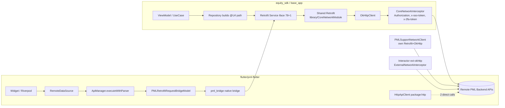

# A1 — Outbound API Surface Map (Agent 2)

**Target:** `/Users/abhijeetpal/Desktop/workspace/android-monorepo` (Android Kotlin + Flutter client app)
**Scope:** `equity_sdk/`, `base_app/`, `flutter/pml-flutter/`
**Date:** 2026-06-17

> **NO SERVER ENDPOINTS.** This is a client application. The entire API surface is **OUTBOUND** — Retrofit service interfaces (Kotlin) and a native-bridge/HTTP client (Flutter) that call remote Paytm Money backend services. Nothing in this repo *serves* HTTP. **(VERIFIED)**

---

## 1. Summary Counts

| Metric | Count | Source |
|---|---|---|
| Retrofit service interfaces (`equity_sdk`, has `@GET/@POST/...`) | **78** | grep over `equity_sdk/src/main` (VERIFIED) |
| Retrofit service interfaces (`base_app`) | **1** (`BaseService.kt`) | (VERIFIED) |
| Endpoint methods in equity service files (`fun ...(`) | **~363** | (VERIFIED, approximate — includes a few non-endpoint funcs) |
| HTTP-verb annotations, `equity_sdk` | `@GET` 247, `@POST` 112, `@PUT` 14, `@DELETE` 6 (**379**) | (VERIFIED) |
| HTTP-verb annotations, `base_app` | `@GET` 25, `@POST` 10 (**35**) | (VERIFIED) |
| `@Url`-dynamic params (equity) | **374** | (VERIFIED) |
| Static literal-path annotations (equity) | **5** | (VERIFIED) |
| Flutter `GoRoute(...)` declarations | **8** static + dynamic-generated routes | `app_router.dart` (VERIFIED) |
| Flutter outbound call sites (`executeWithParser`) | **108** (`_apiManager`) + **65** (`apiManager`) = ~173 | (VERIFIED) |
| Flutter direct `package:http` call sites | **2** (`httpClient.get`, `_client.execute`) | (VERIFIED) |

**Dominant pattern (VERIFIED):** Equity/base Retrofit interfaces overwhelmingly use **`@Url url: String` (dynamic URL)** rather than static annotation paths (374 `@Url` vs 5 literal paths). The actual REST path is assembled in repository/use-case layers (path constants live in repos), not in the annotation. So most endpoints are reported as **`@Url`-dynamic**.

---

## 2. Endpoint Inventory

### 2.1 Kotlin — Retrofit interfaces (representative, `@Url`-dynamic dominant)

| Method | Path | Interface::method | File |
|---|---|---|---|
| POST | @Url-dynamic | `EquityOrderService::placeRegularOrder` | `equity_sdk/.../placeorder/data/EquityOrderService.kt:36` |
| POST | @Url-dynamic | `EquityOrderService::placeAdvanceOrder` | `.../placeorder/data/EquityOrderService.kt:42` |
| PUT | @Url-dynamic | `EquityOrderService::modifyOrderToBasket` | `.../placeorder/data/EquityOrderService.kt:82` |
| POST | @Url-dynamic | `EquityWatchlistService::createWatchlist` | `.../dashboard/watchlist/data/EquityWatchlistService.kt:21` |
| POST | @Url-dynamic | `EquityWatchlistService::addStockToWatchlist` | `.../watchlist/data/EquityWatchlistService.kt:27` |
| PUT | @Url-dynamic | `EquityWatchlistService::renameWatchlist` | `.../watchlist/data/EquityWatchlistService.kt:33` |
| DELETE | @Url-dynamic | `EquityWatchlistService::deleteWatchlist` | `.../watchlist/data/EquityWatchlistService.kt:45` |
| GET | @Url-dynamic | `EquityWatchlistService::getWatchlistStocks` | `.../watchlist/data/EquityWatchlistService.kt:50` |
| POST | `$BASE_URL/communication/v2/push/mapuser` | `PushNotificationService::mapUser` | `.../boot/data/PushNotificationService.kt:21` |
| POST | `$BASE_URL/communication/v1/push/adduser` | `PushNotificationService::addUser` | `.../boot/data/PushNotificationService.kt:26` |
| POST | `$BASE_URL/pm/api/v1/users/{userId}/tnc` | `TncService::acceptTnc` (`@Path userId`) | `.../boot/data/TncService.kt:13` |
| GET | `${BuildConfig.PLATFORM_URL}/aggr/user/v1/boot` | `BootApiService::getBoot` | `.../boot/data/BootApiService.kt:13` |
| GET | @Url-dynamic | `BaseService::getAppBootData` | `base_app/.../app/BaseService.kt:66` |
| POST | @Url-dynamic | `BaseService::acceptTnC` | `base_app/.../app/BaseService.kt:59` |
| GET | @Url-dynamic | `BaseService::getUserDetails` | `base_app/.../app/BaseService.kt:95` |

**+~64 more Retrofit interfaces** across equity domains (orders, funds, portfolio, GTT, SIP, charges, indices, market-movers, IPO, MTF, passcode/OTP, profile, price-alerts, search, chart, corporate-actions, smallcase, PMLThree, traders, etc.). Full file list of 78 services obtained via `grep -rlE "@(GET|POST|PUT|DELETE)" equity_sdk/src/main`. Representative service files:

- `EquityPortfolioService.kt`, `EquitySipService.kt`, `GttService.kt`, `EquityFundsService.kt`, `AddFundsService.kt`, `WithdrawFundsApiService.kt`, `ManageFundsService.kt`, `LedgerFundsApiService.kt`
- `OrderBookServices.kt`, `OrderFundsService.kt`, `OrderChargesServices.kt`, `CommonOrderService.kt`, `PastOrderApiService.kt`
- `CompanyDetailsService.kt`, `ChartService.kt`, `ScripListApiService.kt`, `EquitySearchService.kt`, `PriceAlertsService.kt`
- `EquityIndicesService.kt`, `MarketMoversIndicesServices.kt`, `EquityMarketMoversServices.kt`
- `PMLThreeIPOService.kt`, `PMLThreeBaseService.kt`, `PMLThreeInvestmentIdeasService.kt`, `MarginPledgeHoldingsService.kt`
- `OtpPasscodeApiService.kt`, `CreatePasscodeApiService.kt`, `LoginPasscodeApiService.kt`, `ResetPasscodeApiService.kt`, `LoginOTPApiService.kt`, `EquityPasscodeApiService.kt`
- `ProfileService.kt`, `MyProfileSectionApiService.kt`, `NotificationPreferenceService.kt`, `AccountStatementsApiService.kt`, `EdisService.kt`, `EdisTransactionService.kt`, `MtfService.kt`, `PayLaterService.kt`, `InvestmentReadinessApiService.kt`, `VoiceTradingApiService.kt`, `FlutterAPIService.kt`, `PMLSupportService.kt` (separate client — see §3.2)

### 2.2 Observed real REST paths (sampled from repo path constants — VERIFIED)

These literal paths appear as `@Url`-dynamic string constants in repo/data layers (the actual outbound routes):

| Path | Domain |
|---|---|
| `/aggr/user/v1/boot` | App boot |
| `/aggr/home/v4/combined-dashboard` | Home dashboard |
| `/aggr/equity/stocks/dashboard/v1/view-all`, `aggr/equity/stocks/v2/dashboard` | Stocks dashboard |
| `/aggr/equity/etf/v1/dashboard`, `/aggr/equity/ipo/v1/dashboard` | ETF / IPO |
| `/aggr/equity/fno/dashboard/v1/view-all`, `aggr/equity/fno/v1/dashboard` | F&O |
| `/aggr/equity/market-movers/v1/securities`, `.../v1/widgets` | Market movers |
| `/order/txn/v1/place/advance_order`, `/order/txn/v2/convert/regular` | Order txn |
| `/order/info/v1/position`, `.../positiondetails`, `.../interops/position/mtf` | Positions |
| `/gtt-order/api/v2/gtt` | GTT |
| `/sip/instruction/api/v2/sip/modify`, `.../v1/sip/next-pump-date` | SIP |
| `/holdings/v2/get-ca-all-data`, `/holdings/v1/get-ca-approved-data` | Corporate actions |
| `/scrips/info/v3/topscrips` | Scrips |
| `/aggr/mtf/v1/pledge/authorize-banner`, `/aggr/sf/mtf-equity-sf` | MTF |
| `/communication/v2/push/mapuser`, `/communication/v1/push/adduser`, `.../unmapDevice` | Push notification |
| `/pm/api/v1/users/{userId}/tnc` | TnC |

**+N more** path constants (funds_* keys, charges, etc.) — depth-capped.

### 2.3 Flutter — Navigation routes & outbound calls

**Routing** (`flutter/pml-flutter/lib/core/routes/app_router.dart`, VERIFIED): uses `GoRouter` (`AppRouter._createRouter()`), 8 static `GoRoute` declarations including `/blank` (`:65`), `/order-list-preview` (`:69`), plus **dynamically generated routes** via `_generateDynamicRoutes()` (`:80`) mapping `entry.key` → path. Additional route plumbing: `route_generator.dart`, `pml_stack_core_route_adapter.dart`.

**Outbound HTTP** — two paths:
1. **Native bridge (dominant):** `ApiManager.executeWithParser<T>()` (`lib/core/network/api_manager.dart:103`) builds a `PMLRetrofitRequestBridgeModel` (`:132`) and dispatches over the PML native bridge (`lib/core/bridge/api/pml_bridge.dart`), so Flutter requests are actually executed by the **Kotlin Retrofit/OkHttp stack** (which applies the auth interceptor in §3). ~173 call sites. (VERIFIED)
2. **Direct `package:http`:** `HttpApiClient implements ApiClientBase` (`lib/core/network/http_api_client.dart:19`), uses `http.Client` with a secure-client factory (`:33`) and `_globalHeaders` (`:166`). Only ~2 direct call sites observed. (VERIFIED)

---

## 3. Auth Flow (OkHttp Interceptors)

### 3.1 Primary auth interceptor — `CoreNetworkInterceptor` (in `library/` module — out of scope dir, but it is the binding point for in-scope services)

`library/src/main/java/com/paytmmoney/core/networking/CoreNetworkInterceptor.kt` (VERIFIED). Wired in `library/src/main/java/com/paytmmoney/core/di/CoreNetworkModule.kt:81` (`.addInterceptor(coreNetworkInterceptor)`). This is the OkHttpClient that backs the shared `Retrofit` injected into equity/base services.

Behavior on `intercept(chain)` (`:49`):
- Reads SSO token `authManager.paytmAT` (`:51`); if blank and auth required, logs/blocks with 401 telemetry (`:62-63`).
- Adds `Authorization` header via `CoreHelper.getAuthorization()` (`:131`).
- Adds `x-2fa-token` from `pml_token_fallback` when present (`:141-148`).
- Always adds: `x-request-id`, `x-client-utc-offset`, `x-user-agent`, `pmngx` module headers `KEY_PMNGX`/`VALUE_PMNGX` (`:189-193`).
- Adds `x-sso-token` when token present (`:197`).
- `AUTHORIZATION = "Authorization"` const (`:436`); `UNAUTH_CODE = 401` (`:452`).

### 3.2 Secondary clients (in-scope, equity_sdk)
- `equity_sdk/.../prioritycustomer/data/client/PMLSupportNetworkClient.kt` — builds its own `OkHttpClient` + `Retrofit` (`:29,:43-44`) with only `HttpLoggingInterceptor` (BASIC) (`:34-37`). Separate base URL. (VERIFIED)
- `equity_sdk/.../interactor/di/InteractorClientModule.kt` — `@Named("ext-okhttp")` OkHttpClient adds `ExternalNetworkInterceptor(authManager)` (`:54-55,:76`) + logging; separate `Retrofit` (`:92-97`). The interceptor (`subspayments/.../ExternalNetworkInterceptor.kt`) adds `x-request-id`, `x-client-utc-offset`, `x-user-agent` (`:81-83`). (VERIFIED)

### 3.3 Constants in scope
- `equity_sdk/.../util/Utils.kt:197` — `const val AUTHORIZATION = "Authorization"` (VERIFIED).

### 3.4 Flutter auth
Native-bridge requests inherit the Kotlin interceptor auth (§3.1). The direct `HttpApiClient` uses `_globalHeaders` set via `setGlobalHeader` (`http_api_client.dart:146`); specific token wiring **NOT FOUND** in the two scoped files (INFERRED that headers are injected by callers).

---

## 4. Error Handling

- **OkHttp interceptor (`CoreNetworkInterceptor`):** catches `SocketTimeoutException`, `OnErrorNotImplementedException`, `UnknownHostException`, `retrofit2.HttpException` (`:90`); synthesizes a JSON error body/response (`:210-222`) and logs locally; treats 401 as unauthorized (`UNAUTH_CODE`, `:452`). (VERIFIED)
- **Equity mapping layer:** `equity_sdk/.../extensions/coroutine/FlowResponseMapper.kt` and `FlowExtensionMapper2.kt` map Retrofit responses to success/failure flows (VERIFIED, by filename + grep for `handleApiError`/`ResponseStatus`).
- **Flutter:** `ApiManager` checks `bridgeResponse.statusCode` 200–299 for success (`api_manager.dart:218`), else returns error `ApiResponse` (`:228-233`); bridge errors tracked in `pml_stack_core_error_tracker.dart`. (VERIFIED)

---

## 5. Request Lifecycle

**Kotlin:** ViewModel/UseCase → Repository (builds full `@Url` path from constants) → DI-provided `Service` (`retrofit.create(...)` in `EquityBaseModule.kt` etc.) → shared `Retrofit` (built in `library/CoreNetworkModule.kt`, base URL via `getBaseUrl()`, Gson + RxJava2 adapters) → `OkHttpClient` w/ `CoreNetworkInterceptor` (adds auth + headers) → remote PML backend. A `@Named("no-retry-retrofit")` variant (`CoreNetworkModule.kt:121-135`, `retryOnConnectionFailure(false)`) is used for order placement (`EquityOrderCommonModule.kt:40`). (VERIFIED)

**Flutter:** Widget → Riverpod provider / RemoteDataSource → `ApiManager.executeWithParser` → `PMLRetrofitRequestBridgeModel` → native bridge (`pml_bridge.dart`) → **into the Kotlin Retrofit/OkHttp stack above**. (VERIFIED)

---

## 6. Mermaid Diagram

---

## 7. Unknowns / NOT FOUND

- **Resolved base URL hosts**: services use `BuildConfig.PLATFORM_URL`, `BuildConfig.EQUITY_BASE_URL`, `BuildConfig.IBL_BASE_URL`, `$BASE_URL`, `getBaseUrl()` — concrete host strings are flavor-injected at build time (`build.gradle`/properties), **NOT FOUND as literals** in scoped source. (UNVERIFIED hosts)
- **Per-endpoint full path for the ~374 `@Url`-dynamic methods**: paths are assembled in repository layers from scattered constants; exhausting all is depth-capped. A representative set is in §2.2. (INFERRED total)
- **`CoreNetworkInterceptor` / `CoreNetworkModule` / `ExternalNetworkInterceptor`** live in `library/` and `subspayments/` (outside the 3 scoped dirs) but are the actual auth/transport for in-scope services — cited because they bind the in-scope Retrofit services. (VERIFIED, cross-module)
- **Flutter `HttpApiClient` token injection**: exact auth-header source **NOT FOUND IN REPOSITORY** within scoped files. (INFERRED caller-supplied)
- No server-side endpoint definitions exist anywhere — confirmed client-only. (VERIFIED)
