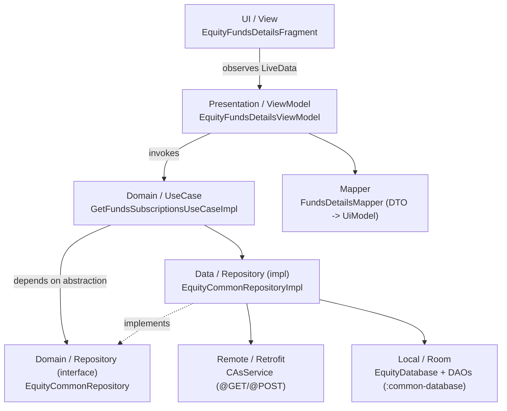

# A1 — Architecture & Dependency Analysis (Equity Vertical)

**Agent:** A5 — Architecture & Dependency Agent
**Repo:** `/Users/abhijeetpal/Desktop/workspace/android-monorepo`
**Scope:** `common-database/`, `equity_sdk/`, `base_app/` (Kotlin); `flutter/pml-flutter/` (high level)
**Date:** 2026-06-17

---

## 1. Architecture Verdict

| Pattern | Confidence | Evidence (paths) |
|---|---|---|
| **Clean Architecture** (feature-sliced `data` / `domain` / `presentation` + `di`) | **VERIFIED** | Every feature folder carries the four sub-packages, e.g. `equity_sdk/.../funds/common/{data,domain,presentation,di}`, `equity_sdk/.../accountstatement/{data,di,domain,presentation,utils}`, `equity_sdk/.../corporateActions/{data,di,domain,ui}` |
| **Repository (interface + impl split)** | **VERIFIED** | Interface `equity_sdk/.../funds/common/domain/EquityCommonRepository.kt:16`; impl `equity_sdk/.../funds/common/data/EquityCommonRepositoryImpl.kt:28,34` (`class EquityCommonRepositoryImpl @Inject … : EquityCommonRepository`) |
| **UseCase (interface + impl)** | **VERIFIED** | 172 `*UseCase*.kt` files. Iface/impl pair: `.../funds/common/domain/GetFundsSubscriptionsUseCase.kt` + `GetFundsSubscriptionsUseCaseImpl.kt:11,15` (`class …Impl @Inject … : GetFundsSubscriptionsUseCase`) |
| **MVVM** (ViewModel + observable LiveData/StateFlow) | **VERIFIED** | 212 `*ViewModel*.kt` files. `.../funds/fundsdetails/presentation/EquityFundsDetailsViewModel.kt:22,38,61-62` exposes `MutableLiveData`/`LiveData` getters |
| **Dagger DI (classic component + module + multibinding ViewModelFactory)** | **VERIFIED** | `@Component` `.../funds/fundsdetails/di/FundsDetailsComponent.kt:13,24`; `@Module @Binds` `.../funds/fundsdetails/di/FundsDetailsModule.kt:13,16`; per-feature `Injector.kt`; root `.../equity/di/EquityBaseComponent.kt`, `EquityBaseModule.kt`, scopes `FeatureScope.kt`/`EquityBaseScope.kt` |
| **Hilt DI (coexists with classic Dagger)** | **VERIFIED** | `@HiltViewModel`/`@Module`/`@InstallIn`/`@Inject` present in `funds` feature (`grep` hit set incl. `FundsDetailsModule.kt`, `van/di/*`, `van/data/remote/VanDetailsRepoImpl.kt`, `van/domain/usecase/GetVanEligibleUseCase.kt`) |
| **Room (local persistence layer)** | **VERIFIED** | `common-database/.../equity_database/EquityDatabase.kt:61-67` `@Database(entities=[…25 entities…]) abstract class EquityDatabase : RoomDatabase()`; `RoomModule.kt`; DAOs per feature (`RecentlyViewedDao`, `KycStatusDao`, `EquityConfigDao`, …) |
| **Retrofit (remote layer)** | **VERIFIED** | `equity_sdk/.../corporateActions/data/CAsService.kt:10-18` (`interface … @GET`); many `*Service.kt` under `*/data/` (CachedScrips, indices, pmlthree, marketmovers, boot, riskdisclosure) |
| **MVI (single immutable state + intent reducer)** | **UNVERIFIED / NOT DOMINANT** | Predominant state holder is `LiveData`/`MutableLiveData` getters (MVVM), not a single sealed-intent + reduced `State`. No systemic MVI evidence found in sampled features |

**Verdict:** The equity vertical is a **feature-sliced Clean Architecture + MVVM**, wired with **Dagger** (classic per-feature components/subcomponents) **and Hilt** (newer features) — a mixed/transitional DI state. Room is the local layer (centralized in `:common-database`), Retrofit the remote layer.

---

## 2. Layer Map

| Layer | Role | Cited key path |
|---|---|---|
| UI (View) | Fragment/Activity, RecyclerView adapters, observes ViewModel | `equity_sdk/.../funds/fundsdetails/presentation/EquityFundsDetailsFragment.kt` |
| Presentation (ViewModel) | Holds observable state, calls UseCases | `equity_sdk/.../funds/fundsdetails/presentation/EquityFundsDetailsViewModel.kt:22` |
| Domain (UseCase) | Business operation, depends on Repository **interface** | `equity_sdk/.../funds/common/domain/GetFundsSubscriptionsUseCaseImpl.kt:11` |
| Domain (Repository iface) | Abstraction boundary | `equity_sdk/.../funds/common/domain/EquityCommonRepository.kt:16` |
| Data (Repository impl) | Implements iface, orchestrates remote/local | `equity_sdk/.../funds/common/data/EquityCommonRepositoryImpl.kt:28` |
| Remote (Retrofit) | HTTP API service | `equity_sdk/.../corporateActions/data/CAsService.kt:10` |
| Local (Room) | DB + DAO, centralized module | `common-database/.../equity_database/EquityDatabase.kt:67` |

---

## 3. Module Dependency Graph

`deps.paytmmoney.*` aliases resolve to local `project(':…')` paths in `build.gradle:369-405` (VERIFIED). Edges below are the cite-able `implementation project(...)` edges from `equity_sdk/build.gradle:272-296` and `base_app/build.gradle:243-250`. `:common-database` declares **no** outbound `project(':…')` edges (leaf data module).

```mermaid
graph TD
    base_app[":base_app"]
    app[":app"]
    composehome[":compose-home"]
    goals[":mf_features:goals"]
    amc[":mf_features:amc"]
    nfo[":mf_features:nfo"]
    nps[":mf_features:nps"]
    pfswitch[":mf_features:portfolioSwitch"]

    equity[":equity_sdk"]
    library[":library (core)"]
    analytics[":analytics"]
    composecore[":compose-core"]
    widgets[":widgets"]
    commonui[":commonui"]
    currentlocation[":currentlocation"]
    crop[":crop"]
    database[":common-database"]
    deeplink[":deeplink"]
    logging[":api_failure_logging"]
    keys[":keys-provider"]
    wsclient[":wsclient"]
    txnstatus[":txnstatus"]
    subspayments[":subspayments"]
    userkyc[":userkyc"]
    apprating[":apprating"]
    manchlib[":manch_lib"]
    digilocker[":digilocker"]
    mini[":mini"]
    customersupport[":customersupport"]
    supreme[":supreme"]
    authentication[":authentication"]
    bank[":bank"]
    videoplayer[":videoPlayer"]

    base_app --> app
    base_app --> goals
    base_app --> amc
    base_app --> nfo
    base_app --> nps
    base_app --> pfswitch
    base_app --> composehome

    equity --> library
    equity --> analytics
    equity --> composecore
    equity --> widgets
    equity --> commonui
    equity --> currentlocation
    equity --> crop
    equity --> database
    equity --> deeplink
    equity --> logging
    equity --> keys
    equity --> wsclient
    equity --> txnstatus
    equity --> subspayments
    equity --> userkyc
    equity --> apprating
    equity --> manchlib
    equity --> digilocker
    equity --> mini
    equity --> customersupport
    equity --> supreme
    equity --> authentication
    equity --> bank
    equity --> videoplayer
```

**Modules in graph: 32** (7 base_app targets incl. `:app`; `:equity_sdk` + its 24 local deps; `:common-database` as a node).
**Note:** `base_app/build.gradle` does not declare `:equity_sdk` via a `project(':equity_sdk')` line in the cited block (243-250); equity is composed elsewhere — no cite-able `base_app -> equity_sdk` edge found, so it is **not** drawn.

**Flutter (high level, VERIFIED):** Flutter add-to-app is integrated via `settings.gradle` (pluginManagement + `evaluate(.../flutter/pml-flutter/.android/include_flutter.groovy)`). A native Kotlin wrapper module `:pml-flutter-library` (`flutter/pml-flutter-library/`, with `PMLFlutterBridge.kt`, `FlutterEngineManager.kt`, `PMLFlutterFragment.kt`) bridges to it; alias `deps.paytmmoney.flutterAndroid -> project(':pml-flutter-library')` (`build.gradle:399`). `equity_sdk` has its own `equity/flutter/` package (`FlutterAPIService.kt`, `FlutterNativeCommunicationImpl.kt`, `FlutterNetworkUseCase.kt`) that proxies native data into Flutter screens.

---

## 4. Design Patterns Table

| Pattern | Example class | File | Role |
|---|---|---|---|
| Repository | `EquityCommonRepositoryImpl` | `equity_sdk/.../funds/common/data/EquityCommonRepositoryImpl.kt:28` | Implements `EquityCommonRepository`, hides remote/local data sources |
| UseCase (Interactor) | `GetFundsSubscriptionsUseCaseImpl` | `equity_sdk/.../funds/common/domain/GetFundsSubscriptionsUseCaseImpl.kt:11` | Encapsulates a single business operation, depends on repo iface |
| DI — Component | `FundsDetailsComponent` | `equity_sdk/.../funds/fundsdetails/di/FundsDetailsComponent.kt:24` | Dagger `@Component` graph for the feature |
| DI — Module (Binds) | `FundsDetailsModule` | `equity_sdk/.../funds/fundsdetails/di/FundsDetailsModule.kt:13,16` | `@Module @Binds` repo iface -> impl |
| DI — Multibinding ViewModelFactory | `EquityFundsViewModelModule` | `equity_sdk/.../funds/common/di/EquityFundsViewModelModule.kt:11,14` | `@Module @Binds` ViewModels into a factory map |
| Mapper | `FundsDetailsMapper` | `equity_sdk/.../funds/fundsdetails/presentation/mapper/FundsDetailsMapper.kt` | Maps data DTO -> presentation UiModel (82 `*Mapper*.kt` total) |
| Facade / Bridge | `PMLFlutterBridge` | `flutter/pml-flutter-library/.../PMLFlutterBridge.kt` | Single entry point bridging native <-> Flutter (MethodChannel) |
| Adapter | RecyclerView adapters | `equity_sdk/.../dashboard/home/presentation/EquityHomeFragment.kt` (uses `RecyclerView.Adapter`/`ListAdapter`) | Adapts list data to RecyclerView view holders |
| Observer | LiveData getters | `equity_sdk/.../funds/fundsdetails/presentation/EquityFundsDetailsViewModel.kt:61-62` | View subscribes to `LiveData` observable state |
| Singleton (Engine manager) | `FlutterEngineManager` / `FlutterEngineGroupManager` | `flutter/pml-flutter-library/.../FlutterEngineManager.kt` | Manages a shared Flutter engine instance |

---

## 5. Layer Violations

**Found — VERIFIED.**

1. **Presentation holds the Room DB directly (bypasses repository).**
   `equity_sdk/.../indices/ui/indexPage/presentation/IndexDetailsViewModel.kt:54,77` — imports `com.paytmmoney.equity_database.EquityDatabase` and takes `val equityDb: EquityDatabase` as a constructor dependency. A presentation-layer ViewModel directly depends on the Room database from `:common-database` instead of going through a repository/UseCase.

2. **`data/` package nested *under* `presentation/`** (inverted layering — data is a child of presentation):
   - `equity_sdk/.../orders/presentation/paymentoptions/data/repo/PaymentOptionsRepoImpl.kt` and `.../paymentoptions/data/PaymentOptionsApiService` — referenced from `.../paymentoptions/di/PaymentOptionsModule.kt:3-4`.
   - `equity_sdk/.../orders/presentation/quickOrderpad/EquityQuickOrderPadModule.kt:6-9,14` imports `OrderFundsSummaryRepositoryImpl`, `EquityOrderRepositoryImpl`, `EquityOrderService`, and `EquityDatabase` directly inside a presentation-package DI module.

3. **Widespread presentation -> Room entity coupling.** Numerous Fragments/ViewModels import Room entities directly, e.g. `EquityGttPlaceOrderViewModel.kt:57`, `ModifyFragmentViewModel.kt:55`, `EquityOrderViewModel.kt:211` (all import `equity_database.config.EquityConfig`); `EquityWatchlistTabFragmentViewModel.kt:48-50` imports `HomeShortCut`, `MtfScripQuery`, `MtfScrips`. Presentation reaches into the local-data layer's entities rather than receiving domain models.

> The violations are concentrated in the `orders` and `indices`/`dashboard` features; the `funds` feature is the clean reference (proper domain iface boundary). This indicates an inconsistently-applied architecture rather than a uniform one.

---

## 6. Confidence Notes

- **VERIFIED** items were confirmed by reading exact lines (class declarations, annotations, constructor params) — citations include `file:line`.
- DI is genuinely **mixed**: classic Dagger `@Component`/`Injector.kt`/scopes is the dominant historical pattern (root `equity/di/EquityBaseComponent.kt`), while Hilt annotations appear in newer feature slices (`funds`). Treat "Hilt-only" claims with caution.
- The module graph edges are **VERIFIED** from `equity_sdk/build.gradle:272-296` + `base_app/build.gradle:243-250` after resolving the `deps.paytmmoney` alias map (`build.gradle:369-405`). Edges not present in those exact blocks (e.g. a direct `base_app -> equity_sdk` line) were **not** drawn — equity composition into base_app is wired elsewhere (UNVERIFIED path).
- `:common-database` shows no outbound `project(':…')` edges in its `build.gradle` (leaf module) — treat as VERIFIED-leaf.
- MVI was searched for and **not** substantiated; state is LiveData-based MVVM.
- Flutter analysis is intentionally **high level** per scope; depth of native<->Dart contract not audited.

---
