# A1 — Room Data Model (Agent 3: Database & Entity)

Reconstructed from source ONLY. Authoritative source = exported Room schema JSONs
(highest version per database). Reconciled against `@Database(entities=[...])`
declarations and `@Entity` classes.

- **Equity DB** — authoritative schema: `common-database/schemas/com.paytmmoney.equity_database.EquityDatabase/19.json` (version 19, highest)
- **Logging DB** — authoritative schema: `api_failure_logging/schemas/com.paytmmoney.api_failure_logging.database.LoggingDataBase/7.json` (version 7, highest)

Labels: **VERIFIED** = present in both schema JSON and source; **INFERRED** = deduced, not declared; **NOT FOUND IN REPOSITORY** = searched and absent.

---

## Entity Inventory

### Database: `equity` (EquityDatabase, v19) — 24 entities

| Entity | Table | File | Verification |
|---|---|---|---|
| PopularSearch | popular_search | common-database/src/main/java/com/paytmmoney/equity_database/search/PopularSearch.kt | VERIFIED (schema 19.json + `@Database` L62) |
| MostInvestedStock | most_invested_stocks | common-database/src/main/java/com/paytmmoney/equity_database/search/MostInvestedStock.kt | VERIFIED |
| RecentSearch | recent_search | common-database/src/main/java/com/paytmmoney/equity_database/search/RecentSearch.kt | VERIFIED |
| EquityConfig | equity_config | common-database/src/main/java/com/paytmmoney/equity_database/config/EquityConfig.kt | VERIFIED |
| PersonalDetails | personal_details | common-database/src/main/java/com/paytmmoney/equity_database/userDetails/PersonalDetails.kt | VERIFIED |
| RecentlyViewed | recently_viewed | common-database/src/main/java/com/paytmmoney/equity_database/recentlyviewed/RecentlyViewed.kt | VERIFIED |
| HomeShortCut | home_shortcut | common-database/src/main/java/com/paytmmoney/equity_database/homeshortcutdb/HomeShortCut.kt | VERIFIED |
| SleekCardDetails | sleek_card_details | common-database/src/main/java/com/paytmmoney/equity_database/sleekcard/SleekCardDetails.kt | VERIFIED |
| AdvancedChartTypes | advanced_chart_types | common-database/src/main/java/com/paytmmoney/equity_database/chartconfigs/advancedcharttypes/AdvancedChartTypes.kt | VERIFIED |
| ChartTypes | chart_types | common-database/src/main/java/com/paytmmoney/equity_database/chartconfigs/chartTypes/ChartTypes.kt | VERIFIED |
| YAxisScale | y_axis_scale | common-database/src/main/java/com/paytmmoney/equity_database/chartconfigs/yaxisscale/YAxisScale.kt | VERIFIED |
| Indicators | indicators | common-database/src/main/java/com/paytmmoney/equity_database/chartconfigs/indicators/Indicators.kt | VERIFIED |
| TimeIntervals | time_intervals | common-database/src/main/java/com/paytmmoney/equity_database/chartconfigs/timeIntervals/TimeIntervals.kt | VERIFIED |
| FnoRanges | fno_ranges | common-database/src/main/java/com/paytmmoney/equity_database/chartconfigs/ranges/fno/FnoRanges.kt | VERIFIED |
| EquityRanges | equity_ranges | common-database/src/main/java/com/paytmmoney/equity_database/chartconfigs/ranges/equity/EquityRanges.kt | VERIFIED |
| PortfolioEntity | portfolio_details | common-database/src/main/java/com/paytmmoney/equity_database/homedashboard/portfolio/PortfolioEntity.kt | VERIFIED |
| CommonEntity | common_details | common-database/src/main/java/com/paytmmoney/equity_database/homedashboard/common/CommonEntity.kt | VERIFIED |
| EquityRealisedDetail | equity_realised_detail | common-database/src/main/java/com/paytmmoney/equity_database/pnL/EquityRealisedDetail.kt | VERIFIED |
| EquityRealisedSummary | equity_realised_summary | common-database/src/main/java/com/paytmmoney/equity_database/pnL/EquityRealisedSummary.kt | VERIFIED |
| FnoRealisedDetail | fno_realised_detail | common-database/src/main/java/com/paytmmoney/equity_database/pnL/FnoRealisedDetail.kt | VERIFIED |
| FnoRealisedSummary | fno_realised_summary | common-database/src/main/java/com/paytmmoney/equity_database/pnL/FnoRealisedSummary.kt | VERIFIED |
| NotificationEntity | pml_notification | common-database/src/main/java/com/paytmmoney/equity_database/notificationcenter/NotificationEntity.kt | VERIFIED |
| MtfScrips | mtf_scrips | common-database/src/main/java/com/paytmmoney/equity_database/mtf/MtfScrips.kt | VERIFIED |
| KycStatusEntity | kyc_status_data | common-database/src/main/java/com/paytmmoney/equity_database/kyc/KycStatusEntity.kt | VERIFIED |

### Database: logging file `equity_logging` (LoggingDataBase, v7) — 3 entities

| Entity | Table | File | Verification |
|---|---|---|---|
| ApiFailureLog | api_failure_logging | api_failure_logging/src/main/java/com/paytmmoney/api_failure_logging/database/ApiFailureLog.kt | VERIFIED (schema 7.json + `@Database` LoggingDataBase.kt:13) |
| ApiResponseTimeLog | api_response_time | api_failure_logging/src/main/java/com/paytmmoney/api_failure_logging/database/timelogger/ApiResponseTimeLog.kt | VERIFIED |
| WhiteListURLDBObj | whitelist_url_tab | api_failure_logging/src/main/java/com/paytmmoney/api_failure_logging/database/errorMessage/WhiteListURLDBObj.kt | VERIFIED |

---

## Primary Keys (from schema JSON `primaryKey.columnNames`)

### equity (v19)
| Table | PK column(s) | Note |
|---|---|---|
| popular_search | id | |
| most_invested_stocks | id | |
| recent_search | stock_id | natural key (String stockId, `@ColumnInfo("stock_id")` RecentSearch.kt:15) |
| equity_config | id | |
| personal_details | userId | natural key (PersonalDetails.kt) |
| recently_viewed | stock_id | natural key (RecentlyViewed.kt:15) |
| home_shortcut | screen_name | natural key |
| sleek_card_details | id | |
| advanced_chart_types | id | |
| chart_types | id | |
| y_axis_scale | id | |
| indicators | id | |
| time_intervals | id | |
| fno_ranges | id | |
| equity_ranges | id | |
| portfolio_details | type | natural key |
| common_details | type | natural key |
| equity_realised_detail | id | |
| equity_realised_summary | id | |
| fno_realised_detail | id | |
| fno_realised_summary | id | |
| pml_notification | id | |
| mtf_scrips | id | |
| kyc_status_data | id | `@PrimaryKey(autoGenerate = true) val id: Long` (KycStatusEntity.kt:15) |

### logging (v7)
| Table | PK column(s) | Note |
|---|---|---|
| api_failure_logging | id | `@PrimaryKey(autoGenerate = true)` (ApiFailureLog.kt:13) |
| api_response_time | id | `@PrimaryKey(autoGenerate = true)` (ApiResponseTimeLog.kt:12) |
| whitelist_url_tab | id | `@PrimaryKey(autoGenerate = true)` (WhiteListURLDBObj.kt:9) |

All 27 tables use a single-column primary key. No composite primary keys exist in either database (schema `primaryKey.columnNames` has exactly one entry for every table).

---

## Foreign Keys

**Explicit FKs: NOT FOUND IN REPOSITORY.**

- `grep -rn "ForeignKey" common-database/src api_failure_logging/src` → zero matches.
- Every entity's `foreignKeys` array in both schema JSONs (`EquityDatabase/19.json`, `LoggingDataBase/7.json`) is empty `[]`.

There are **no referential relationships enforced by Room** in either database. Each table is independent (a flat cache/config store pattern), which is consistent with the natural-key PKs and the use of `fallbackToDestructiveMigration()`.

### INFERRED shared-key links (NOT enforced — for modeling only)
INFERRED, UNVERIFIED as relationships — these are columns that happen to share names/semantics across tables; Room declares no FK between them:

- `stock_id` + `isin` columns appear in **recent_search**, **recently_viewed**, **popular_search**, **most_invested_stocks** (all carry `@ColumnInfo(name = "stock_id")` and `@ColumnInfo(name = "isin")` — e.g. RecentSearch.kt:15/58, RecentlyViewed.kt:15/46, PopularSearch.kt:18/54, MostInvestedStock.kt:19/55). These represent the same logical instrument identity but are **independent rows per table**, not parent/child FKs.
- `equity_realised_detail` ↔ `equity_realised_summary` and `fno_realised_detail` ↔ `fno_realised_summary` are detail/summary pairs by naming convention only (INFERRED; no FK, no shared declared key verified as a link).

---

## Indices / Composite PKs

- Composite primary keys: **none** in either database (see Primary Keys).
- Indices (schema `indices`):
  - **equity / kyc_status_data**: ONE index — `index_kyc_status_data_moduleName_irStatus_subType`, **unique = true**, columns `[moduleName, irStatus, subType]`. Source-confirmed: `@Entity(tableName = KYC_STATUS_TABLE, indices = [Index(value = ["moduleName","irStatus","subType"], unique = true)])` (KycStatusEntity.kt:10-12). VERIFIED.
  - All other 23 equity tables and all 3 logging tables: no indices declared (`indices: []`).

---

## Mermaid erDiagram (grouped by database)

```mermaid
erDiagram
  %% ===== Database: equity (EquityDatabase v19) — 24 tables, no FKs =====
  popular_search { TEXT id_PK }
  most_invested_stocks { TEXT id_PK }
  recent_search { TEXT stock_id_PK }
  equity_config { TEXT id_PK }
  personal_details { TEXT userId_PK }
  recently_viewed { TEXT stock_id_PK }
  home_shortcut { TEXT screen_name_PK }
  sleek_card_details { TEXT id_PK }
  advanced_chart_types { INT id_PK }
  chart_types { INT id_PK }
  y_axis_scale { INT id_PK }
  indicators { INT id_PK }
  time_intervals { INT id_PK }
  fno_ranges { INT id_PK }
  equity_ranges { INT id_PK }
  portfolio_details { TEXT type_PK }
  common_details { TEXT type_PK }
  equity_realised_detail { INT id_PK }
  equity_realised_summary { INT id_PK }
  fno_realised_detail { INT id_PK }
  fno_realised_summary { INT id_PK }
  pml_notification { INT id_PK }
  mtf_scrips { INT id_PK }
  kyc_status_data { INT id_PK }

  %% ===== Database: logging (LoggingDataBase v7) — 3 tables, no FKs =====
  api_failure_logging { INT id_PK }
  api_response_time { INT id_PK }
  whitelist_url_tab { INT id_PK }

  %% No explicit @ForeignKey relations exist in either DB.
  %% INFERRED (unenforced) shared-identity links via stock_id / isin:
  recent_search }o..o{ recently_viewed : "INFERRED shared stock_id/isin"
  popular_search }o..o{ most_invested_stocks : "INFERRED shared stock_id/isin"
  equity_realised_detail }o..o{ equity_realised_summary : "INFERRED detail/summary naming"
  fno_realised_detail }o..o{ fno_realised_summary : "INFERRED detail/summary naming"
```

> Dotted relations are INFERRED/UNVERIFIED and are NOT Room foreign keys.

---

## Reconciliation cross-check

Three views must agree: entity `@Entity` classes found, entities registered in `@Database`, and tables in the highest-version schema.

### equity
- `@Entity` classes found in `common-database/src/main`: **24** (the 24 files listed above).
- Entities in `@Database(entities=[...])` (EquityDatabase.kt:62): **24** — exact list matches the inventory.
- Tables in `EquityDatabase/19.json`: **24** — names match each entity's `tableName`.
- **Result: AGREE (24 = 24 = 24). No mismatch.**
- Note: `EquityRealisedSummaryFromDetails.kt` exists in `pnL/` but is NOT an `@Entity` (not in the `@Entity` grep list) — it is a projection/POJO, correctly excluded. The `EquityDatabase` exposes 24 DAOs (one DAO per entity), consistent.

### logging
- `@Entity` classes found in `api_failure_logging/src/main`: **3**.
- Entities in `@Database(entities=[...])` (LoggingDataBase.kt:13): **3** — `ApiFailureLog`, `ApiResponseTimeLog`, `WhiteListURLDBObj`.
- Tables in `LoggingDataBase/7.json`: **3** — `api_failure_logging`, `api_response_time`, `whitelist_url_tab`.
- **Result: AGREE (3 = 3 = 3). No mismatch.**
- Note: `RoomDatabaseModule.kt` migrations only `addMigrations(1..7)` then `fallbackToDestructiveMigration()`. Schema versions 4/6 are not exported (gaps: files are 1,2,3,5,7) but v7 is highest and authoritative; this is a schema-export gap, not a model mismatch.

---

## Data model summary

- Two independent Room databases. No cross-database links and no intra-database `@ForeignKey` constraints anywhere — a **flat, denormalized cache/config store** design.
- **equity DB** is the large one (24 tables): a mix of (a) server-config caches (chart configs: advanced_chart_types, chart_types, y_axis_scale, indicators, time_intervals, fno_ranges, equity_ranges; plus equity_config, sleek_card_details, home_shortcut), (b) user-scoped data (personal_details, recently_viewed, recent_search, popular_search, most_invested_stocks, mtf_scrips, kyc_status_data, pml_notification), and (c) P&L caches (equity/fno realised detail + summary), and (d) home-dashboard caches (portfolio_details, common_details).
- Stock-identity tables key on natural keys (`stock_id`, `userId`, `screen_name`, `type`) rather than autogenerated ids — supporting upsert-by-identity. Only `kyc_status_data` combines an autogenerated `id` PK with a UNIQUE composite index on `(moduleName, irStatus, subType)` for dedupe.
- **logging DB** is a 3-table telemetry store (api failure logs, api response-time logs, whitelist URL config), all autogenerated-id keyed, relying on destructive migration fallback.
- Relationship integrity is enforced in application/DAO logic, NOT by the database schema.

---

## Counts

- **Databases: 2** (equity / EquityDatabase v19; logging / LoggingDataBase v7).
- **Tables: 27** total (24 equity + 3 logging).
- **Foreign keys: 0** (NOT FOUND IN REPOSITORY).
- **Composite PKs: 0.**
- **Indices: 1** (unique composite index on `kyc_status_data`).
- Entity-class / `@Database`-registration / schema-table counts reconcile perfectly in both DBs.
