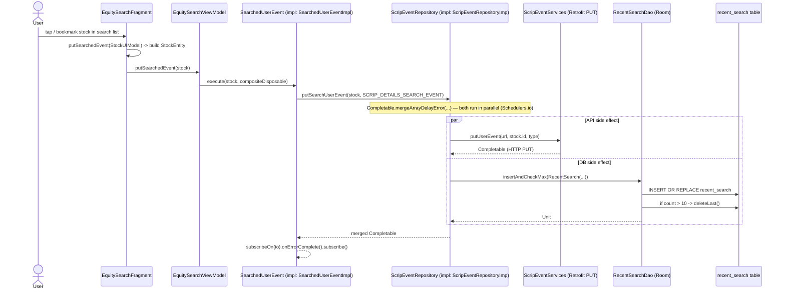

# A1 Flow Trace — "Search-event persistence" (Recent Search write + PUT event API)

Agent 6 (Flow Trace Agent). Read-only analysis of `/Users/abhijeetpal/Desktop/workspace/android-monorepo`.

Flow traced: **User taps/bookmarks a stock from the search screen → an event is recorded both as a remote `PUT` API call AND as a Room DB write into the `recent_search` table.** This flow has TWO real side effects fired in parallel from one repository method (`Completable.mergeArrayDelayError`).

---

## Entry Point

| | |
|---|---|
| **File** | `equity_sdk/src/main/java/com/paytmmoney/equity/search/presentation/EquitySearchFragment.kt:449` |
| **Function** | `EquitySearchFragment.putSearchedEvent(stockUIModel: StockUIModel)` |
| **Purpose** | UI handler invoked when the user acts on a stock in the search results list (e.g. adds it to a watchlist from search listing, line 309; and from item-tap handlers at lines 411 / 429). It maps the UI model `StockUIModel` into a domain `StockEntity` and forwards it to the ViewModel. |

The very top of the chain is a user interaction inside the search list adapter callbacks (`EquitySearchFragment.kt:309`, `:411`, `:429`), each guarded by `if (isSearched) putSearchedEvent(stockUIModel)`.

---

## Execution Path (no gaps)

1. **`EquitySearchFragment.putSearchedEvent(StockUIModel)`** — builds a `StockEntity` from the tapped UI model and calls the ViewModel.
   `equity_sdk/.../search/presentation/EquitySearchFragment.kt:449-465` — **VERIFIED**

2. **`EquitySearchViewModel.putSearchedEvent(stock: StockEntity)`** — guards on the non-null `compositeDisposable` and delegates to the `SearchedUserEvent` use case.
   `equity_sdk/.../search/presentation/EquitySearchViewModel.kt:697-699`
   ```kotlin
   fun putSearchedEvent(stock: StockEntity) {
       compositeDisposable?.let { searchedUserEvent.execute(stock, it) }
   }
   ```
   `searchedUserEvent` is a constructor-injected field (`EquitySearchViewModel.kt:80`, type `SearchedUserEvent`). — **VERIFIED**

3. **`SearchedUserEvent.execute(stock, compositeDisposable)`** — interface call. Interface declared at `equity_sdk/.../scripEvent/domain/usecase/SearchedUserEvent.kt:6`. Resolved to impl via Dagger `@Provides` (see DI below). — **VERIFIED (interface)** / impl binding **VERIFIED via DI**

4. **`SearchedUserEventImpl.execute(stock, compositeDisposable)`** — calls the repository, subscribes on the IO scheduler, swallows errors, and disposes via the composite disposable.
   `equity_sdk/.../scripEvent/domain/SearchedUserEventImpl.kt:16-24`
   ```kotlin
   return repository.putSearchUserEvent(stock, Constants.SCRIP_DETAILS_SEARCH_EVENT)
       .subscribeOn(Schedulers.io())
       .onErrorComplete()
       .subscribe().disposeBy(compositeDisposable)
   ```
   `repository` is constructor-injected `ScripEventRepository` (`SearchedUserEventImpl.kt:14`). — **VERIFIED**

5. **`ScripEventRepository.putSearchUserEvent(stock, type): Completable`** — interface call. Declared `equity_sdk/.../scripEvent/domain/ScripEventRepository.kt:11-14`. Resolved to impl via Dagger `@Provides` (see DI). — **VERIFIED (interface)** / impl binding **VERIFIED via DI**

6. **`ScripEventRepositoryImp.putSearchUserEvent(stock, type)`** — the fan-out point. Builds the event URL via `gtmHandler`, then returns `Completable.mergeArrayDelayError(...)` combining TWO side effects executed together:
   `equity_sdk/.../scripEvent/data/ScripEventRepositoryImp.kt:54-83` — **VERIFIED**
   - **6a (API):** `services.putUserEvent(url, stock.id, type)` → `ScripEventRepositoryImp.kt:63`
   - **6b (DB):** `Completable.fromCallable { recentSearchDao.insertAndCheckMax(RecentSearch(...)) }.subscribeOn(Schedulers.io())` → `ScripEventRepositoryImp.kt:64-81`

7a. **API branch — `ScripEventServices.putUserEvent(@Url url, @Query stockid, @Query type): Completable`**
   `equity_sdk/.../scripEvent/data/ScripEventServices.kt:10-15` — Retrofit `@PUT` interface. The `ScripEventServices` instance is built from a `Retrofit` via `retrofit.create(...)` (see DI). — **VERIFIED**

7b. **DB branch — `RecentSearchDao.insertAndCheckMax(stock: RecentSearch)`** — `@Transaction` method:
   `common-database/.../search/RecentSearchDao.kt:31-37`
   ```kotlin
   @Transaction
   open fun insertAndCheckMax(stock: RecentSearch) {
       insert(stock)
       if (getCount() > MAX) {   // MAX = 10
           deleteLast()
       }
   }
   ```
   — **VERIFIED**

8b. **`RecentSearchDao.insert(stock: RecentSearch)`** — `@Insert(onConflict = OnConflictStrategy.REPLACE)` → terminal Room write into table `recent_search`.
   `common-database/.../search/RecentSearchDao.kt:28-29`. Cap-enforcement secondary write `deleteLast()` at `RecentSearchDao.kt:39-40` deletes the oldest row when count > 10. — **VERIFIED**

The `recentSearchDao` instance used in step 6b is constructor-injected into `ScripEventRepositoryImp` (`ScripEventRepositoryImp.kt:19`), provided by `RoomModule` (see DI).

---

## DI bindings resolved

All Dagger (not Hilt). Module: `equity_sdk/.../scripEvent/di/CommonScripEventModule.kt`.

| Interface / type | Bound to / provided by | Cite | Confidence |
|---|---|---|---|
| `SearchedUserEvent` | `SearchedUserEventImpl` | `CommonScripEventModule.kt:17-18` `bindSearchedUserEventUseCase(...)` | VERIFIED |
| `ScripEventRepository` | `ScripEventRepositoryImp` | `CommonScripEventModule.kt:23-24` `bindScripEventRepository(...)` | VERIFIED |
| `ScripEventServices` | `retrofit.create(ScripEventServices::class.java)` | `CommonScripEventModule.kt:26-27` `provideScripEventService(retrofit)` | VERIFIED |
| `RecentSearchDao` | `database.recentSearchDao` | `common-database/.../RoomModule.kt:84-87` `provideRecentSearchDao(database)` | VERIFIED |
| `EquityDatabase` | `Room.databaseBuilder(...)` singleton (`EquityDatabase.INSTANCE`) | `common-database/.../RoomModule.kt:42-72` `provideDatabase(context)` | VERIFIED |
| `EquitySearchViewModel` | multibound into `ViewModel` map | `equity_sdk/.../search/di/EquitySearchModelModule.kt:20-21` `@ViewModelKey(EquitySearchViewModel::class) bindEquitySearchViewModel(...)` | VERIFIED |
| `RecentSearchDao` exposed to feature components | `EquityBaseComponent.exposeRecentSearchDao(): RecentSearchDao` | `equity_sdk/.../di/EquityBaseComponent.kt:149` | VERIFIED |

`StockEntity` (domain model) and `RecentSearch` (Room `@Entity tableName = "recent_search"`, `common-database/.../search/RecentSearch.kt:10-11`) are plain data classes — no DI.

---

## External dependencies

- **RxJava2** (`io.reactivex.Completable`, `Schedulers.io()`) — used to run the API call and DB write in parallel and off the main thread (`ScripEventRepositoryImp.kt`, `SearchedUserEventImpl.kt`).
- **Retrofit2** — `ScripEventServices` is a `@PUT` Retrofit interface; instance created from an injected `Retrofit` (`CommonScripEventModule.kt:27`).
- **Room** (`androidx.room`) — `RecentSearchDao` `@Dao`/`@Insert`/`@Transaction`; `EquityDatabase` `RoomDatabase` with 18 migrations and `JournalMode.TRUNCATE` (`RoomModule.kt:42-72`).
- **GtmHandler** (`com.paytmmoney.core.gtm.GtmHandler`) — builds the event endpoint URL (`EquityModule.EVENT` + `EquityNetworkConstants.PUT_EVENT`) at `ScripEventRepositoryImp.kt:28-31, 58-61`.
- **Dagger** — DI graph (modules + `EquityBaseComponent`).

---

## Side Effects

| # | Type | What | Location | Confidence |
|---|---|---|---|---|
| 1 | **Remote API call** | HTTP `PUT` user "search" event with query params `stockid` + `type` (`SCRIP_DETAILS_SEARCH_EVENT`) to the GTM-resolved event URL | API: `ScripEventServices.kt:10-15`; invoked `ScripEventRepositoryImp.kt:63` | VERIFIED |
| 2 | **DB write (Room)** | `INSERT … ON CONFLICT REPLACE` into table `recent_search`, then enforce a 10-row cap (`deleteLast()` if count > `MAX`) | `RecentSearchDao.kt:28-40`; entity table `recent_search` (`RecentSearch.kt:11`); invoked `ScripEventRepositoryImp.kt:65` | VERIFIED |
| 3 | **DB delete (cap eviction)** | `DELETE` the oldest `recent_search` row when count exceeds 10 | `RecentSearchDao.kt:39-40` (`deleteLast()`), called inside `insertAndCheckMax` | VERIFIED |

Note: the sibling method `putViewedUserEvent` (`ScripEventRepositoryImp.kt:24-52`) performs the identical pattern against `RecentlyViewedDao` / `recently_viewed` (cap 25), driven from `IndexDetailsViewModel` and `EquityCompanyViewModel` — a parallel "recently viewed" flow not traced in detail here.

---

## Mermaid sequenceDiagram



---

## Known Uncertainties

- **Retrofit base URL / instance scope:** `ScripEventServices` is built from an injected `Retrofit` (`CommonScripEventModule.kt:27`). The actual `Retrofit` provider (base URL, OkHttp client, interceptors) lives in a base/network module not opened in this trace. The endpoint is a full `@Url` resolved at runtime by `GtmHandler` + `EquityNetworkConstants.PUT_EVENT`, so the literal HTTP path is **UNVERIFIED** here. — **INFERRED**
- **Which Dagger component installs `CommonScripEventModule`:** the `@Provides` bindings are confirmed, but the component graph that wires `EquitySearchViewModel` ⇄ `SearchedUserEvent` ⇄ `ScripEventRepositoryImp` ⇄ `RecentSearchDao` (via `EquityBaseComponent.exposeRecentSearchDao`) was not fully walked. The exposure point (`EquityBaseComponent.kt:149`) and module bindings are VERIFIED; the full component wiring is **INFERRED via convention**.
- **`compositeDisposable` lifecycle:** `EquitySearchViewModel.putSearchedEvent` no-ops if `compositeDisposable` is null (`EquitySearchViewModel.kt:698`). Where/when it is initialized was not traced — **UNVERIFIED** (does not affect the side-effect chain when present).
- **Error handling:** `onErrorComplete()` (`SearchedUserEventImpl.kt:22`) plus `mergeArrayDelayError` means a failure in either branch is swallowed and does not surface to the UI; the DB write can still succeed even if the API PUT fails (and vice versa). — VERIFIED behavior.
