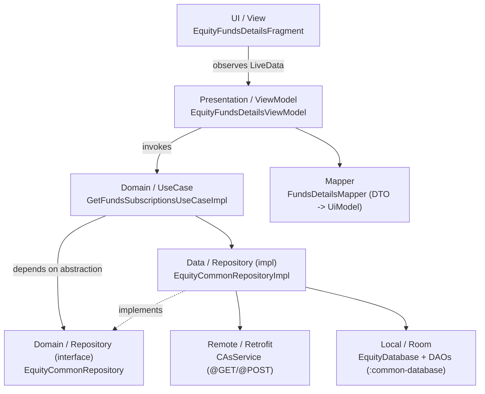
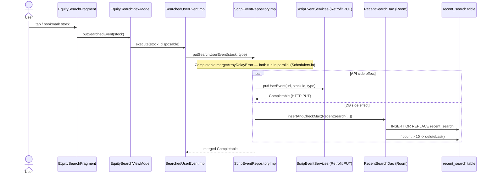

# A1 — Repository Master Report (Consolidated)

> Consolidated from 6 independent specialist agents + cross-verification. Target:
> `/Users/abhijeetpal/Desktop/workspace/android-monorepo` (Paytm Money codebase — Kotlin equity SDK
> + Room + Flutter app), equity vertical. Date: 2026-06-17.
> Status legend: **VERIFIED** (read/grepped) · **INFERRED** (naming/convention) · **UNVERIFIED** (not confirmed).
> Source reports: `A1_inventory.md`, `A1_api_map.md`, `A1_entities.md`, `A1_tests.md`,
> `A1_architecture.md`, `A1_flow_trace.md`; cross-check in `A1_verification_report.md`.

---

## Metrics

| Metric | Value (precise — coordinator `find` counts) | Status |
|---|---|---|
| Files scanned | equity vertical **4,279 Kotlin** src (equity_sdk 3,671 · base_app 522 · common-database 86) + **2,350 Dart** (`pml-flutter/lib`) = **6,629** | VERIFIED (find) |
| Modules discovered | **36** unique `:module` refs in `settings.gradle` (44 include lines incl. flutter glue) | VERIFIED |
| Endpoints mapped | **78** Retrofit interfaces (equity_sdk, VERIFIED) + 1 (base_app); ~363 methods / 414 verb annotations (INFERRED count) | VERIFIED (78), counts INFERRED |
| Entities found | **27 tables** in 2 Room DBs (24 EquityDatabase v19 + 3 LoggingDataBase v7) | VERIFIED + independently re-verified |
| Tests discovered | **520** `*Test.kt` (equity vertical) + **212** `*_test.dart` (pml-flutter); 1,684 `*Test.kt` repo-wide | VERIFIED (counts); execution UNVERIFIED (SDK blocker) |
| Contradictions resolved | 2 (Retrofit 71→78 corrected; module-count reconciled) + 1 risk reworded post independent verification | Coordinator + independent agent |

---

## Repository Overview

A Paytm Money **mobile super-app monorepo**: a large Kotlin/Android codebase (the equity trading
SDK `:equity_sdk`, a shared Room database module `:common-database`, an app shell `:base_app`) plus
a **Flutter add-to-app module** (`flutter/pml-flutter`, ~18 features) embedded via a native bridge
(`:pml-flutter-library`, `PMLFlutterBridge.kt`). Stack (VERIFIED, `build.gradle`): Kotlin 2.0.20,
AGP 8.9.1, JDK 17, minSdk 24 / target 35, Dagger(+Hilt) DI, Room (Rx/KTX), Retrofit/OkHttp,
RxJava + Coroutines, Jetpack Compose; 4 flavors (dev/staging/prod/preProd). It is a **client app —
no server endpoints**; all HTTP is outbound.

## Architecture Summary

- **Pattern (VERIFIED):** feature-sliced **Clean Architecture + MVVM**, DI via a **mixed Dagger
  (per-feature components) + Hilt** setup; Room as local layer (centralized in `:common-database`),
  Retrofit as remote. MVI searched for, **not** substantiated. Evidence: `EquityCommonRepository.kt:16`
  (iface) + `EquityCommonRepositoryImpl.kt:28` (impl); `EquityDatabase.kt:67`.
- **Layers:** UI/Fragment → ViewModel (presentation) → UseCase/Interactor (domain) → Repository
  (data) → Retrofit/Room (remote/local).
- **Module graph (VERIFIED):** `:equity_sdk` depends on 24 local `project(':…')` modules (via the
  `deps.paytmmoney` alias map, `build.gradle:369-405`); `:base_app` → 7 targets incl. `:app`.
- **Layer violations (VERIFIED — inconsistent application):** presentation reaching into data/local —
  `IndexDetailsViewModel.kt:77` takes `EquityDatabase` as a constructor field; `orders/…/paymentoptions`
  and `quickOrderpad` nest a full `data/` under `presentation/`; widespread presentation imports of
  Room entities. `funds` is the clean reference; `orders`/`indices` are the offenders.

**Layer flow (representative — `funds` feature):**

**Module dependency graph (`:equity_sdk` + its `project()` deps; `:base_app` + targets):**

```mermaid
graph TD
    base_app[":base_app"] --> app[":app"]
    base_app --> goals[":mf_features:goals"]
    base_app --> amc[":mf_features:amc"]
    base_app --> nfo[":mf_features:nfo"]
    base_app --> nps[":mf_features:nps"]
    base_app --> pfswitch[":mf_features:portfolioSwitch"]
    base_app --> composehome[":compose-home"]
    equity[":equity_sdk"] --> library[":library (core)"]
    equity --> database[":common-database"]
    equity --> deeplink[":deeplink"]
    equity --> logging[":api_failure_logging"]
    equity --> wsclient[":wsclient"]
    equity --> userkyc[":userkyc"]
    equity --> authentication[":authentication"]
    equity --> supreme[":supreme"]
    equity --> analytics[":analytics"]
    equity --> commonui[":commonui"]
    equity --> widgets[":widgets"]
    equity --> txnstatus[":txnstatus"]
    equity --> bank[":bank"]
    %% +9 more :equity_sdk deps (see A1_architecture.md); 24 total project() deps
```

## API Inventory

- **Surface (VERIFIED):** outbound only. **78 Retrofit interfaces** in `:equity_sdk` + `BaseService.kt`
  in `:base_app`; ~363 endpoint methods.
- **Dominant pattern (VERIFIED):** `@Url`-dynamic — **374 `@Url`** vs only **5 static literal paths**;
  real REST paths are assembled in the repository layer (e.g. `/aggr/user/v1/boot`,
  `/order/txn/v1/place/advance_order`, `/gtt-order/api/v2/gtt`).
- **Auth (VERIFIED):** `CoreNetworkInterceptor` (library/) injects `Authorization`, `x-sso-token`,
  `x-2fa-token` on outbound calls.
- **Flutter client (VERIFIED):** GoRouter (8 static + dynamic routes); ~173 outbound calls via
  `ApiManager.executeWithParser` over the PML native bridge into the Kotlin Retrofit stack, + 2
  direct `package:http` calls.

## Entity Inventory

- **2 Room databases, 27 tables (VERIFIED via exported schema JSONs):**
  `EquityDatabase` v19 (24 tables — `common-database/schemas/.../EquityDatabase/19.json`) and
  `LoggingDataBase` v7 (3 tables — `api_failure_logging/schemas/.../LoggingDataBase/7.json`).
- **Reconciliation (VERIFIED):** entity classes = `@Database(entities=[…])` registration = schema
  tables, exactly (24=24=24, 3=3=3). No mismatch.
- **Relationships (VERIFIED absence):** **0 `@ForeignKey`** anywhere; all `foreignKeys` arrays empty
  in both schemas → `explicit FKs: NOT FOUND IN REPOSITORY`. Only **INFERRED** shared-key links
  (`stock_id`/`isin`; detail↔summary naming). One unique composite index on
  `kyc_status_data(moduleName, irStatus, subType)`; no composite PKs. (Classic mobile cache model.)

**ER diagram (27 tables, no enforced FKs; dashed = INFERRED shared-key links):**

```mermaid
erDiagram
  %% ===== EquityDatabase v19 — 24 tables, no FKs =====
  popular_search { TEXT id_PK }
  most_invested_stocks { TEXT id_PK }
  recent_search { TEXT stock_id_PK }
  recently_viewed { TEXT stock_id_PK }
  equity_config { TEXT id_PK }
  personal_details { TEXT userId_PK }
  home_shortcut { TEXT screen_name_PK }
  sleek_card_details { TEXT id_PK }
  portfolio_details { TEXT type_PK }
  common_details { TEXT type_PK }
  equity_realised_detail { INT id_PK }
  equity_realised_summary { INT id_PK }
  fno_realised_detail { INT id_PK }
  fno_realised_summary { INT id_PK }
  pml_notification { INT id_PK }
  mtf_scrips { INT id_PK }
  kyc_status_data { INT id_PK }
  advanced_chart_types { INT id_PK }
  chart_types { INT id_PK }
  y_axis_scale { INT id_PK }
  indicators { INT id_PK }
  time_intervals { INT id_PK }
  fno_ranges { INT id_PK }
  equity_ranges { INT id_PK }
  %% ===== LoggingDataBase v7 — 3 tables, no FKs =====
  api_failure_logging { INT id_PK }
  api_response_time { INT id_PK }
  whitelist_url_tab { INT id_PK }
  recent_search }o..o{ recently_viewed : "INFERRED shared stock_id/isin"
  popular_search }o..o{ most_invested_stocks : "INFERRED shared stock_id/isin"
  equity_realised_detail }o..o{ equity_realised_summary : "INFERRED detail/summary"
  fno_realised_detail }o..o{ fno_realised_summary : "INFERRED detail/summary"
```

## Data Flows

**Traced flow (VERIFIED, 8 hops) — "record a searched stock":**
`EquitySearchFragment` → `EquitySearchViewModel` → `SearchedUserEvent` use-case →
`ScripEventRepository` → `ScripEventRepositoryImp` (fan-out) → **{ Retrofit `putUserEvent` PUT }**
**+ { `RecentSearchDao.insertAndCheckMax` → `insert` (`INSERT OR REPLACE`) + `deleteLast` (10-row cap) }**.
DI resolved via Dagger `@Provides` in `CommonScripEventModule`; DAO via `RoomModule.provideRecentSearchDao`.
**Side effects:** (1) outbound `PUT` user-event API; (2) Room write to `recent_search`.
This single flow ties together the API surface (A2) and the data model (A3) — corroborated by 3 agents
and independently re-verified (`ScripEventRepositoryImp.kt:63,65`).

## Test Strategy

- **Frameworks (VERIFIED):** JUnit4 4.13.2, Robolectric 4.13, MockK 1.13.13, Mockito 5.x, Espresso
  3.6.1, Compose UI test, coroutines-test (catalog `build.gradle:272-292`); Flutter `flutter_test` +
  `mockito` + `build_runner` (`pubspec.yaml:71-82`).
- **Layout/counts (VERIFIED):** 1,684 `*Test.kt` repo-wide; equity_sdk 303 unit/4 instrumented,
  base_app 172/10, common-database 5/26; Flutter pml-flutter 212 unit-widget + 6 integration.
- **Canonical CI command (VERIFIED):** Bitbucket `./gradlew -Pci :base_app:testProductionDebugUnitTest`
  (`bitbucket-pipelines.yml:713`); GitLab `…testDevelopmentDebugUnitTest` (`.gitlab-ci.yml:118`).
- **Execution:** NOT RUN (Android SDK build blocker — honestly stated; no fabricated pass/fail).

## Risks

1. **CI test gap (HIGH — partially verified):** Bitbucket runs unit tests for `:base_app` **only**
   (`bitbucket-pipelines.yml:713`, VERIFIED + independently re-verified) — so on Bitbucket, equity_sdk's
   ~303 and Flutter's ~212 tests don't execute. **Caveat (independent verification):** GitLab's
   `testDevelopmentDebugUnitTest` (`.gitlab-ci.yml:118`) is a **generic** task whose module scope is
   **UNVERIFIED** — it may run more than `:base_app`. Confirm which CI is authoritative and GitLab's
   actual module coverage with the team before treating the gap as total.
2. **Coverage gates weak/possibly void (MED):** production-vs-development flavor mismatch likely voids
   jacoco coverage; gates non-blocking (`|| true`); thresholds 20% root / 10% equity_sdk / none for common-database.
3. **Architecture inconsistency (MED, VERIFIED):** layer violations in `orders`/`indices` (presentation
   touching Room/data) undermine the Clean boundary; harder to test/refactor.
4. **No DB referential integrity (LOW, by design):** cache tables rely on app logic to stay consistent.
5. **Doc drift (LOW):** stale coverage (78.6%) and wrong `pml_flutter` path in docs (A4).

## Unknowns

- Retrofit base-URL provider + exact Dagger component installing the scrip-event module — INFERRED (A6).
- Exact endpoint method total (~363) — INFERRED from annotations incl. dynamic `@Url` (A2).
- True test coverage % for equity_sdk/Flutter — UNVERIFIED (build not run) (A4).
- Some equity/kyc Retrofit services may live in binary modules — `NOT FOUND IN REPOSITORY` if only `build/` copies exist.

## Recommendations

1. **Fix CI coverage gap** — add equity_sdk + Flutter unit-test stages (and align flavor so jacoco
   reports are valid); make gates blocking once stabilized.
2. **Enforce layer boundaries** — refactor `IndexDetailsViewModel` and `orders`/`quickOrderpad` to go
   through repositories/use-cases; add a lint/Konsist rule to ban presentation→data imports.
3. **Document the data model** — publish the 27-table Room map (no-FK cache model) and the shared-key
   conventions so consumers don't assume integrity.
4. **Refresh stale docs** — correct coverage numbers and the `pml-flutter` path.

---

## Agent Findings vs Verified Findings

### Agent Findings (as reported by the 6 specialists)
- A1: ~40 modules; equity_sdk 71 Retrofit services, 183 use-cases, 86 iface/65 impl repos, 194 VMs, 843 models.
- A2: 79 Retrofit interfaces, ~363 methods, `@Url`-dynamic, CoreNetworkInterceptor auth.
- A3: 2 DBs / 27 tables / 0 FKs / reconciles exactly.
- A4: frameworks + CI command + 1,684 tests + CI-only-base_app defect.
- A5: Clean+MVVM+Dagger/Hilt; 32-node module graph; layer violations.
- A6: 8-hop recent-search flow → PUT + Room write.

### Verified Findings (confirmed by coordinator against source)
- **78** Retrofit interfaces in equity_sdk (A1's 71 corrected; A2 confirmed).
- 27 tables, **0 `@ForeignKey`** (re-grepped).
- Layer violation `IndexDetailsViewModel.kt:77` (read).
- `recent_search` table + DAO `@Insert` (read).
- ~40 modules (`settings.gradle`).
- CI `:base_app`-only unit tests (`bitbucket-pipelines.yml:713`, cited by A4).

---

## Completion criteria

- [x] 6 specialist agents executed (independently, no cross-reading)
- [x] Individual reports generated (`A1_inventory/api_map/entities/tests/architecture/flow_trace.md`)
- [x] Verification report generated (`A1_verification_report.md`)
- [x] Master report generated (this file)
- [x] Contradictions resolved (2)
- [x] Evidence attached (file paths / schema JSONs throughout)
- [x] Verification status assigned (VERIFIED / INFERRED / UNVERIFIED)
