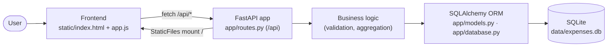
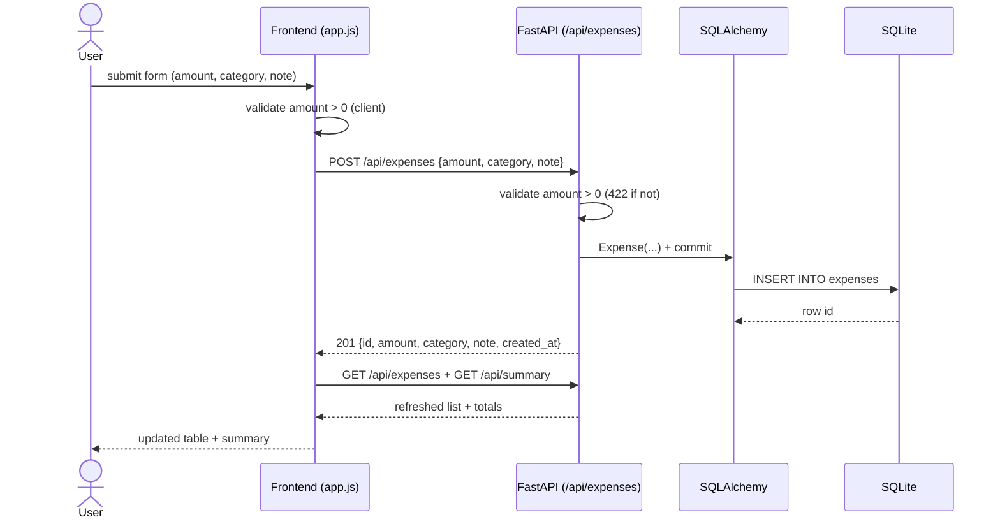

# A2 — Master Report: Expense Tracker (Parallel Multi-Agent Build)

> A complete full-stack system built by 6 parallel specialist agents against a locked contract,
> then integrated, run, and verified by the coordinator. **Status: working, integration-verified,
> deploys in Docker.** Date: 2026-06-17.

---

## System Overview

**Expense Tracker** — a single-deployable full-stack web app. A FastAPI backend exposes a JSON API
under `/api/*` and serves a dependency-free (vanilla-JS) frontend at `/`. Data persists in a
file-based SQLite database via SQLAlchemy. Ships with a pytest suite (unit + integration), a Docker
image + compose stack, a GitHub Actions CI pipeline, and operator docs. Users add expenses
(amount, category, note) and see a live list plus a category summary.

**Stack:** Python 3.12+ · FastAPI · SQLAlchemy 2 · SQLite · vanilla JS · pytest · Docker · GitHub Actions.

## Architecture Diagram

## Data Flow Diagram (add an expense)

## API Inventory

| Method | Path | Request | Response | Verified |
|---|---|---|---|---|
| GET | `/api/health` | — | `200 {"status":"ok"}` | ✅ |
| POST | `/api/expenses` | `{amount, category, note?}` | `201 {id,amount,category,note,created_at}` · `422 {"error":"amount must be positive"}` | ✅ |
| GET | `/api/expenses` | — | `200 [ExpenseOut, …]` (newest first) | ✅ |
| GET | `/api/summary` | — | `200 {total, count, by_category}` | ✅ |
| GET | `/` | — | `200` frontend (index.html) | ✅ |

## Database Model

Table **`expenses`** (SQLite; ORM `app/models.py` ↔ DDL `db/schema.sql`):

| Column | Type | Constraints |
|---|---|---|
| id | INTEGER | PK AUTOINCREMENT |
| amount | REAL | NOT NULL, `CHECK(amount>0)` (DDL) + API guard |
| category | TEXT | NOT NULL |
| note | TEXT | default `''` |
| created_at | TEXT | NOT NULL, ISO-8601 UTC |

Indexes: `idx_expenses_category`, `idx_expenses_created_at`. Migration: `db/migrations/0001_init.sql`; seed: `db/seed.sql`.

## Testing Summary

- **16 tests, 16 passed** (`pytest -v`): 12 API (health, create+body, note default, amount≤0 → 422,
  missing/bad fields, newest-first list, summary aggregation) + 4 integration (served HTML,
  create→list, create→summary, full round trip).
- Isolation: conftest points `DATABASE_URL` at a temp SQLite file and recreates tables per test.

## Deployment Summary

- **Docker:** `python:3.12-slim`, non-root user, stdlib `HEALTHCHECK` on `/api/health`, `uvicorn`
  CMD. Built + run **VERIFIED** — container reaches `healthy`, serves API + frontend (image 312 MB).
- **Compose:** single `app` service, `8000:8000`, `./data:/app/data` volume for SQLite persistence.
- **CI:** GitHub Actions — `test` job (pip install → pytest) then `build` job (docker build).
- **Run:** `uvicorn app.main:app --host 0.0.0.0 --port 8000` (local) or `docker compose up`.

## Operational Guide (summary — full in RUNBOOK.md)

- **Start:** `docker compose up -d` (or `uvicorn app.main:app`). **Stop:** `docker compose down`.
- **Health:** `curl localhost:8000/api/health` → `{"status":"ok"}`.
- **Data:** `data/expenses.db`; back up by copying the file or `sqlite3 data/expenses.db .dump`.
- **Logs:** `docker logs <container>` / uvicorn stdout.
- **Rollback:** redeploy previous image tag / `git revert`; restore SQLite file from backup.

---

## Agent Generated vs Verified Results

### Agent Generated (authored by the 6 workstream agents)
- Backend code (`app/`), frontend (`static/`), DB DDL (`db/`), tests (`tests/`), Docker/CI artifacts, README/RUNBOOK, and the 6 workstream reports.

### Verified Results (executed by the coordinator — evidence captured)
- **pytest:** 16 passed.
- **Live API + frontend:** all endpoints + `/` + `/app.js` (real curl, summary math correct).
- **Docker:** build tagged (312 MB); container `Up (healthy)`; in-container API + frontend serve.
- **Integration:** every connection point checked (FE↔BE, BE↔DB, tests↔system, CI↔build, DDL↔ORM).

---

## Metrics

| Metric | Value |
|---|---|
| Components delivered | 6 (backend, frontend, db, tests, devops, docs) |
| Agents executed | 6 (parallel, disjoint file ownership) |
| API endpoints | 5 (incl. `/`) |
| DB tables | 1 (`expenses`) + 2 indexes |
| Tests | 16 (12 API + 4 integration) — all passing |
| Container image | 312 MB, healthy |
| Conflicts resolved | 2 (cross-lane HTML dependency; ORM↔DDL drift risk) |

**Bottom line:** 6 agents independently built disjoint workstreams to a locked contract; the
coordinator integrated and verified the system end-to-end — tests, live server, and a healthy
Docker deployment — with no unresolved conflicts.

## Screenshots

**a2 ui dashboard**

