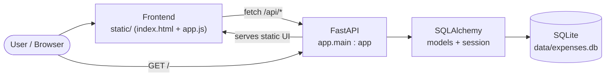

# Expense Tracker

A small full-stack expense tracker. A **FastAPI** backend exposes a JSON API under
`/api`, persists records to **SQLite** via **SQLAlchemy**, and serves a single-page
vanilla-JavaScript frontend at `/`. The app ships with a test suite (pytest), a
Docker image, a `docker-compose` stack, and a GitHub Actions CI pipeline.

## Features

- Add expenses (`amount`, `category`, optional `note`).
- List all expenses (newest first).
- View a summary: grand total, count, and totals grouped by category.
- Health endpoint for monitoring/orchestration.

## Architecture



The browser loads the UI from `GET /` (FastAPI's `StaticFiles` mount). The UI then
calls the JSON API under `/api/*`. FastAPI routes delegate to SQLAlchemy, which
reads/writes the SQLite file at `data/expenses.db`.

> Note: the API router is registered **before** the static mount at `/`, so
> `/api/*` requests reach the API and are not swallowed by the static handler.

## Folder structure

```
A2/
├── app/                    # FastAPI application package
│   ├── __init__.py
│   ├── main.py             # App factory: creates tables on startup, mounts router + static
│   ├── routes.py           # API endpoints (/api/health, /api/expenses, /api/summary)
│   ├── models.py           # SQLAlchemy ORM model (Expense)
│   ├── schemas.py          # Pydantic request/response models
│   └── database.py         # Engine, SessionLocal, Base, get_db dependency
├── static/                 # Vanilla-JS frontend served at /
│   ├── index.html
│   └── app.js
├── db/                     # Raw SQL reference (schema/migrations/seed)
│   ├── schema.sql
│   ├── seed.sql
│   └── migrations/0001_init.sql
├── data/                   # SQLite database lives here (created at runtime)
│   └── expenses.db
├── tests/                  # pytest suite
│   ├── __init__.py
│   └── conftest.py         # Isolated temp-DB fixtures + TestClient
├── docs/                   # Architecture / database / agent notes
├── Dockerfile
├── docker-compose.yml
├── .dockerignore
├── requirements.txt
└── .github/workflows/ci.yml
```

## Setup

Requires **Python 3.12**.

```bash
python3 -m venv .venv
source .venv/bin/activate          # Windows: .venv\Scripts\activate
pip install -r requirements.txt
```

## Run locally

```bash
uvicorn app.main:app --reload
```

The server starts on **http://localhost:8000**.

- Open the UI in a browser: **http://localhost:8000/** — add an expense via the
  form, then watch the summary and the expense table update.
- Interactive API docs (Swagger UI): **http://localhost:8000/docs**

On startup the app creates the `expenses` table automatically and creates the
`./data/` directory if it does not exist (when using the default SQLite path).

### Configuration

| Variable       | Default                          | Description                          |
| -------------- | -------------------------------- | ------------------------------------ |
| `DATABASE_URL` | `sqlite:///./data/expenses.db`   | SQLAlchemy database URL. Read at import time. |

## Test

```bash
pytest -v
```

Tests run against an **isolated temporary SQLite database** (configured in
`tests/conftest.py` via `DATABASE_URL` before the app is imported), so they never
touch the real `data/expenses.db`. Each test starts from a freshly created schema.

## Docker

Build and run the image directly:

```bash
docker build -t expense-tracker:local .
docker run --rm -p 8000:8000 -v "$(pwd)/data:/app/data" expense-tracker:local
```

Or use Compose (recommended — it wires up the persistent data volume and a
healthcheck):

```bash
docker compose up --build
```

The app is then available at **http://localhost:8000/**. The container runs as a
non-root user and exposes a `/api/health` healthcheck.

## API reference

Base URL: `http://localhost:8000`. All API paths are prefixed with `/api`.

| Method | Path             | Request body                              | Success response                                                                 |
| ------ | ---------------- | ----------------------------------------- | -------------------------------------------------------------------------------- |
| GET    | `/api/health`    | —                                         | `200` `{"status":"ok"}`                                                          |
| POST   | `/api/expenses`  | `{"amount":float,"category":str,"note"?:str}` | `201` `{"id","amount","category","note","created_at"}`                       |
| GET    | `/api/expenses`  | —                                         | `200` array of expense objects (newest first)                                    |
| GET    | `/api/summary`   | —                                         | `200` `{"total":float,"count":int,"by_category":{cat:total}}`                    |
| GET    | `/`              | —                                         | `200` HTML (the frontend UI)                                                     |

`amount` must be **positive**; a non-positive amount returns `422` with
`{"error":"amount must be positive"}`. Malformed/missing fields return FastAPI's
standard `422` validation error.

### curl examples

```bash
# Health check
curl http://localhost:8000/api/health
# -> {"status":"ok"}

# Create an expense
curl -X POST http://localhost:8000/api/expenses \
  -H "Content-Type: application/json" \
  -d '{"amount": 12.50, "category": "food", "note": "lunch"}'
# -> {"id":1,"amount":12.5,"category":"food","note":"lunch","created_at":"2026-06-17T..."}

# List expenses (newest first)
curl http://localhost:8000/api/expenses

# Summary
curl http://localhost:8000/api/summary
# -> {"total":12.5,"count":1,"by_category":{"food":12.5}}
```

## Continuous integration

`.github/workflows/ci.yml` runs on every push and pull request: a **test** job
(installs deps, runs `pytest -v` on Python 3.12) followed by a **build** job that
builds the Docker image once tests pass.

---

> _Documentation generated by an AI agent (Claude). Review before relying on it in production._
