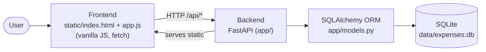

# A2 — System Architecture & Integration Contract (Phase 1)

> Role: Staff+ Engineer & Multi-Agent Build Coordinator.
> System: **Expense Tracker** — a full-stack app (Frontend + Backend + Database + Tests + Deploy + Docs).
> This document is the **locked contract**: every agent builds to these exact interfaces so the
> parallel workstreams integrate without merge chaos. Agents AUTHOR only; the coordinator RUNS &
> VERIFIES in Phase 4. Date: 2026-06-17.

---

## System architecture

- Single deployable: FastAPI serves the JSON API under `/api/*` **and** the static frontend at `/`.
- DB: file-based **SQLite** (zero external infra) via SQLAlchemy. Canonical schema in `db/schema.sql`.

---

## File ownership (disjoint — prevents conflicts)

| Workstream / Agent | Owns (writes only these paths) |
|---|---|
| **Backend** (A1) | `app/__init__.py`, `app/main.py`, `app/database.py`, `app/models.py`, `app/schemas.py`, `app/routes.py`, `requirements.txt` |
| **Frontend** (A2) | `static/index.html`, `static/app.js` |
| **Database** (A3) | `db/schema.sql`, `db/migrations/0001_init.sql`, `db/seed.sql` |
| **QA** (A4) | `tests/__init__.py`, `tests/conftest.py`, `tests/test_api.py`, `tests/test_integration.py`, `pytest.ini` |
| **DevOps** (A5) | `Dockerfile`, `.dockerignore`, `docker-compose.yml`, `.github/workflows/ci.yml` |
| **Docs** (A6) | `README.md`, `RUNBOOK.md` |

Each also writes its report under `docs/agent-analysis/A2_<role>.md`.

---

## Data model (LOCKED) — table `expenses`

| Column | Type | Constraints |
|---|---|---|
| `id` | INTEGER | PRIMARY KEY AUTOINCREMENT |
| `amount` | REAL | NOT NULL, must be > 0 (enforced at API) |
| `category` | TEXT | NOT NULL |
| `note` | TEXT | nullable, default `''` |
| `created_at` | TEXT | NOT NULL, ISO-8601 UTC |

SQLAlchemy model (`app/models.py`) and `db/schema.sql` MUST match this exactly.

---

## API contract (LOCKED)

| Method | Path | Request | Success | Errors |
|---|---|---|---|---|
| GET | `/api/health` | — | `200 {"status":"ok"}` | — |
| POST | `/api/expenses` | `{"amount":12.5,"category":"food","note":"lunch"}` | `201 {id,amount,category,note,created_at}` | `422 {"error":"amount must be positive"}` if amount≤0; `422` validation for missing/bad fields |
| GET | `/api/expenses` | — | `200 [ExpenseOut, …]` (newest first) | — |
| GET | `/api/summary` | — | `200 {"total":<float>,"count":<int>,"by_category":{<cat>:<sum>,…}}` | — |
| GET | `/` | — | `200` serves `static/index.html` | — |

`ExpenseOut = {id:int, amount:float, category:str, note:str, created_at:str}`.

---

## Integration contract (how parts connect)

1. **Frontend ↔ Backend:** `app.js` calls **relative** URLs (`/api/expenses`, `/api/summary`) so it
   works wherever the backend is served. On load: GET list + summary; on form submit: POST then refresh.
2. **Backend ↔ Database:** `app/database.py` reads `DATABASE_URL` env (default
   `sqlite:///./data/expenses.db`); `Base.metadata.create_all()` on startup creates tables matching
   `db/schema.sql`. A `get_db()` dependency yields a session per request.
3. **Tests ↔ System:** `tests/conftest.py` sets `DATABASE_URL` to a temp SQLite file **before**
   importing `app.main`, creates fresh tables per test, and uses FastAPI `TestClient`.
4. **CI ↔ Build:** GitHub Actions installs `requirements.txt`, runs `pytest`, then `docker build`.
5. **Deploy:** `Dockerfile` runs `uvicorn app.main:app --host 0.0.0.0 --port 8000`; HEALTHCHECK hits
   `/api/health`; compose mounts a volume for `data/` so the SQLite file persists.

---

## Integration plan & merge order (Phase 3)

Merge/verify order: **Database schema → Backend (models+API) → Frontend → QA tests → DevOps → Docs.**
The coordinator reconciles any mismatch against THIS contract (the contract wins); conflicts are
logged in the acceptance report's conflict-resolution section.

## Verification plan (Phase 4 — coordinator runs)

- `pip install -r requirements.txt` → `pytest -v` (unit + integration), capture output.
- `uvicorn app.main:app` → curl `/api/health`, POST/GET `/api/expenses`, `/api/summary`, GET `/`.
- `docker build` + `docker run` → curl health + an API call (deployment verification, via Colima).
- Capture commands, outputs, exit codes. No success claimed without evidence.

## Required deliverables / completion

6 workstream reports + `A2_system_acceptance_report.md` + `A2_master_report.md`, with Agent-Generated
vs Verified-Results separation and an integration-verified working system.
