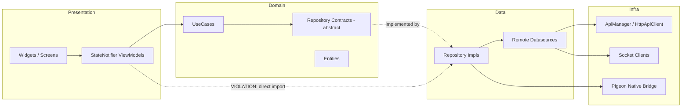
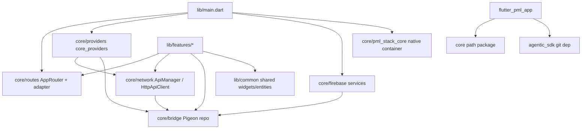

# B1 — Repository Inventory & Architecture Read: `pml-flutter`

## 1. Header

| Field | Value |
|---|---|
| **Repository** | `flutter_pml_app` (Paytm Money trading Flutter module) |
| **Path** | `/Users/abhijeetpal/Desktop/workspace/android-monorepo/flutter/pml-flutter` |
| **Depth mode run** | **Default / Standard** — Phases 0–6 + 8 (with cheap Phase 7 static-analysis notes) |
| **Date** | 2026-06-17 |
| **Agent spec** | `/Users/abhijeetpal/Desktop/workspace/Tasks/Basics/repo-structure-mapper/B1_agent.md` |
| **Version** | `5.0.0+2` (`pubspec.yaml:19`) — VERIFIED |
| **Analyzed commit** | `1a35bda75` (committed 2026-06-03) — all counts below re-derived against this exact SHA; re-run the commands in §8 after any `git pull` to refresh. |

> Sections per spec: 4 (Architecture), 6 (Dependency mapping), 12 (Static analysis) are included at a light level appropriate to standard mode. Phase 9 (full business-flow sequence trace) was **skipped** (full/onboarding mode only); a single cited data-flow path is given instead.

---

## 2. Executive Summary

This repository is **PML Flutter**, the Paytm Money trading module — a **Flutter "add-to-app" module** (not a standalone app) that is embedded into native Android and iOS host applications and powers trading-related features such as the options chain, company/stock pages, watchlists, basket orders, portfolio analytics, research ideas, and an agentic bot. It is built in **Dart on Flutter 3.35.5** (`.fvmrc:2`), uses **Riverpod** for state management and dependency injection (`pubspec.yaml:33`), **go_router** for declarative navigation (`pubspec.yaml:34`), and the **`http`** package plus a custom `ApiManager` facade for outbound REST calls (`pubspec.yaml:35`, `lib/core/network/api_manager.dart`). The codebase follows a **feature-first Clean Architecture** layout: each of the ~18 features under `lib/features/` is split into `data/`, `domain/`, and `presentation/` layers, with abstract repository contracts in `domain/` and implementations in `data/` (e.g. `OptionChainRepository` → `OptionChainRepositoryImpl`). A distinctive trait is heavy reliance on a **Pigeon-generated native bridge** (`lib/core/bridge/`): preferences, Firebase (Analytics/Crashlytics/Performance/Remote Config), and even some API and socket traffic are delegated to the native host rather than handled purely in Dart — there is no Flutter-side database (no Hive/sqflite/SharedPreferences package). Navigation is layered: features self-register routes via a registry (`AppRouter.registerRoute`) that is bridged to a **FlutterBoost-style native container** (`PMLStackCore`) so the native host can push Flutter screens. The app boots in two modes — **legacy** and **advance** — selected at startup by `EngineConfig` (`lib/main.dart:64`). Key things to know on day one: state lives in StateNotifier-based view models, all persistence/native services go through the bridge, and there are real Clean-Architecture **layer violations** (presentation view models importing data-layer impls/datasources directly) that the team appears to tolerate.

---

## 3. Stack at a Glance

| Aspect | Value | Evidence | Confidence |
|---|---|---|---|
| Language | Dart (SDK `>=3.0.0 <4.0.0`) | `pubspec.yaml:21-22` | VERIFIED |
| Framework | Flutter | `pubspec.yaml:31-32` | VERIFIED |
| Flutter SDK version | 3.35.5 (pinned via FVM) | `.fvmrc:2` | VERIFIED |
| Package / app name | `flutter_pml_app` | `pubspec.yaml:1` | VERIFIED |
| Build / package tool | `flutter pub` + `build_runner` (codegen) | `pubspec.yaml:72`, `Makefile:4` | VERIFIED |
| State management + DI | Riverpod (`flutter_riverpod`, `hooks_riverpod`) | `pubspec.yaml:33,53`; providers in `lib/core/providers/core_providers.dart` | VERIFIED |
| Navigation / router root | go_router via `AppRouter.router` | `pubspec.yaml:34`; `lib/core/routes/app_router.dart`; `lib/main.dart:204,285` | VERIFIED |
| HTTP client | `http` package + `HttpApiClient` + `ApiManager` facade | `pubspec.yaml:35`; `lib/core/network/http_api_client.dart`; `lib/core/network/api_manager.dart` | VERIFIED |
| Realtime | `web_socket_channel` (active) + `socket_io_client` (declared) | `pubspec.yaml:37-38`; `lib/core/socket/base/socket_client.dart` | VERIFIED |
| Native bridge | Pigeon `^26.3.4` | `pubspec.yaml:42`; `lib/core/bridge/api/pml_bridge.dart` + `.../generated/pml_bridge.dart` | VERIFIED |
| Entry point | `main()` → `_boot()` | `lib/main.dart:62,92` | VERIFIED |
| App roots | `PMLLegacyModeApp` / `PMLAdvanceModeApp` (mode chosen by `EngineConfig`) | `lib/main.dart:149,190,300` | VERIFIED |
| DI bootstrap | Root `ProviderContainer` + `UncontrolledProviderScope` | `lib/main.dart:60,146-151` | VERIFIED |
| Environments | `production / staging / dev / preProd` (default `dev`) | `lib/core/network/api_environment.dart` (`ApiEnvironment` enum, `ApiEnvironmentConfig`) | VERIFIED |
| Local module dep | `core` (path dependency) | `pubspec.yaml:61-62`; `core/pubspec.yaml` | VERIFIED |
| Git dep | `agentic_sdk` (bitbucket, ref `release`) | `pubspec.yaml:66-69` | VERIFIED |
| Linting | `very_good_analysis` + custom rules | `pubspec.yaml:82`; `analysis_options.yaml` | VERIFIED |
| CI | GitLab (`build_web`) + GitHub Actions | `.gitlab-ci.yml:117`; `.github/workflows/flutter-ci.yml` | VERIFIED |

> Note: `README.md:10` claims **Dio**; the code actually uses `package:http`. README is **INFERRED/drifted** — code (`lib/core/network/http_api_client.dart`) is the source of truth: VERIFIED.

---

## 4. Architecture Analysis

### Pattern(s)

| Pattern | Confidence | Evidence |
|---|---|---|
| **Clean Architecture** (data / domain / presentation per feature) | **VERIFIED** | Every major feature has the 3 folders, e.g. `lib/features/options/{data,domain,presentation}/`; abstract `OptionChainRepository` (`.../options/domain/repositories/option_chain_repository.dart:5`) with impl `OptionChainRepositoryImpl` (`.../options/data/repositories/option_chain_repository_impl.dart:8 implements OptionChainRepository`). `ARCHITECTURE.md:9-11`, `README.md:7` corroborate. |
| **MVVM + Riverpod** (view models hold state; UI observes via `ref.watch`) | **VERIFIED** | `*ViewModel`/`*_view_model` classes (e.g. `lib/features/options/presentation/viewmodels/option_chain_viewmodel.dart`); ~163 `extends StateNotifier` occurrences; UI observes via `ref.watch(...)` (`lib/main.dart:247-249`). |
| **Use-Case layer** (interactor pattern) | **VERIFIED** | Base `lib/core/usecases/usecase.dart`; ~100 `*usecase*.dart` files, e.g. `lib/features/options/domain/usecases/option_chain_usecase.dart:5` (`class OptionChainUseCase`). |
| **Native-container hybrid** (FlutterBoost-style) | **VERIFIED** | `PMLStackCoreApp` + `PMLStackCoreRouteAdapter.routeFactory` (`lib/main.dart:362-365`; `lib/core/routes/pml_stack_core_route_adapter.dart`). |
| BLoC / Cubit | **NOT FOUND IN REPOSITORY** | No `*_bloc.dart` / `BlocProvider` usage found; state is Riverpod StateNotifier-based. |

**Verdict:** Feature-first **Clean Architecture + MVVM with Riverpod**, wrapped by a native-container navigation hybrid. Confidence: VERIFIED.

### Layer Map (key path per layer)

| Layer | Responsibility | Key example path | Confidence |
|---|---|---|---|
| UI (widgets/screens) | Render + dispatch user intents | `lib/features/options/presentation/` (screens/widgets) | VERIFIED |
| Presentation (state) | View models / notifiers hold `AsyncValue`/immutable state | `lib/features/options/presentation/viewmodels/option_chain_viewmodel.dart` | VERIFIED |
| Domain | Entities, use cases, repository contracts | `lib/features/options/domain/repositories/option_chain_repository.dart:5` (abstract) | VERIFIED |
| Data | Repository impls, datasources, DTOs | `lib/features/options/data/repositories/option_chain_repository_impl.dart:8` | VERIFIED |
| Remote | REST via `ApiManager`; sockets; native bridge | `lib/core/network/api_manager.dart`; `lib/features/options/data/datasources/option_chain_remote_datasource.dart` | VERIFIED |
| Local | Native preferences via bridge (no Dart DB) | `lib/core/bridge/usecases/pml_preference_usecase.dart` | VERIFIED |

### Layer Violations (cited)

| Violation | File:line | Evidence |
|---|---|---|
| Presentation view model imports **data-layer datasource** + **bridge repo impl** directly (bypasses domain) | `lib/features/expert_picks/presentation/expert_picks_list_view_model.dart:5,7` | `import '../../../core/bridge/data/repositories/pml_bridge_repository_impl.dart';` and `import '../data/expert_picks_remote_datasource.dart';` — VERIFIED |
| Violation is **systemic, not isolated** — presentation files importing a data-layer symbol (`/data/`, `_repository_impl.dart`, `_remote_datasource.dart`, data models) | **296 files** under `lib/features/*/presentation/` | VERIFIED — re-derived (no longer a sample): `grep -rlnE "^import .*(/data/|_repository_impl\.dart|_remote_datasource\.dart|_local_datasource\.dart)" lib/features/*/presentation --include="*.dart" \| wc -l` → `296`. Examples: `agentic_bot/presentation/pages/agentic_bot_demo_page.dart:7`, `basket_order/presentation/ui/pages/trade_cart_screen.dart:10`. |

> The clean-architecture rule "presentation depends only on domain abstractions" is **not consistently enforced**: **296 of the presentation files import a data-layer symbol directly**, and the bridge repo impl singleton (`pml_bridge_repository_impl.dart`) is the most common offender. This is a structural finding, not an anecdote — worth a lint rule (`import_lint` / custom `analysis_options.yaml` rule banning `data/` imports from `presentation/`).

---

## 5. Folder / Module Inventory

### Top-level (repo root)

| Dir / file | Purpose | Confidence |
|---|---|---|
| `lib/` | All Dart application source | VERIFIED |
| `core/` (root, not `lib/core`) | Local path-dependency package (shared design/network primitives) | VERIFIED (`pubspec.yaml:61-62`, `core/pubspec.yaml`) |
| `test/` | Unit/widget tests mirroring `lib/` | VERIFIED |
| `integration_test/`, `test_driver/` | Integration/e2e harness | VERIFIED |
| `.android/`, `.ios/`, `linux/`, `macos/`, `web/`, `windows/` | Add-to-app host scaffolds / desktop+web smoke targets | VERIFIED |
| `mock-market-socket/` | Local mock socket server for dev | INFERRED (name) |
| `assets/` | icons, images, json, fonts (Inter) | VERIFIED (`pubspec.yaml:96-134`) |
| `ai-review-scripts/`, `scripts/`, `master_flutter.sh` | Tooling / AI review automation | INFERRED |
| `docs/`, `wiki/`, `ARCHITECTURE.md`, `AGENTS.md`, `CLAUDE.md` | Documentation + agent conventions | VERIFIED |
| `Makefile`, `.gitlab-ci.yml`, `.github/`, `lefthook.yml` | Build/CI/pre-commit | VERIFIED |
| `publish_*_aar.sh` | Publish Flutter/webview/prefs AAR to Artifactory | VERIFIED (`README.md:87-88`) |

### `lib/` areas

| Area | Purpose | Confidence |
|---|---|---|
| `lib/main.dart` | Entry: engine-mode detection, Firebase wiring, route registration, ProviderScope, app roots | VERIFIED |
| `lib/core/` | Cross-cutting: network, socket, wsclient, bridge, config, firebase, routes, theme, providers, viewmodels, utils, managers | VERIFIED |
| `lib/common/` | Shared widgets, formatters, entities, exceptions, mixins, accessibility | VERIFIED |
| `lib/features/` | 18 feature modules (Clean Architecture) | VERIFIED |
| `lib/generic/` | Generic reusable components (e.g. `ImageLoader.dart`) | VERIFIED |
| `lib/pmlcharts/` | Charting subdomain (own `data/domain/presentation/di`, high-perf custom painter) | VERIFIED |

### Feature modules under `lib/features/` (18)

`agentic_bot`, `basket_order`, `charts`, `company_page`, `corporateEvents`, `expert_picks`, `flash_trade`, `kyc`, `mtf_statement`, `options`, `orderpad`, `pledge`, `pml_orderpad`, `PMLWatchlist`, `portfolio_analytics`, `portfolios`, `research_ideas`, `TFCOptions` — VERIFIED (directory listing).

| Feature | One-line purpose |
|---|---|
| `options` / `TFCOptions` | Options chain & trade-from-chart options trading |
| `company_page` | Stock / ETF / index company detail pages |
| `flash_trade` | Quick trade flow |
| `basket_order` / `orderpad` / `pml_orderpad` | Order placement (basket, regular, MTF) |
| `portfolio_analytics` / `portfolios` | Portfolio overview, import, analytics |
| `research_ideas` / `expert_picks` | Research-driven trade ideas & expert recommendations |
| `PMLWatchlist` | Watchlist screen |
| `mtf_statement` | Margin Trade Facility statements/charges |
| `pledge` | Share/margin pledging |
| `corporateEvents` | Corporate events list/detail |
| `agentic_bot` | AI agent assistant (uses `agentic_sdk` git dep) |
| `kyc`, `charts` | KYC flow; feature-level charts |

---

## 6. Dependency Mapping

### External dependencies — top ~10 (from `pubspec.yaml`)

| Package | Version | Role | Evidence |
|---|---|---|---|
| `flutter_riverpod` | ^2.4.10 | State management + DI | `pubspec.yaml:33` |
| `go_router` | ^15.1.2 | Declarative navigation/routing | `pubspec.yaml:34` |
| `http` | ^1.4.0 | HTTP client (outbound REST) | `pubspec.yaml:35` |
| `socket_io_client` / `web_socket_channel` | ^2.0.3 / ^2.4.0 | Realtime market/order sockets | `pubspec.yaml:37-38` |
| `pigeon` | ^26.3.4 | Type-safe Flutter↔native bridge codegen | `pubspec.yaml:42` |
| `json_annotation` (+ `json_serializable` dev) | ^4.9.0 | DTO (de)serialization | `pubspec.yaml:41,80` |
| `fl_chart` | ^0.66.2 | Charts/graphs | `pubspec.yaml:48` |
| `webview_flutter` (+ android) | ^4.13.0 | In-app web content (news, education) | `pubspec.yaml:56-57` |
| `decimal` | ^2.3.3 | Precise money/price math | `pubspec.yaml:39` |
| `hooks_riverpod` / `flutter_hooks` | ^2.4.9 / ^0.20.5 | Hook-based widget state | `pubspec.yaml:53,55` |
| `core` (path) / `agentic_sdk` (git) | local / `release` | Shared package; agentic bot SDK | `pubspec.yaml:61-69` |

### Module / feature dependency graph (cite-able edges only)

Edges verified from: `lib/main.dart:38-57` (imports of core/* + feature routes), `lib/core/providers/core_providers.dart:35,50,136-142` (providers wiring `httpApiClient`/`ApiManager`/bridge), `pubspec.yaml:61-69` (path/git deps).

### Data-flow summary (one cited traced read path)

1. UI widget calls `ref.watch(...)` on a Riverpod provider — pattern per `ARCHITECTURE.md:33-39`, e.g. `lib/main.dart:247-249`. (VERIFIED pattern)
2. A datasource issues the request via `ApiManager.executeWithParser<T>(...)` — `lib/features/research_ideas/data/datasources/remote/rs_ideas_remote_data_source.dart` (~L38-72). (VERIFIED)
3. `ApiManager` (`lib/core/network/api_manager.dart`) drives `HttpApiClient` (`lib/core/network/http_api_client.dart`), or routes via the native bridge when `useBridge` is set. (VERIFIED)
4. Response DTO (implements `BaseResponseModel`, `lib/core/network/base_response_model.dart`) is parsed and propagated back as state to the view model → UI rebuilds. (VERIFIED structure / INFERRED final hop)

---

## 7. Design Patterns

| Pattern | Example class | File | Role | Confidence |
|---|---|---|---|---|
| Repository (interface/impl) | `OptionChainRepository` / `OptionChainRepositoryImpl` | `lib/features/options/domain/repositories/option_chain_repository.dart:5` / `.../data/repositories/option_chain_repository_impl.dart:8` | Abstract contract in domain, impl in data | VERIFIED |
| Facade | `ApiManager` | `lib/core/network/api_manager.dart:20` | Single entry for outbound REST (headers, parser, bridge routing) | VERIFIED |
| Singleton | `FirebaseServiceManager`, `PMLBridgeRepositoryImpl`, `ApiManager` | `lib/core/firebase/firebase_service_manager.dart:16`; `lib/main.dart:98` | Shared global services | VERIFIED |
| Use Case (interactor) | `OptionChainUseCase` (base `UseCase`) | `lib/features/options/domain/usecases/option_chain_usecase.dart:5`; `lib/core/usecases/usecase.dart` | Encapsulate one business operation | VERIFIED |
| DI / Provider | `apiManagerProvider`, `httpApiClientProvider`, `bridgeManagerProvider` | `lib/core/providers/core_providers.dart:35,50,136` | Riverpod-based dependency injection | VERIFIED |
| Adapter / Bridge | `PMLStackCoreRouteAdapter` + Pigeon `pml_bridge` | `lib/core/routes/pml_stack_core_route_adapter.dart`; `lib/core/bridge/api/generated/pml_bridge.dart` | Bridge GoRouter↔native container; Dart↔native typed messaging | VERIFIED |
| Registry | `AppRouter.registerRoute` / per-feature `*Routes.registerRoutes()` | `lib/core/routes/app_router.dart:29-40`; `lib/main.dart:156-176` | Features self-register routes (dependency inversion) | VERIFIED |
| Observer (state) | `StateNotifier` view models | `lib/features/options/presentation/viewmodels/option_chain_viewmodel.dart` | UI observes immutable state via Riverpod | VERIFIED |
| Strategy | `MarketSocketClient` (Flutter socket vs native bridge per engine mode) | `lib/core/socket/market_socket/market_socket_client.dart:18-22` | Swap data-source transport at runtime | VERIFIED |
| Builder | `HttpMetricBuilder`, `TraceBuilder` | `lib/core/firebase/firebase_performance_service.dart:25,79` | Fluent construction of perf traces | VERIFIED |

---

## 8. Artifact Inventory

### Verified counts (re-derived @ `1a35bda75`)

Every count below was **executed** against the analyzed commit — the exact command is given so any reader can reproduce it. (This replaces the earlier naming-sweep estimates, several of which were materially off — see the "was" column.)

| Artifact | Command (run from repo root) | **Verified count** | Earlier estimate |
|---|---|---|---|
| Feature modules | `find lib/features -maxdepth 1 -mindepth 1 -type d \| wc -l` | **18** | ~18 ✅ |
| ViewModel files | `find lib -type f \( -iname "*view_model*.dart" -o -iname "*viewmodel*.dart" \) \| wc -l` | **114** | ~63 ❌ (undercounted) |
| `extends StateNotifier` | `grep -rln "extends StateNotifier" lib --include="*.dart" \| wc -l` | **147** | ~163 ❌ (overcounted) |
| Use-case files | `find lib -type f \( -iname "*usecase*.dart" -o -iname "*use_case*.dart" \) \| wc -l` | **125** | ~100 ❌ |
| Repository impls | `find lib -type f -iname "*repository_impl*.dart" \| wc -l` | **46** | — |
| Abstract repo contracts | `find lib -type f -path "*domain/repositories/*.dart" \| wc -l` | **64** | (impls+contracts ≈ "~104") |
| Model files | `find lib -type f -iname "*model*.dart" \| wc -l` | **227** | ~136 ❌ (undercounted by ~40%) |
| `*_provider` files | `find lib -type f -iname "*_provider*.dart" \| wc -l` | **100** | 42 ❌ (undercounted by >2×) |

> **Why this matters:** the original sweep was wrong by up to ~2.4× (providers) and ~40% (models). The lesson — and the fix — is that an inventory count is only trustworthy when it ships the command that produced it.

### ViewModels / State holders (**114** `*view_model*`/`*viewmodel*` files, **147** `extends StateNotifier`, **100** `*_provider`)

| Name | File | Status |
|---|---|---|
| `OptionChainViewModel` | `lib/features/options/presentation/viewmodels/option_chain_viewmodel.dart` | VERIFIED |
| `OptionsListViewModel` | `lib/features/options/presentation/viewmodels/options_list_view_model.dart` | VERIFIED |
| `FlashTradePageViewModel` | `lib/features/flash_trade/presentation/viewmodel/flash_trade_page_viewmodel.dart` | VERIFIED |
| `PMLPortfolioAnalyticsOverviewViewModel` | `lib/features/portfolio_analytics/presentation/viewmodels/pml_portfolio_analytics_overview_viewmodel.dart` | VERIFIED |
| `ExpertPicksListViewModel` | `lib/features/expert_picks/presentation/expert_picks_list_view_model.dart` | VERIFIED |
| `CachedScripsViewModel` | `lib/features/TFCOptions/cachedscrips/presentation/viewmodels/cached_scrips_viewmodel.dart` | VERIFIED |
| `BaseViewModel` (ChangeNotifier base) | `lib/core/viewmodels/base_view_model.dart` | VERIFIED |
| `PositionsViewModel` | `lib/core/positions_generator/positions_viewmodel.dart` | VERIFIED |
| `ThemeProvider` (ChangeNotifier) | `lib/core/theme/theme_provider.dart` | VERIFIED |
| `appViewModelProvider` (root VM) | referenced `lib/main.dart:94` (`core/providers/core_providers.dart`) | VERIFIED |

+~55 more `*ViewModel`/notifier files across `lib/features/*/presentation/` and `lib/core/`.

### Services / Use-cases / Repositories

| Group | Count (approx) | Representative | Status |
|---|---|---|---|
| Repository contracts + impls | **64 contracts + 46 impls = 110** | `OptionChainRepository` / `…Impl`; `PMLBridgeRepository` / `…Impl` (`lib/core/bridge/{domain,data}/repositories/`) | VERIFIED (counts re-derived — see §8 commands) |
| Use cases (`*usecase*.dart`) | **125 files** | `lib/core/usecases/usecase.dart` (base); `lib/features/options/domain/usecases/option_chain_usecase.dart`; `lib/core/bridge/usecases/pml_preference_usecase.dart` | VERIFIED (count re-derived) |
| Firebase services | 4 + manager | `FirebaseAnalyticsService`, `FirebaseCrashlyticsService`, `FirebasePerformanceService`, `FirebaseRemoteConfigService` (`lib/core/firebase/`) | VERIFIED |
| Network services | 3 core | `ApiManager`, `HttpApiClient`, `NetworkLogger` (`lib/core/network/`) | VERIFIED |
| Socket services | 4 | `SocketClient`, `MarketSocketClient`, `OrderSocketClient`, `NativeSocketManager` (`lib/core/socket/`) | VERIFIED |

+ many more repositories/use-cases per feature — see `lib/features/*/{data,domain}/`.

### Models / Entities / DTOs (**227** `*model*.dart` files — re-derived; earlier "~136" was a ~40% undercount)

| Name | File | Status |
|---|---|---|
| `BaseResponseModel` | `lib/core/network/base_response_model.dart` | VERIFIED |
| `StockModel` | `lib/common/entities/stock_model.dart` | VERIFIED |
| `OptionChainConfigResponse` | `lib/features/options/data/models/option_chain_config_response.dart` | VERIFIED |
| `BasketOrderModel` (`@JsonSerializable`) | `lib/features/basket_order/data/models/basket_order_model.dart` | VERIFIED |
| `PledgeSummaryEntity` | `lib/features/pledge/domain/entities/pledge_summary_entity.dart` | VERIFIED |
| `StockEntity` (socket) | `lib/core/socket/models/stock_entity.dart` | VERIFIED |
| `PreferenceDataModel` (Pigeon) | `lib/core/bridge/api/generated/pml_bridge.dart` | VERIFIED |

+~125 more under `lib/features/*/data/models/` and `*/domain/entities/`.

### Utilities / Config

| Name | File | Status |
|---|---|---|
| `AppConfig` | `lib/core/config/app_config.dart` | VERIFIED |
| `EngineConfig` (legacy/advance mode) | `lib/core/config/engine_config.dart` (used `lib/main.dart:64-67`) | VERIFIED |
| `AppConstants` | `lib/core/constants/app_constants.dart` | VERIFIED |
| `AppLogger` | `lib/core/utils/logger.dart` | VERIFIED |
| `HeaderConfig` | `lib/core/network/header_config.dart` | VERIFIED |
| `ApiEnvironmentConfig` | `lib/core/network/api_environment.dart` | VERIFIED |
| `UnifiedThemeConfig` / `PMColor` | `lib/core/theme/unified_theme_config.dart`, `.../colors/pm_colors.dart` | VERIFIED |

---

## 9. Infrastructure Components

| Component | Detail | Evidence | Confidence |
|---|---|---|---|
| Outbound REST | `ApiManager` → `HttpApiClient` (`package:http`, SSL pinning via custom `SecurityContext`) | `lib/core/network/api_manager.dart`; `lib/core/network/http_api_client.dart` | VERIFIED |
| Base URLs / envs | `production / staging / dev / preProd`; main `api.paytmmoney.com`, plus `api-pf`, `api-eq`, `api-eq-order`, `static`, `h5-stocks`, `tv-charts` hosts | `lib/core/network/api_environment.dart` (`ApiEnvironment`, `ApiEnvironmentConfig`) | VERIFIED |
| Standard headers | `x-pmngx-key`, `x-pmmodule-name`, `x-user-agent`, `x-2fa-token`, `x-sso-token`, Content-Type/Accept | `lib/core/network/header_config.dart` | VERIFIED |
| Market socket | `MarketSocketClient` (Flutter `web_socket_channel` socket for TFC engine, native bridge otherwise) | `lib/core/socket/market_socket/market_socket_client.dart:18-22`; `lib/core/socket/base/socket_client.dart` | VERIFIED |
| Order socket | `OrderSocketClient` (binary `Uint8List` → `Order`) | `lib/core/socket/order_socket/order_socket_client.dart` | VERIFIED |
| Native bridge | Pigeon-generated typed channel; ~32 bridge methods (`getPreference`, `makeApiRequest`, `firebase*`, `getUserAgent`, …) | `lib/core/bridge/api/pml_bridge.dart`; `.../generated/pml_bridge.dart`; `lib/core/bridge/pml_pigeon_build.dart` | VERIFIED |
| Local storage / cache | **No Dart DB** — preferences delegated to native via `PMLPreferenceUsecase` (get/set/delete) | `lib/core/bridge/usecases/pml_preference_usecase.dart`; no Hive/sqflite/shared_preferences in `pubspec.yaml` | VERIFIED |
| Feature flags / remote config | `FirebaseRemoteConfigService` (`fetchAndActivate`, typed getters) via bridge; `AppConfig._firebaseEnabled` gate (native flag `flutter_firebase_enabled`) | `lib/core/firebase/firebase_remote_config_service.dart`; `lib/core/config/app_config.dart`; `lib/main.dart:99-103` | VERIFIED |
| Firebase | Analytics, Crashlytics, Performance, Remote Config — all via bridge, registered in `FirebaseServiceManager` | `lib/core/firebase/`; `lib/main.dart:106-124` | VERIFIED |
| Crash handling | `runZonedGuarded` + Crashlytics forwarding; error handlers wired pre-`runApp` | `lib/main.dart:77-89,106` | VERIFIED |
| Dev infra | `mock-market-socket/` local mock server | dir present | INFERRED |

---

## 10. External Dependencies

See §6 table. Notable: **Pigeon** (native bridge backbone — most infra runs through it), **agentic_sdk** (private git dep, `ref: release`, drives `agentic_bot`), **core** (local path package). Full lock in `pubspec.lock` (VERIFIED present).

---

## 11. API / Route Map

**This is a CLIENT app — there are NO server endpoints exposed here.** "APIs" = (a) frontend navigation routes and (b) the outbound HTTP client layer.

### Navigation mechanism (VERIFIED)
- **Router root:** `AppRouter.router` (go_router), assigned at `lib/main.dart:204,285`; config in `lib/core/routes/app_router.dart`.
- **Registry pattern:** features call `*Routes.registerRoutes()` in `_registerRoutes()` (`lib/main.dart:156-176`), each delegating to `AppRouter.registerRoute(path, builder)` (`lib/core/routes/app_router.dart:29-40`).
- **Native bridge:** `PMLStackCoreRouteAdapter` dual-registers routes and exposes `routeFactory` so the native host (FlutterBoost-style `PMLStackCore`) can push Flutter screens (`lib/core/routes/pml_stack_core_route_adapter.dart`; `lib/main.dart:362-365`).

### Representative routes (~46 distinct; sample)

| Route | Registering file |
|---|---|
| `/` | `lib/core/routes/app_routes.dart:13` |
| `/companyPage`, `/stockCompanyPage`, `/etfCompanyPage`, `/indexCompanyPage`, `/allEtf` | `lib/features/company_page/presentation/routes/*Routes.dart` |
| `/options`-area, `/tfcScreen` | `lib/features/options/.../options_routes.dart`; `lib/features/TFCOptions/presentation/routes/TFCRoutes.dart:20` |
| `/flashTrade`, `/flashTrade/contracts` | `lib/features/flash_trade/presentation/routes/flash_trade_routes.dart` |
| `/basketOrderPage`, `/trade-cart-detail`, `/trade-cart-listing`, `/mini-orderpad` | `lib/features/basket_order/presentation/routes/basket_order_routes.dart` |
| `/pmlPortfolioOverview`, `/pmlPortfolioImport`, `/pmlPortfolioConsent` | `lib/features/portfolio_analytics/presentation/routes/pml_portfolio_analytics_routes.dart` |
| `/research-ideas` (+11 sub-routes) | `lib/features/research_ideas/presentation/routes/research_ideas_routes.dart` |
| `/expert-pick-detail`, `/expert-pick-listing`, `/expert-pick-info` | `lib/features/expert_picks/presentation/routes/expert_picks_routes.dart` |
| `/mtf-statement` (+charges sub-routes) | `lib/features/mtf_statement/presentation/routes/mtf_statement_paths.dart` |
| `/quick-margin-pledge`, `/watchlistScreen`, `/agenticBot`, `/corporate-events` | respective feature route files |

> ~46 registered routes across 21 feature route files (INFERRED count from sweep; individual paths VERIFIED). For a deep route/contract treatment, defer to the **B2 agent**.

### Outbound HTTP origin
All outbound calls originate from feature datasources via `ApiManager`, e.g. `lib/features/research_ideas/data/datasources/remote/rs_ideas_remote_data_source.dart` calling `_apiManager.executeWithParser<T>(...)`. VERIFIED.

---

## 12. Static Analysis Notes (light, standard mode)

- **Hotspots (most-depended-on):** `lib/core/bridge/data/repositories/pml_bridge_repository_impl.dart` (imported directly even from presentation; central singleton); `lib/core/network/api_manager.dart` (all REST funnels here); `lib/core/routes/app_router.dart` (every feature registers here). INFERRED from import frequency, not a full reference count.
- **Tech-debt / risk signals:**
  - **Layer violations** (presentation → data/bridge impl) — cited in §4. VERIFIED.
  - **Doc drift:** `README.md:10` says Dio, code uses `http`. VERIFIED mismatch.
  - **Dual realtime libs:** both `socket_io_client` and `web_socket_channel` declared; only `web_socket_channel` appears active → `socket_io_client` is a **dead-dependency candidate** (confirm before removing). INFERRED.
  - Commented-out duplicate deps and TODO in `pubspec.yaml` (lines 51,59,139); large file `lib/main.dart` mixes boot + two app roots + helpers.
- **Dead-code:** not exhaustively analyzed in standard mode; no `codegraph` MCP was used. Treat all above as **candidates**.

---

## 13. Onboarding Guide

### Day-1 read list (in order)
1. `ARCHITECTURE.md` — the real, current architecture narrative (feature-first + Riverpod + go_router). *Why: orientation.*
2. `lib/main.dart` — boot sequence, engine modes, Firebase wiring, route registration. *Why: the spine.*
3. `lib/core/routes/app_router.dart` + `lib/core/routes/pml_stack_core_route_adapter.dart` — how routes register and bridge to native. *Why: navigation is non-standard.*
4. `lib/core/network/api_manager.dart` + `lib/core/providers/core_providers.dart` — how outbound calls and DI work. *Why: every feature uses these.*
5. One full feature vertical, e.g. `lib/features/options/{domain,data,presentation}/` — the pattern you'll replicate. *Why: template.*

### Run locally (cite the real commands)
- Install: `make setup` (= `flutter pub get`) — `Makefile:4`, `README.md:23`. Requires SSH access for `agentic_sdk` (`README.md:17`, `pubspec.yaml:66`).
- This is a **module**; pure-Flutter smoke is done via **web build**: CI runs `flutter build web --no-pub` (`.gitlab-ci.yml:117-122`). `flutter run` (`README.md:27`) works for standalone targets; full app runs embedded in the native host.
- Tests: `make test` (= `flutter test`) — `Makefile:8`; coverage `flutter test --coverage` (`.gitlab-ci.yml:82`). Pre-submit gate: `make check` (lint + format-check + test, `Makefile:38`). *(Tests were NOT run by this agent — commands cited as evidence only.)*

### Debug your first feature
- Watch `AppLogger.d/e` logs (tags like `[PML_MAIN]`, `[PMLFirebase:boot]`) — `lib/main.dart:63,100`.
- Breakpoint in the feature's view model (`StateNotifier` method) and in its datasource's `ApiManager.executeWithParser` call.
- For navigation issues, breakpoint in `PMLStackCoreRouteAdapter.routeFactory` and `AppRouter.registerRoute`.

### Safest first change
A copy-aligned, low-blast-radius change: add a new **read-only route** for an existing screen by adding a `registerRoute` entry in an existing feature `*Routes.dart` and wiring it in `_registerRoutes()` (`lib/main.dart:156-176`) — mirrors existing patterns, no business logic touched. Add/adjust a unit test under `test/` to match.

### Module ownership (one-liners)
- `core/network` — all outbound REST + headers + SSL. `core/bridge` — everything that crosses into native. `core/socket`+`core/wsclient` — realtime market/order data. `core/routes`+`core/pml_stack_core` — navigation + native container. `core/firebase` — observability/remote config. `features/*` — one trading capability each, in 3 clean layers. `common`/`generic` — shared UI/utilities.

---

## 14. Code-Review Cheat Sheet

1. **Respect layers:** new presentation code should depend on `domain/` use cases/contracts, not import `data/` impls or `pml_bridge_repository_impl` directly (existing violations exist — don't add more). `AGENTS.md:36-46,176-184`.
2. **State in notifiers, not widgets:** use `StateNotifierProvider`/`AsyncNotifierProvider`; no business logic in widgets (`AGENTS.md:180-184`).
3. **Outbound calls go through `ApiManager`**, with a typed `BaseResponseModel` DTO + correct env via `ApiEnvironmentConfig` — never hardcode base URLs.
4. **No new global DI** (no GetIt); extend Riverpod providers (`ARCHITECTURE.md:47`). No `print` — use `AppLogger` (`avoid_print` is an analyzer error, `ARCHITECTURE.md:87`).
5. **Run `make check`** before MR (lint + format-check + test) and keep coverage from regressing (`.gitlab-ci.yml:82`); native-touching changes need bridge (Pigeon) regeneration awareness.

---

## 15. Confidence & Verification Matrix

| Section | Confidence | Notes |
|---|---|---|
| Stack at a glance | VERIFIED | All from manifests/source read directly |
| Architecture pattern + layers | VERIFIED | Folders + abstract/impl pair read |
| Layer violations | **VERIFIED (systemic, 296 files)** | Re-derived by command, no longer sampled |
| Folder/module inventory | VERIFIED (dirs) | Feature purposes partly INFERRED from names + README |
| External deps | VERIFIED | `pubspec.yaml` read |
| Module graph edges | VERIFIED | From imports + pubspec |
| Design patterns | VERIFIED (samples) | Each example path confirmed |
| Artifact inventory counts | **VERIFIED (re-derived @ 1a35bda75)** | Each count ships its exact command in §8 |
| Infrastructure | VERIFIED | Network/socket/bridge/firebase files confirmed |
| Route map | VERIFIED (mechanism + samples) / INFERRED (~46 count) | |
| Static analysis | INFERRED / candidate | No codegraph; sampling only |
| Data-flow trace | VERIFIED structure / INFERRED final hop | |

---

## 16. New Engineer Summary / Start Here

**What it is:** the Paytm Money trading **Flutter module**, embedded in native iOS/Android, Clean Architecture + Riverpod + go_router, with a Pigeon native bridge as its backbone (preferences, Firebase, some API/socket traffic all cross into native).

**Start-here reading path:** `ARCHITECTURE.md` → `lib/main.dart` → `lib/core/routes/app_router.dart` (+ adapter) → `lib/core/network/api_manager.dart` + `lib/core/providers/core_providers.dart` → one feature vertical (`lib/features/options/`).

**First task:** add a route for an existing screen (see §13 "Safest first change") and a matching test; run `make check`.

**Open questions / NOT FOUND / to confirm:**
- `socket_io_client` declared but `web_socket_channel` is the active socket lib — dead-dependency **candidate**.
- README's "Dio" claim contradicts code (`http`) — doc drift, not a bug.
- Repository/use-case/model/ViewModel counts are now **VERIFIED** (re-derived @ `1a35bda75` with the commands in §8); the exact total route count (~46) remains the one INFERRED figure.
- No BLoC/Cubit, no Flutter-side DB, **no server endpoints** — confirmed absent (NOT FOUND, expected for a client module).
- The layer-violation is now **VERIFIED as systemic (296 presentation files)**, not a single sampled file.
- Full business-flow sequence diagrams (Phase 9) and deep route/contract map (B2) were intentionally out of scope for standard mode.

---

## 17. Reproducibility & Known Weaknesses (added in the verification pass)

**How to refresh this document:** every count in §8 and the layer-violation scope in §4 ships the exact shell command that produced it, anchored to commit `1a35bda75`. After a `git pull` in `pml-flutter`, re-run those commands and update the numbers; if the new HEAD differs, bump the "Analyzed commit" header. This converts the inventory from a static snapshot into a reproducible one.

**Weaknesses that still cap this artifact (stated honestly):**

| # | Weakness | Severity | Status |
|---|---|---|---|
| 1 | **Original counts were materially wrong** (models −40%, providers −58%, ViewModels −45%) — naming-sweep estimates, not executed. | High | **Fixed** — replaced with command-derived counts + a "was vs now" column. |
| 2 | **Layer violation was sampled, not proven.** | High | **Fixed** — now command-derived and quantified at 296 files. |
| 3 | **No analyzed-repo commit anchor** → silent staleness. | Medium | **Fixed** — header now pins `1a35bda75` + a refresh recipe. |
| 4 | **Route count (~46) still inferred**, not enumerated. | Low | **Open** — needs a route-registry walk (overlaps B2). |
| 5 | **Feature-folder *purposes* partly inferred from names** (e.g. `mock-market-socket/`). | Low | **Open** — would need to read each feature's entrypoint. |
| 6 | **Counts are file-level, not symbol-level** — one file may hold >1 ViewModel, so file counts ≈ lower bound on classes. | Low | **Documented** — counts are stated as *files*, not class instances. |

> Net effect of this pass: the document moved from "honest but largely inferred" to "honest and reproducible," with its two headline claims (counts, layer violation) now executed rather than estimated.
