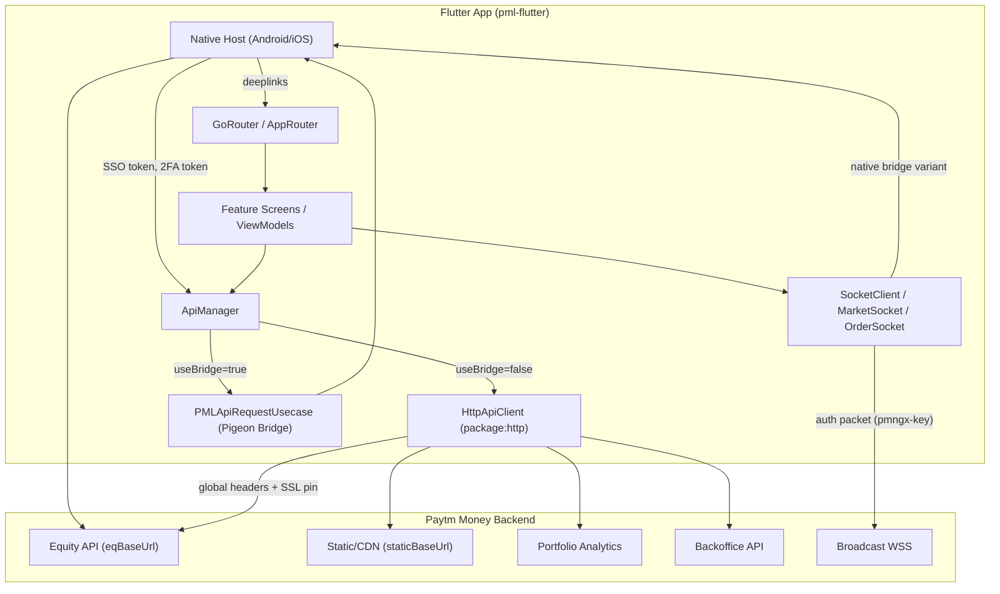
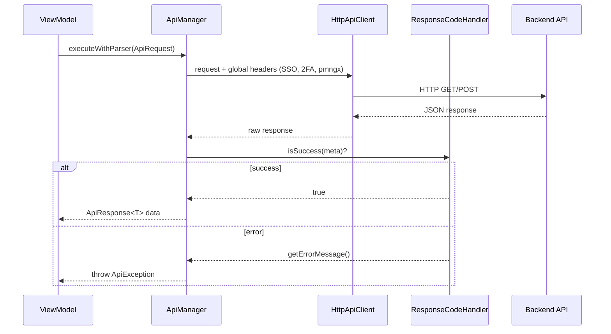

# B2 API Map — pml-flutter

> Generated by B2 API Mapping Agent. Repository: `android-monorepo/flutter/pml-flutter`.
> Repo type: **Flutter client** — inventories **frontend routes**, **outbound HTTP**, and **WebSocket** surfaces (no server endpoints).

---

## Summary Counts

| API Type | Count | Notes |
|----------|-------|-------|
| **Frontend routes (FE)** | **46** active registered GoRouter paths | 4 path constants defined but not registered; 2 commented-out |
| **Outbound REST (HTTP)** | **~136** call sites / **~99** unique path patterns | Via `ApiManager` + `package:http`; no Dio/Retrofit |
| **WebSocket (WS)** | **6** connection URLs | 3 envs × (market broadcast + order broadcast) |
| **GraphQL** | **0** | NOT FOUND IN REPOSITORY |
| **Internal / admin server APIs** | **0** | Client-only repo |
| **Native bridge HTTP** | **3+** | Expert picks + readiness via `PMLApiRequestUsecase` |

**Auth model at a glance:** Most authenticated HTTP calls require global headers injected at app startup — `x-sso-token`, `x-2fa-token`, `x-pmngx-key`, plus `x-user-agent`, `X-Client-Version`, `X-Platform`. Static JSON/CDN endpoints and some config fetches are effectively **public** (no explicit per-route auth override found). WebSocket auth uses `HeaderConfig.pmngxKey` in broadcast auth packets.

---

## 1. Endpoint Inventory

### 1.1 Frontend Routes (GoRouter) — 46 active

Central router: `lib/core/routes/app_router.dart` (lazy `GoRouter`, `MaterialApp.router`).
Registration bridge: `lib/core/routes/pml_stack_core_route_adapter.dart` → `AppRouter.registerRoute()`.
Startup: `lib/main.dart` `_registerRoutes()`.

`initialLocation`: `/tfcScreen` (debug + Android) else `/blank`. No `ShellRoute` or `redirect:` handlers found.

#### Core / Infrastructure (3)

| Method | Route | Handler | File | Auth | Status |
|--------|-------|---------|------|------|--------|
| FE | `/blank` | `BlankScreen` | `lib/core/routes/app_router.dart` | public | VERIFIED |
| FE | `/order-list-preview` | `OrderListPreviewScreen` | `lib/core/routes/app_router.dart` | public | VERIFIED |
| FE | `/` | `SizedBox.shrink()` | `lib/core/routes/app_routes.dart` | public | VERIFIED |

#### Watchlist (1)

| Method | Route | Handler | File | Auth | Status |
|--------|-------|---------|------|------|--------|
| FE | `/watchlistScreen` | `PMLWatchlistPage` | `lib/features/PMLWatchlist/routes/pmlwatchlist_routes.dart` | public | VERIFIED |

#### Expert Picks (3)

| Method | Route | Handler | File | Auth | Status |
|--------|-------|---------|------|------|--------|
| FE | `/expert-pick-detail` | `ExpertPickDetailBottomSheet` | `lib/features/expert_picks/presentation/routes/expert_picks_routes.dart` | public | VERIFIED |
| FE | `/expert-pick-info` | `ExpertPicksInfoBottomSheet` | same | public | VERIFIED |
| FE | `/expert-pick-listing` | `ExpertPickListingWidget` | same | public | VERIFIED |

#### Company Pages (9)

| Method | Route | Handler | File | Auth | Status |
|--------|-------|---------|------|------|--------|
| FE | `/companyPage` | `PMLCompanyPage` | `lib/features/company_page/presentation/routes/CompanyPageRoutes.dart` | public | VERIFIED |
| FE | `/indexCompanyPage` | `PMLIndexCompanyPage` | `lib/features/company_page/presentation/routes/IndexCompanyPageRoutes.dart` | public | VERIFIED |
| FE | `/investInIndexDetails` | `PMLDetailsInvestIndexPage` | same | public | VERIFIED |
| FE | `/stockCompanyPage` | `PMLStockCompanyPage` | `lib/features/company_page/presentation/routes/stock_company_page_routes.dart` | public | VERIFIED |
| FE | `/stockCompanyExternalNewsDetailsWebPage` | `StockExternalNewsDetailsWebPage` | same | public | VERIFIED |
| FE | `/resultsVsExpectationsViewAll` | `ResultsVsExpectationsViewAllPage` | same | public | VERIFIED |
| FE | `/etfCompanyPage` | `PMLETFCompanyPage` | `lib/features/company_page/presentation/routes/ETFCompanyPageRoutes.dart` | public | VERIFIED |
| FE | `/allEtf` | `PMLAllEtfPage` | `lib/features/company_page/presentation/routes/AllETFPageRoutes.dart` | public | VERIFIED |
| FE | `/mtf-pay-later-sheet` | `MtfPayLaterSheetScreen` | `lib/features/company_page/presentation/routes/mtf_pay_later_sheet_routes.dart` | public | VERIFIED |

#### TFC (1)

| Method | Route | Handler | File | Auth | Status |
|--------|-------|---------|------|------|--------|
| FE | `/tfcScreen` | `TradeFromChartsScreen` | `lib/features/TFCOptions/presentation/routes/TFCRoutes.dart` | public | VERIFIED |

#### Portfolio Analytics (4)

| Method | Route | Handler | File | Auth | Status |
|--------|-------|---------|------|------|--------|
| FE | `/pmlPortfolioImport` | `PMLPortfolioAnalyticsImportInfoScreen` | `lib/features/portfolio_analytics/presentation/routes/pml_portfolio_analytics_routes.dart` | public | VERIFIED |
| FE | `/pmlPortfolioOverview` | `PMLPortfolioAnalyticsOverviewScreen` | same | public | VERIFIED |
| FE | `/pmlPortfolioConsent` | `PMLPortfolioConsentScreen` | same | public | VERIFIED |
| FE | `/pmlPortfolioOverview/holding` | `PMLPortfolioAnalyticsHoldingScreen` | same | public | VERIFIED |

#### Research Ideas (11)

| Method | Route | Handler | File | Auth | Status |
|--------|-------|---------|------|------|--------|
| FE | `/research-ideas/home` | `ResearchIdeasHome` | `lib/features/research_ideas/presentation/routes/research_ideas_routes.dart` | public | VERIFIED |
| FE | `/research-ideas/tnc` | `ResearchIdeasDisclaimer` | same | public | VERIFIED |
| FE | `/research-ideas` | `ResearchIdeas` | same | public | VERIFIED |
| FE | `/research-ideas/listing` | `StockIdeas` / `IdeaProfitScreen` | same | public | VERIFIED |
| FE | `/research-ideas/search` | `SearchScreen` | same | public | VERIFIED |
| FE | `/research-ideas/analysts` | `ResearchAnalysts` | same | public | VERIFIED |
| FE | `/research-ideas/analysts/details` | `ResearchAnalystsDetails` | same | public | VERIFIED |
| FE | `/research-ideas/bookmarks` | `BookmarksScreen` | same | public | VERIFIED |
| FE | `/research-ideas/details` | `StockDetailsPage` | same | public | VERIFIED |
| FE | `/research-ideas/idea-profit` | `IdeaProfitScreen` | same | public | VERIFIED |
| FE | `/research-ideas/trending` | `TrendingIdeasScreen` | same | public | VERIFIED |

#### Corporate Events (2)

| Method | Route | Handler | File | Auth | Status |
|--------|-------|---------|------|------|--------|
| FE | `/corporate-events` | `CorporateEventsScreen` | `lib/features/corporateEvents/presentation/routes/corporate_events_routes.dart` | public | VERIFIED |
| FE | `/corporate-events-detail` | `CorporateEventsDetailSheetScreen` | `lib/features/corporateEvents/presentation/routes/corporate_events_detail_routes.dart` | public | VERIFIED |

#### Pledge (1)

| Method | Route | Handler | File | Auth | Status |
|--------|-------|---------|------|------|--------|
| FE | `/quick-margin-pledge` | `PledgeScreen` | `lib/features/pledge/presentation/routes/pledge_routes.dart` | public | VERIFIED |

#### Flash Trade (2)

| Method | Route | Handler | File | Auth | Status |
|--------|-------|---------|------|------|--------|
| FE | `/flashTrade` | `FlashTradePage` | `lib/features/flash_trade/presentation/routes/flash_trade_routes.dart` | public | VERIFIED |
| FE | `/flashTrade/contracts` | `FlashTradeContractsScreen` | same | public | VERIFIED |

#### Basket / Trade Cart (2)

| Method | Route | Handler | File | Auth | Status |
|--------|-------|---------|------|------|--------|
| FE | `/basketOrderPage` | `BasketOrderPage` | `lib/features/basket_order/presentation/routes/basket_order_routes.dart` | public | VERIFIED |
| FE | `/trade-cart-listing` | `TradeCartScreen` / `TradeCartBottomSheet` | same | public | VERIFIED |

#### Orderpad (1)

| Method | Route | Handler | File | Auth | Status |
|--------|-------|---------|------|------|--------|
| FE | `/bpe-education` | `BestPriceExecutionWebPage` | `lib/features/pml_orderpad/presentation/routes/orderpad_routes.dart` | public | VERIFIED |

#### MTF Statement (5)

| Method | Route | Handler | File | Auth | Status |
|--------|-------|---------|------|------|--------|
| FE | `/mtf-ledger-charges` | `MtfLedgerChargesScreen` | `lib/features/mtf_statement/presentation/routes/mtf_statement_routes.dart` | public | VERIFIED |
| FE | `/mtf-statement` | `MtfStatementScreen` | same | public | VERIFIED |
| FE | `/mtf-beneficiary-demat-charges` | `BeneficiaryDematChargesScreen` | same | public | VERIFIED |
| FE | `/mtf-delayed-payment-charges` | `DelayedPaymentChargesScreen` | same | public | VERIFIED |
| FE | `/mtf-margin-statement` | `MtfMarginStatementScreen` | same | public | VERIFIED |

#### Agentic Bot (1)

| Method | Route | Handler | File | Auth | Status |
|--------|-------|---------|------|------|--------|
| FE | `/agenticBot` | `AgenticBotDemoPage` | `lib/features/agentic_bot/presentation/routes/agentic_bot_routes.dart` | public | VERIFIED |

#### Unregistered / Deprecated / Hidden Frontend Routes

| Method | Route | Handler | File | Auth | Status |
|--------|-------|---------|------|------|--------|
| FE | `/trade-cart-detail` | NOT REGISTERED | `lib/features/basket_order/presentation/routes/basket_order_routes.dart` (constant only) | — | INFERRED hidden |
| FE | `/mini-orderpad` | NOT REGISTERED | same | — | INFERRED hidden |
| FE | `/portfolio-holdings` | NOT CALLED from `main.dart` | `lib/features/portfolios/portfolio_holdings/core_domain/routes/portfolio_holdings_routes.dart` | — | INFERRED dead |
| FE | `/portfolio-positions` | NOT CALLED from `main.dart` | same | — | INFERRED dead |
| FE | `/options`, `/detail` | COMMENTED OUT | `lib/features/options/presentation/routes/options_routes.dart` | — | VERIFIED deprecated |

**Deep links** (native → Flutter, not separate GoRouter paths): `/corporate-events`, `/flashTrade/contracts`, `/agenticBot` — documented in respective route files.

---

### 1.2 Outbound REST APIs — by Module

Base URLs: `lib/core/network/api_routes.dart`, `lib/core/network/api_environment.dart` (`eqBaseUrl`, `staticBaseUrl`, `pfBaseUrl`, `platformBaseUrl`, `portfolioAnalytics`, etc.).

Transport: `ApiRequest` → `ApiManager.executeWithParser()` → `HttpApiClient` (`package:http`).

#### Core / Common

| Method | Route | Handler | File | Auth | Status |
|--------|-------|---------|------|------|--------|
| GET | `company/api/v1/report/score/{pmlId}` | `PMLExpertOpinionRequest.getExpertOpinionRequest` | `lib/core/network/requests/expert_opinion_request.dart` | SSO+2FA (global) | VERIFIED |
| GET | `company/api/v1/report/recommendation/{isinId}` | `PMLExpertOpinionRequest.getRecommendationRequest` | same | SSO+2FA | VERIFIED |
| GET | `/aggr/kyc/v1/messages` | `KycMessagesApiRequest` | `lib/common/data/requests/kyc_messages_api_request.dart` | SSO+2FA | VERIFIED |
| GET | `/userprofile/user/{userId}/v5/readiness?product={products}` | `PMLApiRequestUsecase` (native bridge) | `lib/core/bridge/usecases/pml_api_request_usecase.dart` | SSO (bridge) | VERIFIED |

#### Orderpad / Orders

| Method | Route | Handler | File | Auth | Status |
|--------|-------|---------|------|------|--------|
| POST | `/order/txn/v2/place/regular` | `OrderApiRequest.placeRegularOrder` | `lib/features/orderpad/data/requests/order_api_request.dart` | SSO+2FA | VERIFIED |
| POST | `/txn/v1/place/bracket` | `OrderApiRequest.placeBracketOrder` | same | SSO+2FA | VERIFIED |
| POST | `/txn/v1/place/cover` | `OrderApiRequest.placeCoverOrder` | same | SSO+2FA | VERIFIED |
| GET | `/margin/calculator/api/v1/order` | `OrderApiRequest.margin` | same | SSO+2FA | VERIFIED |
| POST | `/fms/api/v1/charges/info` | `OrderApiRequest.charges` | same | SSO+2FA | VERIFIED |
| GET | `/data/v1/{env}/orderrestrictions.json` | `OrderApiRequest.orderRestrictions` | same | public (static) | VERIFIED |
| POST | `/fms/api/v1/orderpad/funds/summary` | `OrderApiRequest.fundsSummary` | same | SSO+2FA | VERIFIED |
| POST | `/order/txn/v2/modify/regular` | `ModifyOrderRequest` | `lib/features/pml_orderpad/data/models/modify_order_request.dart` | SSO+2FA | VERIFIED |
| GET | `order/info/v1/position` | `UserPositionsRequest` | `lib/features/pml_orderpad/data/models/user_positions_request.dart` | SSO+2FA | VERIFIED |
| GET | `holdings/v1/get-user-holdings-data` | `UserHoldingsRequest` | `lib/features/pml_orderpad/data/models/user_holdings_request.dart` | SSO+2FA | VERIFIED |
| GET | `data/v2/isin-pml-details` | `SiblingDetailsRequest` / `IsinDetailsApiRequest` | `pml_orderpad/`, `orderpad/` | SSO+2FA | VERIFIED |
| GET | `exchange/mkt/v2/status` | `MarketStatusRequest` | `lib/features/pml_orderpad/data/models/market_status_request.dart` | SSO+2FA | VERIFIED |
| GET | `company/api/v1/order-flow/best-price-execution` | `BestPriceExecutionRequest` | `lib/features/pml_orderpad/data/models/best_price_execution_request.dart` | SSO+2FA | VERIFIED |
| GET | `/order/info/v1/orderbook` | `OrdersRemoteDataSource` | `lib/features/TFCOptions/orders/data/datasources/orders_remote_datasource.dart` | SSO+2FA | VERIFIED |
| POST | `/order/txn/v1/cancel/regular` | constant only | `lib/features/TFCOptions/orders/data/OrdersApiConstansts.dart` | SSO+2FA | INFERRED |
| POST | `/order/txn/v1/exit/bracket` | constant only | same | SSO+2FA | INFERRED |
| POST | `/order/txn/v1/exit/cover` | constant only | same | SSO+2FA | INFERRED |

#### Basket Order

| Method | Route | Handler | File | Auth | Status |
|--------|-------|---------|------|------|--------|
| POST | `/basket-order/api/v2/create/basket` | `BasketOrderApiRequest` | `lib/features/basket_order/data/requests/basket_order_api_request.dart` | SSO+2FA | VERIFIED |
| GET | `/basket-order/api/v2/baskets` | same | same | SSO+2FA | VERIFIED |
| DELETE | `/basket-order/api/v1/delete/order/{basketId}/{orderId}` | same | same | SSO+2FA | VERIFIED |
| PUT | `/basket-order/api/v1/modify/basket/{basketId}` | same | same | SSO+2FA | VERIFIED |
| POST | `/basket-order/api/v1/add/order/{basketId}` | same | same | SSO+2FA | VERIFIED |
| POST | `/fms/api/v1/orderpad/funds/summary` | `FundsSummaryApiRequest` | `lib/features/basket_order/data/requests/funds_summary_api_request.dart` | SSO+2FA | VERIFIED |
| GET | `/subscription/customer/{customerId}/plan` | `ChargesInfoApiRequest` | `lib/features/basket_order/data/requests/charges_info_api_request.dart` | SSO+2FA | VERIFIED |
| POST | `/fms/api/v1/charges/info` | same | same | SSO+2FA | VERIFIED |

#### Pledge / Holdings

| Method | Route | Handler | File | Auth | Status |
|--------|-------|---------|------|------|--------|
| GET | `margin/pledge/api/v1/holdings` | `PledgeApiRequest` | `lib/features/pledge/data/requests/pledge_api_request.dart` | SSO+2FA | VERIFIED |
| GET | `margin/pledge/api/v1/timings` | same | same | SSO+2FA | VERIFIED |
| POST | `margin/pledge/api/v1/place` | same | same | SSO+2FA | VERIFIED |
| GET | `/margin/pledge/api/v1/holdings` | `PledgeHoldingsApiRequest` | `lib/features/portfolios/portfolio_holdings/core_data/requests/pledge_holdings_api_request.dart` | SSO+2FA | VERIFIED |
| GET | `/holdings/v1/get-user-holdings-data` | `HoldingsApiRequest` | `lib/features/TFCOptions/holdings/data/holdings_api_request.dart` | SSO+2FA | VERIFIED |
| GET | `/holdings/v1/get-holdings-transaction-details?isin={isin}` | `PMLHoldingsTransactionDetailsRemoteDataSourceImpl` | `lib/features/company_page/data/datasources/remote/` | SSO+2FA | VERIFIED |
| GET | `/holdings/v2/get-ca-all-data?...` | `CorporateEventsApiRequest` / `StockEventApiRequest` | corporate events, company page | SSO+2FA | VERIFIED |
| GET | `/holdings/v2/get-ca-filtered-data?filterType=WATCHLIST` | `CorporateEventsApiRequest.getWatchlistEvents` | `lib/features/corporateEvents/data/requests/corporate_events_api_request.dart` | SSO+2FA | VERIFIED |
| GET | `/holdings/v2/get-ca-filtered-data?filterType=HOLDINGS` | `CorporateEventsApiRequest.getHoldingsEvents` | same | SSO+2FA | VERIFIED |
| GET | `/holdings/v1/get-ca-approved-data` | `CaApprovedDataRemoteDataSource` | `lib/features/PMLWatchlist/data/datasource/ca_approved_data_remote_datasource.dart` | SSO+2FA | VERIFIED |

#### Research Ideas

| Method | Route | Handler | File | Auth | Status |
|--------|-------|---------|------|------|--------|
| GET | `/data/v1/production/android/ra/ra_tnc.json` | `RSIdeasApiRequest` | `lib/features/research_ideas/data/requests/rs_ideas_api_request.dart` | public (CDN) | VERIFIED |
| GET | `/advisor-api/jamoon/getResult?...` | same | same | SSO+2FA | VERIFIED |
| GET | `/advisor-api/jamoon/trendingIdeas` | same | same | SSO+2FA | VERIFIED |
| GET | `/advisor-api/jamoon/closedIdeas` | same | same | SSO+2FA | VERIFIED |
| GET | `/data/v1/production/advisors.json` | same | same | public (CDN) | VERIFIED |
| GET | `/data/v1/production/advisory-definitoins.json` | same | same | public (CDN) | VERIFIED |
| GET | `userprofile/v1/user/{userId}/tnc-accept/verify?tncType=RAPARTNER` | same | same | SSO+2FA | VERIFIED |
| POST | `userprofile/v1/user/{userId}/tnc-accept` | same | same | SSO+2FA | VERIFIED |
| GET | `/data/v1/production/android/ra/ra-faq.json` | same | same | public (CDN) | VERIFIED |
| GET | `/pml-user-engagement-service/api/v1/bookmarks` | `BookmarkApiRequest` | `lib/features/research_ideas/data/requests/bookmark_api_request.dart` | SSO+2FA | VERIFIED |
| POST | `/pml-user-engagement-service/api/v1/bookmarks` | same | same | SSO+2FA | VERIFIED |
| POST | `/pml-user-engagement-service/api/v1/bookmarks/remove` | same | same | SSO+2FA | VERIFIED |
| GET | `/pml-user-engagement-service/api/v1/actions/follow/check?...` | `RsAnalystsRequest` | `lib/features/research_ideas/data/requests/rs_analysts_request.dart` | SSO+2FA | VERIFIED |
| POST | `/pml-user-engagement-service/api/v1/actions/follow` | same | same | SSO+2FA | VERIFIED |
| POST | `/pml-user-engagement-service/api/v1/actions/unfollow` | same | same | SSO+2FA | VERIFIED |
| POST/PUT | `/pml-user-engagement-service/api/v1/ratings` | same | same | SSO+2FA | VERIFIED |
| GET | `/pml-user-engagement-service/api/v1/ratings/entity?...` | same | same | SSO+2FA | VERIFIED |
| POST | `/aggr/sf/ra_tarding_ideas_{prod\|staging}` | `RADiscoverRemoteDataSource` | `lib/features/research_ideas/data/datasources/remote/ra_discover_remote_data_source.dart` | SSO+2FA | VERIFIED |
| GET | `/data/v1/production/android/ra/ra-discover-fallback.json` | same | same | public (CDN) | VERIFIED |
| GET | `/mtf/order/api/v2/scrips` | `MtfScripsApiRequest` | `lib/features/research_ideas/data/requests/mtf_scrips_api_request.dart` | SSO+2FA | VERIFIED |
| GET | `/pml-core-badge-service/v1/tags/list` | `BadgeServiceApiRequest` | `lib/features/research_ideas/data/requests/badge_service_api_request.dart` | SSO+2FA | VERIFIED |

#### Portfolio Analytics

| Method | Route | Handler | File | Auth | Status |
|--------|-------|---------|------|------|--------|
| GET | `{portfolioAnalytics}users/{userId}/portfolio-consent-status` | `PmlPortfolioConsentRequest` | `lib/features/portfolio_analytics/data/requests/pml_portfolio_consent_request.dart` | SSO+2FA | VERIFIED |
| GET | `{portfolioAnalytics}users/{userId}/financial-overview` | `PMLPortfolioAnalyticsOverviewApiRequest` | `pml_portfolio_analytics_overview_api_request.dart` | SSO+2FA | VERIFIED |
| GET | `{portfolioAnalytics}users/{userId}/financial-overview/chart-data` | `PMLPortfolioChartApiRequest` | `pml_portfolio_chart_api_request.dart` | SSO+2FA | VERIFIED |
| GET | `{portfolioAnalytics}users/{userId}/financial-overview/bank/debit-credit-chart-data` | `PMLPortfolioBankChartApiRequest` | `pml_portfolio_bank_chart_api_request.dart` | SSO+2FA | VERIFIED |
| GET | `/data/flutter/{env}/portfolioanalytics.json` | `PMLPortfolioAnalyticsImportApiRequest` | `pml_portfolio_analytics_import_api_request.dart` | public (static) | VERIFIED |
| GET | `{portfolioAnalytics}transaction/{id}/portfolio-transaction-status` | same | same | SSO+2FA | VERIFIED |
| POST | `{portfolioAnalytics}users/{userId}/consent/request` | same | same | SSO+2FA | VERIFIED |
| PUT | `{portfolioAnalytics}users/{userId}/consent/revoke` | same | same | SSO+2FA | VERIFIED |
| GET | `/combined-portfolio/v1/{userId}` | `PmlMutualFundApiRequest` | `lib/features/portfolio_analytics/data/requests/pml_mutual_fund_api_request.dart` | SSO+2FA | VERIFIED |

#### Options / FNO

| Method | Route | Handler | File | Auth | Status |
|--------|-------|---------|------|------|--------|
| GET | `/fno/dashboard/api/v2/option-chain?...` | `OptionChainDataApiRequest` | `lib/features/options/data/requests/option_chain_data_api_request.dart` | SSO+2FA | VERIFIED |
| GET | `/fno/dashboard/api/v2/option-chain/config?...` | `OptionChainApiRequest` | `lib/features/options/data/requests/option_chain_api_request.dart` | SSO+2FA | VERIFIED |
| GET | `/fno/dashboard/api/v2/futures/builtup?...` | same | same | SSO+2FA | VERIFIED |
| GET | `/data/v3/suggest` | `PmtfcApiRequest` | `lib/features/TFCOptions/data/requests/pmtfc_api_request.dart` | SSO+2FA | VERIFIED |
| GET | `/data/v1/user-event` | `OptionsApiConstants` | `lib/features/options/data/constants/options_api_constants.dart` | SSO+2FA | VERIFIED |
| GET | `/2fa/passcode/v2/user/{userId}/validate` | same | same | SSO+2FA | VERIFIED |
| GET | `/data/v3/recent/searched` | `PmtfcApiRequest` | `pmtfc_api_request.dart` | SSO+2FA | VERIFIED |
| GET | `/data/v4/popular` | same | same | SSO+2FA | VERIFIED |
| GET | `/fno/dashboard/api/v2/top-option` | `TopOptionsRemoteDataSource` | `lib/features/PMLWatchlist/feature/options_watchlist/data/datasource/top_options_remote_datasource.dart` | SSO+2FA | VERIFIED |

#### PMLWatchlist

Constants: `lib/features/PMLWatchlist/constants/pmlwatchlist_endpoints.dart`

| Method | Route | Handler | File | Auth | Status |
|--------|-------|---------|------|------|--------|
| GET | `/data/android/watchlist_tab_config_new_v3.json` | `PmlwatchlistTabConfigApiRequest` | `lib/features/PMLWatchlist/feature/watchlist_categories/data/pmlwatchlist_tab_config_api_request.dart` | public (static) | VERIFIED |
| GET | `/marketwatch/api/v2/watchlist` | `WatchlistApiRequests` / datasources | PMLWatchlist + company_page + TFC | SSO+2FA | VERIFIED |
| POST | `/marketwatch/api/v1/watchlist` | same | same | SSO+2FA | VERIFIED |
| DELETE | `/marketwatch/api/v1/watchlist/{id}` | same | same | SSO+2FA | VERIFIED |
| PUT | `/marketwatch/api/v1/watchlist/{id}/rename` | same | same | SSO+2FA | VERIFIED |
| PUT | `/marketwatch/api/v1/watchlist/reorder` | same | same | SSO+2FA | VERIFIED |
| DELETE | `/marketwatch/api/v1/watchlist/{id}/security/{securityId}` | same | same | SSO+2FA | VERIFIED |
| PUT | `/marketwatch/api/v1/watchlist/{id}/security/reorder` | same | same | SSO+2FA | VERIFIED |
| GET | `/marketmovers/api/v2/config` | `ExchangeFilterApiRequest` | `lib/features/PMLWatchlist/feature/market_movers/data/exchange_filter_api_request.dart` | SSO+2FA | VERIFIED |
| GET | `/marketmovers/api/v1/top-gainers` (+ losers, value, volume) | `MarketMoversRemoteDataSource` | `market_movers_remote_datasource.dart` | SSO+2FA | VERIFIED |
| GET | `/marketmovers/api/v2/stocks` | yearly high/low | same | SSO+2FA | VERIFIED |
| POST | `/data/v2/scrips-list` | `EtfsRemoteDataSource` | `lib/features/PMLWatchlist/feature/etfs/data/datasource/etfs_remote_datasource.dart` | SSO+2FA | VERIFIED |
| GET | `/data/v2/etf-filters` | `EtfFilterApiRequest` | `etf_filter_api_request.dart` | SSO+2FA | VERIFIED |
| GET | `/aggr/journey/v1/widgets` | `OptionsWatchlistConfigRemoteDataSource` | `options_watchlist_config_remote_datasource.dart` | SSO+2FA | VERIFIED |
| POST | `/data/v1/breakouts-by-pmlid` | `LatestBreakoutsRemoteDataSource` | `lib/features/PMLWatchlist/feature/breakout/data/datasources/latest_breakouts_remote_datasource.dart` | SSO+2FA | VERIFIED |
| GET | `/data/v1/breakouts/latest` | same | same | SSO+2FA | VERIFIED |
| GET | `/data/v1/breakouts-by-watchlist` | same | same | SSO+2FA | VERIFIED |
| GET | `/data/v1/production/breakout-stocks-content.json` | same | same | public (CDN) | VERIFIED |
| GET | `/company/api/v1/report/recommendation/{instrument}` | `RecommendationRemoteDataSource` | `lib/features/PMLWatchlist/data/datasource/recommendation_remote_datasource.dart` | SSO+2FA | VERIFIED |
| GET | `/data/v2/production/fno-dashboard-search-scrips.json` | `FnoSearchScripsRemoteDataSource` | `fno_search_scrips_remote_datasource.dart` | public (static) | VERIFIED |

#### Company Page (representative — ~40 endpoints)

| Method | Route | Handler | File | Auth | Status |
|--------|-------|---------|------|------|--------|
| GET | `data/v2/fundamentals-ttm?id={pmlId}` | `CompanyDetailsRequest` | `lib/features/company_page/data/requests/company_details_request.dart` | SSO+2FA | VERIFIED |
| GET | `/data/v1/desc?id={pmlId}` | same | same | SSO+2FA | VERIFIED |
| GET | `company/api/v1/share/holding-pattern` | `ShareholdingPatternRequest` | `lib/features/company_page/data/models/` | SSO+2FA | VERIFIED |
| GET | `company/api/v1/report/actuals/annual` | `ResultsVsExpectationsReportRequest` | same | SSO+2FA | VERIFIED |
| GET | `company/api/v1/report/actuals/interim` | same | same | SSO+2FA | VERIFIED |
| GET | `company/api/v1/technical/ratio` | `PMLMovingAveragesRequest` | same | SSO+2FA | VERIFIED |
| GET | `company/api/v1/technical/pivot/classic` | `PMLStockCompanyPivotRequest` | `lib/features/company_page/data/` | SSO+2FA | VERIFIED |
| GET | `/fno/dashboard/api/v1/oi` | `PMLOIRequest` | same | SSO+2FA | VERIFIED |
| GET | `mtf/order/api/v1/scrip` | `PMLCompanyPageRequest` | same | SSO+2FA | VERIFIED |
| GET | `/company/api/v1/report/download/{pmlId}` | `PMLDownloadReportRemoteDataSourceImpl` | `lib/features/company_page/data/datasources/remote/` | SSO+2FA | VERIFIED |
| GET | `/ssr-charts/v4/price?format=png&...` | `PMLFuturesRemoteDataSource` | same | SSO+2FA | VERIFIED |
| GET | `/company/api/v1/forthcoming/results?pml_id={pmlId}` | `StockEventApiRequest` | `lib/features/company_page/data/requests/events_api_request.dart` | SSO+2FA | VERIFIED |
| GET/PUT/DELETE | `/data/v1/*-price-alert*` | `PMLPriceAlertRemoteDataSource` | remote datasource | SSO+2FA | VERIFIED |
| GET | equity news variants | `EquityNewsApiRequest` | requests | SSO+2FA | VERIFIED |

#### MTF Statement (Backoffice)

| Method | Route | Handler | File | Auth | Status |
|--------|-------|---------|------|------|--------|
| GET | `/backoffice/ext/statements/v1/report/mtfreport/available-dates` | `MtfMarginReportApiRequest` | `lib/features/mtf_statement/data/requests/` | SSO+2FA | VERIFIED |
| GET | `/backoffice/ext/statements/v1/report/mtfreport/file` | same | same | SSO+2FA | VERIFIED |
| GET | `/backoffice/user/v1/userid/{id}` | `MtfUserProfileApiRequest` | same | SSO+2FA | VERIFIED |
| GET | `/backoffice/external/pendingCharges/v1/getPendingCharges` | `MtfPendingChargesApiRequest` | same | SSO+2FA | VERIFIED |
| GET/POST | `/backoffice/ext/statements/v1/ledger/mtf/{data\|download\|email}` | `MtfLedgerApiRequest` | same | SSO+2FA | VERIFIED |
| GET/POST | `/backoffice/ext/statements/v1/mtf/interest/{data\|download\|email}` | `MtfInterestApiRequest` | same | SSO+2FA | VERIFIED |
| GET | `/backoffice/external/v1/accruedcharges` | `MtfAccruedChargesApiRequest` | same | SSO+2FA | VERIFIED |

#### Expert Picks (Native Bridge)

| Method | Route | Handler | File | Auth | Status |
|--------|-------|---------|------|------|--------|
| POST | `/data/v4/scrips-list` | `ExpertPicksRemoteDataSource.fetchExpertPicks` | `lib/features/expert_picks/data/datasources/expert_picks_remote_datasource.dart` | SSO (bridge) | VERIFIED |
| GET | `/data/v1/expert-picks-filters` | `fetchExpertPicksFilters` | same | SSO (bridge) | VERIFIED |

#### Flash Trade / TFC / Misc

| Method | Route | Handler | File | Auth | Status |
|--------|-------|---------|------|------|--------|
| GET | `/aggr/journey/v1/widgets?businessType=FNO_WIDGETS` | `FlashTradeRemoteDataSourceImpl` | `lib/features/flash_trade/data/datasources/remote/flash_trade_remote_datasource_impl.dart` | SSO+2FA | VERIFIED |
| GET | `/nudge-info/api/v3/scrip` | `InvestcareApiRequest` | `lib/features/TFCOptions/data/requests/investcare_api_request.dart` | SSO+2FA | VERIFIED |
| GET | `/data/v1/production/equity-infocard.json` | `EquityInfocardApiRequest` | `equity_infocard_api_request.dart` | public (CDN) | VERIFIED |
| GET | `/data/v2/pml-details` | `CompanyDetailsApiRequest` | `company_details_api_request.dart` | SSO+2FA | VERIFIED |
| GET | `/data/v2/secid-x-pml-details` | same | same | SSO+2FA | VERIFIED |
| GET | `/data/v2/equity_chart_constants_mobile.json` | `ChartService` | `lib/features/charts/data/datasources/chart_service.dart` | public (CDN) | VERIFIED |
| GET | `/data/v1/conciseEquityNews?pageSize=50&from=0&isins={isin}` | `NewsApiRequest` | `lib/features/TFCOptions/data/requests/news_api_request.dart` | SSO+2FA | VERIFIED |
| GET | `/order/info/v1/position` | `PositionsApiRequest` | `lib/features/TFCOptions/positions/data/positions_api_request.dart` | SSO+2FA | VERIFIED |

#### pmlcharts (isolated demo module)

| Method | Route | Handler | File | Auth | Status |
|--------|-------|---------|------|------|--------|
| GET | `{baseUrl}/chart-data` | `ChartApiDataSource.fetchChartData` | `lib/pmlcharts/data/datasources/chart_api_datasource.dart` | public (placeholder) | VERIFIED |

---

### 1.3 WebSocket Endpoints (6 connection URLs)

Source: `lib/core/socket/base/socket_constants.dart`

| Method | Route | Handler | File | Auth | Status |
|--------|-------|---------|------|------|--------|
| WS | `wss://broadcast-{dev\|stg\|}.paytmmoney.com` | `MarketSocketClient` / `SocketClient` | `lib/core/socket/market_socket/market_socket_client.dart` | pmngx-key auth packet | VERIFIED |
| WS | `wss://broadcast-order-{dev\|stg\|}.paytmmoney.com/bcorder` | `OrderSocketClient` | `lib/core/socket/order_socket/order_socket_client.dart` | pmngx-key auth packet | VERIFIED |

Native bridge variants: `native_market_socket_client.dart`, `native_order_socket_client.dart`, `native_mbp_socket_client.dart` — delegate to platform WebSocket.

Auth packet model: `lib/core/socket/models/authentication_header.dart` (uses `HeaderConfig.pmngxKey`).

---

## 2. Auth Flow

### Token source and propagation

1. **Native host app** provides SSO and 2FA tokens to Flutter via Pigeon bridge (`lib/core/bridge/`).
2. **`AppService`** (`lib/core/services/app_service.dart`) injects tokens into `ApiManager` global headers:
   - `HeaderConfig.kSsoToken` (`x-sso-token`) — set on login/session restore (~line 245)
   - `HeaderConfig.kTwoFaToken` (`x-2fa-token`) — set/cleared on 2FA events (~line 67)
3. **Startup headers** also set: `x-pmngx-key`, `x-pmmodule-name`, `X-Client-Version`, `X-Platform`, `debug_env`, `x-user-agent`.
4. **`HeaderConfig`** (`lib/core/network/header_config.dart`) holds header key constants and default values (`pmngxKey` default `'330'`).
5. **`ApiManager.addOrRemoveGlobalHeader()`** merges into `HttpApiClient` global header map before every request.
6. **Per-request headers**: some `*ApiRequest` factories call `HeaderConfig.getHeadersUtil()` or build custom maps (pledge, expert opinion).
7. **Bridge path**: `ApiManager.useBridge = true` routes through `PMLApiRequestUsecase` → native Android/iOS HTTP stack (expert picks, readiness).
8. **WebSocket**: auth binary packet built with `HeaderConfig.pmngxKey` in `authentication_header.dart`.

### Route-level auth

Frontend GoRouter routes have **no route guards** — all FE routes are `public` at the router layer. Feature screens may gate on KYC/2FA state internally (NOT FOUND IN REPOSITORY as a centralized guard).

---

## 3. Validation Flow

| Layer | Mechanism | File |
|-------|-----------|------|
| Order form validation | `OrderpadFormValidator` (documented) | `docs/orderpad_form_validator_usage.md` |
| API request construction | `BaseApiRequest` / `ApiRequest` with typed params | `lib/core/network/api_request.dart` |
| Response validation | `ApiResponseDataParser`, `BaseResponseModel` | `lib/core/network/models/` |
| Backend code validation | `ResponseCodeHandler.isValidationError()` | `lib/core/network/handlers/response_code_handler.dart` |
| Response code enum | `ResponseCode.fromCode()` — `PM_EUE_*` codes | `lib/core/network/models/response_code.dart` |

No centralized request-body schema validator (no zod/pydantic equivalent) — validation is per-feature at the ViewModel/form layer before building `ApiRequest` objects.

---

## 4. Error Flow

| Stage | Component | File | Behavior |
|-------|-----------|------|----------|
| HTTP status mapping | `ApiException.fromStatusCode()` | `lib/core/network/api_exception.dart` | 400→badRequest, 401→unauthorized, 403→forbidden, 404→notFound, 5xx→serverError |
| Subclasses | `BadRequestException`, `UnauthorizedException`, etc. | same | Typed convenience exceptions |
| Backend meta codes | `ResponseCodeHandler` | `lib/core/network/handlers/response_code_handler.dart` | `displayMessage` > `message` > code description |
| Orchestrator catch | `ApiManager.executeWithParser()` | `lib/core/network/api_manager.dart` | Wraps failures in `ApiException`, logs via `NetworkLogger` / native bridge |
| Repository layer | Feature datasources/repos | per-feature | Catch `ApiException`, map to UI state |
| Global utility | `ErrorHandler` | `lib/core/utils/error_handler.dart` | Shared error presentation helpers |

Error envelope shape: `ApiResponse` with `ApiResponseMeta` containing `code`, `message`, `displayMessage` (Paytm `PM_EUE_*` response codes).

---

## 5. Request Lifecycle

Actual ordering for pml-flutter HTTP:

```
Feature DataSource / Repository
  → builds ApiRequest (method, baseUrl, endpoint, body, per-request headers)
  → ApiManager.executeWithParser<T>()
    → [if useBridge] PMLApiRequestUsecase → native HTTP
    → [else] HttpApiClient
      → merge global headers (SSO, 2FA, pmngx, user-agent, platform)
      → SSL pinning check (SecurityContext / SslConfig)
      → package:http GET/POST/PUT/DELETE/PATCH
    → parse response via ApiResponseDataParser
    → ResponseCodeHandler.isSuccess() / getErrorMessage()
    → on HTTP error: ApiException.fromStatusCode()
    → NetworkLogger (PII-redacted, debug builds)
  → return ApiResponse<T> to repository
  → ViewModel maps to UiState
```

WebSocket lifecycle:

```
SocketClient.connect(wss URL from SocketConstants)
  → send auth packet (pmngx-key via AuthenticationHeader)
  → subscribe to channels (market/order)
  → binary protocol via wsclient models
  → [optional] native bridge for non-TFC screens
```

Navigation lifecycle:

```
Native deeplink / in-app navigation
  → PMLStackCoreRouteAdapter.routeFactory OR GoRouter.go/push
  → AppRouter (GoRouter) matches path
  → RouteBuilder returns Screen widget
  → Screen ViewModel triggers ApiManager calls
```

---

## 6. Mermaid Architecture Diagram





---

## 7. Unknowns

| Item | Status |
|------|--------|
| Per-endpoint auth exceptions (which static JSON calls skip SSO) | INFERRED from CDN/static paths; no explicit allowlist file found |
| `PortfolioHoldingsRoutes` (`/portfolio-holdings`, `/portfolio-positions`) — intentionally dead or pending wiring? | NOT FOUND IN REPOSITORY (no `main.dart` registration) |
| Order cancel/exit endpoints in `OrdersApiConstansts.dart` — used via dynamic strings elsewhere? | INFERRED; constants exist but direct `endpoint:` grep did not find call sites |
| Centralized FE route auth guard | NOT FOUND IN REPOSITORY |
| Full company_page endpoint list (~15+ additional model-based requests) | Partially mapped; grep found 40+ files under `company_page/data/` |
| `positions_api.dart` in portfolios feature | Blocked from read; TFC exposes `/order/info/v1/position` as alternate |
| `ApiRoutes` exact production base URLs | Defined in `api_routes.dart` / `api_environment.dart` — not fully enumerated here |
| pmlcharts `{baseUrl}/chart-data` | Placeholder `https://api.example.com` in demo DI — not production |

### Open questions for team

1. Should `/trade-cart-detail` and `/mini-orderpad` be registered, or are they reached only via native navigation?
2. Is `PortfolioHoldingsRoutes.registerRoutes()` intentionally omitted from `main.dart`?
3. When is `ApiManager.useBridge` toggled vs direct HTTP — per-feature policy or runtime flag?
4. Are order cancel/exit constants (`OrdersApiConstansts`) legacy dead code?

---

*Artifact path: `docs/agent-analysis/B2_api_map.md`*
*Analysis date: 2026-06-16*
