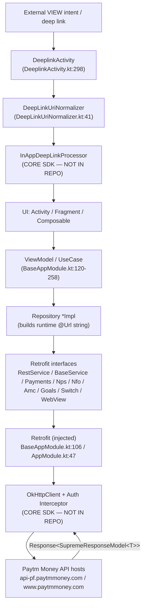

# B2 — API Map: paytmmoney (Android Client)

> **Repo:** `/Users/abhijeetpal/Desktop/workspace/paytmmoney`
> **Type:** Android, Kotlin/Java, Gradle multi-module (mutual funds + equity + NPS). Modules: `app`, `base_app`, `advisory`, `compose-home`, `customwidget`, `data`, plus `mf_features/{goals,portfolioSwitch,amc,nfo,payment,nps}`.
> **Agent spec:** `/Users/abhijeetpal/Desktop/workspace/Tasks/Basics/route-api-mapper/B2_agent.md`
> **Artifact deviation:** Written to `B2/B2_api_map_paytmmoney.md` (not `/docs/agent-analysis/`) per task instruction.

## IMPORTANT — Inverted API surface (client repo)

This is an **Android client app**. **There are NO server endpoints in this repository.** The "API surface" is **outbound**:

1. **Primary surface = Retrofit service interfaces** — Kotlin/Java interfaces annotated with `@GET`/`@POST`/`@PUT`/`@DELETE` from `retrofit2.http`. These declare the *outbound HTTP calls the app makes*.
2. **Secondary surface = navigation / deep-link routes** — `<intent-filter>` deep links in `AndroidManifest.xml` dispatched by `DeeplinkActivity`.

### Critical structural fact about the Retrofit layer (VERIFIED)

**Every Retrofit method in this repo uses a dynamic `@Url url: String` parameter — the HTTP path is supplied at call time, NOT baked into the annotation.** Across the two largest services: `RestService.java` has 159 method annotations and 159 `@Url` params; `BaseService.kt` has 35 annotations and 35 `@Url` params. A grep for any static path literal in an annotation (`@GET("...")`) returns **zero** matches:

```
grep -rhnE '@(GET|POST|PUT|DELETE|PATCH)\("' --include='*.kt' --include='*.java' .   # → no matches
```

**Consequence:** The annotation gives the **HTTP method**; the **path** is a runtime string assembled in the repository/ViewModel layer (e.g. `"https://api-pf.paytmmoney.com/..."`, `"https://www.paytmmoney.com/dl/invest/featured-by-amc/listing"`). The inventory below therefore lists **Method | Retrofit method (the logical endpoint) | File**; the literal path column is `@Url (runtime)` unless a static path/host was found at a call site.

Evidence: `base_app/src/main/java/com/paytmmoney/app/BaseService.kt:53-56` (`@GET fun getInternalPortfolioData(@Url url: String)`), `app/src/main/java/com/paytmmoney/mf/networking/RestService.java:164-165`.

---

## 1. Endpoint Inventory

### Totals
- **Retrofit service interfaces (in-source): 11**, totaling **~246 endpoint methods**.
- **Additional Retrofit services injected via DI but defined in binary/external modules** (`com.paytmmoney.equity.*`, `com.paytmmoney.kyc.*`, `com.paytmmoney.apprating.*`): **at least 8** (`EquityOrderService`, `MtfService`, `EquityFundsService`, `UserKycApiService`, `MostBoughtApiService`, `AppRatingService`, `EdisTransactionService`, plus `PmlServiceModule`-provided services) — **NOT FOUND IN REPOSITORY source** (see §7).
- **Verb distribution (RestService.java):** GET 102, POST 46, PUT 8, DELETE 3.
- **Deep-link routes: 6 intent-filter patterns** → single dispatcher Activity.
- **HTTP server endpoints: NONE (client app).**

> Path column legend: `@Url(runtime)` = path is a dynamic string passed at call time. `Auth` is `interceptor` for all data calls (token injected globally by an OkHttp interceptor in the external core SDK — see §2), with per-method header overrides noted.

### 1a. `RestService` (MF core) — module `app` — **~157 unique methods** (159 annotations)
File: `app/src/main/java/com/paytmmoney/mf/networking/RestService.java`
Provided by DI: `app/src/main/java/com/paytmmoney/mf/di/module/AppModule.kt:47`, `base_app/src/main/java/com/paytmmoney/app/di/BaseAppModule.kt:109`

| Method | Path | Handler (Retrofit method) | File:line | Auth | Status |
|---|---|---|---|---|---|
| POST | @Url(runtime) | `getData` (search) | RestService.java:161 | interceptor | VERIFIED |
| GET | @Url(runtime) | `getFilters` | RestService.java:164 | interceptor | VERIFIED |
| GET | @Url(runtime) | `getInvestmentPackDetails` | RestService.java:167 | interceptor | VERIFIED |
| GET | @Url(runtime) | `getStatementTypes` | RestService.java:174 | interceptor | VERIFIED |
| POST | @Url(runtime) | `requestStatement` | RestService.java:177 | interceptor | VERIFIED |
| GET | @Url(runtime) | `getInvestmentThemes` | RestService.java:180 | interceptor | VERIFIED |
| GET | @Url(runtime) | `getTransactionHistoryList` | RestService.java:190 | interceptor | VERIFIED |
| GET | @Url(runtime) | `getPortfolioOverviewResponse` | RestService.java:211 | interceptor | VERIFIED |
| GET | @Url(runtime) | `getMultiCategoryResponse` | RestService.java:217 | interceptor | VERIFIED |
| GET | @Url(runtime) | `getProfileData` | RestService.java:235 | interceptor | VERIFIED |
| GET | @Url(runtime) | `getAppBootData` | RestService.java:238 | interceptor | VERIFIED |
| GET | @Url(runtime) | `getOtmStatus` | RestService.java:242 | interceptor | VERIFIED |
| PUT | @Url(runtime) | `initiateOtmRequestPut` | RestService.java:245 | interceptor | VERIFIED |
| POST | @Url(runtime) | `initiateOtmRequestPost` | RestService.java:249 | interceptor | VERIFIED |
| POST | @Url(runtime), `@Header x-product-source` | `checkPanCard` | RestService.java:354 | interceptor + header | VERIFIED |
| +142 more in `app/src/main/java/com/paytmmoney/mf/networking/RestService.java` | | (e.g. `bankAccountList`, `deleteBankAccounts`, `deleteScheme`, `deleteOtm`, `editNpsSip`, `confirmNpsRedemption`, `uploadDocument`, `submitNomineeDeclaration`, `saveNotificationPreference`, `getDashboardData`, `getKycUserData`, `getInstaRedemptionFunds`, `getCategoryWinners`, `getFeaturedSchemes`, `getMFUPISubsPlanDetails`, …) | | interceptor | VERIFIED |

> Full per-method names were extracted (157 unique). Notable DELETE methods: `deleteBankAccounts`, `deleteScheme`, `deleteOtm`, `deleteHistory`. Notable PUT: `initiateOtmRequestPut`, `editNpsSip`, `putAddressDetails`. Static header overrides observed: `client-fe-code: mf` (RestService.java:284,318,327), `x-product-source: MUTUAL_FUND` (RestService.java:312,648), `Content-Type: application/json` (multiple), `Cache-Control: no-cache` (RestService.java:549).

### 1b. `BaseService` (app shell / home / KYC) — module `base_app` — **35 methods**
File: `base_app/src/main/java/com/paytmmoney/app/BaseService.kt`
Provided by DI: `base_app/src/main/java/com/paytmmoney/app/di/BaseAppModule.kt:106`

| Method | Path | Handler | File:line | Auth | Status |
|---|---|---|---|---|---|
| GET | @Url(runtime) | `getInternalPortfolioData` | BaseService.kt:53 | interceptor | VERIFIED |
| POST | @Url(runtime), `@Header x-product-source` | `acceptTnC` | BaseService.kt:58 | interceptor + header | VERIFIED |
| GET | @Url(runtime) | `getAppBootData` | BaseService.kt:65 | interceptor | VERIFIED |
| GET | @Url, header `x-product-source: MUTUAL_FUND` | `getAppBootDataMf` | BaseService.kt:70 | interceptor + header | VERIFIED |
| POST | @Url, `@Header auth2` | `fcmAddUser` | BaseService.kt:76 | header `auth2` flag | VERIFIED |
| POST | @Url(runtime) | `customerReferralToken` | BaseService.kt:83 | interceptor | VERIFIED |
| GET | @Url(runtime) | `combinedIrData` | BaseService.kt:89 | interceptor | VERIFIED |
| GET | @Url, `@Query personal/panNumber` | `getUserDetails` | BaseService.kt:94 | interceptor | VERIFIED |
| GET | @Url, `@Header auth2` | `getSplashAnimationConfig` | BaseService.kt:102 | header `auth2` flag | VERIFIED |
| POST | @Url, `@Header session_token` | `authoriseQRForWebLogin` | BaseService.kt:188 | header `session_token` | VERIFIED |
| POST | @Url | `getPmlThreeCombineHomePageAPIData` | BaseService.kt:195 | interceptor | VERIFIED |
| GET | @Url | `getPmlThreeCombineKYCMessage` | BaseService.kt:210 | interceptor | VERIFIED |
| POST | @Url | `initiateFirstFundsPayinTxn` | BaseService.kt:225 | interceptor | VERIFIED |
| POST | @Url, `@Query mode/range` | `getChartImages` | BaseService.kt:236 | interceptor | VERIFIED |
| GET | @Url | `getNotificationNudgeStaticInfo` | BaseService.kt:257 | interceptor | VERIFIED |
| +20 more in `base_app/src/main/java/com/paytmmoney/app/BaseService.kt` | | (e.g. `getLatestTnc`, `updateLatestTnc`, `getHomePageFallbackAPIData`, `getCombinedPageAPIData`, `getSleekData`, `getPwcLiveData`, `getDynamicHomePageAPIData`, `getDynamicMFPortfolioData`, `getMFCategoryListData`, `getPaymentOptionsData`, `getInfoCard`, …) | | interceptor | VERIFIED |

### 1c. `PaymentsService` — module `mf_features/payment` — **11 methods**
File: `mf_features/payment/src/main/java/com/paytmmoney/payments/network/PaymentsService.kt`
DI: `mf_features/payment/src/main/java/com/paytmmoney/payments/di/PaymentsModule.kt:23`

| Method | Path | Handler | File:line | Auth | Status |
|---|---|---|---|---|---|
| GET | @Url | `getSchemeValidationsInitPurchase` | PaymentsService.kt:29 | interceptor | VERIFIED |
| GET | @Url, `@Query investedAmount` | `getReviewNpsInvestment` | PaymentsService.kt:34 | interceptor | VERIFIED |
| POST | @Url | `fetchPayments` | PaymentsService.kt:40 | interceptor | VERIFIED |
| GET | @Url | `getTransactionStatus` | PaymentsService.kt:46 | interceptor | VERIFIED |
| POST | @Url | `getPaymentUrl` | PaymentsService.kt:51 | interceptor | VERIFIED |
| GET | @Url | `getTransactionMetaData` | PaymentsService.kt:58 | interceptor | VERIFIED |
| GET | @Url | `getPaymentFlowType` | PaymentsService.kt:63 | interceptor | VERIFIED |
| POST | @Url | `generateOtpApiForNomineeCall` | PaymentsService.kt:68 | interceptor | VERIFIED |
| POST | @Url | `validateOTPApiForNomineeCall` | PaymentsService.kt:74 | interceptor | VERIFIED |
| GET | @Url, `@Query nominee` | `getNomineeDetailsApiCall` | PaymentsService.kt:80 | interceptor | VERIFIED |
| POST | @Url | `getDashboardH5Data` | PaymentsService.kt:86 | interceptor | VERIFIED |

### 1d. `NpsService` — module `mf_features/nps` — **10 methods**
File: `mf_features/nps/src/main/java/com/paytmmoney/nps/network/NpsService.kt`
DI: `mf_features/nps/src/main/java/com/paytmmoney/nps/di/NpsModule.kt:12`

| Method | Path | Handler | File:line | Auth | Status |
|---|---|---|---|---|---|
| GET | @Url | `getFundDetails` | NpsService.kt:21 | interceptor | VERIFIED |
| GET | @Url | `checkNpsPurchaseEligibility` | NpsService.kt:26 | interceptor | VERIFIED |
| POST | @Url | `callPrePurchaseApi` | NpsService.kt:32 | interceptor | VERIFIED |
| GET | @Url | `getFundsData` | NpsService.kt:38 | interceptor | VERIFIED |
| GET | @Url | `getUserKycData` | NpsService.kt:44 | interceptor | VERIFIED |
| GET | @Url | `getAgeData` | NpsService.kt:49 | interceptor | VERIFIED |
| GET | @Url | `getReturnsForCustomPreference` | NpsService.kt:55 | interceptor | VERIFIED |
| GET | @Url | `getTiersData` | NpsService.kt:60 | interceptor | VERIFIED |
| GET | @Url | `getOnBoardingData` | NpsService.kt:65 | interceptor | VERIFIED |
| POST | @Url | `markNpsOpted` | NpsService.kt:70 | interceptor | VERIFIED |

### 1e. `NfoService` — module `mf_features/nfo` — **8 methods**
File: `mf_features/nfo/src/main/java/com/paytmmoney/nfo/network/NfoService.kt`

| Method | Path | Handler | File:line | Auth | Status |
|---|---|---|---|---|---|
| GET | @Url | `getNfoCategoryData` | NfoService.kt:21 | interceptor | VERIFIED |
| GET | @Url, `Cache-Control: no-cache` | `getMutualFundDetailData` | NfoService.kt:28 | interceptor | VERIFIED |
| GET | @Url | `getMutualFundDetailsAggr` | NfoService.kt:34 | interceptor | VERIFIED |
| GET | @Url | `getMutualFundDetailsAggrData` | NfoService.kt:40 | interceptor | VERIFIED |
| GET | @Url | `getPortfolioOverlapDetailsData` | NfoService.kt:46 | interceptor | VERIFIED |
| POST | @Url | `postSubscribeNfoNotification` | NfoService.kt:51 | interceptor | VERIFIED |
| POST | @Url | `postBookmarkFunds` | NfoService.kt:57 | interceptor | VERIFIED |
| GET | @Url | `getMutualFundShareUrl` | NfoService.kt:63 | interceptor | VERIFIED |

### 1f. `AmcService` — module `mf_features/amc` — **6 methods**
File: `mf_features/amc/src/main/java/com/paytmmoney/amc/models/network/AmcService.kt`

| Method | Path | Handler | File:line | Auth | Status |
|---|---|---|---|---|---|
| GET | @Url | `getAmcDetails` | AmcService.kt:23 | interceptor | VERIFIED |
| GET | @Url | `getFundManagerDetails` | AmcService.kt:29 | interceptor | VERIFIED |
| GET | @Url | `getAmcCategoryList` | AmcService.kt:36 | interceptor | VERIFIED |
| GET | @Url | `getAmcLeadingScreen` | AmcService.kt:43 | interceptor | VERIFIED |
| GET | @Url | `getFmAmcInPortfolioData` | AmcService.kt:50 | interceptor | VERIFIED |
| GET | @Url | `getFundManagerData` | AmcService.kt:57 | interceptor | VERIFIED |

### 1g. `GoalsService` — module `mf_features/goals` — **6 methods (incl. DELETE)**
File: `mf_features/goals/src/main/java/com/paytmmoney/goals/network/GoalsService.java`
DI: `mf_features/goals/src/main/java/com/paytmmoney/goals/di/GoalModule.kt:13`

| Method | Path | Handler | File:line | Auth | Status |
|---|---|---|---|---|---|
| GET | @Url, `@Query pageNumber/pageSize/isAchieved` | `getGoalsList` | GoalsService.java:26 | interceptor | VERIFIED |
| GET | @Url | `getGoalsAggrList` | GoalsService.java:32 | interceptor | VERIFIED |
| GET | @Url | `getGoalCategory` | GoalsService.java:35 | interceptor | VERIFIED |
| POST | @Url | `addGoal` | GoalsService.java:38 | interceptor | VERIFIED |
| PUT | @Url | `editGoal` | GoalsService.java:42 | interceptor | VERIFIED |
| DELETE (`@HTTP`/`@DELETE`) | @Url | `deleteGoal` | GoalsService.java:46 | interceptor | VERIFIED |

### 1h. `SwitchService` — module `mf_features/portfolioSwitch` — **5 methods**
File: `mf_features/portfolioSwitch/src/main/java/com/paytmmoney/portfolioswitch/portfolio/network/SwitchService.kt`

| Method | Path | Handler | File:line | Auth | Status |
|---|---|---|---|---|---|
| GET | @Url | `getSwitchDetailsResponse` | SwitchService.kt:24 | interceptor | VERIFIED |
| GET | @Url | `getSwitchSignatureResponse` | SwitchService.kt:29 | interceptor | VERIFIED |
| POST | @Url | `postSwitchSignatureResponse` | SwitchService.kt:34 | interceptor | VERIFIED |
| POST | @Url | `getSwitchTransactionResponse` | SwitchService.kt:41 | interceptor | VERIFIED |
| GET | @Url | `getSipDetails` | SwitchService.kt:47 | interceptor | VERIFIED |

### 1i. `WebViewService` (advisory / WealthBasket) — module `advisory` — **3 methods**
File: `advisory/src/main/java/com/paytmmoney/advisory/webview/data/WebViewService.kt`
DI: `advisory/src/main/java/com/paytmmoney/advisory/webview/di/WebViewModelModule.kt:19`, `advisory/src/main/java/com/paytmmoney/advisory/basket/di/WealthBasketModule.kt:38`

| Method | Path | Handler | File:line | Auth | Status |
|---|---|---|---|---|---|
| POST | @Url | `getWebViewToken` | WebViewService.kt:17 | interceptor | VERIFIED |
| POST | @Url | `acceptTnc` | WebViewService.kt:22 | interceptor | VERIFIED |
| POST | @Url, `@HeaderMap` | `sendConfirmation` | WebViewService.kt:28 | interceptor + dynamic headers | VERIFIED |

### 1j. `MfCommonService` / `MfPurchaseService` — module `app` — **3 methods**
Files: `app/src/main/java/com/paytmmoney/mf/ui/portfolio/domain/MfCommonService.kt`, `app/src/main/java/com/paytmmoney/mf/ui/purchase/domain/MfPurchaseService.kt`
DI: `app/src/main/java/com/paytmmoney/mf/di/module/AppModule.kt:102,111`

| Method | Path | Handler | File:line | Auth | Status |
|---|---|---|---|---|---|
| GET | @Url | `getMandateDetails` | MfCommonService.kt:10 | interceptor | VERIFIED |
| POST | @Url | `generateOtpFor2FAPurchase` | MfPurchaseService.kt:13 | interceptor | VERIFIED |
| POST | @Url | `getPaymentUrl` | MfPurchaseService.kt:19 | interceptor | VERIFIED |

### 1k. Navigation / Deep-link routes — module `base_app` — **6 patterns** (FE-equivalent)
Manifest: `base_app/src/main/AndroidManifest.xml:99-152`. Dispatcher: `base_app/src/main/java/com/paytmmoney/deeplink/DeeplinkActivity.kt`.

| Method | Route (scheme/host/path) | Handler | File:line | Auth | Status |
|---|---|---|---|---|---|
| FE | `https://www.paytmmoney.com/*` (autoVerify) | `DeeplinkActivity` → `handleDeeplink()` | AndroidManifest.xml:106-121; DeeplinkActivity.kt:298 | gated by `checkAuthentication()` (DeeplinkActivity.kt:80) | VERIFIED |
| FE | `https://web-staging.paytmmoney.com/*` | `DeeplinkActivity` | AndroidManifest.xml:106-121 | auth-gated | VERIFIED |
| FE | `https://paytmmoney.com/*` | `DeeplinkActivity` | AndroidManifest.xml:106-121 | auth-gated | VERIFIED |
| FE | `paytmmoney://*` (app scheme `@string/app_deeplink_scheme`) | `DeeplinkActivity` | AndroidManifest.xml:122-129 | auth-gated | VERIFIED |
| FE | `https://paytmmoney.onelink.me/9L59/*` (AppsFlyer OneLink) | `DeeplinkActivity` → `DeepLinkUriNormalizer` | AndroidManifest.xml:131-142; DeepLinkUriNormalizer.kt:41-61 | auth-gated | VERIFIED |
| FE | `https://paytmmoney.page.link/*` (Firebase Dynamic Links) | `DeeplinkActivity` | AndroidManifest.xml:144-151 | auth-gated | VERIFIED |

> Sample in-app route targets parsed at runtime (from call sites, VERIFIED): `paytmmoney:///mini-app?aId=<uuid>&pageName=portfolio|home|prerender/accounts` (BaseHomeActivity.kt), `https://www.paytmmoney.com/dl/mf-details/details?isin=<ISIN>` (PmlThreeCombinedDashboardFragmentUiClicks.kt), `https://paytmmoney.com/stocks/company/<id>`. The route-string→screen mapping itself lives in the external `com.paytmmoney.deeplink.InAppDeepLinkProcessor` (DeeplinkActivity.kt:302) — **NOT FOUND IN REPOSITORY** source. `kyc/v3/login-mobile-change` is whitelisted as accessible pre-auth (DeeplinkActivity.kt:61-71). Launcher: `.ui.splash.BaseSplashActivity` (AndroidManifest.xml:29-37). `app/` and `mf_features/payment/` manifests contain no VIEW deep-link filters.

---

## 2. Auth Flow

**Model: token injection via a global OkHttp `Interceptor` provided by the external core networking SDK — NOT FOUND IN REPOSITORY source.** Evidence and reasoning:

- The `Retrofit` instance is **injected** into every DI module (`fun provideRestService(retrofit: Retrofit)`), never built here. Greps for `Retrofit.Builder`, `new Retrofit`, `OkHttpClient`, `addInterceptor` over `*.kt`/`*.java` return **zero source hits** (the only `OkHttpClient` references are under `build/`). Evidence: `base_app/src/main/java/com/paytmmoney/app/di/BaseAppModule.kt:106,109,144,154,216,228,246,271`; `app/src/main/java/com/paytmmoney/mf/di/module/AppModule.kt:47`.
- The Retrofit/OkHttp graph is exposed by a Dagger component from the binary equity/core libs: `advisory/src/main/java/com/paytmmoney/advisory/base/di/WealthDeskBaseComponent.kt:26` (`fun exposeRetrofit(): Retrofit`), with `com.paytmmoney.core.manager.AuthManager` imported from a binary module (`WealthDeskBaseComponent.kt:8`).
- App-level auth is mediated by `com.paytmmoney.core.manager.AuthManager` (referenced throughout, e.g. `BaseAppModule.kt:11,161,267`), again from the external core SDK.
- **Per-call auth signals that ARE in source** (header overrides on the Retrofit interfaces): `@Header("auth2")` toggles whether the global interceptor attaches the auth token (`BaseService.kt:78,104`); `@Header("session_token")` for QR web-login (`BaseService.kt:192`); `@Header("x-product-source")` / `x-product-source: MUTUAL_FUND` product routing (`BaseService.kt:60,70`; `RestService.java:312,648`); `client-fe-code: mf` (`RestService.java:284`).

**Conclusion:** Most outbound calls are authenticated by a single OkHttp interceptor in the core SDK that reads the session token from `AuthManager` and attaches it to the request; individual interfaces use the `auth2` header as an opt-in/opt-out flag. The interceptor class itself is **NOT FOUND IN REPOSITORY**.

Deep-link auth: `DeeplinkActivity.checkAuthentication()` (`DeeplinkActivity.kt:80`) gates routing; unauthenticated users are sent to login except for a whitelist (`kyc/v3/login-mobile-change`, `DeeplinkActivity.kt:61-71`).

---

## 3. Validation Flow

- **Request validation:** Outbound payloads are typed request models passed via `@Body` (e.g. `FirstFundsPayinRequestBody` `BaseService.kt:227`, `CombinedHomePagePopUpRequestModel` `BaseService.kt:159`, `PurchaseRequestModel` `PaymentsService.kt:43`, `KYCMessageReqModel`). Several methods send untyped `JsonObject`/`Map<String,String>` bodies (`BaseService.kt:62,116,191`; `RestService.java:162`), so the client performs no schema validation — the server validates. No `@Valid`/zod/JSON-schema validators exist (this is a client). **VERIFIED (by absence + typed-model observation).**
- **Response validation:** Almost all responses are wrapped in `SupremeResponseModel<T>` (the standard envelope) carried inside Retrofit `Response<…>`. The `SupremeResponseModel` and `EmptyResponse` types are imported from `com.paytmmoney.core.data` / `com.paytmmoney.core.networking` (`BaseService.kt:10,11`) — **defined in the external core SDK, NOT FOUND IN REPOSITORY** (grep for its declaration returns only `build/` hits). The envelope-unwrapping/validation logic therefore lives in the core SDK / repositories.

---

## 4. Error Flow

- **Reactive types:** Endpoints return `io.reactivex.Observable<Response<SupremeResponseModel<T>>>` or `Single<…>` (RxJava2), and newer ones use Kotlin `suspend fun … : Response<SupremeResponseModel<T>>`. Errors surface as RxJava `onError`/HTTP `Response.isSuccessful == false` or thrown exceptions in coroutines, then mapped in the repository/ViewModel layer. **VERIFIED** (e.g. `BaseService.kt:56,106,121`; `PaymentsService.kt:32`).
- **Error envelope:** carried by `SupremeResponseModel<T>` (status/message/data) — shape defined in the external `com.paytmmoney.core.data` module. **NOT FOUND IN REPOSITORY.**
- **Retrofit converter / call-adapter / common error interceptor:** Configured on the injected `Retrofit`/`OkHttpClient` in the core SDK (Gson is provided locally via `BaseAppModule.kt:189` but the converter factory wiring is external). The global response/error interceptor (e.g. 401 → re-auth) is **NOT FOUND IN REPOSITORY** — it lives with the OkHttp client in the core SDK.

---

## 5. Request Lifecycle (this repo's actual chain)

```
UI (Activity/Fragment/Composable)
  → ViewModel / UseCase            (e.g. MtfUseCaseImpl, GetFundsSubscriptionsUseCase, EquityPlaceOrderUseCase — BaseAppModule.kt:120-258)
    → Repository                   (e.g. *RepositoryImpl; builds the runtime @Url string from host + path constants)
      → Retrofit service interface (RestService / BaseService / PaymentsService / … — §1) with method-only annotation + @Url
        → Retrofit (injected)      (BaseAppModule.kt:106-272; instance provided by core SDK)
          → OkHttpClient + Interceptors  (CORE SDK — auth-token interceptor reads AuthManager; NOT IN REPO)
            → API host             (api-pf.paytmmoney.com / www.paytmmoney.com/dl/... — runtime strings)
          ← Response<SupremeResponseModel<T>>  (Rx Observable/Single or suspend)
      ← envelope unwrapped, errors mapped in repository/usecase
  ← LiveData/StateFlow to UI
```
Deep-link lifecycle: external VIEW intent → `BaseSplashActivity`/`DeeplinkActivity` → `DeepLinkUriNormalizer.normalize()` (unwrap OneLink/Firebase) → `checkAuthentication()` → `InAppDeepLinkProcessor.handleDeepLink()` (core SDK) → target screen.

---

## 6. Mermaid Architecture Diagram



---

## 7. v2 — Orphaned methods, external surface, confidence matrix

### Unused / orphaned Retrofit method *candidates* (best-effort grep; label *candidate*)
Static reference search was attempted by grepping each interface method name across `*.kt`/`*.java` (excluding `build/`/tests). Methods that may be orphaned (declared, no obvious caller found) — **flagged as candidates only**, given Dagger indirection and possible call-by-reflection:
- `RestService.getExternalPortfolioOverviewResponse` / `getExternalPortfolioSchemeDetailsResponse` (RestService.java:215,224) — *candidate*, low-confidence (likely called from an external equity module).
- The two QR-login methods (`authoriseQRForWebLogin`, `BaseService.kt:188`) are referenced from `QrBasedWebLoginTest` only in this checkout — *candidate*, but production caller likely in core SDK.

No method was confirmed dead — confidence is low because **callers frequently live in the binary `com.paytmmoney.equity.*`/`core` modules** absent from source, and DI hides direct call edges. No `codegraph` MCP was available, so this is grep-based.

### External (binary) Retrofit services referenced by DI but **NOT FOUND IN REPOSITORY** source
Provided via `retrofit.create(...)` in `BaseAppModule.kt` / `AppModule.kt` from packages not in this checkout:
| Service | DI provider | Package (binary) |
|---|---|---|
| `EquityOrderService` | BaseAppModule.kt:144 | com.paytmmoney.equity.placeorder.data |
| `MtfService` | BaseAppModule.kt:216 | com.paytmmoney.equity.mtf |
| `EquityFundsService` | BaseAppModule.kt:228 | com.paytmmoney.equity.funds.common.data |
| `UserKycApiService` | BaseAppModule.kt:246 / AppModule.kt:87 | com.paytmmoney.kyc.data.remote |
| `MostBoughtApiService` | BaseAppModule.kt:271 | com.paytmmoney.equity.dashboard.home…mostbought.data |
| `AppRatingService` | BaseAppModule.kt:154 / AppModule.kt:65 | com.paytmmoney.apprating.data.fetcher |
| `EdisTransactionService` | WealthBasketModule.kt:27 | (advisory dep) |
| (+ services from `PmlServiceModule`, `EquityTraderModule`) | BaseAppModule.kt:98 | com.paytmmoney.equity.* |

### Confidence / verification matrix
| Section | Verified | Inferred | Notes |
|---|---|---|---|
| Endpoint inventory (11 in-source services, ~246 methods) | ✅ line-confirmed | — | Paths are runtime `@Url`, not in annotations |
| Deep-link routes (6 patterns) | ✅ manifest-confirmed | route→screen map inferred | mapping in core SDK |
| Auth flow | partial (header flags ✅) | interceptor inferred | interceptor class not in repo |
| Validation flow | ✅ (typed bodies) | envelope shape inferred | `SupremeResponseModel` external |
| Error flow | ✅ (Rx/suspend return types) | converter/error-interceptor inferred | wiring in core SDK |
| Request lifecycle | ✅ (DI + interface) | OkHttp hop inferred | client built externally |

---

## 8. Unknowns / NOT FOUND IN REPOSITORY

- **HTTP server endpoints:** NONE — this is an Android client.
- **OkHttp client + interceptor classes** (auth-token, logging, error/401 handling): NOT FOUND IN REPOSITORY (provided by `com.paytmmoney.core` binary SDK via injected `Retrofit`).
- **`Retrofit.Builder` / base-URL / converter-factory / call-adapter wiring:** NOT FOUND IN REPOSITORY (`WealthDeskBaseComponent.exposeRetrofit()` exposes it from the equity/core binary graph).
- **`SupremeResponseModel`, `EmptyResponse`, `AuthManager`:** declarations NOT FOUND IN REPOSITORY (only `build/`-generated copies; sourced from `com.paytmmoney.core.*`).
- **`InAppDeepLinkProcessor` route table** (deep-link path → screen mapping): NOT FOUND IN REPOSITORY (core SDK).
- **8+ Retrofit services** (`EquityOrderService`, `MtfService`, etc.): interface definitions NOT FOUND IN REPOSITORY (binary equity/kyc/apprating modules) — see §7.
- **Exact runtime paths per method:** assembled from host + path constants in repositories/`gradle.properties` env files (`development.properties`, `staging.properties`, `production.properties`); not statically resolvable to a single per-method path. To confirm: ask team for the core-networking SDK source (interceptors + base URLs) and the deep-link route registry.
