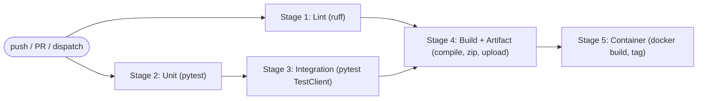

# D3 — Production CI Pipeline (GitHub Actions)

A 5-stage GitHub Actions pipeline for a sample FastAPI service: **Lint → Unit → Integration → Build
→ Container** (+ artifact publication), with pip + Docker layer caching, lockfile-deterministic
installs, fail-fast gating, and a proven failure→fix cycle. Workflow lives at the repo root
`.github/workflows/ci.yml`; the app under test is here in `DevOps-Infra/ci-pipeline/`.

> Verified — see `docs/agent-analysis/D3_ci_pipeline_record.md` (green run, failure demo, container build, cache evidence).

## Pipeline Overview / Architecture


Lint and Unit run in parallel; Integration needs Unit; Build needs Lint+Integration; Container needs Build (fail-fast via `needs`).

## Workflow Stages
| Stage | Job | Command | Gate |
|---|---|---|---|
| 1 Lint | `lint` | `ruff check .` + `ruff format --check .` | — |
| 2 Unit | `unit-tests` | `pytest tests/test_unit.py` | — |
| 3 Integration | `integration-tests` | `pytest tests/test_integration.py` | needs unit |
| 4 Build + Artifact | `build` | `compileall` + zip + `upload-artifact` | needs lint+integration |
| 5 Container | `container` | `docker build` (tag `d3-sample:<sha>`) | needs build |

## Trigger Rules
Runs on **push**, **pull_request**, and **workflow_dispatch**; `concurrency` cancels superseded runs on the same ref.

## Cache Strategy
* **pip:** `actions/setup-python` `cache: pip`, keyed on `requirements-dev.txt`.
* **Docker:** BuildKit `cache-from/to: type=gha`. (Locally proven: container rebuild 16s → 1s.)

## Dependency Strategy (deterministic)
Pinned lockfiles: `requirements.txt` (runtime, used by the Dockerfile) and `requirements-dev.txt`
(runtime + tooling, used by CI). Installed with `pip install -r requirements-dev.txt` — no floating ranges.

## Local Testing
```bash
cd "DevOps-Infra/ci-pipeline"
./scripts/run-ci-local.sh        # runs all 5 stages (same commands as ci.yml) with timing + exit codes
```
Or, with the GitHub Actions local runner:
```bash
act -j lint -P ubuntu-latest=catthehacker/ubuntu:act-latest --container-daemon-socket -
# (on a network behind a TLS proxy, mount the corporate CA + set NODE_EXTRA_CA_CERTS so setup-python can download)
```

## Failure Troubleshooting
| Symptom | Cause | Fix |
|---|---|---|
| Stage 2/3 red | failing test | read the pytest assertion; fix code/test |
| Stage 1 red | lint/format | `ruff check --fix .` + `ruff format .` |
| Container stage red | bad Dockerfile / build | run `docker build .` locally; read logs |
| `act` setup-python `unable to get local issuer certificate` | corporate proxy CA not trusted in runner | mount CA + `NODE_EXTRA_CA_CERTS`; or use GitHub-hosted runners |

## Artifact Information
Stage 4 publishes `d3-app-<run>.zip` (app + `requirements.txt` + `build-info.json` with commit/run/timestamp), retained 7 days (`actions/upload-artifact`).

## Container Build
```bash
cd "DevOps-Infra/ci-pipeline"
docker build -t d3-sample:local .
docker run -d -p 8000:8000 d3-sample:local
curl localhost:8000/health        # {"status":"ok"}
```
