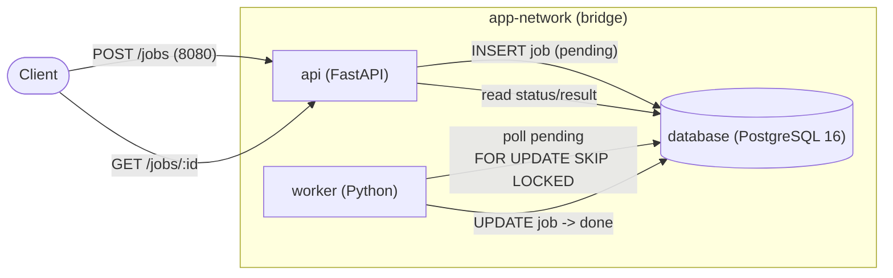

# D2 — Docker Compose Multi-Service Stack (API + PostgreSQL + Worker)

A fully containerized, health-check-orchestrated stack: a **FastAPI** API and a **Python worker**
share a **PostgreSQL** database over a user-defined bridge network. Jobs created via the API are
consumed and processed asynchronously by the worker. Verified end-to-end (see
`docs/agent-analysis/D2_compose_e2e_record.md`).

## Architecture


Service discovery: API/worker reach the DB by its service name `database` via Docker DNS on
`app-network`. Only the API publishes a host port (`8080→8000`).

## Project Structure
```
D2/
├── api/        (Dockerfile, app/main.py, requirements.txt)   # FastAPI
├── worker/     (Dockerfile, worker.py, requirements.txt)     # Python worker
├── database/   (seed.sql)                                    # schema + fixtures
├── scripts/    (seed.sh, integration-test.sh, teardown.sh)
├── docker-compose.yml
├── README.md
└── docs/agent-analysis/D2_compose_e2e_record.md
```

## Build
```bash
cd "Advanced/D2"
docker compose build
```

## Start
```bash
docker compose up -d        # api/worker wait for the DB to be healthy
docker compose ps           # database = healthy
```

## Seed
The schema + fixtures auto-apply on a **fresh** database — `database/seed.sql` is mounted
into the Postgres init dir (`/docker-entrypoint-initdb.d/`), so a clean `up` from zero needs
no manual seeding. `seed.sh` remains for **re-seeding** an already-running stack:
```bash
./scripts/seed.sh           # re-applies database/seed.sql, prints row counts (users=3, jobs=1)
```

## Test (end-to-end, against the live stack)
```bash
./scripts/integration-test.sh
# client -> API (DB write) -> worker (DB update) -> verification query -> PASS
```

## Teardown
```bash
./scripts/teardown.sh        # docker compose down -v
```

### One-shot (deterministic, from a fresh clone)
```bash
# Schema auto-applies on fresh DB — no manual seed step needed.
docker compose up -d --build && ./scripts/integration-test.sh \
  && docker compose logs && ./scripts/teardown.sh
```

## Troubleshooting
| Symptom | Cause | Fix |
|---|---|---|
| `docker: unknown command: docker compose` | Compose plugin missing | `brew install docker-compose` + symlink into `~/.docker/cli-plugins/` |
| `Cannot connect to the Docker daemon` | engine not running | start Docker Desktop / `colima start` |
| API `503 {"db":"down"}` | DB not ready yet | wait for `database` to be `healthy` (`docker compose ps`) |
| E2E `FAIL` / job stuck `pending` | DB volume from an old run without the init mount | `docker compose down -v` then `up` to re-init the schema |
| port 8080 in use | another process on 8080 | free it or change the `api` host port mapping |
| `relation "jobs" does not exist` in worker logs | stale DB volume predating the init-script mount | `docker compose down -v` to recreate a fresh, auto-seeded DB |
