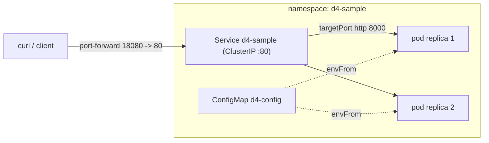

# D4 — Kubernetes Manifests Verified on a Local Cluster

Deploys a small **FastAPI** service (Python 3.12) to a local **kind** cluster with
production-grade manifests — namespace isolation, resource requests/limits, liveness /
readiness / startup probes, a ConfigMap for runtime config, a ClusterIP Service, and an
optional Ingress — then **proves it runs** with dry-run validation and live `curl` responses.

Full evidence: [`docs/agent-analysis/D4_kubernetes_validation_record.md`](docs/agent-analysis/D4_kubernetes_validation_record.md).
Runtime analysis with file-level sources: [`docs/agent-analysis/D4_kubernetes_analysis.md`](docs/agent-analysis/D4_kubernetes_analysis.md).

## Architecture



## Layout

```
D4/
├── app/                 # FastAPI workload (main.py: /health, /ready, /, /add)
├── tests/               # pytest (5 tests) — run before building the image
├── Dockerfile           # non-root (uid 10001), HEALTHCHECK, port 8000
├── requirements.txt
├── k8s/
│   ├── namespace.yaml
│   ├── configmap.yaml   # APP_ENV / APP_GREETING / APP_VERSION (injected via envFrom)
│   ├── deployment.yaml  # 2 replicas, probes, resources, securityContext
│   ├── service.yaml     # ClusterIP :80 -> :8000
│   └── ingress.yaml     # optional (nginx), host d4-sample.local
└── docs/agent-analysis/ # analysis + validation record
```

## Prerequisites

- Docker engine running (Docker Desktop / Colima / OrbStack)
- `kind` and `kubectl` — `brew install kind kubectl`

## Run tests (optional, no cluster needed)

```bash
python3 -m venv .venv && . .venv/bin/activate
pip install -r requirements-dev.txt
python -m pytest tests/ -q
```

## Up — bring the service online

```bash
# 1. Create the local cluster
kind create cluster --name d4-cluster --wait 120s

# 2. Build the image and side-load it into the cluster (no registry needed)
docker build -t d4-sample:v1 .
kind load docker-image d4-sample:v1 --name d4-cluster

# 3. Validate manifests (structural gate) — expect exit 0
kubectl apply --dry-run=client -f k8s/

# 4. Apply and wait for rollout
kubectl apply -f k8s/
kubectl rollout status deployment/d4-sample -n d4-sample --timeout=120s

# 5. Inspect
kubectl get all -n d4-sample
kubectl logs deployment/d4-sample -n d4-sample
```

## Verify — curl proof

```bash
# Bridge a local port to the in-cluster Service (run in a second terminal, or backgrounded)
kubectl port-forward -n d4-sample service/d4-sample 18080:80 &

curl -i http://127.0.0.1:18080/health            # 200 {"status":"ok"}
curl -i http://127.0.0.1:18080/ready             # 200 {"status":"ready"}
curl -i http://127.0.0.1:18080/                  # 200 shows ConfigMap-injected env
curl -i "http://127.0.0.1:18080/add?a=2&b=3"     # 200 {"sum":5,"even":false}
curl -i "http://127.0.0.1:18080/add?a=x&b=3"     # 422 validation error
```

## Down — tear everything down

```bash
# Remove just the app objects (keep the cluster)
kubectl delete -f k8s/

# Or delete the whole cluster
kind delete cluster --name d4-cluster
```

## Optional: Ingress

`k8s/ingress.yaml` is included and dry-run validated but **off the critical proof path**
(it needs an ingress controller). To use it on kind, install `ingress-nginx`, then add
`127.0.0.1 d4-sample.local` to `/etc/hosts` and curl `http://d4-sample.local/`.
The `port-forward` proof above requires no controller.
