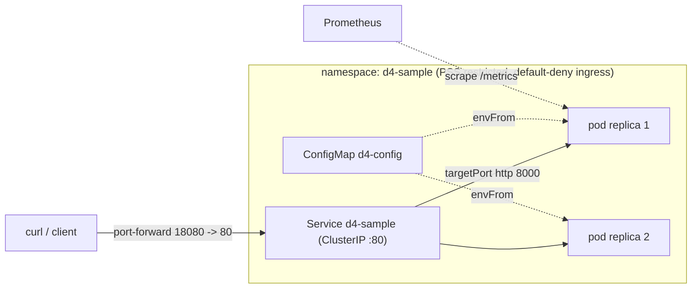

# D4 — Kubernetes Manifests Verified on a Local Cluster

Deploys a small **FastAPI** service (Python 3.12) to a local **kind** cluster with
production-grade, **Kustomize**-structured manifests — namespace isolation with the
restricted Pod Security Standard, a dedicated ServiceAccount (no API token), resource
requests/limits, liveness / readiness / startup probes, a ConfigMap for runtime config,
a default-deny NetworkPolicy, a PodDisruptionBudget, an HPA, topology spread, and an
optional TLS Ingress — then **proves it runs** with offline schema validation and live
`curl` responses.

The workload is instrumented out of the box: structured JSON access logs, Prometheus
metrics at `/metrics`, security response headers, and a per-request `X-Request-ID`.

Full evidence: [`docs/agent-analysis/D4_kubernetes_validation_record.md`](docs/agent-analysis/D4_kubernetes_validation_record.md).
Operations: [`docs/RUNBOOK.md`](docs/RUNBOOK.md).
Runtime analysis with file-level sources: [`docs/agent-analysis/D4_kubernetes_analysis.md`](docs/agent-analysis/D4_kubernetes_analysis.md).

## Architecture



## Layout

```
kubernetes-manifests/
├── app/                      # FastAPI workload
│   ├── main.py               # /health /ready / /add /metrics + observability middleware
│   ├── calc.py               # pure functions under unit test
│   ├── logging_setup.py      # structured JSON logging
│   ├── metrics.py            # Prometheus counters + latency histogram
│   └── middleware/security.py# security response headers
├── tests/                    # pytest (26 tests, coverage gate ≥80%)
├── Dockerfile                # digest-pinned base, non-root uid 10001, HEALTHCHECK, :8000
├── requirements*.txt
├── pytest.ini · ruff.toml · mypy.ini
├── Makefile                  # verify · validate · deploy · down
├── k8s/
│   ├── base/                 # namespace, serviceaccount, configmap, deployment,
│   │   │                     #  service, networkpolicy, pdb, hpa, ingress (+ kustomization)
│   │   ├── servicemonitor.yaml   # Prometheus Operator (CRD-gated, not in base)
│   │   └── secret.yaml.example   # example only — use External/Sealed Secrets in prod
│   └── overlays/
│       ├── dev/              # 2 replicas, side-loaded image (the kind workflow)
│       └── prod/             # 3 replicas, registry digest, higher limits, prod env
├── scripts/
│   ├── deploy-and-verify.sh  # kind: build → load → apply -k → rollout → curl proof
│   ├── validate-manifests.sh # kustomize + kubeconform strict + kube-score (offline)
│   └── push-image.sh         # build + push to GHCR, print digest to pin
└── docs/                     # RUNBOOK + analysis + validation record
```

## Prerequisites

- Docker engine running (Docker Desktop / Colima / OrbStack)
- `kind` and `kubectl` — `brew install kind kubectl`
- For offline manifest validation: `brew install kubeconform kube-score` (optional locally; CI installs them)

## Quick start (Makefile)

```bash
make verify          # app gates: ruff + mypy --strict + pytest (coverage ≥80%)
make validate        # manifests: kustomize build + kubeconform strict (dev + prod)
make deploy          # kind E2E: build → side-load → apply -k → rollout → curl proof
make verify-e2e      # ...same, then tear the cluster down
make down            # delete the kind cluster
```

## Run tests (no cluster needed)

```bash
python3 -m venv .venv && . .venv/bin/activate
pip install -r requirements-dev.txt
python -m pytest                 # 26 tests, coverage gate ≥80%, zero warnings
```

## Up — bring the service online

```bash
# 1. Create the local cluster
kind create cluster --name d4-cluster --wait 120s

# 2. Build the image and side-load it into the cluster (no registry needed)
docker build -t d4-sample:v1 .
kind load docker-image d4-sample:v1 --name d4-cluster

# 3. Validate manifests offline (structural gate) — expect "Valid: 10"
bash scripts/validate-manifests.sh

# 4. Apply the dev overlay and wait for rollout
kubectl apply -k k8s/overlays/dev
kubectl rollout status deployment/d4-sample -n d4-sample --timeout=120s

# 5. Inspect
kubectl get deploy,pods,svc,hpa,pdb,netpol,sa -n d4-sample
kubectl logs deployment/d4-sample -n d4-sample
```

Everything in steps 2–5 is automated by `bash scripts/deploy-and-verify.sh`.

## Verify — curl proof

```bash
# Bridge a local port to the in-cluster Service (second terminal, or backgrounded)
kubectl port-forward -n d4-sample service/d4-sample 18080:80 &

curl -i http://127.0.0.1:18080/health            # 200 {"status":"ok"}
curl -i http://127.0.0.1:18080/ready             # 200 {"status":"ready"}
curl -i http://127.0.0.1:18080/                  # 200 shows ConfigMap-injected env
curl -i http://127.0.0.1:18080/metrics           # 200 Prometheus exposition
curl -i "http://127.0.0.1:18080/add?a=2&b=3"     # 200 {"sum":5,"even":false}
curl -i "http://127.0.0.1:18080/add?a=x&b=3"     # 422 validation error
```

Every response carries `X-Request-ID` and the security headers; each request emits one
structured JSON log line on stdout.

## Production overlay

```bash
kubectl apply -k k8s/overlays/prod
```

The prod overlay (`k8s/overlays/prod/kustomization.yaml`) pulls a **digest-pinned**
image from a registry, runs 3 replicas with higher CPU/memory headroom, widens the HPA
to 3→10, enforces hard zone anti-affinity, and sets `APP_ENV=production`. Build and
push the image with `scripts/push-image.sh`, then pin the printed digest.

## Down — tear everything down

```bash
kubectl delete -k k8s/overlays/dev     # remove the app objects (keep the cluster)
kind delete cluster --name d4-cluster  # or delete the whole cluster
```

## Security & hardening posture

- **Pod**: `runAsNonRoot`, `runAsUser: 10001` (matches the Dockerfile `USER`),
  `readOnlyRootFilesystem`, `allowPrivilegeEscalation: false`, drop **ALL** capabilities,
  seccomp `RuntimeDefault`. Asserted in `tests/test_manifests.py` so a regression fails CI.
- **Namespace**: enforces the **restricted** Pod Security Standard at the apiserver.
- **ServiceAccount**: dedicated, `automountServiceAccountToken: false`, zero RBAC.
- **Network**: default-deny ingress; only port 8000 from the app, ingress, and
  monitoring namespaces (`k8s/base/networkpolicy.yaml`).
- **Supply chain**: digest-pinned base image; `pip-audit` on runtime deps in CI.

## Observability

- `GET /metrics` — Prometheus counters (`http_requests_total`, `http_request_errors_total`)
  + latency histogram (`http_request_duration_seconds`), labelled by the matched route.
- Structured JSON logs on stdout (request_id / method / path / status / duration_ms).
- In-cluster scraping: annotation-based (works without the Operator) or via
  `k8s/base/servicemonitor.yaml` once kube-prometheus-stack is installed.

## CI

`.github/workflows/d4-kubernetes.yml` runs on changes under this directory:
**validate** (ruff + mypy --strict + pytest/coverage + pip-audit), **manifests**
(kustomize build → kubeconform strict on both overlays → kube-score), and an opt-in
**e2e** job (`workflow_dispatch`) that spins up kind and runs `deploy-and-verify.sh`.
Actions are SHA-pinned; `permissions: contents: read`.

## Optional: Ingress

`k8s/base/ingress.yaml` is included and schema-validated but **off the critical proof
path** (it needs an ingress controller). It declares TLS via a cert-manager
`cluster-issuer` annotation. To use it on kind, install `ingress-nginx` (+ cert-manager
for TLS), add `127.0.0.1 d4-sample.local` to `/etc/hosts`, then curl
`https://d4-sample.local/`. The `port-forward` proof above requires no controller.
