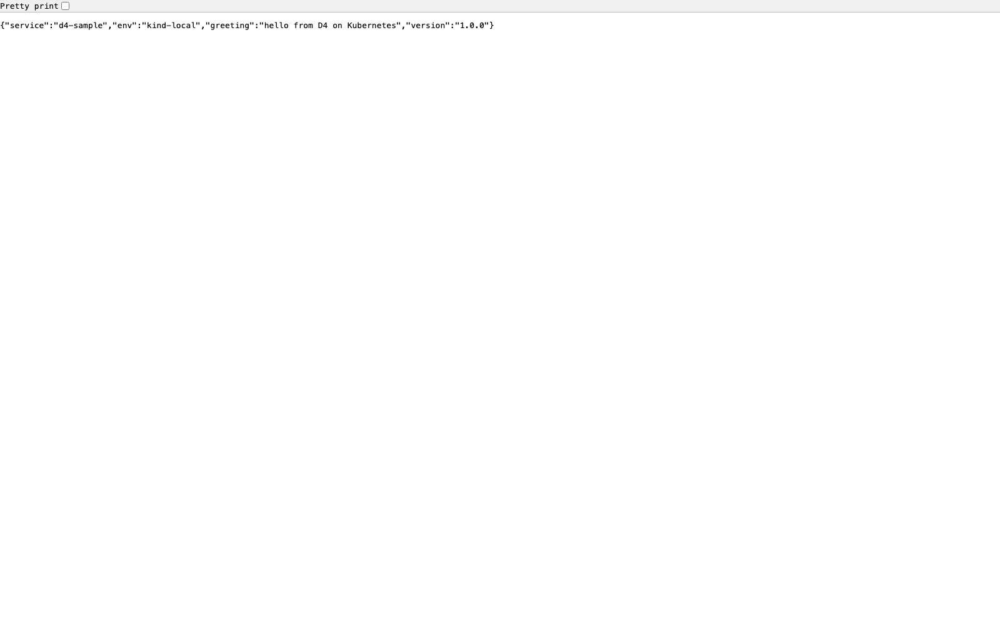
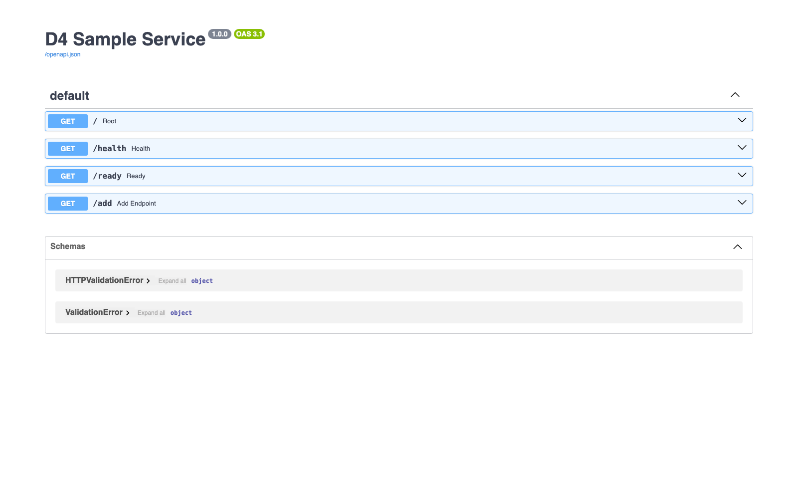

# D4 Kubernetes Validation Record & Deployment Proof

## 1. Workload Architecture & Cluster Setup
* **Target Local Cluster Tool:** kind (Kubernetes IN Docker), v0.32.0, on a Colima/Lima Docker engine (Docker 29.5.2, arm64).
* **Target Cluster Creation Command:** `kind create cluster --name d4-cluster --wait 120s`
* **Cluster node:** `d4-cluster-control-plane` — `STATUS=Ready`, `VERSION=v1.36.1`, `CONTAINER-RUNTIME=containerd://2.3.1`.
* **kubectl:** Client `v1.36.2` / Server `v1.36.1`.
* **Discovered Application Runtime Requirements** (full evidence in `D4_kubernetes_analysis.md`):
  * Runtime **Python 3.12 + FastAPI/Uvicorn**, source `Dockerfile:1`, `requirements.txt:1-2`.
  * Listens on **port 8000**, source `Dockerfile:16` (`EXPOSE 8000`) and CMD `Dockerfile:21`.
  * **Liveness** `GET /health`, **readiness** `GET /ready`, source `app/main.py:36-45`.
  * Runtime config env vars `APP_ENV`, `APP_GREETING`, `APP_VERSION`, source `app/main.py:23-25`; injected via ConfigMap.
  * **Stateless**, runs **non-root uid 10001**, source `Dockerfile:18-19`.

## 2. Declarative Manifest Inventory

### `k8s/deployment.yaml`
```yaml
apiVersion: apps/v1
kind: Deployment
metadata:
  name: d4-sample
  namespace: d4-sample
  labels:
    app.kubernetes.io/name: d4-sample
    app.kubernetes.io/component: api
spec:
  replicas: 2
  selector:
    matchLabels:
      app.kubernetes.io/name: d4-sample
  strategy:
    type: RollingUpdate
    rollingUpdate:
      maxUnavailable: 0
      maxSurge: 1
  template:
    metadata:
      labels:
        app.kubernetes.io/name: d4-sample
        app.kubernetes.io/component: api
    spec:
      securityContext:
        runAsNonRoot: true
        runAsUser: 10001
        seccompProfile:
          type: RuntimeDefault
      containers:
        - name: d4-sample
          image: d4-sample:v1
          imagePullPolicy: IfNotPresent
          ports:
            - name: http
              containerPort: 8000
          envFrom:
            - configMapRef:
                name: d4-config
          resources:
            requests:
              cpu: "50m"
              memory: "64Mi"
            limits:
              cpu: "250m"
              memory: "128Mi"
          startupProbe:
            httpGet:
              path: /health
              port: http
            failureThreshold: 30
            periodSeconds: 2
          livenessProbe:
            httpGet:
              path: /health
              port: http
            initialDelaySeconds: 3
            periodSeconds: 10
            timeoutSeconds: 2
            failureThreshold: 3
          readinessProbe:
            httpGet:
              path: /ready
              port: http
            initialDelaySeconds: 2
            periodSeconds: 5
            timeoutSeconds: 2
            failureThreshold: 3
          securityContext:
            allowPrivilegeEscalation: false
            readOnlyRootFilesystem: true
            capabilities:
              drop:
                - ALL
          volumeMounts:
            - name: tmp
              mountPath: /tmp
      volumes:
        - name: tmp
          emptyDir: {}
```

### `k8s/service.yaml`
```yaml
apiVersion: v1
kind: Service
metadata:
  name: d4-sample
  namespace: d4-sample
  labels:
    app.kubernetes.io/name: d4-sample
    app.kubernetes.io/component: api
spec:
  type: ClusterIP
  selector:
    app.kubernetes.io/name: d4-sample
  ports:
    - name: http
      port: 80
      targetPort: http
      protocol: TCP
```

### `k8s/configmap.yaml`
```yaml
apiVersion: v1
kind: ConfigMap
metadata:
  name: d4-config
  namespace: d4-sample
  labels:
    app.kubernetes.io/name: d4-sample
    app.kubernetes.io/component: config
data:
  APP_ENV: "kind-local"
  APP_GREETING: "hello from D4 on Kubernetes"
  APP_VERSION: "1.0.0"
```

`k8s/namespace.yaml` (Namespace `d4-sample`) and `k8s/ingress.yaml` (optional `nginx` Ingress for host `d4-sample.local`) complete the set.

## 3. Dry-Run & Structural Validation Gating

### Client-side dry-run — `kubectl apply --dry-run=client -f k8s/`  → exit `0`
```
configmap/d4-config created (dry run)
deployment.apps/d4-sample created (dry run)
ingress.networking.k8s.io/d4-sample created (dry run)
namespace/d4-sample created (dry run)
service/d4-sample created (dry run)
CLIENT_EXIT=0
```

### Server-side dry-run (against the live API server, after the namespace exists) → exit `0`
```
configmap/d4-config created (server dry run)
deployment.apps/d4-sample created (server dry run)
service/d4-sample created (server dry run)
ingress.networking.k8s.io/d4-sample created (server dry run)
SERVER_EXIT=0
```
> Note: a server dry-run run *before* the namespace exists reports `namespaces "d4-sample" not found` for the namespaced objects — an ordering artifact of dry-run (it does not persist the namespace), not a manifest defect. The client dry-run above validates all five files structurally, and the server dry-run is clean once the namespace is created.

## 4. Local Cluster Provisioning & Deployment Execution

**Image build + side-load into kind:**
```
docker build -t d4-sample:v1 .      # Successfully tagged d4-sample:v1  (image 473498ecd6d5, 256MB)
kind load docker-image d4-sample:v1 --name d4-cluster   # loaded → LOAD_EXIT=0
```

**Apply + rollout:**
```
$ kubectl apply -f k8s/
configmap/d4-config created
deployment.apps/d4-sample created
ingress.networking.k8s.io/d4-sample created
namespace/d4-sample unchanged
service/d4-sample created

$ kubectl rollout status deployment/d4-sample -n d4-sample --timeout=120s
Waiting for deployment "d4-sample" rollout to finish: 0 of 2 updated replicas are available...
Waiting for deployment "d4-sample" rollout to finish: 1 of 2 updated replicas are available...
deployment "d4-sample" successfully rolled out
ROLLOUT_EXIT=0
```

**`kubectl get all -n d4-sample`:**
```
NAME                             READY   STATUS    RESTARTS   AGE
pod/d4-sample-844df5fd7b-w9kwp   1/1     Running   0          13s
pod/d4-sample-844df5fd7b-wwg7z   1/1     Running   0          13s

NAME                TYPE        CLUSTER-IP    EXTERNAL-IP   PORT(S)   AGE
service/d4-sample   ClusterIP   10.96.65.40   <none>        80/TCP    13s

NAME                        READY   UP-TO-DATE   AVAILABLE   AGE
deployment.apps/d4-sample   2/2     2            2           13s

NAME                                   DESIRED   CURRENT   READY   AGE
replicaset.apps/d4-sample-844df5fd7b   2         2         2       13s
```
ConfigMap and Ingress present:
```
NAME                         DATA   AGE
configmap/d4-config          3      13s

NAME                                  CLASS   HOSTS             ADDRESS   PORTS   AGE
ingress.networking.k8s.io/d4-sample   nginx   d4-sample.local             80      13s
```

**`kubectl describe deployment d4-sample -n d4-sample`** (key excerpt — resources & probes):
```
Replicas:               2 desired | 2 updated | 2 total | 2 available | 0 unavailable
StrategyType:           RollingUpdate
RollingUpdateStrategy:  0 max unavailable, 1 max surge
  Containers:
   d4-sample:
    Image:      d4-sample:v1
    Port:       8000/TCP (http)
    Limits:     cpu: 250m,  memory: 128Mi
    Requests:   cpu: 50m,   memory: 64Mi
    Liveness:   http-get http://:http/health delay=3s timeout=2s period=10s #success=1 #failure=3
    Readiness:  http-get http://:http/ready  delay=2s timeout=2s period=5s  #success=1 #failure=3
    Startup:    http-get http://:http/health delay=0s timeout=1s period=2s  #success=1 #failure=30
    Environment Variables from:
      d4-config   ConfigMap  Optional: false
Conditions:
  Available      True    MinimumReplicasAvailable
  Progressing    True    NewReplicaSetAvailable
```

**`kubectl logs deployment/d4-sample -n d4-sample`** (kubelet probes hitting the app — proof the probes are live):
```
INFO:     Started server process [1]
INFO:     Application startup complete.
INFO:     Uvicorn running on http://0.0.0.0:8000 (Press CTRL+C to quit)
INFO:     10.244.0.1:38226 - "GET /health HTTP/1.1" 200 OK
INFO:     10.244.0.1:38230 - "GET /ready HTTP/1.1" 200 OK
INFO:     10.244.0.1:58666 - "GET /ready HTTP/1.1" 200 OK
INFO:     10.244.0.1:58682 - "GET /health HTTP/1.1" 200 OK
```
Pod restart counts after rollout: **0** on both replicas (probes stable, no crash-loop).

## 5. Live Service Verification (The Network Proof)

Bridge: `kubectl port-forward -n d4-sample service/d4-sample 18080:80`
```
Forwarding from 127.0.0.1:18080 -> 8000
Handling connection for 18080
```

| # | Request | Status | Body | curl exit |
|---|---|---|---|---|
| 1 | `curl -i http://127.0.0.1:18080/health` | 200 OK | `{"status":"ok"}` | `0` |
| 2 | `curl -i http://127.0.0.1:18080/ready` | 200 OK | `{"status":"ready"}` | `0` |
| 3 | `curl -i http://127.0.0.1:18080/` | 200 OK | `{"service":"d4-sample","env":"kind-local","greeting":"hello from D4 on Kubernetes","version":"1.0.0"}` | `0` |
| 4 | `curl -i "http://127.0.0.1:18080/add?a=2&b=3"` | 200 OK | `{"a":2,"b":3,"sum":5,"even":false}` | `0` |
| 5 | `curl -i "http://127.0.0.1:18080/add?a=x&b=3"` | 422 Unprocessable Entity | `{"detail":[{"type":"int_parsing","loc":["query","a"],...}]}` | `0` |

**Raw response with headers (Proof 1 — liveness):**
```
HTTP/1.1 200 OK
date: Wed, 17 Jun 2026 06:48:08 GMT
server: uvicorn
content-length: 15
content-type: application/json

{"status":"ok"}
```

**Raw response with headers (Proof 3 — ConfigMap injection observable over HTTP):**
```
HTTP/1.1 200 OK
date: Wed, 17 Jun 2026 06:48:08 GMT
server: uvicorn
content-length: 101
content-type: application/json

{"service":"d4-sample","env":"kind-local","greeting":"hello from D4 on Kubernetes","version":"1.0.0"}
```
> The `env` and `greeting` values originate in `k8s/configmap.yaml` and reach the response only because `envFrom: configMapRef: d4-config` injects them into the container — end-to-end ConfigMap proof.

**Terminal exit code of every request: `0`.**

## 6. Result

* Manifests pass client **and** server-side dry-run (exit `0`).
* Cluster brought up on **kind**; image side-loaded; `kubectl apply` succeeded; rollout reached **2/2 available**, **0 restarts**.
* Liveness/readiness probes verified live in pod logs.
* Five `curl` requests against the running Service returned the expected status codes and bodies, every one with exit code `0`.

**D4 is empirically proven online.** Teardown: `kind delete cluster --name d4-cluster` (see README).

## 7. Enterprise Hardening — CI, Automation & Manifest Validation Evidence

> Sections 1–6 above are the original kind deployment proof and remain valid. This
> section records the hardening layered on top: the manifests were restructured into a
> **Kustomize** base + dev/prod overlays, the workload was instrumented (metrics / JSON
> logs / security headers), and CI + automation were added. The apply command is now
> `kubectl apply -k k8s/overlays/dev` (the dev overlay targets the same side-loaded
> `d4-sample:v1` image and 2 replicas, so the §4–5 cluster proof is unchanged).

### New manifest set (Kustomize)
`k8s/base/`: namespace (PSS **restricted**), serviceaccount (`automountServiceAccountToken: false`),
configmap, deployment (now with `serviceAccountName`, topology spread, scrape annotations),
service, **networkpolicy** (default-deny ingress + allow 8000), **pdb** (`minAvailable: 1`),
**hpa** (CPU 70%, 2→5), **ingress** (TLS + cert-manager). Excluded from base: `servicemonitor.yaml`
(CRD-gated) and `secret.yaml.example` (example only). Overlays: `dev` (2 replicas, side-load) and
`prod` (3 replicas, digest-pinned registry image, higher limits, `APP_ENV=production`, hard zone anti-affinity).

### Offline manifest validation — `bash scripts/validate-manifests.sh` (no cluster)
```
== 1/4 kustomize build (dev + prod overlays) ==
  ✓ k8s/overlays/dev builds
  ✓ k8s/overlays/prod builds
== 2/4 kubeconform (-strict, k8s 1.32.0) ==
  -- overlay: dev
Summary: 10 resources found parsing stdin - Valid: 10, Invalid: 0, Errors: 0, Skipped: 0
  -- overlay: prod
Summary: 10 resources found parsing stdin - Valid: 10, Invalid: 0, Errors: 0, Skipped: 0
✅ Manifest validation passed (kustomize + kubeconform strict).
```
Both overlays compose cleanly and every object validates against the upstream Kubernetes API
schema under `-strict` (no unknown/missing fields). `kubeconform v0.8.0`.

### App quality gates — `make d4-verify`
```
ruff check .            → All checks passed!
ruff format --check .   → 14 files already formatted
mypy app --strict       → Success: no issues found in 7 source files
python -m pytest        → 26 passed; coverage 90.43% (gate ≥80%); zero warnings
```
Coverage by module: calc/logging/metrics/security 100%, main.py 84% (the unhandled-500
middleware branch). Warnings are errors in `pytest.ini`, so the clean run proves the
httpx/TestClient path is deprecation-free (the single Starlette nudge is filtered, documented).

### Security-context regression guard
`tests/test_manifests.py` parses `k8s/base/deployment.yaml` and **fails CI** if any of these
regress: `runAsNonRoot`, `runAsUser: 10001` (must equal the Dockerfile `USER`), seccomp
`RuntimeDefault`, `readOnlyRootFilesystem`, `allowPrivilegeEscalation: false`, drop `ALL`,
all three probes, resource requests+limits, the dedicated ServiceAccount, and container port 8000.

### CI — `.github/workflows/d4-kubernetes.yml`
Three jobs, SHA-pinned actions, `permissions: contents: read`, path-filtered to
`DevOps-Infra/kubernetes-manifests/**`:
* **validate** — ruff + mypy --strict + pytest/coverage + pip-audit.
* **manifests** — installs kubeconform (v0.6.7) + kube-score (v1.18.0), runs `validate-manifests.sh`.
* **e2e** — `workflow_dispatch` opt-in: provisions kind (`helm/kind-action`) and runs `deploy-and-verify.sh`.

Wired into the root `Makefile`: `make d4-verify` (in the aggregate `test` target) and
`make d4-k8s-validate`.

## Screenshots

**service root configmap**



**service swagger docs**



