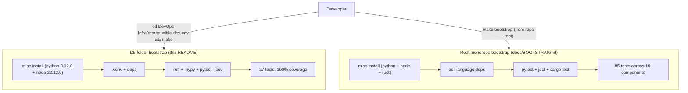

# D5 — Reproducible Dev Environment from a Fresh Clone

A fresh clone of **this folder** builds and passes its tests with **one command**,
on a clean machine, using **pinned runtime versions** — no "works on my machine"
drift. It is a small, production-shaped FastAPI service whose real subject is the
*bootstrap*: pinned Python **3.12.8** + Node **22.12.0**, lint + type + coverage
gates, and a CI job that proves the whole thing on a clean Linux runner.

> **Two different entrypoints — do not conflate them.** `make` *in this folder*
> bootstraps **only this demo** (27 tests). `make bootstrap` at the **repo root**
> bootstraps the **whole polyglot monorepo** (Python + Node + Rust, 85 tests).
> See the diagram below and [root `docs/BOOTSTRAP.md`](../../docs/BOOTSTRAP.md).



## The single command

```bash
make
```

That's it. `make` (default target → `scripts/bootstrap.sh`) is **idempotent and
incremental**:
1. `mise install` — installs the pinned toolchain from `mise.toml`,
2. **verifies** Python *and* Node actually resolve to the pinned versions,
3. creates an isolated `.venv` with the pinned Python (**only if missing**),
4. installs dependencies (**skipped if `requirements*.txt` are unchanged** — content-hashed),
5. runs the quality gates — `ruff check`, `ruff format --check`, `mypy app`,
6. runs the test suite with a **coverage gate** (`--cov-fail-under=80`).

A cold run is ~18s; a warm re-run is ~2s (it reuses the venv and skips pip).
Full captured output: [`docs/agent-analysis/D5_bootstrap_output.txt`](docs/agent-analysis/D5_bootstrap_output.txt).
Verification record: [`docs/agent-analysis/D5_reproducibility_record.md`](docs/agent-analysis/D5_reproducibility_record.md).

## Prerequisite (one-time, per machine)

[`mise`](https://mise.jdx.dev) — the version manager that reads `mise.toml`:
```bash
brew install mise        # or: curl https://mise.run | sh
```
Everything else (Python, Node, dependencies) is installed *by* `make` at the exact
pinned versions. No system Python/Node required.

## Pinned toolchain (`mise.toml`)

| Tool | Version | Why pinned |
|---|---|---|
| python | 3.12.8 | tests assert 3.12.x; avoids host-Python drift (this host runs 3.14) |
| node | 22.12.0 | polyglot-monorepo parity; **verified live** at bootstrap and in `tests/test_toolchain.py` |

These pins are kept identical to the repo-root `mise.toml` / `.tool-versions`
(Python + Node) — enforced by `scripts/check-toolchain-sync.sh`, which runs in CI.
Plus declared env (`APP_ENV`, `PYTHONDONTWRITEBYTECODE`) that was previously implicit.

## `make` vs `make verify` (semantics)

| Target | What it does | When |
|---|---|---|
| `make` (`bootstrap`) | install toolchain + deps (if changed) → gates → tests | fresh clone / after dependency or pin changes |
| `make verify` | lint + types + tests in the **existing** venv — **no install** | fast inner loop while editing |
| `make test` | tests + coverage gate only | quick test-only check |

## Other targets

```bash
make lint           # ruff check + ruff format --check + mypy
make check-sync     # fail if root/D5 toolchain pins diverge
make verify-fresh   # simulate a fresh clone (rsync tracked files -> temp) and run make there
make lock           # regenerate requirements.lock (full resolved transitive closure)
make run            # serve the app on :8000
make doctor         # show the resolved pinned toolchain (mise ls)
make clean          # remove .venv
make help           # list targets
```

## Deterministic installs

Direct dependencies are exact-pinned (`==`) in `requirements.txt` /
`requirements-dev.txt`. `requirements.lock` captures the **full resolved transitive
closure** (`pip freeze`) so an install can be byte-for-byte reproducible:

```bash
./.venv/bin/python -m pip install -r requirements.lock   # exact closure
make lock                                                # regenerate after a bump
```

The bootstrap installs from `requirements-dev.txt` (readable, direct pins) and
content-hashes both files to skip reinstalls; use the lock when you need the exact
transitive set reproduced (e.g. release builds).

## The service

| Method + path | Purpose |
|---|---|
| `GET /health` | liveness; echoes the live Python version + `APP_ENV` (proves the pin) |
| `POST /v1/add` | **canonical** add — bounded JSON body (`a`,`b`), unknown keys / out-of-range → 422 |
| `GET /add` | **deprecated** query-param form, kept for back-compat (same bounds) |
| `GET /metrics` | Prometheus scrape target |

Every response carries security headers (`X-Content-Type-Options`, `X-Frame-Options`,
`Content-Security-Policy`, …) and an `X-Request-ID`; access logs are structured JSON.
CORS is off by default — opt in with `CORS_ALLOW_ORIGINS` (comma-separated allow-list).

## Alternative bootstrap: Dev Container

`.devcontainer/devcontainer.json` reproduces the **same** environment in VS Code /
Codespaces by installing `mise` and running the identical `make` bootstrap — so the
container and your laptop read **one** source of truth (this folder's `mise.toml`),
not a divergent feature-installed runtime. `postStartCommand` re-runs `make verify`
on every start under the same pinned Python 3.12.8.

## What was previously implicit (now explicit)

| Previously implicit | Now declared in |
|---|---|
| Python version (host had 3.14 → deprecation drift) | `mise.toml` + `.tool-versions` + `.python-version` (`3.12.8`) |
| Node version (declared but never verified) | `mise.toml`/`.tool-versions` + **verified** in bootstrap & `test_toolchain.py` |
| `gpg` needed for mise's Python attestation verification | `mise.toml` `[settings] python.github_attestations = false` |
| `APP_ENV` environment variable | `mise.toml` `[env]` + devcontainer |
| Exact dependency versions | `requirements*.txt` (`==` pins; aligned with the sibling ci-pipeline) |
| No CI proof of a clean-machine bootstrap | `.github/workflows/d5-reproducible-env.yml` (ubuntu fresh-clone) |

See [`docs/RUNBOOK.md`](docs/RUNBOOK.md) for operational procedures (mise trust,
corporate proxy, version bumps, troubleshooting).
