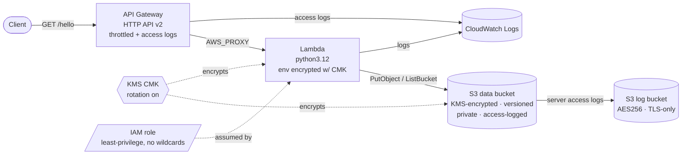

# terraform-aws-stack — S3 + Lambda + API Gateway (HTTP API v2)

Production-grade, **fully-offline-plannable** Terraform for a small serverless
stack: an HTTP API that invokes a Lambda which reads/writes an encrypted S3
bucket. Providers are strictly pinned and locked; `terraform plan` runs with
**no AWS account** (mock credentials + skip flags), so CI validates every change
without secrets. A real apply switches to OIDC credentials via one variable.

> Validation evidence (fmt/validate/plan/scan logs):
> [`docs/agent-analysis/D1_terraform_validation.md`](docs/agent-analysis/D1_terraform_validation.md)

## Architecture



**Request flow:** `client → API Gateway (GET /hello) → Lambda (AWS_PROXY) →
S3 (record + count visits)`. The handler genuinely exercises the S3 permissions
the IAM role grants — infrastructure and code agree.

## Prerequisites

| Tool | Version | Needed for |
|---|---|---|
| Terraform | `>= 1.6, < 2.0` (pinned/tested on **1.15.6**) | everything |
| Python | 3.12 | handler unit tests |
| AWS CLI / credentials | optional | only for a **real** apply |
| tflint, checkov | optional | local lint/security parity with CI |

## Quickstart

```bash
cd DevOps-Infra/terraform-aws-stack

# 1. Validate (offline, no AWS account)
terraform init -backend=false
terraform fmt -check -recursive
terraform validate

# 2. Plan (offline — mock creds + skip flags in providers.tf)
terraform plan -input=false          # => Plan: 28 to add, 0 to change, 0 to destroy

# 3. Handler unit tests
python -m venv .venv && . .venv/bin/activate
pip install -r requirements-dev.txt
pytest                                # 6 tests, coverage gate >= 90%

# 4. Apply to a REAL account (disables the offline mocks)
#    Uses your standard credential chain (OIDC / AWS_PROFILE / env vars).
terraform init
terraform apply -var='offline_mode=false'
curl "$(terraform output -raw api_endpoint)"

# 5. Tear down
terraform destroy -var='offline_mode=false'
```

From the repo root you can also run everything via `make d1-verify`.

## Security posture

- **Encryption** — data bucket and Lambda environment variables use a
  customer-managed **KMS CMK** (rotation enabled); the access-log bucket uses
  SSE-S3 (AES256) because S3 log delivery cannot target a CMK bucket.
- **S3** — all public access blocked, versioned, ACLs disabled
  (`BucketOwnerEnforced`), TLS enforced via bucket policy, lifecycle rules bound
  storage, and the data bucket ships server access logs to a dedicated bucket.
- **IAM** — a single inline policy scoped to exact ARNs (this function's log
  group, the data bucket, the one CMK). **No AWS managed policies and no
  wildcard actions or resources.**
- **API Gateway** — per-stage throttling (burst/rate) and JSON access logging to
  CloudWatch.
- **Offline-by-default** — `terraform plan` needs no credentials; CI gates every
  PR with fmt + validate + plan + tflint + checkov + handler tests.

### Deliberate, documented exceptions (checkov skips)

Each is an inline `# checkov:skip=...:reason` next to its resource. Highlights:

| Check | Why skipped |
|---|---|
| `CKV_AWS_50` (X-Ray) | `xray:PutTraceSegments` only supports resource `"*"`, which would break the no-wildcard IAM rule. |
| `CKV_AWS_116` (Lambda DLQ) | Function is invoked **synchronously** by API Gateway; a DLQ only captures async failures. |
| `CKV_AWS_158` (CMK on log groups) | An explicit key policy needs the account id, which is unavailable while plan is fully offline. |
| `CKV_AWS_145` (logs bucket KMS) | S3 access-log delivery requires SSE-S3 on the target bucket; CMK is unsupported. |
| `CKV_AWS_309` (API auth) | Intentionally public `/hello` demo endpoint. |
| `CKV_AWS_144` / `CKV2_AWS_62` | Single-region reference; no cross-region replica or event consumer in scope. |

## Files

| File | Purpose |
|---|---|
| `versions.tf` | Terraform + provider version constraints; local backend |
| `providers.tf` | AWS provider; `offline_mode` toggles mock creds vs real chain |
| `variables.tf` | 17 typed, validated, defaulted variables |
| `main.tf` | locals, `random_id` suffix, Lambda zip (`archive_file`) |
| `kms.tf` | customer-managed CMK + alias |
| `s3.tf` | data bucket + access-log bucket and all hardening |
| `iam.tf` | least-privilege Lambda execution role |
| `lambda.tf` | Lambda function + its log group |
| `apigw.tf` | HTTP API, integration, route, stage, invoke permission |
| `outputs.tf` | endpoint, bucket names, role/key ARNs |
| `src/handler.py` | Lambda handler (records + counts S3 visits) |
| `tests/test_handler.py` | handler unit tests (in-memory S3 fake) |
| `.tflint.hcl`, `.checkov.yaml` | lint + security-scan config |

## Variables

| Variable | Type | Default | Description |
|---|---|---|---|
| `aws_region` | string | `ap-south-1` | Region (regex-validated) |
| `project_name` | string | `d1-svc` | Naming/tag prefix |
| `environment` | string | `dev` | `dev` \| `staging` \| `prod` |
| `offline_mode` | bool | `true` | Mock creds for offline plan; false for real apply |
| `tags` | map(string) | `{}` | Extra tags merged into default_tags |
| `lambda_runtime` | string | `python3.12` | Supported Python runtime |
| `lambda_memory_mb` | number | `128` | 128–10240 |
| `lambda_timeout_s` | number | `10` | 1–900 |
| `lambda_reserved_concurrency` | number | `-1` | `-1` unreserved, or 1–1000 |
| `lambda_log_level` | string | `INFO` | DEBUG/INFO/WARNING/ERROR |
| `log_retention_days` | number | `14` | CloudWatch retention (valid CWL value) |
| `log_object_retention_days` | number | `90` | S3 access-log object expiry |
| `noncurrent_version_retention_days` | number | `90` | Data bucket noncurrent expiry |
| `force_destroy_buckets` | bool | `false` | Allow destroy of non-empty buckets |
| `kms_deletion_window_days` | number | `30` | KMS key deletion window (7–30) |
| `api_throttle_burst_limit` | number | `50` | API GW burst limit |
| `api_throttle_rate_limit` | number | `100` | API GW steady-state rate |

## Outputs

| Output | Description |
|---|---|
| `api_endpoint` | Invoke URL for `GET /hello` |
| `s3_bucket_name` | Data bucket name |
| `logs_bucket_name` | Access-log bucket name |
| `lambda_function_name` | Lambda function name |
| `lambda_role_arn` | Lambda execution role ARN |
| `kms_key_arn` | CMK ARN |

## Real-account apply notes

The optional CI apply job (`workflow_dispatch` → `apply: true`) assumes an IAM
role via **GitHub OIDC** (no long-lived secrets). Configure:

- `vars.AWS_DEPLOY_ROLE_ARN` — IAM role trusting this repo's OIDC provider
- `vars.AWS_REGION` — target region (defaults to `ap-south-1`)
- a protected `production` environment for manual approval
