# I1 — Entity-Relationship Diagram: android-monorepo

> Generated by I1 Repository ER Diagram Agent. Stack: **Android Room** (SQLite local cache).

> Authoritative schema source: exported Room `schemas/**/*.json` (highest version per database).

---

## 1. Entity Inventory

| Entity | Table | File Path | Verification |
|---|---|---|---|
| PopularSearch | `popular_search` | `common-database/src/main/java/com/paytmmoney/equity_database/search/PopularSearch.kt` | VERIFIED — `schemas/.../19.json` PK=['id'], autoGenerate=True |
| MostInvestedStock | `most_invested_stocks` | `common-database/src/main/java/com/paytmmoney/equity_database/search/MostInvestedStock.kt` | VERIFIED — `schemas/.../19.json` PK=['id'], autoGenerate=True |
| RecentSearch | `recent_search` | `common-database/src/main/java/com/paytmmoney/equity_database/search/RecentSearch.kt` | VERIFIED — `schemas/.../19.json` PK=['stock_id'], autoGenerate=False |
| EquityConfig | `equity_config` | `common-database/src/main/java/com/paytmmoney/equity_database/config/EquityConfig.kt` | VERIFIED — `schemas/.../19.json` PK=['id'], autoGenerate=True |
| PersonalDetails | `personal_details` | `common-database/src/main/java/com/paytmmoney/equity_database/userDetails/PersonalDetails.kt` | VERIFIED — `schemas/.../19.json` PK=['userId'], autoGenerate=False |
| RecentlyViewed | `recently_viewed` | `common-database/src/main/java/com/paytmmoney/equity_database/recentlyviewed/RecentlyViewed.kt` | VERIFIED — `schemas/.../19.json` PK=['stock_id'], autoGenerate=False |
| HomeShortCut | `home_shortcut` | `common-database/src/main/java/com/paytmmoney/equity_database/homeshortcutdb/HomeShortCut.kt` | VERIFIED — `schemas/.../19.json` PK=['screen_name'], autoGenerate=False |
| SleekCardDetails | `sleek_card_details` | `common-database/src/main/java/com/paytmmoney/equity_database/sleekcard/SleekCardDetails.kt` | VERIFIED — `schemas/.../19.json` PK=['id'], autoGenerate=False |
| AdvancedChartTypes | `advanced_chart_types` | `common-database/src/main/java/com/paytmmoney/equity_database/chartconfigs/advancedcharttypes/AdvancedChartTypes.kt` | VERIFIED — `schemas/.../19.json` PK=['id'], autoGenerate=True |
| ChartTypes | `chart_types` | `common-database/src/main/java/com/paytmmoney/equity_database/chartconfigs/chartTypes/ChartTypes.kt` | VERIFIED — `schemas/.../19.json` PK=['id'], autoGenerate=True |
| YAxisScale | `y_axis_scale` | `common-database/src/main/java/com/paytmmoney/equity_database/chartconfigs/yaxisscale/YAxisScale.kt` | VERIFIED — `schemas/.../19.json` PK=['id'], autoGenerate=True |
| Indicators | `indicators` | `common-database/src/main/java/com/paytmmoney/equity_database/chartconfigs/indicators/Indicators.kt` | VERIFIED — `schemas/.../19.json` PK=['id'], autoGenerate=True |
| TimeIntervals | `time_intervals` | `common-database/src/main/java/com/paytmmoney/equity_database/chartconfigs/timeIntervals/TimeIntervals.kt` | VERIFIED — `schemas/.../19.json` PK=['id'], autoGenerate=True |
| FnoRanges | `fno_ranges` | `common-database/src/main/java/com/paytmmoney/equity_database/chartconfigs/ranges/fno/FnoRanges.kt` | VERIFIED — `schemas/.../19.json` PK=['id'], autoGenerate=True |
| EquityRanges | `equity_ranges` | `common-database/src/main/java/com/paytmmoney/equity_database/chartconfigs/ranges/equity/EquityRanges.kt` | VERIFIED — `schemas/.../19.json` PK=['id'], autoGenerate=True |
| PortfolioEntity | `portfolio_details` | `common-database/src/main/java/com/paytmmoney/equity_database/homedashboard/portfolio/PortfolioEntity.kt` | VERIFIED — `schemas/.../19.json` PK=['type'], autoGenerate=False |
| CommonEntity | `common_details` | `common-database/src/main/java/com/paytmmoney/equity_database/homedashboard/common/CommonEntity.kt` | VERIFIED — `schemas/.../19.json` PK=['type'], autoGenerate=False |
| EquityRealisedDetail | `equity_realised_detail` | `common-database/src/main/java/com/paytmmoney/equity_database/pnL/EquityRealisedDetail.kt` | VERIFIED — `schemas/.../19.json` PK=['id'], autoGenerate=True |
| EquityRealisedSummary | `equity_realised_summary` | `common-database/src/main/java/com/paytmmoney/equity_database/pnL/EquityRealisedSummary.kt` | VERIFIED — `schemas/.../19.json` PK=['id'], autoGenerate=True |
| FnoRealisedDetail | `fno_realised_detail` | `common-database/src/main/java/com/paytmmoney/equity_database/pnL/FnoRealisedDetail.kt` | VERIFIED — `schemas/.../19.json` PK=['id'], autoGenerate=True |
| FnoRealisedSummary | `fno_realised_summary` | `common-database/src/main/java/com/paytmmoney/equity_database/pnL/FnoRealisedSummary.kt` | VERIFIED — `schemas/.../19.json` PK=['id'], autoGenerate=True |
| NotificationEntity | `pml_notification` | `common-database/src/main/java/com/paytmmoney/equity_database/notificationcenter/NotificationEntity.kt` | VERIFIED — `schemas/.../19.json` PK=['id'], autoGenerate=True |
| MtfScrips | `mtf_scrips` | `common-database/src/main/java/com/paytmmoney/equity_database/mtf/MtfScrips.kt` | VERIFIED — `schemas/.../19.json` PK=['id'], autoGenerate=True |
| KycStatusEntity | `kyc_status_data` | `common-database/src/main/java/com/paytmmoney/equity_database/kyc/KycStatusEntity.kt` | VERIFIED — `schemas/.../19.json` PK=['id'], autoGenerate=True |
| ApiFailureLog | `api_failure_logging` | `api_failure_logging/src/main/java/com/paytmmoney/api_failure_logging/database/ApiFailureLog.kt` | VERIFIED — `schemas/.../7.json` PK=['id'], autoGenerate=True |
| ApiResponseTimeLog | `api_response_time` | `api_failure_logging/src/main/java/com/paytmmoney/api_failure_logging/database/timelogger/ApiResponseTimeLog.kt` | VERIFIED — `schemas/.../7.json` PK=['id'], autoGenerate=True |
| WhiteListURLDBObj | `whitelist_url_tab` | `api_failure_logging/src/main/java/com/paytmmoney/api_failure_logging/database/errorMessage/WhiteListURLDBObj.kt` | VERIFIED — `schemas/.../7.json` PK=['id'], autoGenerate=True |

**Databases:** 2 (`equity` — `EquityDatabase` v19; `logging` — `LoggingDataBase` v7)

**Flutter (`pml-flutter`):** No drift/floor/sqflite/isar dependencies found — **NOT FOUND IN REPOSITORY** for relational tables.

## 2. Primary Keys

| Entity | PK | Source |
|---|---|---|
| PopularSearch | `id` (AUTOINCREMENT) | `common-database/schemas/com.paytmmoney.equity_database.EquityDatabase/19.json` `primaryKey.columnNames` |
| MostInvestedStock | `id` (AUTOINCREMENT) | `common-database/schemas/com.paytmmoney.equity_database.EquityDatabase/19.json` `primaryKey.columnNames` |
| RecentSearch | `stock_id` | `common-database/schemas/com.paytmmoney.equity_database.EquityDatabase/19.json` `primaryKey.columnNames` |
| EquityConfig | `id` (AUTOINCREMENT) | `common-database/schemas/com.paytmmoney.equity_database.EquityDatabase/19.json` `primaryKey.columnNames` |
| PersonalDetails | `userId` | `common-database/schemas/com.paytmmoney.equity_database.EquityDatabase/19.json` `primaryKey.columnNames` |
| RecentlyViewed | `stock_id` | `common-database/schemas/com.paytmmoney.equity_database.EquityDatabase/19.json` `primaryKey.columnNames` |
| HomeShortCut | `screen_name` | `common-database/schemas/com.paytmmoney.equity_database.EquityDatabase/19.json` `primaryKey.columnNames` |
| SleekCardDetails | `id` | `common-database/schemas/com.paytmmoney.equity_database.EquityDatabase/19.json` `primaryKey.columnNames` |
| AdvancedChartTypes | `id` (AUTOINCREMENT) | `common-database/schemas/com.paytmmoney.equity_database.EquityDatabase/19.json` `primaryKey.columnNames` |
| ChartTypes | `id` (AUTOINCREMENT) | `common-database/schemas/com.paytmmoney.equity_database.EquityDatabase/19.json` `primaryKey.columnNames` |
| YAxisScale | `id` (AUTOINCREMENT) | `common-database/schemas/com.paytmmoney.equity_database.EquityDatabase/19.json` `primaryKey.columnNames` |
| Indicators | `id` (AUTOINCREMENT) | `common-database/schemas/com.paytmmoney.equity_database.EquityDatabase/19.json` `primaryKey.columnNames` |
| TimeIntervals | `id` (AUTOINCREMENT) | `common-database/schemas/com.paytmmoney.equity_database.EquityDatabase/19.json` `primaryKey.columnNames` |
| FnoRanges | `id` (AUTOINCREMENT) | `common-database/schemas/com.paytmmoney.equity_database.EquityDatabase/19.json` `primaryKey.columnNames` |
| EquityRanges | `id` (AUTOINCREMENT) | `common-database/schemas/com.paytmmoney.equity_database.EquityDatabase/19.json` `primaryKey.columnNames` |
| PortfolioEntity | `type` | `common-database/schemas/com.paytmmoney.equity_database.EquityDatabase/19.json` `primaryKey.columnNames` |
| CommonEntity | `type` | `common-database/schemas/com.paytmmoney.equity_database.EquityDatabase/19.json` `primaryKey.columnNames` |
| EquityRealisedDetail | `id` (AUTOINCREMENT) | `common-database/schemas/com.paytmmoney.equity_database.EquityDatabase/19.json` `primaryKey.columnNames` |
| EquityRealisedSummary | `id` (AUTOINCREMENT) | `common-database/schemas/com.paytmmoney.equity_database.EquityDatabase/19.json` `primaryKey.columnNames` |
| FnoRealisedDetail | `id` (AUTOINCREMENT) | `common-database/schemas/com.paytmmoney.equity_database.EquityDatabase/19.json` `primaryKey.columnNames` |
| FnoRealisedSummary | `id` (AUTOINCREMENT) | `common-database/schemas/com.paytmmoney.equity_database.EquityDatabase/19.json` `primaryKey.columnNames` |
| NotificationEntity | `id` (AUTOINCREMENT) | `common-database/schemas/com.paytmmoney.equity_database.EquityDatabase/19.json` `primaryKey.columnNames` |
| MtfScrips | `id` (AUTOINCREMENT) | `common-database/schemas/com.paytmmoney.equity_database.EquityDatabase/19.json` `primaryKey.columnNames` |
| KycStatusEntity | `id` (AUTOINCREMENT) | `common-database/schemas/com.paytmmoney.equity_database.EquityDatabase/19.json` `primaryKey.columnNames` |
| ApiFailureLog | `id` (AUTOINCREMENT) | `api_failure_logging/schemas/com.paytmmoney.api_failure_logging.database.LoggingDataBase/7.json` `primaryKey.columnNames` |
| ApiResponseTimeLog | `id` (AUTOINCREMENT) | `api_failure_logging/schemas/com.paytmmoney.api_failure_logging.database.LoggingDataBase/7.json` `primaryKey.columnNames` |
| WhiteListURLDBObj | `id` (AUTOINCREMENT) | `api_failure_logging/schemas/com.paytmmoney.api_failure_logging.database.LoggingDataBase/7.json` `primaryKey.columnNames` |

## 3. Foreign Keys

**NOT FOUND IN REPOSITORY**

Evidence: repo-wide grep for `@ForeignKey`, `ForeignKey(` returned **0 matches** across `*.kt`/`*.java`. 
Room schema JSON v19 and v7 contain **no `foreignKeys` arrays** on any entity.

| Source Table | Target Table | Column(s) | Cascade | Source File | Verification |
|---|---|---|---|---|---|
| — | — | — | — | — | NOT FOUND IN REPOSITORY |

### Notable Indices (non-FK)

| Table | Index | Unique | Columns | Source |
|---|---|---|---|---|
| `kyc_status_data` | `index_kyc_status_data_moduleName_irStatus_subType` | yes | `moduleName`, `irStatus`, `subType` | `common-database/schemas/.../EquityDatabase/19.json` | VERIFIED |

## 4. Mermaid ER Diagram

Two isolated Room databases; no VERIFIED FK edges. Dashed-style labels denote **INFERRED** soft links via shared business keys.

```mermaid
erDiagram
    %% ── Database: equity (EquityDatabase v19) ──
    personal_details {
        TEXT userId PK
        TEXT email
        TEXT mobile_number
    }
    recent_search {
        TEXT stock_id PK
        TEXT isin
        TEXT symbol
        INTEGER created_at
    }
    recently_viewed {
        TEXT stock_id PK
        TEXT isin
        INTEGER created_at
    }
    popular_search {
        INTEGER id PK
        TEXT stock_id
        TEXT isin
    }
    most_invested_stocks {
        INTEGER id PK
        TEXT stock_id
        TEXT isin
    }
    equity_config {
        INTEGER id PK
        TEXT exchange
        TEXT segment
    }
    portfolio_details {
        TEXT type PK
        REAL currentValue
        REAL investedValue
    }
    common_details {
        TEXT type PK
        TEXT data
    }
    equity_realised_summary {
        INTEGER id PK
        TEXT isin
        TEXT scriptName
    }
    equity_realised_detail {
        INTEGER id PK
        TEXT isin
        TEXT scriptName
    }
    fno_realised_summary {
        INTEGER id PK
        TEXT isin
    }
    fno_realised_detail {
        INTEGER id PK
        TEXT isin
    }
    pml_notification {
        INTEGER id PK
        INTEGER is_read
        TEXT deepLink
    }
    mtf_scrips {
        INTEGER id PK
        TEXT scripId
        TEXT exchange
    }
    kyc_status_data {
        INTEGER id PK
        TEXT moduleName
        TEXT irStatus
    }
    home_shortcut {
        TEXT screen_name PK
        INTEGER last_visited_timestamp
    }
    sleek_card_details {
        TEXT id PK
        TEXT message
    }
    chart_types { INTEGER id PK TEXT label TEXT value }
    advanced_chart_types { INTEGER id PK TEXT label TEXT value }
    y_axis_scale { INTEGER id PK TEXT label TEXT value }
    indicators { INTEGER id PK TEXT label TEXT value }
    time_intervals { INTEGER id PK TEXT label TEXT value }
    fno_ranges { INTEGER id PK TEXT label TEXT value }
    equity_ranges { INTEGER id PK TEXT label TEXT value }

    recent_search }o..o{ recently_viewed : "INFERRED shared stock_id"
    popular_search }o..o{ recent_search : "INFERRED shared stock_id/isin"
    most_invested_stocks }o..o{ popular_search : "INFERRED shared stock_id/isin"
    equity_realised_summary ||..o{ equity_realised_detail : "INFERRED shared isin"
    fno_realised_summary ||..o{ fno_realised_detail : "INFERRED shared isin"
    mtf_scrips }o..o{ recent_search : "INFERRED scripId ~ stock_id"

    %% ── Database: logging (LoggingDataBase v7) ──
    api_failure_logging {
        INTEGER id PK
        TEXT key
        TEXT page
        INTEGER apiResponseTime
    }
    api_response_time {
        INTEGER id PK
        TEXT key
        TEXT page
        INTEGER time
    }
    whitelist_url_tab {
        INTEGER id PK
        TEXT urlPart
        TEXT moduleName
    }
    api_failure_logging }o..o{ api_response_time : "INFERRED shared key/page"
```

## 5. Data Model Summary

### Core entities

- **`personal_details`** — cached logged-in user profile (`userId` PK). Evidence: `EquityDatabase.kt` entity list + schema v19.

- **Stock/search cache cluster** — `recent_search`, `recently_viewed`, `popular_search`, `most_invested_stocks` store denormalized instrument snapshots keyed by `stock_id` and/or auto `id`. Evidence: identical column shapes in schema v19 `createSql`.

- **Home dashboard cache** — `portfolio_details` and `common_details` are type-keyed JSON/value blobs for dashboard widgets.

- **PnL cache** — `equity_realised_*` and `fno_realised_*` tables cache realised P&L summary/detail rows from backend.

- **Logging DB** — `api_failure_logging`, `api_response_time`, `whitelist_url_tab` for diagnostics (separate SQLite file `logging`).

### Relationship hotspots

- **Stock identity columns** (`stock_id`, `isin`, `security_id`, `symbol`) appear across 5+ equity tables without FK enforcement — application-layer joins only.

- **PnL detail/summary pairs** share `isin` + `scriptName` shape but no parent-child FK.

- **Chart config lookup tables** (7 tables with `label`/`value` pattern) are independent reference data.

### Potential issues

1. **No foreign keys anywhere** — orphan rows possible; referential integrity is not enforced at DB level (typical mobile cache pattern).

2. **Denormalized stock snapshots** — same instrument metadata duplicated across search/viewed/popular tables; updates can drift.

3. **Mixed PK strategies** — some tables use natural keys (`stock_id`, `userId`, `type`, `screen_name`) while others use auto-increment `id`; complicates cross-table linking.

4. **`mtf_scrips.scripId` vs `stock_id`** — naming mismatch; relationship to search tables is INFERRED only.

5. **JSON-in-TEXT columns** — `equity_config` order-type fields, `common_details.data` store serialized structures; schema does not document JSON shape.

6. **No soft-delete columns** — tables use hard replace/delete patterns (no universal `deleted_at`).

7. **Schema version gap** — exported versions jump 5→6→…→19 with no v15 in `schemas/` folder (versions 15 may be missing from export history; current head is v19).

---

## Appendix A — Column Inventory (from schema JSON)

### EquityDatabase (`equity`) — schema v19

**PopularSearch** → `popular_search`: `id` (INTEGER, NOT NULL), `stock_id` (TEXT, NOT NULL), `company_name` (TEXT, NOT NULL), `exchange` (TEXT, NOT NULL), `security_id` (TEXT, NOT NULL), `symbol` (TEXT, NOT NULL), `instrument_type` (TEXT, NOT NULL), `expiry_display_date` (TEXT), `expiry_type` (TEXT), `segment` (TEXT, NOT NULL), `lot_size` (INTEGER), `tick_size` (REAL), `series` (TEXT, NOT NULL), `isin` (TEXT, NOT NULL)

**MostInvestedStock** → `most_invested_stocks`: `id` (INTEGER, NOT NULL), `stock_id` (TEXT, NOT NULL), `company_name` (TEXT, NOT NULL), `exchange` (TEXT, NOT NULL), `security_id` (TEXT, NOT NULL), `symbol` (TEXT, NOT NULL), `instrument_type` (TEXT, NOT NULL), `expiry_display_date` (TEXT), `expiry_type` (TEXT), `segment` (TEXT, NOT NULL), `lot_size` (INTEGER), `tick_size` (REAL), `series` (TEXT, NOT NULL), `isin` (TEXT, NOT NULL)

**RecentSearch** → `recent_search`: `stock_id` (TEXT, NOT NULL), `company_name` (TEXT, NOT NULL), `exchange` (TEXT, NOT NULL), `security_id` (TEXT, NOT NULL), `symbol` (TEXT, NOT NULL), `exch_symbol` (TEXT, NOT NULL), `segment` (TEXT, NOT NULL), `instrument_type` (TEXT, NOT NULL), `expiry_display_date` (TEXT), `expiry_type` (TEXT), `series` (TEXT, NOT NULL), `lot_size` (INTEGER), `tick_size` (REAL), `created_at` (INTEGER, NOT NULL), `isin` (TEXT, NOT NULL)

**EquityConfig** → `equity_config`: `id` (INTEGER, NOT NULL), `exchange` (TEXT, NOT NULL), `segment` (TEXT, NOT NULL), `status` (INTEGER, NOT NULL), `message` (TEXT, NOT NULL), `delivery_orders` (TEXT, NOT NULL), `intraday_orders` (TEXT, NOT NULL), `bracket_orders` (TEXT, NOT NULL), `cover_orders` (TEXT, NOT NULL), `margins` (TEXT, NOT NULL), `mtf_orders` (TEXT, NOT NULL)

**PersonalDetails** → `personal_details`: `userId` (TEXT, NOT NULL), `email` (TEXT, NOT NULL), `mobile_number` (TEXT, NOT NULL), `first_name` (TEXT, NOT NULL), `display_name` (TEXT, NOT NULL), `country_code` (TEXT, NOT NULL), `display_pic_location` (TEXT, NOT NULL)

**RecentlyViewed** → `recently_viewed`: `stock_id` (TEXT, NOT NULL), `company_name` (TEXT, NOT NULL), `exchange` (TEXT, NOT NULL), `security_id` (TEXT, NOT NULL), `symbol` (TEXT, NOT NULL), `instrument_type` (TEXT, NOT NULL), `segment` (TEXT, NOT NULL), `series` (TEXT, NOT NULL), `expiry_display_date` (TEXT), `expiry_type` (TEXT), `isin` (TEXT, NOT NULL), `lot_size` (INTEGER), `created_at` (INTEGER, NOT NULL)

**HomeShortCut** → `home_shortcut`: `screen_name` (TEXT, NOT NULL), `last_visited_timestamp` (INTEGER, NOT NULL), `last_visited_month` (INTEGER, NOT NULL), `last_visited_consecutive` (INTEGER, NOT NULL), `counter_day` (INTEGER, NOT NULL), `counter_month` (INTEGER, NOT NULL), `consecutive_counter_day` (INTEGER, NOT NULL), `to_show_card` (INTEGER, NOT NULL)

**SleekCardDetails** → `sleek_card_details`: `id` (TEXT, NOT NULL), `icon` (TEXT), `message` (TEXT), `cta_txt` (TEXT), `cta_dl` (TEXT), `start_date` (TEXT), `end_date` (TEXT), `outage` (INTEGER)

**AdvancedChartTypes** → `advanced_chart_types`: `id` (INTEGER, NOT NULL), `label` (TEXT, NOT NULL), `value` (TEXT, NOT NULL), `show_settings_icon` (INTEGER, NOT NULL)

**ChartTypes** → `chart_types`: `id` (INTEGER, NOT NULL), `label` (TEXT, NOT NULL), `value` (TEXT, NOT NULL), `icon` (TEXT, NOT NULL)

**YAxisScale** → `y_axis_scale`: `id` (INTEGER, NOT NULL), `label` (TEXT, NOT NULL), `value` (TEXT, NOT NULL)

**Indicators** → `indicators`: `id` (INTEGER, NOT NULL), `label` (TEXT, NOT NULL), `value` (TEXT, NOT NULL)

**TimeIntervals** → `time_intervals`: `id` (INTEGER, NOT NULL), `label` (TEXT, NOT NULL), `value` (TEXT, NOT NULL)

**FnoRanges** → `fno_ranges`: `id` (INTEGER, NOT NULL), `label` (TEXT, NOT NULL), `value` (TEXT, NOT NULL)

**EquityRanges** → `equity_ranges`: `id` (INTEGER, NOT NULL), `label` (TEXT, NOT NULL), `value` (TEXT, NOT NULL)

**PortfolioEntity** → `portfolio_details`: `type` (TEXT, NOT NULL), `title` (TEXT, NOT NULL), `subTitle` (TEXT, NOT NULL), `currentValue` (REAL, NOT NULL), `investedValue` (REAL, NOT NULL), `returns` (REAL, NOT NULL), `returnsPercentage` (REAL, NOT NULL), `deeplink` (TEXT), `errorMessage` (TEXT), `portfolioUpdatedDate` (INTEGER), `fetchTime` (TEXT)

**CommonEntity** → `common_details`: `type` (TEXT, NOT NULL), `data` (TEXT, NOT NULL), `other` (TEXT), `fetchTime` (TEXT)

**EquityRealisedDetail** → `equity_realised_detail`: `id` (INTEGER, NOT NULL), `isin` (TEXT, NOT NULL), `purchaseDate` (TEXT, NOT NULL), `purchasedPrice` (REAL, NOT NULL), `purchaseValue` (REAL, NOT NULL), `quantity` (INTEGER), `realisedValue` (REAL, NOT NULL), `sellDate` (TEXT, NOT NULL), `scriptName` (TEXT, NOT NULL), `sellPrice` (REAL, NOT NULL), `sellValue` (REAL, NOT NULL), `totalCharges` (REAL, NOT NULL), `brokerage` (REAL, NOT NULL), `serviceTax` (REAL, NOT NULL), `securityTransactionTax` (REAL, NOT NULL), `exchangeTurnoverTax` (REAL, NOT NULL), `sebiTax` (REAL, NOT NULL), `stampDuty` (REAL, NOT NULL), `realisedDate` (TEXT, NOT NULL)

**EquityRealisedSummary** → `equity_realised_summary`: `id` (INTEGER, NOT NULL), `isin` (TEXT, NOT NULL), `purchaseAveragePrice` (REAL, NOT NULL), `purchaseValue` (REAL, NOT NULL), `quantity` (INTEGER, NOT NULL), `realisedValue` (REAL, NOT NULL), `sellAveragePrice` (REAL, NOT NULL), `scriptName` (TEXT, NOT NULL), `sellValue` (REAL, NOT NULL), `totalCharges` (REAL, NOT NULL)

**FnoRealisedDetail** → `fno_realised_detail`: `id` (INTEGER, NOT NULL), `isin` (TEXT, NOT NULL), `purchaseDate` (TEXT, NOT NULL), `purchasedPrice` (REAL, NOT NULL), `purchaseValue` (REAL, NOT NULL), `quantity` (INTEGER), `realisedValue` (REAL, NOT NULL), `sellDate` (TEXT, NOT NULL), `scriptName` (TEXT, NOT NULL), `sellPrice` (REAL, NOT NULL), `sellValue` (REAL, NOT NULL), `totalCharges` (REAL, NOT NULL), `brokerage` (REAL, NOT NULL), `serviceTax` (REAL, NOT NULL), `securityTransactionTax` (REAL, NOT NULL), `exchangeTurnoverTax` (REAL, NOT NULL), `sebiTax` (REAL, NOT NULL), `stampDuty` (REAL, NOT NULL), `realisedDate` (TEXT, NOT NULL)

**FnoRealisedSummary** → `fno_realised_summary`: `id` (INTEGER, NOT NULL), `isin` (TEXT, NOT NULL), `purchaseAveragePrice` (REAL, NOT NULL), `purchaseValue` (REAL, NOT NULL), `quantity` (INTEGER, NOT NULL), `realisedValue` (REAL, NOT NULL), `sellAveragePrice` (REAL, NOT NULL), `scriptName` (TEXT, NOT NULL), `sellValue` (REAL, NOT NULL), `totalCharges` (REAL, NOT NULL)

**NotificationEntity** → `pml_notification`: `id` (INTEGER, NOT NULL), `is_bookmark` (INTEGER, NOT NULL), `is_read` (INTEGER, NOT NULL), `body` (TEXT), `title` (TEXT), `deepLink` (TEXT), `messageType` (TEXT), `bigImageUrl` (TEXT), `channel` (TEXT), `header` (TEXT), `received_timestamp` (INTEGER), `action_title` (TEXT), `action_deeplink` (TEXT)

**MtfScrips** → `mtf_scrips`: `id` (INTEGER, NOT NULL), `scripId` (TEXT, NOT NULL), `exchange` (TEXT, NOT NULL), `marginPercentage` (REAL, NOT NULL), `marginX` (REAL, NOT NULL), `product` (TEXT, NOT NULL), `tPlusFiveMarginPercentage` (REAL, NOT NULL), `tPlusFiveMarginLeverage` (REAL, NOT NULL)

**KycStatusEntity** → `kyc_status_data`: `id` (INTEGER, NOT NULL), `moduleName` (TEXT, NOT NULL), `cta` (TEXT), `cardCta` (TEXT), `cardDisplayMessage` (TEXT), `cardCtaTitle` (TEXT), `ctaTitle` (TEXT), `cardHeader` (TEXT), `irStatus` (TEXT, NOT NULL), `ctaDisplayMessage` (TEXT), `profileStatus` (TEXT), `subType` (TEXT), `isCancellablePopup` (INTEGER, NOT NULL)

### LoggingDataBase (`logging`) — schema v7

**ApiFailureLog** → `api_failure_logging`: `id` (INTEGER, NOT NULL), `level` (TEXT, NOT NULL), `key` (TEXT, NOT NULL), `timestamp` (TEXT, NOT NULL), `data` (TEXT, NOT NULL), `page` (TEXT, NOT NULL), `apiResponseTime` (INTEGER, NOT NULL), `description` (TEXT, NOT NULL)

**ApiResponseTimeLog** → `api_response_time`: `id` (INTEGER, NOT NULL), `key` (TEXT, NOT NULL), `timestamp` (TEXT, NOT NULL), `description` (TEXT), `time` (INTEGER, NOT NULL), `page` (TEXT, NOT NULL)

**WhiteListURLDBObj** → `whitelist_url_tab`: `id` (INTEGER, NOT NULL), `urlPart` (TEXT, NOT NULL), `moduleMsg` (TEXT, NOT NULL), `moduleName` (TEXT, NOT NULL), `codesToIgnore` (TEXT, NOT NULL)
