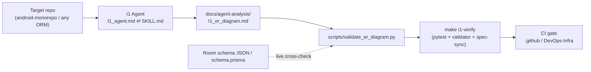

# I1 — Repository ER Diagram Agent

Reconstruct the **complete, evidence-backed data model** of a repository from source alone —
ORM entities, exported schemas, and migrations — and emit a fully-cited Entity-Relationship
diagram. The reference run targets **`android-monorepo`** (Android Room): **27 tables across 2
databases, 0 foreign keys**.

This task ships the agent spec, the produced artifact, a **reproducible validator** that proves
the artifact is internally consistent (and optionally cross-checks it against the live schema),
a Prisma fixture proving the validator generalizes, and CI wiring.

---

## Purpose

| Question a newcomer asks | Where this task answers it |
|---|---|
| What does the app store on-device? | `docs/agent-analysis/I1_er_diagram.md` §1 Entity Inventory (+ sensitivity) |
| How is each table keyed? | §2 Primary Keys · §1.1 `@Database` registration |
| How do tables relate? | §3 Foreign Keys (**NOT FOUND**) · §4 Mermaid (INFERRED soft links only) |
| Can I trust the numbers? | §6 Reconciliation · §7 Agent-vs-Verified · §8 Self-Consistency · `VERIFICATION_RESULTS.md` |
| Does it still hold after a schema change? | `make i1-verify` (CI-gated) |

---

## Architecture



---

## Folder Structure

```text
Intermediate/er-diagram/
├── I1_agent.md                       # agent spec — THIN WRAPPER (canonical = skill)
├── I1_er_diagram.md                  # stub → docs/agent-analysis/I1_er_diagram.md
├── README.md                         # this file
├── VERIFICATION_RESULTS.md           # real captured pytest/validator output
├── validation.config.json            # expected counts + artifact path + live-schema paths
├── pytest.ini
├── requirements.txt                  # pytest>=8.0 (stdlib-only validator)
├── docs/agent-analysis/
│   └── I1_er_diagram.md              # THE ARTIFACT (§1–§10, Appendix A)
├── scripts/
│   ├── validate_er_diagram.py        # offline + live + prisma validator
│   └── check_spec_sync.sh            # fails if agent spec drifts from skill
└── tests/
    ├── test_validate_er_diagram.py   # 19 tests
    └── fixtures/
        ├── mini_schema.json          # 2-table Room schema (offline live-mode test)
        └── prisma-sample/            # User/Post/Tag — 1 verified FK (W19)
            ├── schema.prisma
            └── expected_fk_count.json
```

---

## How to run the agent

The agent is a prompt spec, not a script. The **canonical** copy is
`skills/tasks-er-diagram/SKILL.md`; `I1_agent.md` is a kept-in-sync wrapper.

1. Point the agent at a repository (it auto-detects the persistence stack — Room, JPA, Prisma,
   Django, Sequelize, GORM, …).
2. It prefers exported schema artifacts (Room `schemas/*.json`, `schema.rb`, `schema.prisma`),
   reconciles three independent counts, and labels every claim **VERIFIED** or **INFERRED**.
3. Output is written to `docs/agent-analysis/I1_er_diagram.md`.

---

## How to verify

From the **repo root** (one command — venv, deps, tests, validator, Prisma, spec-sync):

```bash
make i1-verify
```

Or directly in this folder:

```bash
cd Intermediate/er-diagram
python3 -m venv .venv && source .venv/bin/activate
pip install -r requirements.txt

python -m pytest -v                              # 19 tests
python scripts/validate_er_diagram.py            # offline internal-consistency gate
bash scripts/check_spec_sync.sh                  # agent spec ⇄ skill drift guard
```

Optional **live** cross-check against the real Room export (requires `android-monorepo`):

```bash
python scripts/validate_er_diagram.py \
  --schema-json <…>/common-database/schemas/com.paytmmoney.equity_database.EquityDatabase/19.json
```

Optional **Prisma** generalizability check:

```bash
python scripts/validate_er_diagram.py --stack prisma --prisma tests/fixtures/prisma-sample/schema.prisma
```

The validator works **offline** by default (no checkout of the target repo needed) and exits
non-zero with a human-readable diff on any failure.

---

## Outputs

- **`docs/agent-analysis/I1_er_diagram.md`** — the artifact: entity inventory (with PII/Financial/
  Diagnostic sensitivity), primary keys, foreign keys, `@Database` registration, TypeConverter/
  Embedded audit, multi-line Mermaid ER diagram, DAO inventory, reconciliation cross-check,
  agent-vs-verified ledger, self-consistency check, known uncertainties, and a full column appendix.
- **`VERIFICATION_RESULTS.md`** — captured terminal evidence + a 27/27 per-entity checklist.

---

## Example target — `android-monorepo` (Android Room)

| Metric | Value |
|---|---|
| Databases | 2 — `EquityDatabase` (v19), `LoggingDataBase` (v7) |
| Tables | **27** (24 equity + 3 logging) |
| Foreign keys | **0** — `@ForeignKey`/`ForeignKey(` grep = 0; schema `foreignKeys` empty |
| Type converters | `Converters.kt` (`List<String>` ⇆ JSON `TEXT`) |
| Embedded objects | none (`@Embedded` = 0) |
| Flutter (`pml-flutter`) | no relational DB; `shared_preferences` (key-value) only |
| PII tables | 1 — `personal_details` (email, mobile, name) |

A cache-style mobile DB with **no DB-level referential integrity** is a valid, important finding —
the artifact reports it honestly and renders only clearly-labeled INFERRED shared-key links.

---

## Related

- **Canonical agent spec:** `skills/tasks-er-diagram/SKILL.md`
- **Agent wrapper:** [`I1_agent.md`](I1_agent.md)
- **Artifact:** [`docs/agent-analysis/I1_er_diagram.md`](docs/agent-analysis/I1_er_diagram.md)
- **Verification evidence:** [`VERIFICATION_RESULTS.md`](VERIFICATION_RESULTS.md)
- **CI snippet:** [`.github-workflow-snippet.yml`](.github-workflow-snippet.yml)
