# I1 — Entity-Relationship Diagram: android-monorepo

> Generated by the I1 Repository ER Diagram Agent. Stack: **Android Room** (SQLite local cache).
> Authoritative schema source: exported Room `schemas/**/*.json` (highest version per database).

## Provenance

| Field | Value |
|---|---|
| **Generated** | 2026-06-21 |
| **Target repo** | `android-monorepo` (modules: `common-database`, `api_failure_logging`) |
| **Stack** | Android Room over SQLite (on-device cache of server data) |
| **Schema versions** | `EquityDatabase` **v19**, `LoggingDataBase` **v7** (highest exported per DB) |
| **Agent spec** | `skills/tasks-er-diagram/SKILL.md` (canonical) ⇆ `I1_agent.md` (wrapper, kept in sync by `scripts/check_spec_sync.sh`) |
| **Validator** | `scripts/validate_er_diagram.py` — **PASS** (see `VERIFICATION_RESULTS.md`) |
| **Entity count** | **27** = 24 (`EquityDatabase`) + 3 (`LoggingDataBase`) |
| **Database count** | 2 (`equity`, `logging`) — isolated SQLite files, no cross-DB references |
| **Explicit foreign keys** | **NOT FOUND (0)** — `@ForeignKey` / `ForeignKey(` grep returns 0 matches; schema JSON `foreignKeys` arrays empty |
| **Type converters** | **FOUND** — `Converters.kt` (`List<String>` ⇆ JSON), registered on `EquityDatabase` (see §3.1) |
| **Embedded objects** | **NOT FOUND (0)** — `@Embedded` grep returns 0 matches |

---

## 1. Entity Inventory

`Sensitivity` legend: **PII** (personally identifiable), **Financial** (money/holdings/P&L), **Diagnostic** (telemetry/logs), **None** (reference/config/UI cache).

| Entity | Table | Sensitivity | File Path | Verification |
|---|---|---|---|---|
| PopularSearch | `popular_search` | None | `common-database/src/main/java/com/paytmmoney/equity_database/search/PopularSearch.kt` | VERIFIED — `common-database/schemas/com.paytmmoney.equity_database.EquityDatabase/19.json` PK=['id'], autoGenerate=True |
| MostInvestedStock | `most_invested_stocks` | None | `common-database/src/main/java/com/paytmmoney/equity_database/search/MostInvestedStock.kt` | VERIFIED — `common-database/schemas/com.paytmmoney.equity_database.EquityDatabase/19.json` PK=['id'], autoGenerate=True |
| RecentSearch | `recent_search` | None | `common-database/src/main/java/com/paytmmoney/equity_database/search/RecentSearch.kt` | VERIFIED — `common-database/schemas/com.paytmmoney.equity_database.EquityDatabase/19.json` PK=['stock_id'], autoGenerate=False |
| EquityConfig | `equity_config` | None | `common-database/src/main/java/com/paytmmoney/equity_database/config/EquityConfig.kt` | VERIFIED — `common-database/schemas/com.paytmmoney.equity_database.EquityDatabase/19.json` PK=['id'], autoGenerate=True |
| PersonalDetails | `personal_details` | PII | `common-database/src/main/java/com/paytmmoney/equity_database/userDetails/PersonalDetails.kt` | VERIFIED — `common-database/schemas/com.paytmmoney.equity_database.EquityDatabase/19.json` PK=['userId'], autoGenerate=False |
| RecentlyViewed | `recently_viewed` | None | `common-database/src/main/java/com/paytmmoney/equity_database/recentlyviewed/RecentlyViewed.kt` | VERIFIED — `common-database/schemas/com.paytmmoney.equity_database.EquityDatabase/19.json` PK=['stock_id'], autoGenerate=False |
| HomeShortCut | `home_shortcut` | None | `common-database/src/main/java/com/paytmmoney/equity_database/homeshortcutdb/HomeShortCut.kt` | VERIFIED — `common-database/schemas/com.paytmmoney.equity_database.EquityDatabase/19.json` PK=['screen_name'], autoGenerate=False |
| SleekCardDetails | `sleek_card_details` | None | `common-database/src/main/java/com/paytmmoney/equity_database/sleekcard/SleekCardDetails.kt` | VERIFIED — `common-database/schemas/com.paytmmoney.equity_database.EquityDatabase/19.json` PK=['id'], autoGenerate=False |
| AdvancedChartTypes | `advanced_chart_types` | None | `common-database/src/main/java/com/paytmmoney/equity_database/chartconfigs/advancedcharttypes/AdvancedChartTypes.kt` | VERIFIED — `common-database/schemas/com.paytmmoney.equity_database.EquityDatabase/19.json` PK=['id'], autoGenerate=True |
| ChartTypes | `chart_types` | None | `common-database/src/main/java/com/paytmmoney/equity_database/chartconfigs/chartTypes/ChartTypes.kt` | VERIFIED — `common-database/schemas/com.paytmmoney.equity_database.EquityDatabase/19.json` PK=['id'], autoGenerate=True |
| YAxisScale | `y_axis_scale` | None | `common-database/src/main/java/com/paytmmoney/equity_database/chartconfigs/yaxisscale/YAxisScale.kt` | VERIFIED — `common-database/schemas/com.paytmmoney.equity_database.EquityDatabase/19.json` PK=['id'], autoGenerate=True |
| Indicators | `indicators` | None | `common-database/src/main/java/com/paytmmoney/equity_database/chartconfigs/indicators/Indicators.kt` | VERIFIED — `common-database/schemas/com.paytmmoney.equity_database.EquityDatabase/19.json` PK=['id'], autoGenerate=True |
| TimeIntervals | `time_intervals` | None | `common-database/src/main/java/com/paytmmoney/equity_database/chartconfigs/timeIntervals/TimeIntervals.kt` | VERIFIED — `common-database/schemas/com.paytmmoney.equity_database.EquityDatabase/19.json` PK=['id'], autoGenerate=True |
| FnoRanges | `fno_ranges` | None | `common-database/src/main/java/com/paytmmoney/equity_database/chartconfigs/ranges/fno/FnoRanges.kt` | VERIFIED — `common-database/schemas/com.paytmmoney.equity_database.EquityDatabase/19.json` PK=['id'], autoGenerate=True |
| EquityRanges | `equity_ranges` | None | `common-database/src/main/java/com/paytmmoney/equity_database/chartconfigs/ranges/equity/EquityRanges.kt` | VERIFIED — `common-database/schemas/com.paytmmoney.equity_database.EquityDatabase/19.json` PK=['id'], autoGenerate=True |
| PortfolioEntity | `portfolio_details` | Financial | `common-database/src/main/java/com/paytmmoney/equity_database/homedashboard/portfolio/PortfolioEntity.kt` | VERIFIED — `common-database/schemas/com.paytmmoney.equity_database.EquityDatabase/19.json` PK=['type'], autoGenerate=False |
| CommonEntity | `common_details` | Financial | `common-database/src/main/java/com/paytmmoney/equity_database/homedashboard/common/CommonEntity.kt` | VERIFIED — `common-database/schemas/com.paytmmoney.equity_database.EquityDatabase/19.json` PK=['type'], autoGenerate=False |
| EquityRealisedDetail | `equity_realised_detail` | Financial | `common-database/src/main/java/com/paytmmoney/equity_database/pnL/EquityRealisedDetail.kt` | VERIFIED — `common-database/schemas/com.paytmmoney.equity_database.EquityDatabase/19.json` PK=['id'], autoGenerate=True |
| EquityRealisedSummary | `equity_realised_summary` | Financial | `common-database/src/main/java/com/paytmmoney/equity_database/pnL/EquityRealisedSummary.kt` | VERIFIED — `common-database/schemas/com.paytmmoney.equity_database.EquityDatabase/19.json` PK=['id'], autoGenerate=True |
| FnoRealisedDetail | `fno_realised_detail` | Financial | `common-database/src/main/java/com/paytmmoney/equity_database/pnL/FnoRealisedDetail.kt` | VERIFIED — `common-database/schemas/com.paytmmoney.equity_database.EquityDatabase/19.json` PK=['id'], autoGenerate=True |
| FnoRealisedSummary | `fno_realised_summary` | Financial | `common-database/src/main/java/com/paytmmoney/equity_database/pnL/FnoRealisedSummary.kt` | VERIFIED — `common-database/schemas/com.paytmmoney.equity_database.EquityDatabase/19.json` PK=['id'], autoGenerate=True |
| NotificationEntity | `pml_notification` | None | `common-database/src/main/java/com/paytmmoney/equity_database/notificationcenter/NotificationEntity.kt` | VERIFIED — `common-database/schemas/com.paytmmoney.equity_database.EquityDatabase/19.json` PK=['id'], autoGenerate=True |
| MtfScrips | `mtf_scrips` | Financial | `common-database/src/main/java/com/paytmmoney/equity_database/mtf/MtfScrips.kt` | VERIFIED — `common-database/schemas/com.paytmmoney.equity_database.EquityDatabase/19.json` PK=['id'], autoGenerate=True |
| KycStatusEntity | `kyc_status_data` | None | `common-database/src/main/java/com/paytmmoney/equity_database/kyc/KycStatusEntity.kt` | VERIFIED — `common-database/schemas/com.paytmmoney.equity_database.EquityDatabase/19.json` PK=['id'], autoGenerate=True |
| ApiFailureLog | `api_failure_logging` | Diagnostic | `api_failure_logging/src/main/java/com/paytmmoney/api_failure_logging/database/ApiFailureLog.kt` | VERIFIED — `api_failure_logging/schemas/com.paytmmoney.api_failure_logging.database.LoggingDataBase/7.json` PK=['id'], autoGenerate=True |
| ApiResponseTimeLog | `api_response_time` | Diagnostic | `api_failure_logging/src/main/java/com/paytmmoney/api_failure_logging/database/timelogger/ApiResponseTimeLog.kt` | VERIFIED — `api_failure_logging/schemas/com.paytmmoney.api_failure_logging.database.LoggingDataBase/7.json` PK=['id'], autoGenerate=True |
| WhiteListURLDBObj | `whitelist_url_tab` | Diagnostic | `api_failure_logging/src/main/java/com/paytmmoney/api_failure_logging/database/errorMessage/WhiteListURLDBObj.kt` | VERIFIED — `api_failure_logging/schemas/com.paytmmoney.api_failure_logging.database.LoggingDataBase/7.json` PK=['id'], autoGenerate=True |

**Databases:** 2 (`equity` — `EquityDatabase` v19, 24 tables; `logging` — `LoggingDataBase` v7, 3 tables).

**Sensitivity rollup:** PII 1 (`personal_details`) · Financial 7 (`portfolio_details`, `common_details`, `equity_realised_detail`, `equity_realised_summary`, `fno_realised_detail`, `fno_realised_summary`, `mtf_scrips`) · Diagnostic 3 (logging DB) · None 16. **`personal_details` carries email, mobile_number, first_name, display_name → treat as PII at rest.**

### 1.1 @Database Registration Table

Membership is declared in each `@Database(entities=[...])` block. Lines cite the exact registration site.

| Entity Class | Database | Registered In | Line | Schema Table |
|---|---|---|---|---|
| PopularSearch | EquityDatabase v19 | `common-database/src/main/java/com/paytmmoney/equity_database/EquityDatabase.kt` | 63 | `popular_search` |
| MostInvestedStock | EquityDatabase v19 | `EquityDatabase.kt` | 63 | `most_invested_stocks` |
| RecentSearch | EquityDatabase v19 | `EquityDatabase.kt` | 63 | `recent_search` |
| EquityConfig | EquityDatabase v19 | `EquityDatabase.kt` | 63 | `equity_config` |
| PersonalDetails | EquityDatabase v19 | `EquityDatabase.kt` | 64 | `personal_details` |
| RecentlyViewed | EquityDatabase v19 | `EquityDatabase.kt` | 64 | `recently_viewed` |
| HomeShortCut | EquityDatabase v19 | `EquityDatabase.kt` | 64 | `home_shortcut` |
| SleekCardDetails | EquityDatabase v19 | `EquityDatabase.kt` | 64 | `sleek_card_details` |
| AdvancedChartTypes | EquityDatabase v19 | `EquityDatabase.kt` | 65 | `advanced_chart_types` |
| ChartTypes | EquityDatabase v19 | `EquityDatabase.kt` | 65 | `chart_types` |
| YAxisScale | EquityDatabase v19 | `EquityDatabase.kt` | 65 | `y_axis_scale` |
| Indicators | EquityDatabase v19 | `EquityDatabase.kt` | 65 | `indicators` |
| TimeIntervals | EquityDatabase v19 | `EquityDatabase.kt` | 66 | `time_intervals` |
| FnoRanges | EquityDatabase v19 | `EquityDatabase.kt` | 66 | `fno_ranges` |
| EquityRanges | EquityDatabase v19 | `EquityDatabase.kt` | 66 | `equity_ranges` |
| PortfolioEntity | EquityDatabase v19 | `EquityDatabase.kt` | 66 | `portfolio_details` |
| CommonEntity | EquityDatabase v19 | `EquityDatabase.kt` | 67 | `common_details` |
| EquityRealisedDetail | EquityDatabase v19 | `EquityDatabase.kt` | 67 | `equity_realised_detail` |
| EquityRealisedSummary | EquityDatabase v19 | `EquityDatabase.kt` | 67 | `equity_realised_summary` |
| FnoRealisedDetail | EquityDatabase v19 | `EquityDatabase.kt` | 68 | `fno_realised_detail` |
| FnoRealisedSummary | EquityDatabase v19 | `EquityDatabase.kt` | 68 | `fno_realised_summary` |
| NotificationEntity | EquityDatabase v19 | `EquityDatabase.kt` | 68 | `pml_notification` |
| MtfScrips | EquityDatabase v19 | `EquityDatabase.kt` | 69 | `mtf_scrips` |
| KycStatusEntity | EquityDatabase v19 | `EquityDatabase.kt` | 69 | `kyc_status_data` |
| ApiFailureLog | LoggingDataBase v7 | `api_failure_logging/src/main/java/com/paytmmoney/api_failure_logging/database/LoggingDataBase.kt` | 13 | `api_failure_logging` |
| ApiResponseTimeLog | LoggingDataBase v7 | `LoggingDataBase.kt` | 13 | `api_response_time` |
| WhiteListURLDBObj | LoggingDataBase v7 | `LoggingDataBase.kt` | 13 | `whitelist_url_tab` |

`EquityDatabase.kt` declares `@Database(entities = [...], version = 19, exportSchema = true)` across lines 61–72 (24 `::class` tokens, lines 63–69). `LoggingDataBase.kt` declares 3 entities on line 13, `version = 7`.

### 1.2 Flutter Storage Analysis (`flutter/pml-flutter`)

The Flutter module is checked for any on-device relational/persistent store. Manifest of record: `flutter/pml-flutter/pubspec.yaml` (51 dependencies); usage confirmed by `package:` imports under `lib/`.

| Storage type | Kind | Found | Evidence |
|---|---|---|---|
| `drift` (ex-moor) | Relational | No | No `drift:` in `pubspec.yaml`; no `package:drift` import in `lib/` |
| `floor` | Relational | No | No `floor:` in `pubspec.yaml`; no `package:floor` import |
| `sqflite` | Relational | No | No `sqflite:` in `pubspec.yaml`; no `package:sqflite` import |
| `isar` | NoSQL/object | No | No `isar:` in `pubspec.yaml`; no `package:isar` import |
| `hive` | Key-value/object | No | No `hive:` in `pubspec.yaml`; no `package:hive` import |
| `flutter_secure_storage` | Secure key-value | No | No `flutter_secure_storage:` in `pubspec.yaml` |
| `shared_preferences` | Key-value (non-relational) | **Yes** | `package:shared_preferences/shared_preferences.dart` imported in 2 files (`lib/features/pml_orderpad/core/utils/order_state_manager.dart:9`, `lib/features/research_ideas/data/datasources/local/rs_ideas_local_data_source.dart:5`) |

**Conclusion:** **NO relational database in the Flutter layer.** `shared_preferences` is the only on-device store and holds key-value pairs (not tables/PKs/FKs), so it contributes no ER entities. The relational model lives entirely in the native Room databases above.

## 2. Primary Keys

| Entity | PK | Source |
|---|---|---|
| PopularSearch | `id` (AUTOINCREMENT) | `common-database/schemas/com.paytmmoney.equity_database.EquityDatabase/19.json` `primaryKey.columnNames` |
| MostInvestedStock | `id` (AUTOINCREMENT) | `common-database/schemas/com.paytmmoney.equity_database.EquityDatabase/19.json` `primaryKey.columnNames` |
| RecentSearch | `stock_id` | `common-database/schemas/com.paytmmoney.equity_database.EquityDatabase/19.json` `primaryKey.columnNames` |
| EquityConfig | `id` (AUTOINCREMENT) | `common-database/schemas/com.paytmmoney.equity_database.EquityDatabase/19.json` `primaryKey.columnNames` |
| PersonalDetails | `userId` | `common-database/schemas/com.paytmmoney.equity_database.EquityDatabase/19.json` `primaryKey.columnNames` |
| RecentlyViewed | `stock_id` | `common-database/schemas/com.paytmmoney.equity_database.EquityDatabase/19.json` `primaryKey.columnNames` |
| HomeShortCut | `screen_name` | `common-database/schemas/com.paytmmoney.equity_database.EquityDatabase/19.json` `primaryKey.columnNames` |
| SleekCardDetails | `id` | `common-database/schemas/com.paytmmoney.equity_database.EquityDatabase/19.json` `primaryKey.columnNames` |
| AdvancedChartTypes | `id` (AUTOINCREMENT) | `common-database/schemas/com.paytmmoney.equity_database.EquityDatabase/19.json` `primaryKey.columnNames` |
| ChartTypes | `id` (AUTOINCREMENT) | `common-database/schemas/com.paytmmoney.equity_database.EquityDatabase/19.json` `primaryKey.columnNames` |
| YAxisScale | `id` (AUTOINCREMENT) | `common-database/schemas/com.paytmmoney.equity_database.EquityDatabase/19.json` `primaryKey.columnNames` |
| Indicators | `id` (AUTOINCREMENT) | `common-database/schemas/com.paytmmoney.equity_database.EquityDatabase/19.json` `primaryKey.columnNames` |
| TimeIntervals | `id` (AUTOINCREMENT) | `common-database/schemas/com.paytmmoney.equity_database.EquityDatabase/19.json` `primaryKey.columnNames` |
| FnoRanges | `id` (AUTOINCREMENT) | `common-database/schemas/com.paytmmoney.equity_database.EquityDatabase/19.json` `primaryKey.columnNames` |
| EquityRanges | `id` (AUTOINCREMENT) | `common-database/schemas/com.paytmmoney.equity_database.EquityDatabase/19.json` `primaryKey.columnNames` |
| PortfolioEntity | `type` | `common-database/schemas/com.paytmmoney.equity_database.EquityDatabase/19.json` `primaryKey.columnNames` |
| CommonEntity | `type` | `common-database/schemas/com.paytmmoney.equity_database.EquityDatabase/19.json` `primaryKey.columnNames` |
| EquityRealisedDetail | `id` (AUTOINCREMENT) | `common-database/schemas/com.paytmmoney.equity_database.EquityDatabase/19.json` `primaryKey.columnNames` |
| EquityRealisedSummary | `id` (AUTOINCREMENT) | `common-database/schemas/com.paytmmoney.equity_database.EquityDatabase/19.json` `primaryKey.columnNames` |
| FnoRealisedDetail | `id` (AUTOINCREMENT) | `common-database/schemas/com.paytmmoney.equity_database.EquityDatabase/19.json` `primaryKey.columnNames` |
| FnoRealisedSummary | `id` (AUTOINCREMENT) | `common-database/schemas/com.paytmmoney.equity_database.EquityDatabase/19.json` `primaryKey.columnNames` |
| NotificationEntity | `id` (AUTOINCREMENT) | `common-database/schemas/com.paytmmoney.equity_database.EquityDatabase/19.json` `primaryKey.columnNames` |
| MtfScrips | `id` (AUTOINCREMENT) | `common-database/schemas/com.paytmmoney.equity_database.EquityDatabase/19.json` `primaryKey.columnNames` |
| KycStatusEntity | `id` (AUTOINCREMENT) | `common-database/schemas/com.paytmmoney.equity_database.EquityDatabase/19.json` `primaryKey.columnNames` |
| ApiFailureLog | `id` (AUTOINCREMENT) | `api_failure_logging/schemas/com.paytmmoney.api_failure_logging.database.LoggingDataBase/7.json` `primaryKey.columnNames` |
| ApiResponseTimeLog | `id` (AUTOINCREMENT) | `api_failure_logging/schemas/com.paytmmoney.api_failure_logging.database.LoggingDataBase/7.json` `primaryKey.columnNames` |
| WhiteListURLDBObj | `id` (AUTOINCREMENT) | `api_failure_logging/schemas/com.paytmmoney.api_failure_logging.database.LoggingDataBase/7.json` `primaryKey.columnNames` |

## 3. Foreign Keys

**NOT FOUND IN REPOSITORY**

Evidence: repo-wide grep for `@ForeignKey`, `ForeignKey(` returned **0 matches** across `*.kt`/`*.java` in `common-database` and `api_failure_logging`.
Room schema JSON v19 and v7 contain **no `foreignKeys` arrays** on any entity.

| Source Table | Target Table | Column(s) | Cascade | Source File | Verification |
|---|---|---|---|---|---|
| — | — | — | — | — | NOT FOUND IN REPOSITORY |

### Notable Indices (non-FK)

| Table | Index | Unique | Columns | Source |
|---|---|---|---|---|
| `kyc_status_data` | `index_kyc_status_data_moduleName_irStatus_subType` | yes | `moduleName`, `irStatus`, `subType` | `common-database/schemas/com.paytmmoney.equity_database.EquityDatabase/19.json` — VERIFIED |

### 3.1 TypeConverters / Embedded Audit

| Marker | Grep command | Matches | Status | Evidence |
|---|---|---|---|---|
| `@TypeConverter` (method-level) | `grep -rn "@TypeConverter" --include="*.kt" common-database api_failure_logging` | 11 | **FOUND** | `common-database/src/main/java/com/paytmmoney/equity_database/config/Converters.kt:9,28` define `fromString`/`fromArrayList`; per-getter on `common-database/src/main/java/com/paytmmoney/equity_database/config/EquityConfig.kt` (lines 21–36) |
| `@TypeConverters` (registration) | `grep -rn "@TypeConverters" --include="*.kt" common-database api_failure_logging` | 9 | **FOUND** | `EquityDatabase.kt:74 @TypeConverters(Converters::class)`; also on `EquityConfig.kt`, `common-database/src/main/java/com/paytmmoney/equity_database/config/EquityConfigDao.kt:15`, `common-database/src/main/java/com/paytmmoney/equity_database/homedashboard/common/CommonDAO.kt:15` |
| `@Embedded` / `Embedded(` | `grep -rn "@Embedded\|Embedded(" --include="*.kt" common-database api_failure_logging` | 0 | **NOT FOUND IN REPOSITORY** | No embedded value objects; all columns are flat scalar columns |

**Converter behaviour (`Converters.kt`):** `fromString(String?) → List<String>` (Gson `fromJson`, empty-safe) and `fromArrayList(List<String>) → String` (Gson `toJson`). Effect: `List<String>` fields are persisted as JSON-encoded `TEXT` columns (a `TEXT`-backed list, not a related table). This is why `equity_config` order-type columns (`delivery_orders`, `intraday_orders`, …) are `TEXT` in the schema JSON. **No converter introduces a new table or relationship.**

## 4. Mermaid ER Diagram

Two isolated Room databases; no VERIFIED FK edges. Dashed-style labels denote **INFERRED** soft links via shared business keys. All 27 entities are rendered as standalone, multi-line entity blocks.

```mermaid
erDiagram
    %% ── Database: equity (EquityDatabase v19) ──
    personal_details {
        TEXT userId PK
        TEXT email
        TEXT mobile_number
    }
    recent_search {
        TEXT stock_id PK
        TEXT isin
        TEXT symbol
        INTEGER created_at
    }
    recently_viewed {
        TEXT stock_id PK
        TEXT isin
        INTEGER created_at
    }
    popular_search {
        INTEGER id PK
        TEXT stock_id
        TEXT isin
    }
    most_invested_stocks {
        INTEGER id PK
        TEXT stock_id
        TEXT isin
    }
    equity_config {
        INTEGER id PK
        TEXT exchange
        TEXT segment
    }
    portfolio_details {
        TEXT type PK
        REAL currentValue
        REAL investedValue
    }
    common_details {
        TEXT type PK
        TEXT data
    }
    equity_realised_summary {
        INTEGER id PK
        TEXT isin
        TEXT scriptName
    }
    equity_realised_detail {
        INTEGER id PK
        TEXT isin
        TEXT scriptName
    }
    fno_realised_summary {
        INTEGER id PK
        TEXT isin
    }
    fno_realised_detail {
        INTEGER id PK
        TEXT isin
    }
    pml_notification {
        INTEGER id PK
        INTEGER is_read
        TEXT deepLink
    }
    mtf_scrips {
        INTEGER id PK
        TEXT scripId
        TEXT exchange
    }
    kyc_status_data {
        INTEGER id PK
        TEXT moduleName
        TEXT irStatus
    }
    home_shortcut {
        TEXT screen_name PK
        INTEGER last_visited_timestamp
    }
    sleek_card_details {
        TEXT id PK
        TEXT message
    }
    chart_types {
        INTEGER id PK
        TEXT label
        TEXT value
    }
    advanced_chart_types {
        INTEGER id PK
        TEXT label
        TEXT value
    }
    y_axis_scale {
        INTEGER id PK
        TEXT label
        TEXT value
    }
    indicators {
        INTEGER id PK
        TEXT label
        TEXT value
    }
    time_intervals {
        INTEGER id PK
        TEXT label
        TEXT value
    }
    fno_ranges {
        INTEGER id PK
        TEXT label
        TEXT value
    }
    equity_ranges {
        INTEGER id PK
        TEXT label
        TEXT value
    }

    %% ── Database: logging (LoggingDataBase v7) ──
    api_failure_logging {
        INTEGER id PK
        TEXT key
        TEXT page
        INTEGER apiResponseTime
    }
    api_response_time {
        INTEGER id PK
        TEXT key
        TEXT page
        INTEGER time
    }
    whitelist_url_tab {
        INTEGER id PK
        TEXT urlPart
        TEXT moduleName
    }

    %% ── INFERRED soft links (shared business keys; NO DB-level FK) ──
    recent_search }o..o{ recently_viewed : "INFERRED shared stock_id"
    popular_search }o..o{ recent_search : "INFERRED shared stock_id/isin"
    most_invested_stocks }o..o{ popular_search : "INFERRED shared stock_id/isin"
    equity_realised_summary ||..o{ equity_realised_detail : "INFERRED shared isin"
    fno_realised_summary ||..o{ fno_realised_detail : "INFERRED shared isin"
    mtf_scrips }o..o{ recent_search : "INFERRED scripId ~ stock_id"
    api_failure_logging }o..o{ api_response_time : "INFERRED shared key/page"
```

## 5. Data Model Summary

### Core entities

- **`personal_details`** — cached logged-in user profile (`userId` PK). Evidence: `EquityDatabase.kt` entity list + schema v19. **Only PII table.**

- **Stock/search cache cluster** — `recent_search`, `recently_viewed`, `popular_search`, `most_invested_stocks` store denormalized instrument snapshots keyed by `stock_id` and/or auto `id`. Evidence: identical column shapes in schema v19 `createSql`.

- **Home dashboard cache** — `portfolio_details` and `common_details` are type-keyed JSON/value blobs for dashboard widgets.

- **PnL cache** — `equity_realised_*` and `fno_realised_*` tables cache realised P&L summary/detail rows from backend.

- **Logging DB** — `api_failure_logging`, `api_response_time`, `whitelist_url_tab` for diagnostics (separate SQLite file `logging`).

### Relationship hotspots

- **Stock identity columns** (`stock_id`, `isin`, `security_id`, `symbol`) appear across 5+ equity tables without FK enforcement — application-layer joins only.

- **PnL detail/summary pairs** share `isin` + `scriptName` shape but no parent-child FK.

- **Chart config lookup tables** (7 tables with `label`/`value` pattern) are independent reference data.

### Potential issues

1. **No foreign keys anywhere** — orphan rows possible; referential integrity is not enforced at DB level (typical mobile cache pattern).

2. **Denormalized stock snapshots** — same instrument metadata duplicated across search/viewed/popular tables; updates can drift.

3. **Mixed PK strategies** — some tables use natural keys (`stock_id`, `userId`, `type`, `screen_name`) while others use auto-increment `id`; complicates cross-table linking.

4. **`mtf_scrips.scripId` vs `stock_id`** — naming mismatch; relationship to search tables is INFERRED only.

5. **JSON-in-TEXT columns** — `equity_config` order-type fields (via `Converters`), `common_details.data` store serialized structures; schema does not document JSON shape.

6. **No soft-delete columns** — tables use hard replace/delete patterns (no universal `deleted_at`).

7. **Schema version gap** — exported versions jump (e.g. no `15.json` in `schemas/`); current head is v19 for equity, v7 for logging.

---

## 6. Reconciliation Cross-Check

The three independent counts (entity classes ⇆ `@Database` registration ⇆ exported schema) must agree per database, or an entity was missed. All commands run from `android-monorepo/android-monorepo/`.

| Source | Count | Evidence File / Command |
|---|---|---|
| `@Entity` classes in equity module | 24 | `grep -rl "@Entity" common-database/src/main/java/com/paytmmoney/equity_database \| wc -l` → `24` |
| `@Database(entities=[...])` `EquityDatabase` | 24 | `common-database/src/main/java/com/paytmmoney/equity_database/EquityDatabase.kt` lines 63–69 — 24 `::class` tokens registered |
| Schema JSON tables `EquityDatabase` v19 | 24 | `common-database/schemas/com.paytmmoney.equity_database.EquityDatabase/19.json` → `len(database.entities) = 24` |
| `@Entity` classes in logging module | 3 | `grep -rl "@Entity" api_failure_logging/src/main/java \| wc -l` → `3` |
| `@Database(entities=[...])` `LoggingDataBase` | 3 | `api_failure_logging/src/main/java/com/paytmmoney/api_failure_logging/database/LoggingDataBase.kt` line 13 — `ApiFailureLog`, `ApiResponseTimeLog`, `WhiteListURLDBObj` |
| Schema JSON tables `LoggingDataBase` v7 | 3 | `api_failure_logging/schemas/com.paytmmoney.api_failure_logging.database.LoggingDataBase/7.json` → `len(database.entities) = 3` |
| **Total** | **27** | **PASS** — equity 24 + logging 3 = 27; all three counts agree per DB |

Cross-check vs this artifact: §1 inventory rows = 27 · §2 PK rows = 27 · §4 Mermaid entity blocks = 27 · §10 DAO rows = 27 · Appendix A entity blocks = 27. **All equal 27.**

## 7. Agent-Generated vs Verified

Every material claim is labelled by how it was established. **Verified** = read directly from an authoritative source file (schema JSON, `@Database` block, grep over the repo). **Agent-Generated** = synthesised/interpreted by the agent (naming-based inference, classification, summary judgement).

| # | Claim | Label | Verification Method |
|---|---|---|---|
| 1 | 27 tables total across 2 databases | Verified | Schema JSON entity counts (24 + 3) + `@Database` blocks |
| 2 | `EquityDatabase` is at schema version 19 | Verified | `19.json` `database.version = 19`; `EquityDatabase.kt:71 version = 19` |
| 3 | `LoggingDataBase` is at schema version 7 | Verified | `7.json` `database.version = 7`; `LoggingDataBase.kt:14 version = 7` |
| 4 | Each entity's table name + PK | Verified | `19.json` / `7.json` `tableName` + `primaryKey.columnNames` |
| 5 | No explicit foreign keys exist | Verified | `grep "@ForeignKey\|ForeignKey("` = 0 matches; schema `foreignKeys` arrays empty |
| 6 | Unique index on `kyc_status_data` (moduleName, irStatus, subType) | Verified | `19.json` `indices[]` entry |
| 7 | `personal_details` holds PII (email, mobile, name) | Verified | Appendix A columns from `19.json` `createSql` |
| 8 | TypeConverters exist (`List<String>` ⇆ JSON) | Verified | `Converters.kt:9,28`; `EquityDatabase.kt:74` registration |
| 9 | No `@Embedded` value objects | Verified | `grep "@Embedded"` = 0 matches |
| 10 | Each entity has a dedicated DAO | Verified | `EquityDatabase.kt:76–99` + `LoggingDataBase.kt:18–20` abstract DAO getters; 24+3 `@Dao` files |
| 11 | Flutter layer has no relational DB | Verified | `pubspec.yaml` has no drift/floor/sqflite/isar/hive; only `shared_preferences` imported (key-value) |
| 12 | `recent_search` ↔ `recently_viewed` share `stock_id` | Inferred | Same column name/type across tables; **no FK** — naming-based soft link |
| 13 | `equity_realised_summary` → `equity_realised_detail` is summary/detail | Inferred | Shared `isin`/`scriptName` shape; no parent-child FK in schema |
| 14 | `mtf_scrips.scripId` relates to search `stock_id` | Inferred | Naming similarity only; column names differ (`scripId` vs `stock_id`) |
| 15 | `api_failure_logging` ↔ `api_response_time` share `key`/`page` | Inferred | Shared column names; no FK |
| 16 | Sensitivity classification (PII/Financial/Diagnostic/None) | Agent-Generated | Judgement over Appendix A column semantics (e.g. P&L/price → Financial) |
| 17 | "Denormalized stock snapshots can drift" risk | Agent-Generated | Interpretation of duplicated instrument columns across cache tables |
| 18 | "Schema version gap" (missing intermediate `*.json`) | Verified (observation) | directory listing of the `EquityDatabase` schema folder shows non-contiguous versions (e.g. `7.json`, `17.json`, `19.json`; no `15.json`); head is v19 |
| 19 | `common_details`/`equity_config` store JSON-in-TEXT | Verified | `Converters.kt` JSON encoding + `TEXT` column types in schema JSON |

## 8. Self-Consistency Check

- **Entity counts agree across sections:** §1 inventory (27) = §2 PKs (27) = §1.1 registration (27) = §4 Mermaid blocks (27) = §10 DAOs (27) = Appendix A blocks (27) = reconciliation total (27).
- **Per-DB split is consistent:** 24 equity + 3 logging everywhere it appears (§1, §6, Appendix A).
- **INFERRED edges reference existing columns only:** every soft link in §4 cites a column present in Appendix A for both endpoints (`stock_id`, `isin`, `scriptName`, `key`, `page`, `scripId`). No edge references a non-existent column.
- **No FK contradictions:** §3 declares 0 FKs; §4 renders 0 solid (VERIFIED) relationship edges — only dashed INFERRED links. Provenance header, §3, and §7 row 5 all agree on "0 explicit FKs".
- **PK consistency:** every PK in §2 matches the `PK`-marked attribute for that table in §4 and the `primaryKey` in Appendix A.
- **Sensitivity rollup sums to 27:** PII 1 + Financial 7 + Diagnostic 3 + None 16 = 27.

## 9. Known Uncertainties

1. **Schema version gap (v15)** — exported `schemas/` versions are non-contiguous for `EquityDatabase` (e.g. `7.json`, `17.json`, `19.json` present; no `15.json`). v19 is the migrated ground truth used here; intermediate versions were not exported or were pruned. No impact on the current model. [Observed]

2. **`scripId` vs `stock_id`** — `mtf_scrips.scripId` and the search tables' `stock_id` are *assumed* to denote the same instrument identifier, but the column names differ and no FK/join confirms it. The §4 edge is INFERRED only. [Inferred]

3. **JSON-in-TEXT column shapes** — `equity_config` order-type fields and `common_details.data` are `TEXT` columns holding serialized JSON (via `Converters`). The internal JSON schema is not declared in Room metadata and is not reverse-engineered here. [Inferred]

4. **DAO SQL not fully traced** — each entity has a dedicated DAO (§10), but the individual `@Query` SQL bodies (joins, projections, application-level relationships) were not exhaustively read. Any application-layer join would be additional INFERRED structure beyond the DB schema. [Partial]

5. **`shared_preferences` contents** — the Flutter key-value store holds untyped key/value pairs; its keys are not enumerated and contribute no relational entities. [Out of scope]

## 10. DAO Inventory

Every entity is backed by a dedicated DAO interface, exposed as an abstract getter on its `@Database`. No entity lacks a DAO.

| DAO Interface | Entity | Key Operations | Source File (getter line in `@Database`) |
|---|---|---|---|
| RecentSearchDao | RecentSearch | insert/query/delete recent searches | `common-database/src/main/java/com/paytmmoney/equity_database/search/RecentSearchDao.kt` (`EquityDatabase.kt:76`) |
| PopularSearchDao | PopularSearch | insert/query popular searches | `common-database/src/main/java/com/paytmmoney/equity_database/search/PopularSearchDao.kt` (`EquityDatabase.kt:77`) |
| EquityConfigDao | EquityConfig | upsert/query equity config (`@TypeConverters`) | `common-database/src/main/java/com/paytmmoney/equity_database/config/EquityConfigDao.kt` (`EquityDatabase.kt:78`) |
| PersonalDetailsDao | PersonalDetails | upsert/query user profile | `common-database/src/main/java/com/paytmmoney/equity_database/userDetails/PersonalDetailsDao.kt` (`EquityDatabase.kt:79`) |
| RecentlyViewedDao | RecentlyViewed | insert/query recently viewed | `common-database/src/main/java/com/paytmmoney/equity_database/recentlyviewed/RecentlyViewedDao.kt` (`EquityDatabase.kt:80`) |
| HomeShortCutDao | HomeShortCut | upsert/query shortcuts | `common-database/src/main/java/com/paytmmoney/equity_database/homeshortcutdb/HomeShortCutDao.kt` (`EquityDatabase.kt:81`) |
| SleekCardDetailsDao | SleekCardDetails | upsert/query cards | `common-database/src/main/java/com/paytmmoney/equity_database/sleekcard/SleekCardDetailsDao.kt` (`EquityDatabase.kt:82`) |
| AdvancedChartTypesDao | AdvancedChartTypes | bulk insert/query chart types | `common-database/src/main/java/com/paytmmoney/equity_database/chartconfigs/advancedcharttypes/AdvancedChartTypesDao.kt` (`EquityDatabase.kt:83`) |
| ChartTypesDao | ChartTypes | bulk insert/query chart types | `common-database/src/main/java/com/paytmmoney/equity_database/chartconfigs/chartTypes/ChartTypesDao.kt` (`EquityDatabase.kt:84`) |
| TimeIntervalsDao | TimeIntervals | bulk insert/query intervals | `common-database/src/main/java/com/paytmmoney/equity_database/chartconfigs/timeIntervals/TimeIntervalsDao.kt` (`EquityDatabase.kt:85`) |
| YAxisScaleDao | YAxisScale | bulk insert/query scales | `common-database/src/main/java/com/paytmmoney/equity_database/chartconfigs/yaxisscale/YAxisScaleDao.kt` (`EquityDatabase.kt:86`) |
| IndicatorsDao | Indicators | bulk insert/query indicators | `common-database/src/main/java/com/paytmmoney/equity_database/chartconfigs/indicators/IndicatorsDao.kt` (`EquityDatabase.kt:87`) |
| EquityRangesDao | EquityRanges | bulk insert/query ranges | `common-database/src/main/java/com/paytmmoney/equity_database/chartconfigs/ranges/equity/EquityRangesDao.kt` (`EquityDatabase.kt:88`) |
| FnoRangesDao | FnoRanges | bulk insert/query ranges | `common-database/src/main/java/com/paytmmoney/equity_database/chartconfigs/ranges/fno/FnoRangesDao.kt` (`EquityDatabase.kt:89`) |
| MostInvestedDao | MostInvestedStock | insert/query most-invested | `common-database/src/main/java/com/paytmmoney/equity_database/search/MostInvestedDao.kt` (`EquityDatabase.kt:90`) |
| PortfolioDAO | PortfolioEntity | upsert/query portfolio (`@TypeConverters`) | `common-database/src/main/java/com/paytmmoney/equity_database/homedashboard/portfolio/PortfolioDAO.kt` (`EquityDatabase.kt:91`) |
| CommonDAO | CommonEntity | upsert/query dashboard blobs (`@TypeConverters`) | `common-database/src/main/java/com/paytmmoney/equity_database/homedashboard/common/CommonDAO.kt:15` (`EquityDatabase.kt:92`) |
| EquityRealisedDetailDao | EquityRealisedDetail | insert/query realised detail | `common-database/src/main/java/com/paytmmoney/equity_database/pnL/EquityRealisedDetailDao.kt` (`EquityDatabase.kt:93`) |
| EquityRealisedSummaryDao | EquityRealisedSummary | insert/query realised summary | `common-database/src/main/java/com/paytmmoney/equity_database/pnL/EquityRealisedSummaryDao.kt` (`EquityDatabase.kt:94`) |
| FnoRealisedDetailDao | FnoRealisedDetail | insert/query realised detail | `common-database/src/main/java/com/paytmmoney/equity_database/pnL/FnoRealisedDetailDao.kt` (`EquityDatabase.kt:95`) |
| FnoRealisedSummaryDao | FnoRealisedSummary | insert/query realised summary | `common-database/src/main/java/com/paytmmoney/equity_database/pnL/FnoRealisedSummaryDao.kt` (`EquityDatabase.kt:96`) |
| PMLNotificationDao | NotificationEntity | insert/query/mark-read notifications | `common-database/src/main/java/com/paytmmoney/equity_database/notificationcenter/PMLNotificationDao.kt` (`EquityDatabase.kt:97`) |
| MtfScripsDao | MtfScrips | insert/query MTF scrips | `common-database/src/main/java/com/paytmmoney/equity_database/mtf/MtfScripsDao.kt` (`EquityDatabase.kt:98`) |
| KycStatusDao | KycStatusEntity | upsert/query KYC status | `common-database/src/main/java/com/paytmmoney/equity_database/kyc/KycStatusDao.kt` (`EquityDatabase.kt:99`) |
| ApiFailureLogDao | ApiFailureLog | insert/query/purge failure logs | `api_failure_logging/src/main/java/com/paytmmoney/api_failure_logging/database/ApiFailureLogDao.kt` (`LoggingDataBase.kt:18`) |
| ApiResponseTimeLogDao | ApiResponseTimeLog | insert/query response-time logs | `api_failure_logging/src/main/java/com/paytmmoney/api_failure_logging/database/timelogger/ApiResponseTimeLogDao.kt` (`LoggingDataBase.kt:19`) |
| WhiteListUrlDao | WhiteListURLDBObj | insert/query whitelist URLs | `api_failure_logging/src/main/java/com/paytmmoney/api_failure_logging/database/errorMessage/WhiteListUrlDao.kt` (`LoggingDataBase.kt:20`) |

**No entity has a missing DAO** — 24 equity DAOs (`grep -rl "@Dao" common-database | wc -l` → 24) + 3 logging DAOs (→ 3) = 27, matching the 27 entities.

---

## Appendix A — Column Inventory (from schema JSON)

### EquityDatabase (`equity`) — schema v19

**PopularSearch** → `popular_search`: `id` (INTEGER, NOT NULL), `stock_id` (TEXT, NOT NULL), `company_name` (TEXT, NOT NULL), `exchange` (TEXT, NOT NULL), `security_id` (TEXT, NOT NULL), `symbol` (TEXT, NOT NULL), `instrument_type` (TEXT, NOT NULL), `expiry_display_date` (TEXT), `expiry_type` (TEXT), `segment` (TEXT, NOT NULL), `lot_size` (INTEGER), `tick_size` (REAL), `series` (TEXT, NOT NULL), `isin` (TEXT, NOT NULL)

**MostInvestedStock** → `most_invested_stocks`: `id` (INTEGER, NOT NULL), `stock_id` (TEXT, NOT NULL), `company_name` (TEXT, NOT NULL), `exchange` (TEXT, NOT NULL), `security_id` (TEXT, NOT NULL), `symbol` (TEXT, NOT NULL), `instrument_type` (TEXT, NOT NULL), `expiry_display_date` (TEXT), `expiry_type` (TEXT), `segment` (TEXT, NOT NULL), `lot_size` (INTEGER), `tick_size` (REAL), `series` (TEXT, NOT NULL), `isin` (TEXT, NOT NULL)

**RecentSearch** → `recent_search`: `stock_id` (TEXT, NOT NULL), `company_name` (TEXT, NOT NULL), `exchange` (TEXT, NOT NULL), `security_id` (TEXT, NOT NULL), `symbol` (TEXT, NOT NULL), `exch_symbol` (TEXT, NOT NULL), `segment` (TEXT, NOT NULL), `instrument_type` (TEXT, NOT NULL), `expiry_display_date` (TEXT), `expiry_type` (TEXT), `series` (TEXT, NOT NULL), `lot_size` (INTEGER), `tick_size` (REAL), `created_at` (INTEGER, NOT NULL), `isin` (TEXT, NOT NULL)

**EquityConfig** → `equity_config`: `id` (INTEGER, NOT NULL), `exchange` (TEXT, NOT NULL), `segment` (TEXT, NOT NULL), `status` (INTEGER, NOT NULL), `message` (TEXT, NOT NULL), `delivery_orders` (TEXT, NOT NULL), `intraday_orders` (TEXT, NOT NULL), `bracket_orders` (TEXT, NOT NULL), `cover_orders` (TEXT, NOT NULL), `margins` (TEXT, NOT NULL), `mtf_orders` (TEXT, NOT NULL)

**PersonalDetails** → `personal_details`: `userId` (TEXT, NOT NULL), `email` (TEXT, NOT NULL), `mobile_number` (TEXT, NOT NULL), `first_name` (TEXT, NOT NULL), `display_name` (TEXT, NOT NULL), `country_code` (TEXT, NOT NULL), `display_pic_location` (TEXT, NOT NULL)

**RecentlyViewed** → `recently_viewed`: `stock_id` (TEXT, NOT NULL), `company_name` (TEXT, NOT NULL), `exchange` (TEXT, NOT NULL), `security_id` (TEXT, NOT NULL), `symbol` (TEXT, NOT NULL), `instrument_type` (TEXT, NOT NULL), `segment` (TEXT, NOT NULL), `series` (TEXT, NOT NULL), `expiry_display_date` (TEXT), `expiry_type` (TEXT), `isin` (TEXT, NOT NULL), `lot_size` (INTEGER), `created_at` (INTEGER, NOT NULL)

**HomeShortCut** → `home_shortcut`: `screen_name` (TEXT, NOT NULL), `last_visited_timestamp` (INTEGER, NOT NULL), `last_visited_month` (INTEGER, NOT NULL), `last_visited_consecutive` (INTEGER, NOT NULL), `counter_day` (INTEGER, NOT NULL), `counter_month` (INTEGER, NOT NULL), `consecutive_counter_day` (INTEGER, NOT NULL), `to_show_card` (INTEGER, NOT NULL)

**SleekCardDetails** → `sleek_card_details`: `id` (TEXT, NOT NULL), `icon` (TEXT), `message` (TEXT), `cta_txt` (TEXT), `cta_dl` (TEXT), `start_date` (TEXT), `end_date` (TEXT), `outage` (INTEGER)

**AdvancedChartTypes** → `advanced_chart_types`: `id` (INTEGER, NOT NULL), `label` (TEXT, NOT NULL), `value` (TEXT, NOT NULL), `show_settings_icon` (INTEGER, NOT NULL)

**ChartTypes** → `chart_types`: `id` (INTEGER, NOT NULL), `label` (TEXT, NOT NULL), `value` (TEXT, NOT NULL), `icon` (TEXT, NOT NULL)

**YAxisScale** → `y_axis_scale`: `id` (INTEGER, NOT NULL), `label` (TEXT, NOT NULL), `value` (TEXT, NOT NULL)

**Indicators** → `indicators`: `id` (INTEGER, NOT NULL), `label` (TEXT, NOT NULL), `value` (TEXT, NOT NULL)

**TimeIntervals** → `time_intervals`: `id` (INTEGER, NOT NULL), `label` (TEXT, NOT NULL), `value` (TEXT, NOT NULL)

**FnoRanges** → `fno_ranges`: `id` (INTEGER, NOT NULL), `label` (TEXT, NOT NULL), `value` (TEXT, NOT NULL)

**EquityRanges** → `equity_ranges`: `id` (INTEGER, NOT NULL), `label` (TEXT, NOT NULL), `value` (TEXT, NOT NULL)

**PortfolioEntity** → `portfolio_details`: `type` (TEXT, NOT NULL), `title` (TEXT, NOT NULL), `subTitle` (TEXT, NOT NULL), `currentValue` (REAL, NOT NULL), `investedValue` (REAL, NOT NULL), `returns` (REAL, NOT NULL), `returnsPercentage` (REAL, NOT NULL), `deeplink` (TEXT), `errorMessage` (TEXT), `portfolioUpdatedDate` (INTEGER), `fetchTime` (TEXT)

**CommonEntity** → `common_details`: `type` (TEXT, NOT NULL), `data` (TEXT, NOT NULL), `other` (TEXT), `fetchTime` (TEXT)

**EquityRealisedDetail** → `equity_realised_detail`: `id` (INTEGER, NOT NULL), `isin` (TEXT, NOT NULL), `purchaseDate` (TEXT, NOT NULL), `purchasedPrice` (REAL, NOT NULL), `purchaseValue` (REAL, NOT NULL), `quantity` (INTEGER), `realisedValue` (REAL, NOT NULL), `sellDate` (TEXT, NOT NULL), `scriptName` (TEXT, NOT NULL), `sellPrice` (REAL, NOT NULL), `sellValue` (REAL, NOT NULL), `totalCharges` (REAL, NOT NULL), `brokerage` (REAL, NOT NULL), `serviceTax` (REAL, NOT NULL), `securityTransactionTax` (REAL, NOT NULL), `exchangeTurnoverTax` (REAL, NOT NULL), `sebiTax` (REAL, NOT NULL), `stampDuty` (REAL, NOT NULL), `realisedDate` (TEXT, NOT NULL)

**EquityRealisedSummary** → `equity_realised_summary`: `id` (INTEGER, NOT NULL), `isin` (TEXT, NOT NULL), `purchaseAveragePrice` (REAL, NOT NULL), `purchaseValue` (REAL, NOT NULL), `quantity` (INTEGER, NOT NULL), `realisedValue` (REAL, NOT NULL), `sellAveragePrice` (REAL, NOT NULL), `scriptName` (TEXT, NOT NULL), `sellValue` (REAL, NOT NULL), `totalCharges` (REAL, NOT NULL)

**FnoRealisedDetail** → `fno_realised_detail`: `id` (INTEGER, NOT NULL), `isin` (TEXT, NOT NULL), `purchaseDate` (TEXT, NOT NULL), `purchasedPrice` (REAL, NOT NULL), `purchaseValue` (REAL, NOT NULL), `quantity` (INTEGER), `realisedValue` (REAL, NOT NULL), `sellDate` (TEXT, NOT NULL), `scriptName` (TEXT, NOT NULL), `sellPrice` (REAL, NOT NULL), `sellValue` (REAL, NOT NULL), `totalCharges` (REAL, NOT NULL), `brokerage` (REAL, NOT NULL), `serviceTax` (REAL, NOT NULL), `securityTransactionTax` (REAL, NOT NULL), `exchangeTurnoverTax` (REAL, NOT NULL), `sebiTax` (REAL, NOT NULL), `stampDuty` (REAL, NOT NULL), `realisedDate` (TEXT, NOT NULL)

**FnoRealisedSummary** → `fno_realised_summary`: `id` (INTEGER, NOT NULL), `isin` (TEXT, NOT NULL), `purchaseAveragePrice` (REAL, NOT NULL), `purchaseValue` (REAL, NOT NULL), `quantity` (INTEGER, NOT NULL), `realisedValue` (REAL, NOT NULL), `sellAveragePrice` (REAL, NOT NULL), `scriptName` (TEXT, NOT NULL), `sellValue` (REAL, NOT NULL), `totalCharges` (REAL, NOT NULL)

**NotificationEntity** → `pml_notification`: `id` (INTEGER, NOT NULL), `is_bookmark` (INTEGER, NOT NULL), `is_read` (INTEGER, NOT NULL), `body` (TEXT), `title` (TEXT), `deepLink` (TEXT), `messageType` (TEXT), `bigImageUrl` (TEXT), `channel` (TEXT), `header` (TEXT), `received_timestamp` (INTEGER), `action_title` (TEXT), `action_deeplink` (TEXT)

**MtfScrips** → `mtf_scrips`: `id` (INTEGER, NOT NULL), `scripId` (TEXT, NOT NULL), `exchange` (TEXT, NOT NULL), `marginPercentage` (REAL, NOT NULL), `marginX` (REAL, NOT NULL), `product` (TEXT, NOT NULL), `tPlusFiveMarginPercentage` (REAL, NOT NULL), `tPlusFiveMarginLeverage` (REAL, NOT NULL)

**KycStatusEntity** → `kyc_status_data`: `id` (INTEGER, NOT NULL), `moduleName` (TEXT, NOT NULL), `cta` (TEXT), `cardCta` (TEXT), `cardDisplayMessage` (TEXT), `cardCtaTitle` (TEXT), `ctaTitle` (TEXT), `cardHeader` (TEXT), `irStatus` (TEXT, NOT NULL), `ctaDisplayMessage` (TEXT), `profileStatus` (TEXT), `subType` (TEXT), `isCancellablePopup` (INTEGER, NOT NULL)

### LoggingDataBase (`logging`) — schema v7

**ApiFailureLog** → `api_failure_logging`: `id` (INTEGER, NOT NULL), `level` (TEXT, NOT NULL), `key` (TEXT, NOT NULL), `timestamp` (TEXT, NOT NULL), `data` (TEXT, NOT NULL), `page` (TEXT, NOT NULL), `apiResponseTime` (INTEGER, NOT NULL), `description` (TEXT, NOT NULL)

**ApiResponseTimeLog** → `api_response_time`: `id` (INTEGER, NOT NULL), `key` (TEXT, NOT NULL), `timestamp` (TEXT, NOT NULL), `description` (TEXT), `time` (INTEGER, NOT NULL), `page` (TEXT, NOT NULL)

**WhiteListURLDBObj** → `whitelist_url_tab`: `id` (INTEGER, NOT NULL), `urlPart` (TEXT, NOT NULL), `moduleMsg` (TEXT, NOT NULL), `moduleName` (TEXT, NOT NULL), `codesToIgnore` (TEXT, NOT NULL)
