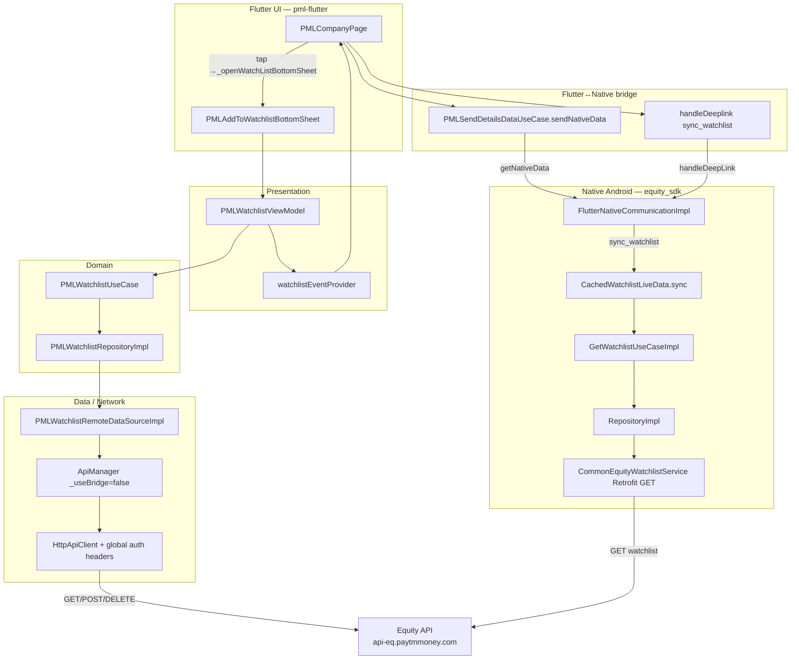
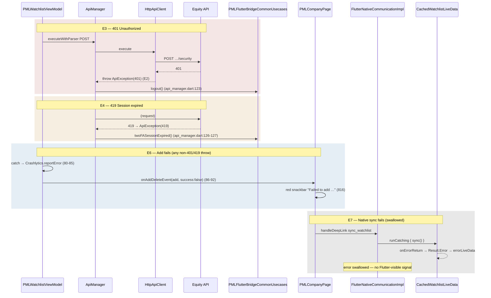

# I2 — End-to-End Flow Trace: `android-monorepo`

> **Target repo (read-only):** `android-monorepo` — `flutter/pml-flutter`, `equity_sdk`, `base_app`, `common-database`
> **Pinned commit:** `e7fc70a6b564ca3baffecb9a652194702443df3b` (2026-06-20, branch `bugfix/PM4-6240-scheme-holding-tab-inaccessible-initially`)
> **Local path of pinned clone:** `/Users/abhijeetpal/Desktop/workspace/android-monorepo/android-monorepo`
> **Reproduce:** see `../../README.md` and `../../scripts/verify_trace.sh` (every entry edge below is asserted by that script).

This document traces **two** business flows:

| | Flow | Trigger | Final side effect | Hops |
|---|---|---|---|---|
| **Flow A** (primary) | **Add security to watchlist** | User taps watchlist icon on a Company Page → picks a watchlist | `POST .../watchlist/{id}/security` + native cache `sync()` (Retrofit `GET`) | **33** |
| **Flow B** (secondary) | **Recent-search persistence** | User taps/bookmarks a stock in equity search | Parallel `PUT` event API **+** Room write to `recent_search` | 8 (see §B) |

Flow B is fully traced in `Advanced/parallel-repo-analysis/docs/agent-analysis/A1_flow_trace.md` and **re-verified at this pinned commit** in §B below — it is the flow the portfolio README previously named, retained here as a cross-referenced corroborating trace.

All `file:line` citations were read directly in the working tree at the pinned commit. Confidence tags: **[VERIFIED]** = edge read in source at the cited line; **[INFERRED]** = resolved via DI/convention but not line-confirmed. This run resolved **every** primary-path hop to **[VERIFIED]** (0 INFERRED on the happy path — the previous `sendNativeData`, bridge-default, `handleDeeplink`, and native-`sync()` gaps are now line-confirmed).

Paths below are relative to the repo root (`flutter/pml-flutter/lib/...`, `equity_sdk/src/main/java/...`, etc.).

---

## Flow A — Add to Watchlist

### 1. Entry Point

| Field | Value |
|---|---|
| **File** | `flutter/pml-flutter/lib/features/company_page/presentation/ui/PMLCompanyPage.dart` |
| **Function** | `GestureDetector.onTap` (watchlist icon, **line 1829**) → `_openWatchListBottomSheet(pmlID)` (**line 1928**) |
| **Trigger** | User taps the watchlist icon in the Company Page header |
| **Purpose** | Open the add-to-watchlist bottom sheet for the current security (`pmlID`) |

The same entry pattern is shared by `PMLStockCompanyPage.dart`, `PMLIndexCompanyPage.dart`, and `PMLETFCompanyPage.dart` (all route through the shared `PMLCompanyPage` widget).

---

### 2. Execution Path (33 hops, no gaps)

#### Phase A — Open sheet & load watchlists (GET)

| # | File :: Function | Line | Conf. | Description |
|---|---|---|---|---|
| 1 | `PMLCompanyPage.dart` :: `GestureDetector.onTap` | 1829 | ✅ | `onTap: () => _openWatchListBottomSheet(pmlID)` |
| 2 | `PMLCompanyPage.dart` :: `_openWatchListBottomSheet` | 1928 | ✅ | `showModalBottomSheet` (1929) → `PMLAddToWatchlistBottomSheet(pmlId: companyPmlId)` (1932-1934) |
| 3 | `bottom_sheets/PMLAddToWatchlistBottomSheet.dart` :: `initState` | 40 | ✅ | Post-frame: `ref.read(watchlistViewModelProvider.notifier).loadWatchList()` |
| 4 | `…/viewmodel/PMLWatchlistViewModel.dart` :: `loadWatchList` | 17 | ✅ | Sets `PMLWatchlistLoading`; `await _useCase.fetchWatchlists()` (20) |
| 5 | `…/domain/usecases/PMLWatchlistUseCase.dart` :: `fetchWatchlists` | 11 | ✅ | `return repository.fetchWatchlists()` (12) |
| 6 | `…/data/repositories/PMLWatchlistRepositoryImpl.dart` :: `fetchWatchlists` | 13 | ✅ | `return remoteDataSource.fetchWatchlists()` (14) |
| 7 | `…/data/datasources/remote/PMLWatchlistRemoteDataSourceImpl.dart` :: `fetchWatchlists` | 18 | ✅ | `BaseApiRequest(GET, '/marketwatch/api/v2/watchlist?verbose=1')` (19-22); `apiManager.executeWithParser<PMLWatchlistResponse>` (26) |
| 8 | `core/network/api_manager.dart` :: `executeWithParser` | 102 | ✅ | `_useBridge == false` (33) → `else` branch `_executeDirectRequest` (114-115). **Resolves the prior INFERRED bridge hop.** |
| 9 | `core/network/http_api_client.dart` :: `execute` | 340 | ✅ | Builds `http.Request` (340-342); 2xx → parse + return (400-409); non-2xx → `throw ApiException(statusCode, metaData)` (428-431) |
| 10 | `PMLWatchlistViewModel.dart` :: `loadWatchList` (success) | 17 | ✅ | Filters non-system watchlists; sets `PMLWatchlistData(lists)` |

#### Phase B — Select watchlist → add security (POST)

| # | File :: Function | Line | Conf. | Description |
|---|---|---|---|---|
| 11 | `PMLAddToWatchlistBottomSheet.dart` :: `_WatchlistRow.onTap` | 121 | ✅ | `Navigator.pop()`, then `toggleWatchlistStatus(item.id, item.name, widget.pmlId, isChecked)` (125-129) |
| 12 | `PMLWatchlistViewModel.dart` :: `toggleWatchlistStatus` | 126 | ✅ | Add branch → `addToWatchlist(watchlistId, securityId, watchListName)` (135). **See param-order note (Uncertainty #2).** |
| 13 | `PMLWatchlistViewModel.dart` :: `addToWatchlist` | 67 | ✅ | `await _useCase.addToWatchlist(watchlistId, securityId)` (73) |
| 14 | `PMLWatchlistUseCase.dart` :: `addToWatchlist` | 19 | ✅ | `return repository.addToWatchlist(watchlistId, securityId)` (23) |
| 15 | `PMLWatchlistRepositoryImpl.dart` :: `addToWatchlist` | 23 | ✅ | `return remoteDataSource.addToWatchlist(watchlistId, securityId)` (27) |
| 16 | `PMLWatchlistRemoteDataSourceImpl.dart` :: `addToWatchlist` | 54 | ✅ | `BaseApiRequest(POST, '/marketwatch/api/v1/watchlist/$watchlistId/security', body: AddToWatchlistRequestBody(securityId))` (58-63); `executeWithParser<PMLAddWatchlistResponse>` (68) |
| 17 | `…/data/models/AddToWatchlistRequestBody.dart` :: `toJson` | 8 | ✅ | `=> {'security_id': securityId}` |
| 18 | `api_manager.dart` :: `executeWithParser` | 102 | ✅ | Same direct HTTP path as hop 8 (`_useBridge == false`) |
| 19 | `http_api_client.dart` :: `execute` | 340 | ✅ | `POST {equityBaseUrl}/marketwatch/api/v1/watchlist/{id}/security` |

#### Phase C — Post-success UI & native-sync entry

| # | File :: Function | Line | Conf. | Description |
|---|---|---|---|---|
| 20 | `PMLWatchlistViewModel.dart` :: `addToWatchlist` (success) | 74 | ✅ | `onAddDeleteEvent(PMLWatchlistCreateAddDeleteEvent(watchListName, PMLWatchlistEventType.add))` (74-79) |
| 21 | `…/presentation/di/PMLWatchlistProviders.dart` :: `watchlistViewModelProvider` callback | 35 | ✅ | `onAddDeleteEvent: (event) => ref.read(watchlistEventProvider.notifier).state = event` (`watchlistEventProvider` declared line 12) |
| 22 | `PMLCompanyPage.dart` :: `build` → `ref.listen(watchlistEventProvider, …)` | 806 | ✅ | On `add`: snackbar (833), `sendNativeData` (817-821), family refresh (846-847), deeplink (850-854) |
| 23 | `…/domain/usecases/PMLSendDetailsDataUseCase.dart` :: `sendNativeData` | 9 | ✅ | Via `PMLCompanyPageViewModel.sendNativeData` (`viewmodel/PMLCompanyPageViewModel.dart:114`, `unawaited`). Builds `PmlDetailsData(selectedTabType: 'WatchListAdded')` (51); `_pmlBridgeRepositoryImpl.sendEvent(PMLBridgeName.getNativeData, …)` (63). **Resolves prior INFERRED hop.** |
| 24 | `PMLCompanyPage.dart` :: listener (guard line 844 `next.success && (add‖delete)`) | 846-847 | ✅ | `watchlistSyncStateProvider.notifier.markAsNeedingRefresh()` (846) + `watchlistViewModelFamilyProvider(pmlID).notifier.loadWatchList()` (847) |
| 25 | `PMLCompanyPage.dart` :: listener → `handleDeeplink` | 850-854 | ✅ | `PMLFlutterBridgeCommonUsecases(PMLBridgeRepositoryImpl()).handleDeeplink(PMLHandleDeepLinkBridgeRequest(url: 'sync_watchlist'))`. Impl: `core/bridge/usecases/pml_flutter_bridge_common_usecases.dart:170` → `sendEvent(PMLBridgeName.handleDeepLink, priority: low)` (173-177). **Resolves prior INFERRED hop.** |
| 26 | `equity_sdk/…/flutter/FlutterNativeCommunicationImpl.kt` :: `when(deeplinkUrl)` `"sync_watchlist"` | 471 | ✅ | `runCatching { cachedWatchlistLiveData.sync() }` (471-475). `cachedWatchlistLiveData` is a `@Inject` constructor param (type `CachedWatchlistLiveData`, line 160). The `base_app` impl does **not** handle `sync_watchlist` (0 grep hits). |

#### Phase D — Native sync sub-trace → Retrofit (resolves prior depth-budget stop)

| # | File :: Function | Line | Conf. | Description |
|---|---|---|---|---|
| 27 | `equity_sdk/…/watchlist/presentation/CachedWatchlistLiveData.kt` :: `sync()` | 63 | ✅ | Re-entrancy guard `if (state.inProgress) return` (65); `getWatchlistUseCase.execute().subscribeOn(Schedulers.io())` (67-70) |
| 28 | `…/watchlist/domain/GetWatchlistUseCase.kt` :: `GetWatchlistUseCase.execute()` (interface) | 10-11 | ✅ | `fun execute(): Single<Result<List<WatchlistEntity>>>` |
| 29 | `…/watchlist/domain/GetWatchlistUseCase.kt` :: `GetWatchlistUseCaseImpl.execute()` | 29 | ✅ | `= repository.getAllWatchlists()` |
| 30 | `…/watchlist/domain/Repository.kt` :: `Repository.getAllWatchlists()` (interface) | 10 | ✅ | `fun getAllWatchlists(): Single<Result<List<WatchlistEntity>>>` |
| 31 | `…/watchlist/data/RepositoryImpl.kt` :: `getAllWatchlists()` | 29-42 | ✅ | `gtmHandler.getEquityUrl(default = '/marketwatch/api/v2/watchlist')` (30-36); `equityWatchlistService.getAllWatchlists(url, 1)` (37-38); `.convertResponseToResult { … }` (39) |
| 32 | `…/watchlist/data/CommonEquityWatchlistService.kt` :: `getAllWatchlists` | 17-21 | ✅ | **TERMINAL** Retrofit `@GET` `getAllWatchlists(@Url url, @Query("verbose") verbose): Single<Response<SupremeResponseModel<EquityWatchlistsDTO>>>` |
| 33 | `equity_sdk/…/base/Mapper.kt` :: `Single<…>.convertResponseToResult` | 68-75 | ✅ | Maps `Response→Result`; `onErrorReturn { Result.Error(it) }` (71) → consumed by `sync()` (`CachedWatchlistLiveData.kt:73-90`) |

**Net:** 33 ordered hops, entry → terminal Retrofit call, **all VERIFIED**. The native "cache" is an **in-memory Android `LiveData`** (`CachedWatchlistLiveData.setData → postValue`, lines 81/97-99) — **not** Room. There is no SQLite write anywhere in Flow A (confirmed by grepping `common-database/` for a watchlist DAO → 0 hits).

---

### 3. DI Bindings — Flow A

#### 3a. Riverpod (Flutter, `pml-flutter`)

| Provider | Resolves to (concrete) | Injects | File:line | Conf. |
|---|---|---|---|---|
| `watchlistEventProvider` | `StateProvider<PMLWatchlistCreateAddDeleteEvent?>` | initial `null` | `presentation/di/PMLWatchlistProviders.dart:12` | ✅ |
| `watchlistRemoteDataSourceProvider` | `PMLWatchlistRemoteDataSourceImpl` (iface `PMLWatchlistRemoteDataSource`) | `apiManager: apiManagerProvider` | `PMLWatchlistProviders.dart:14-18` | ✅ |
| `watchlistRepositoryProvider` | `PMLWatchlistRepositoryImpl` (iface `PMLWatchlistRepository`) | `remoteDataSource: watchlistRemoteDataSourceProvider` | `PMLWatchlistProviders.dart:20-24` | ✅ |
| `watchlistUseCaseProvider` | `PMLWatchlistUseCase` (concrete) | `repository: watchlistRepositoryProvider` | `PMLWatchlistProviders.dart:26-30` | ✅ |
| `watchlistViewModelProvider` | `StateNotifierProvider<PMLWatchlistViewModel, …>` | `useCase`, `onAddDeleteEvent` (writes `watchlistEventProvider`) | `PMLWatchlistProviders.dart:32-37` | ✅ |
| `watchlistViewModelFamilyProvider` (`.family` by `pmlID`) | `PMLWatchlistViewModel` (per-`pmlID`) | `useCase`, `onAddDeleteEvent` | `presentation/di/PMLCompanyPageFamilyProviders.dart:131-140` | ✅ |
| `watchlistSyncStateProvider` | `StateNotifierProvider<WatchlistSyncNotifier, …>` | `WatchlistSyncNotifier()` | `features/PMLWatchlist/presentation/provider/watchlist_sync_provider.dart:45-47` | ✅ |
| `apiManagerProvider` | `ApiManager` (singleton `factory ApiManager()`) | `httpApiClientProvider` + parser; `manager.initialize(client, parserCreator)` | `core/providers/core_providers.dart:50-63` | ✅ |
| `httpApiClientProvider` | `HttpApiClient` (iface `ApiClientBase`) | `HttpApiClient()` | `core/providers/core_providers.dart:35-37` | ✅ |

> **Two ViewModel providers, one chain.** The bottom sheet uses the *global* `watchlistViewModelProvider`; the company-page icon state reads the `.family` variant keyed by `pmlID`. Both share the same use-case/repo/datasource chain and both write the same `watchlistEventProvider`. Icon refresh after add (hop 24) re-fetches the *family* provider — not the same VM instance that performed the POST.

#### 3b. Dagger (native, `equity_sdk`) — native sync path

All in `equity_sdk/…/watchlist/di/CommonEquityWatchlistModule.kt` (`@Provides`, not `@Binds`):

| Interface / type | Bound to | Module file:line | Conf. |
|---|---|---|---|
| `GetWatchlistUseCase` | `GetWatchlistUseCaseImpl` (`@Inject constructor`) | `CommonEquityWatchlistModule.kt:25` | ✅ |
| `Repository` | `RepositoryImpl` (`@Inject constructor`; deps `CommonEquityWatchlistService` + `GtmHandler`) | `CommonEquityWatchlistModule.kt:31` | ✅ |
| `CommonEquityWatchlistService` | `retrofit.create(CommonEquityWatchlistService::class.java)` | `CommonEquityWatchlistModule.kt:34` | ✅ |
| `CachedWatchlistLiveData` | `CachedWatchlistLiveData.getInstance(...)` (singleton via companion) | `CommonEquityWatchlistModule.kt:19-22` | ✅ |
| `FlutterNativeCommunicationImpl.cachedWatchlistLiveData` | `@Inject constructor` 3rd param | `flutter/FlutterNativeCommunicationImpl.kt:160` | ✅ |

---

### 4. Auth header injection chain (app init → `HttpApiClient`)

Every watchlist call carries global auth/identity headers attached by `HttpApiClient`. Header key constants are defined in `core/network/header_config.dart`:

| Header | Constant | Line | Source of value |
|---|---|---|---|
| `x-sso-token` | `kSsoToken` | 60 | native login bridge (`processLoginInfo`) |
| `x-2fa-token` | `kTwoFaToken` | 59 | native 2FA bridge (`processTwoFAInfo`) |
| `x-user-agent` | `kUserAgent` | 58 | `HeaderConfig.getDefaultUserAgentInfo()` |
| `x-pmngx-key` | `kPmngxKey` (default `'330'`, line 46) | 55 | static, app init |
| `x-pmmodule-name` | `kPmModuleName` | 56 | `AppConfig.platform` |
| `X-Client-Version` | `kClientVersion` | 53 | `AppConfig.appVersion` |
| `X-Platform` | `kPlatform` | 54 | `AppConfig.platform` |

**Injection chain (all VERIFIED):**

1. `main.dart:205` → `appViewModel.initializeApp(args)` → `core/viewmodels/app_view_model.dart:194` → `_appService.initializeApp(args)`.
2. `core/services/app_service.dart:336+` `initializeApp` sets static headers via `_apiManager.addOrRemoveGlobalHeader(...)` — `x-pmngx-key` (348-351), `x-pmmodule-name` (354-357), `X-Client-Version` (362-365), `X-Platform` (368-371).
3. `app_service.dart:247-253` `processLoginInfo(data)` (from `app_view_model.dart:98`, native bridge `PMLLoginInfoBridgeModel`) → injects `x-sso-token` (247-250) and `x-user-agent` (251-253).
4. `app_service.dart:68-71` `processTwoFAInfo(data)` (from `app_view_model.dart:83`, `PMLTwoFAInfoBridgeModel`) → injects/removes `x-2fa-token`.
5. `api_manager.dart:68-79` `addOrRemoveGlobalHeader` → non-null `_client.setGlobalHeader(key,value)` (78); null → `removeGlobalHeader`.
6. `http_api_client.dart` stores them: field `_globalHeaders` (33), `setGlobalHeader` writes the map (286-288).
7. `http_api_client.dart:execute` merges them into every outgoing request: `final headers = {..._globalHeaders}` (346) → `httpRequest.headers.addAll(headers)` (359).

**Production base URL:** `https://api-eq.paytmmoney.com` — `core/network/api_environment.dart:42` (`_getEquityBaseUrl()`, `case production`), exposed via `ApiEnvironmentConfig.equityBaseUrl` getter (169).

---

### 5. Side Effects — Flow A

#### API

| Method | Endpoint | Body | Source | Hop |
|---|---|---|---|---|
| **GET** | `{equityBaseUrl}/marketwatch/api/v2/watchlist?verbose=1` | — | `PMLWatchlistRemoteDataSourceImpl.dart:19-22` | 7 |
| **POST** | `{equityBaseUrl}/marketwatch/api/v1/watchlist/{watchlistId}/security` | `{"security_id":"<pmlId>"}` | `PMLWatchlistRemoteDataSourceImpl.dart:58-63` + `AddToWatchlistRequestBody.dart:8` | 16-17 |
| **DELETE** | `{equityBaseUrl}/marketwatch/api/v1/watchlist/{watchlistId}/security/{securityId}` | — | `PMLWatchlistRemoteDataSourceImpl.dart:81-85` (toggle-off branch) | — |
| **GET** (native sync) | `{BASE_URL_API_EQUITY}` + GTM-resolved (default `/marketwatch/api/v2/watchlist`), `?verbose=1` | — | `CommonEquityWatchlistService.kt:17-21`; URL `RepositoryImpl.kt:30-38` | 32 |

Base URL: `https://api-eq.paytmmoney.com` (`api_environment.dart:42`).

#### Database
**None in Flow A.** No Room/SQLite write in either the Flutter path or the native `sync()` path. (Room writes belong to **Flow B** — see §B.)

#### Queue
None.

#### Cache

| Action | Kind | Source | Hop |
|---|---|---|---|
| Native watchlist refresh `CachedWatchlistLiveData.sync()` → `setData → postValue` | **In-memory `LiveData`** (not Room) | `CachedWatchlistLiveData.kt:63, 81, 97-99` | 26-33 |
| Flutter `watchlistSyncStateProvider.markAsNeedingRefresh()` | In-memory Riverpod state | `PMLCompanyPage.dart:846` | 24 |

#### Native bridge events

| Event | Bridge method | Source | Hop |
|---|---|---|---|
| Native data push `selectedTabType: 'WatchListAdded'` | `PMLBridgeName.getNativeData` | `PMLSendDetailsDataUseCase.dart:51-65` | 23 |
| Deeplink `sync_watchlist` | `PMLBridgeName.handleDeepLink` | `PMLCompanyPage.dart:850-854` → `pml_flutter_bridge_common_usecases.dart:173-177` | 25-26 |

---

### 6. Error / failure paths (all VERIFIED)

| # | Trigger | Path | Outcome | Cite |
|---|---|---|---|---|
| E1 | Load watchlists fails | `loadWatchList` catch → `CrashlyticsHelper.reportError` → `PMLWatchlistError` | Bottom sheet `_ErrorView` w/ retry | `PMLWatchlistViewModel.dart:23-29` |
| E2 | HTTP non-2xx | `HttpApiClient.execute` throws `ApiException(statusCode, metaData)` | Propagates to `ApiManager` catch | `http_api_client.dart:428-431` |
| E3 | **401 Unauthorized** | `ApiManager.executeWithParser` catch → `PMLFlutterBridgeCommonUsecases().logout()` | User logged out via native bridge | `api_manager.dart:121-124` |
| E4 | **419 Session expired** | catch → `twoFASessionExpired()` | 2FA re-auth prompt via bridge | `api_manager.dart:126-127` |
| E5 | 4xx/5xx w/ meta | catch → `sendAPILogs(PMLRetrofitRequestBridgeModel)` | Logged, exception rethrown | `api_manager.dart:130-155, 165` |
| E6 | Add fails | `addToWatchlist` catch → Crashlytics → `onAddDeleteEvent(add, success: false)` | Red snackbar `Failed to add {name} to {watchlist}` | `PMLWatchlistViewModel.dart:80-92`; `PMLCompanyPage.dart:816` |
| E7 | Native sync fails | `runCatching { sync() }` swallows; inside, `Mapper.onErrorReturn → Result.Error → errorLiveData` | **No Flutter-visible signal** | `FlutterNativeCommunicationImpl.kt:471-475`; `Mapper.kt:71`; `CachedWatchlistLiveData.kt:86-90` |

---

### 7. Dependency Graph



### 8. Sequence Diagram — happy path (1:1 with hops 1–33)

```mermaid
sequenceDiagram
    actor User
    participant CP as PMLCompanyPage
    participant BS as PMLAddToWatchlistBottomSheet
    participant VM as PMLWatchlistViewModel
    participant UC as PMLWatchlistUseCase
    participant Repo as PMLWatchlistRepositoryImpl
    participant DS as PMLWatchlistRemoteDataSourceImpl
    participant AM as ApiManager
    participant HC as HttpApiClient
    participant API as Equity API
    participant EV as watchlistEventProvider
    participant FNC as FlutterNativeCommunicationImpl
    participant CWL as CachedWatchlistLiveData
    participant NSvc as CommonEquityWatchlistService

    User->>CP: tap watchlist icon (1)
    CP->>BS: showModalBottomSheet (2)
    BS->>VM: loadWatchList() (3-4)
    VM->>UC: fetchWatchlists() (5)
    UC->>Repo: fetchWatchlists() (6)
    Repo->>DS: fetchWatchlists() (7)
    DS->>AM: executeWithParser GET (8)
    AM->>HC: _executeDirectRequest → execute (8-9)
    HC->>API: GET /marketwatch/api/v2/watchlist?verbose=1
    API-->>HC: 200 watchlist JSON
    HC-->>VM: PMLWatchlistResponse (10)
    VM-->>BS: PMLWatchlistData (render rows)

    User->>BS: tap watchlist row (11)
    BS->>VM: toggleWatchlistStatus() (12)
    VM->>UC: addToWatchlist(id, securityId) (13-14)
    UC->>Repo: addToWatchlist() (15)
    Repo->>DS: addToWatchlist() (16)
    DS->>AM: executeWithParser POST (18)
    AM->>HC: execute (19)
    HC->>API: POST /marketwatch/api/v1/watchlist/{id}/security {"security_id":"…"}
    API-->>HC: 200 ack
    HC-->>VM: success (20)

    VM->>EV: PMLWatchlistCreateAddDeleteEvent(add) (20-21)
    EV->>CP: ref.listen fires (22)
    CP->>CP: snackbar (22); markAsNeedingRefresh + family loadWatchList (24)
    CP->>FNC: getNativeData WatchListAdded (23)
    CP->>FNC: handleDeepLink sync_watchlist (25)
    FNC->>CWL: runCatching { sync() } (26-27)
    CWL->>NSvc: getAllWatchlists(@Url, verbose=1) (28-32)
    NSvc->>API: GET /marketwatch/api/v2/watchlist?verbose=1
    API-->>CWL: 200 → Result → LiveData.postValue (33)
```

### 9. Sequence Diagram — error paths (E3 401, E4 419, E6 add-fail, E7 native-sync-fail)



---

### 10. Known Uncertainties (Flow A) — honest, ≤5

1. **`sendNativeData` and `sync_watchlist` fire on add *failure* too.** In the `add` case of the listener, `sendNativeData('WatchListAdded', …)` runs **before** the `next.success` check (`PMLCompanyPage.dart:817-821`), and `handleDeeplink('sync_watchlist')` runs **unconditionally** for any non-null event (`850-854`, outside the `next.success` guard at 844). So a *failed* add still emits the native data push and triggers a native cache sync. This is **[VERIFIED behavior]** and flagged as likely-unintended; the family-VM icon refresh (hop 24) is correctly success-gated.
2. **Param-name vs positional-order double swap.** Call site passes `(item.id, item.name, widget.pmlId, isChecked)` (`PMLAddToWatchlistBottomSheet.dart:125-129`); `toggleWatchlistStatus` names its 2nd/3rd params `securityId`/`watchListName` (swapped vs the values), and `addToWatchlist` names them in the opposite order `watchListName`/`securityId`. The two swaps cancel, so the real security id (`widget.pmlId`) reaches the API correctly. Names are misleading at both layers; runtime is correct. **[VERIFIED in source]**
3. **Native sync error is swallowed twice** — `runCatching` (`FlutterNativeCommunicationImpl.kt:471-475`) and `Mapper.onErrorReturn` (`Mapper.kt:71`). A failed cache refresh produces no user- or Flutter-visible signal (only an internal `errorLiveData`). **[VERIFIED]**
4. **Native sync URL is GTM/remote-config resolved.** `RepositoryImpl.getAllWatchlists` builds the URL via `gtmHandler.getEquityUrl(...)` with literal default `/marketwatch/api/v2/watchlist` (`RepositoryImpl.kt:30-36`). The *default* is **[VERIFIED]**; the runtime value can be overridden by remote config and is **[UNVERIFIED]** at trace time.
5. **Dagger component graph not fully walked.** All `@Provides` bindings in `CommonEquityWatchlistModule` and the `@Inject` constructor of `FlutterNativeCommunicationImpl` are **[VERIFIED]**; which component installs the module and scopes the singleton was not traced end-to-end — **[INFERRED via convention]**.

---

### 11. Self-Consistency Check (Flow A)

- Sequence diagram (§8) participants & arrows map 1:1 to numbered hops 1–33 (hop numbers annotated on each arrow).
- Every API side effect (§5) appears as a hop: GET=7, POST=16-17, DELETE=toggle-off branch (noted), native GET=32.
- Cache side effects (§5) map to hops 24 & 26-33; bridge events to hops 23 & 25.
- Error-path diagram (§9) covers E3/E4/E6/E7 and does not contradict the happy path.
- 0 INFERRED hops on the happy path; the 5 uncertainties are behavioral/scope notes, not unresolved edges.

---

## Flow B — Recent-Search Persistence (cross-reference + re-verification)

**Full trace:** `Advanced/parallel-repo-analysis/docs/agent-analysis/A1_flow_trace.md`.
**This is the flow the portfolio README historically named.** It is retained here, **re-verified at pinned commit `e7fc70a`**, as an independent corroborating trace that touches a *real Room DB write* (which Flow A does not).

> **Flow:** User taps/bookmarks a stock in equity search → one repository method fans out via `Completable.mergeArrayDelayError` into **two parallel side effects**: a remote `PUT` event API **and** a Room write to `recent_search`.

### B.1 Re-verified execution path (line drift folded in)

| # | File :: Function | Line (now) | Was | Conf. | Note |
|---|---|---|---|---|---|
| 1 | `equity_sdk/…/search/presentation/EquitySearchFragment.kt` :: `putSearchedEvent(StockUIModel)` | 456 | ~449 | ✅ | +7 drift; builds `StockEntity` |
| — | call sites: bookmark (unguarded) / index / company | 313 / 418 / 436 | ~309/411/429 | ✅ | bookmark path is unguarded; other two `if (isSearched)` |
| 2 | `EquitySearchViewModel.kt` :: `putSearchedEvent(StockEntity)` | 750-752 | ~697-699 | ✅ | +53 drift; `searchedUserEvent` field decl line 80 |
| 3 | `…/scripEvent/domain/SearchedUserEventImpl.kt` :: `execute` | 16-24 | ~16-24 | ✅ | `repository.putSearchUserEvent(...).subscribeOn(io).onErrorComplete().subscribe().disposeBy(...)` |
| 4 | `…/scripEvent/data/ScripEventRepositoryImp.kt` :: `putSearchUserEvent` | 55-86 | ~54-83 | ✅ | `Completable.mergeArrayDelayError(...)` fan-out (64) |
| 4a | → `services.putUserEvent(url, stock.id, type)` | 65 | ~63 | ✅ | **API leg** |
| 4b | → `Completable.fromCallable { recentSearchDao.insertAndCheckMax(RecentSearch(...)) }.subscribeOn(io)` | 66-84 | ~64-81 | ✅ | **DB leg** |
| 5 | `…/scripEvent/data/ScripEventServices.kt` :: `putUserEvent` (`@PUT @Url`) | 8-15 | ~10-15 | ✅ | Retrofit |
| 6 | `common-database/…/search/RecentSearchDao.kt` :: `insertAndCheckMax` (`@Transaction`) | 30-36 | ~31-37 | ✅ | `insert` (27-28), `deleteLast` (38-39), `getCount` (18-19), `MAX=10` (14) |
| — | `RecentSearch.kt` :: `@Entity(tableName = "recent_search")` | 10-12 | ~10-11 | ✅ | terminal table |

### B.2 DI bindings (Dagger)

| Interface | Impl / provider | Module file:line |
|---|---|---|
| `SearchedUserEvent` | `SearchedUserEventImpl` | `CommonScripEventModule.kt:17` |
| `ScripEventRepository` | `ScripEventRepositoryImp` | `CommonScripEventModule.kt:23` |
| `ScripEventServices` | `retrofit.create(ScripEventServices)` | `CommonScripEventModule.kt:26` |
| `RecentSearchDao` | `database.recentSearchDao` | `RoomModule.kt:80` |
| `EquityDatabase` | `Room.databaseBuilder(...)` | `RoomModule.kt:42` |

### B.3 Reconciliation with A1

| Item | A1 (commit at A1 time) | This run (e7fc70a) | Status |
|---|---|---|---|
| Fragment `putSearchedEvent` decl | ~449 | 456 | drift +7, intact |
| VM `putSearchedEvent` | ~697-699 | 750-752 | drift +53, intact |
| `mergeArrayDelayError` fan-out (PUT + Room) | `:63` / `:64-81` | `:65` / `:66-84` | drift +2, intact |
| `recent_search` table, `MAX=10`, `deleteLast` cap | confirmed | confirmed (`MAX=10` at line 14) | **CONFIRMED** |
| Side effects: PUT API + Room insert + cap-evict delete | 3 | 3 | **CONFIRMED** |

**Nothing in Flow B was removed or renamed** between A1 and this commit — only line drift. A1's analysis is reconfirmed verbatim in substance; see A1 for the full sequence diagram, side-effect table, and uncertainties (Retrofit base-URL/`@Url` resolution, component graph, `compositeDisposable` lifecycle, `onErrorComplete` swallowing).

---

## Final Summary

- **Flow A (primary):** watchlist icon tap → `POST /marketwatch/api/v1/watchlist/{id}/security` → native `CachedWatchlistLiveData.sync()` Retrofit `GET`. **33 hops, all VERIFIED, 0 INFERRED on happy path.**
- **Flow B (secondary):** search/bookmark → parallel `PUT` event API **+** Room write to `recent_search` (cap 10). 8 hops, re-verified at this commit; full detail in A1.
- **External systems:** Equity REST API (`api-eq.paytmmoney.com`); native in-memory `LiveData` cache (Flow A); Room `EquityDatabase`/`recent_search` (Flow B); Flutter↔Native bridge (`getNativeData`, `handleDeepLink`).
- **Reproduce:** `bash scripts/verify_trace.sh` asserts every entry edge against the pinned commit; machine-readable graph in `I2_callgraph.yaml`; independent adversarial verification in `I2_verification_report.md`.
