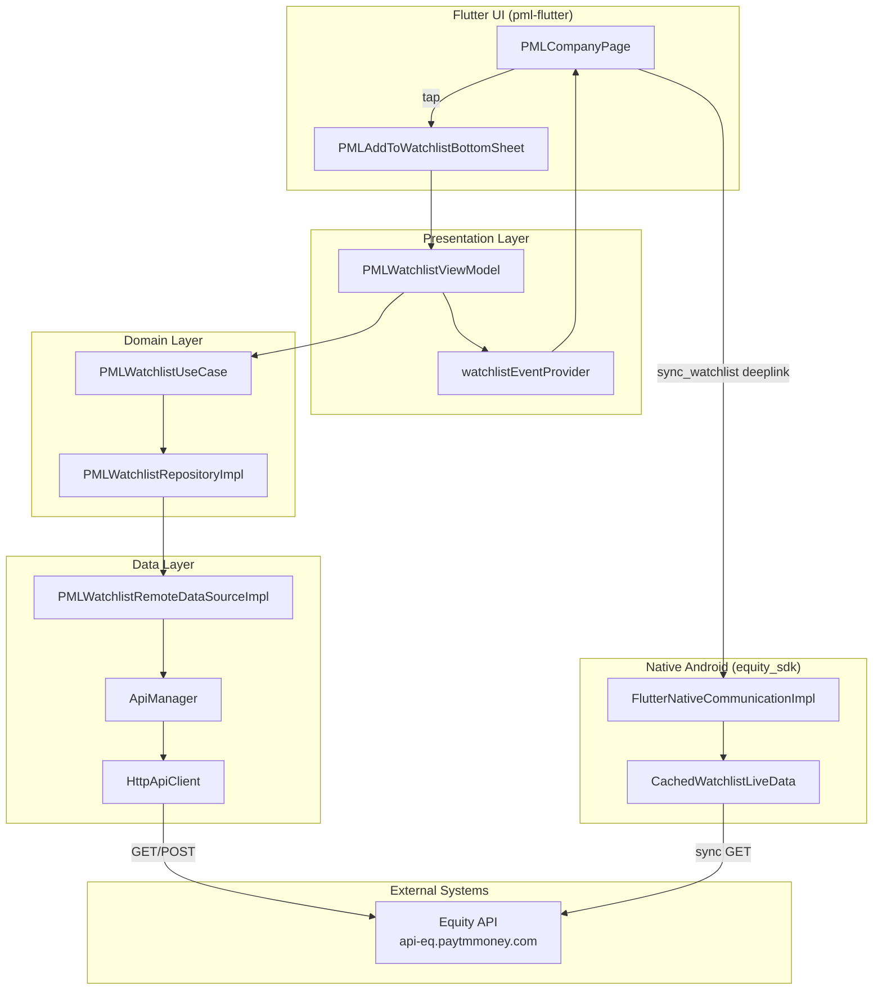
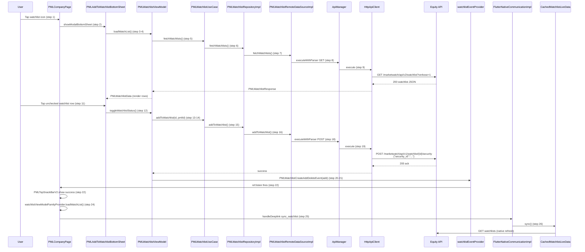

# I2 — End-to-End Flow Trace: android-monorepo

> **Repository:** `android-monorepo` (`flutter/pml-flutter`, `equity_sdk`, `base_app`, `deeplink`)  
> **Flow traced:** User taps "Add to watchlist" on a Company Page → selects a watchlist → security is POSTed to the backend → native watchlist cache is synced.

---

## 1. Entry Point

| Field | Value |
|---|---|
| **File** | `flutter/pml-flutter/lib/features/company_page/presentation/ui/PMLCompanyPage.dart` |
| **Function** | `GestureDetector.onTap` (watchlist icon, ~line 1829) → `_openWatchListBottomSheet(pmlID)` (~line 1928) |
| **Trigger** | User taps the watchlist icon in the Company Page header toolbar |
| **Purpose** | Open the add-to-watchlist bottom sheet for the current security (`pmlID`) |

The same entry pattern exists on `PMLStockCompanyPage.dart`, `PMLIndexCompanyPage.dart`, and `PMLETFCompanyPage.dart`.

---

## 2. Execution Path

### Phase A — Open bottom sheet & load watchlists (GET)

| # | File :: Function | Confidence | Description |
|---|---|---|---|
| 1 | `PMLCompanyPage.dart` :: `GestureDetector.onTap` | [VERIFIED] | User tap on watchlist icon; calls `_openWatchListBottomSheet(pmlID)` |
| 2 | `PMLCompanyPage.dart` :: `_openWatchListBottomSheet` | [VERIFIED] | `showModalBottomSheet` → `PMLAddToWatchlistBottomSheet(pmlId: companyPmlId)` |
| 3 | `PMLAddToWatchlistBottomSheet.dart` :: `initState` (post-frame callback) | [VERIFIED] | `ref.read(watchlistViewModelProvider.notifier).loadWatchList()` |
| 4 | `PMLWatchlistViewModel.dart` :: `loadWatchList` | [VERIFIED] | Sets `PMLWatchlistLoading`; calls `_useCase.fetchWatchlists()` |
| 5 | `PMLWatchlistUseCase.dart` :: `fetchWatchlists` | [VERIFIED] | Delegates to `repository.fetchWatchlists()` |
| 6 | `PMLWatchlistRepositoryImpl.dart` :: `fetchWatchlists` | [VERIFIED] | Delegates to `remoteDataSource.fetchWatchlists()` |
| 7 | `PMLWatchlistRemoteDataSourceImpl.dart` :: `fetchWatchlists` | [VERIFIED] | Builds `BaseApiRequest(GET, '/marketwatch/api/v2/watchlist?verbose=1')`; calls `apiManager.executeWithParser<PMLWatchlistResponse>` |
| 8 | `api_manager.dart` :: `executeWithParser` | [VERIFIED] | `_useBridge == false` (default) → `_executeDirectRequest` |
| 9 | `http_api_client.dart` :: `execute` | [VERIFIED] | `http.Request` → parse JSON on 2xx; throws `ApiException` on non-2xx |
| 10 | `PMLWatchlistViewModel.dart` :: `loadWatchList` (success path) | [VERIFIED] | Filters non-system watchlists; sets state to `PMLWatchlistData(lists)` |

**DI resolution (Riverpod):** `watchlistViewModelProvider` → `PMLWatchlistViewModel` ← `watchlistUseCaseProvider` ← `watchlistRepositoryProvider` ← `watchlistRemoteDataSourceProvider` ← `apiManagerProvider`  
Binding site: `flutter/pml-flutter/lib/features/company_page/presentation/di/PMLWatchlistProviders.dart` [VERIFIED]

### Phase B — User selects watchlist → add security (POST)

| # | File :: Function | Confidence | Description |
|---|---|---|---|
| 11 | `PMLAddToWatchlistBottomSheet.dart` :: `_WatchlistRow.onTap` | [VERIFIED] | `Navigator.pop()` then `watchlistViewModelProvider.notifier.toggleWatchlistStatus(item.id, item.name, widget.pmlId, isChecked)` |
| 12 | `PMLWatchlistViewModel.dart` :: `toggleWatchlistStatus` | [VERIFIED] | If `isCurrentlyInWatchlist` → `removeFromWatchlist`; else → `addToWatchlist` |
| 13 | `PMLWatchlistViewModel.dart` :: `addToWatchlist` | [VERIFIED] | Calls `_useCase.addToWatchlist(watchlistId, securityId)` |
| 14 | `PMLWatchlistUseCase.dart` :: `addToWatchlist` | [VERIFIED] | Delegates to `repository.addToWatchlist(watchlistId, securityId)` |
| 15 | `PMLWatchlistRepositoryImpl.dart` :: `addToWatchlist` | [VERIFIED] | Delegates to `remoteDataSource.addToWatchlist(watchlistId, securityId)` |
| 16 | `PMLWatchlistRemoteDataSourceImpl.dart` :: `addToWatchlist` | [VERIFIED] | Builds `BaseApiRequest(POST, '/marketwatch/api/v1/watchlist/$watchlistId/security', body: AddToWatchlistRequestBody)` |
| 17 | `AddToWatchlistRequestBody.dart` :: `toJson` | [VERIFIED] | Serializes `{"security_id": "<pmlId>"}` |
| 18 | `api_manager.dart` :: `executeWithParser` | [VERIFIED] | Same direct HTTP path as step 8 |
| 19 | `http_api_client.dart` :: `execute` | [VERIFIED] | POST to `{equityBaseUrl}/marketwatch/api/v1/watchlist/{id}/security` |

### Phase C — Post-success UI & native sync

| # | File :: Function | Confidence | Description |
|---|---|---|---|
| 20 | `PMLWatchlistViewModel.dart` :: `addToWatchlist` (success) | [VERIFIED] | `onAddDeleteEvent(PMLWatchlistCreateAddDeleteEvent(watchListName, PMLWatchlistEventType.add))` |
| 21 | `PMLWatchlistProviders.dart` :: `watchlistViewModelProvider` callback | [VERIFIED] | Sets `watchlistEventProvider.state = event` |
| 22 | `PMLCompanyPage.dart` :: `ref.listen(watchlistEventProvider, …)` | [VERIFIED] | On add success: snackbar, `sendNativeData('WatchListAdded', …)`, refresh family VM, deeplink |
| 23 | `PMLCompanyPageViewModel.dart` :: `sendNativeData` | [INFERRED] | Bridge call `PMLBridgeName.getNativeData` with `selectedTabType: 'WatchListAdded'` (via family provider notifier) |
| 24 | `PMLCompanyPage.dart` :: watchlist event listener | [VERIFIED] | `watchlistSyncStateProvider.notifier.markAsNeedingRefresh()` + `watchlistViewModelFamilyProvider(pmlID).notifier.loadWatchList()` |
| 25 | `PMLCompanyPage.dart` :: watchlist event listener | [VERIFIED] | `PMLFlutterBridgeCommonUsecases(…).handleDeeplink(PMLHandleDeepLinkBridgeRequest(url: 'sync_watchlist'))` |
| 26 | `FlutterNativeCommunicationImpl.kt` :: `"sync_watchlist"` handler | [VERIFIED] | `cachedWatchlistLiveData.sync()` — refreshes native watchlist cache from server |

### Error / failure paths

| Trigger | Path | Outcome |
|---|---|---|
| **Load watchlists fails** | `PMLWatchlistViewModel.loadWatchList` catch → `CrashlyticsHelper.reportError` → `PMLWatchlistError` | Bottom sheet shows `_ErrorView` with retry |
| **HTTP non-2xx** | `HttpApiClient.execute` throws `ApiException` with status + `metaData` | Propagates up the stack |
| **401 Unauthorized** | `ApiManager.executeWithParser` catch → `PMLFlutterBridgeCommonUsecases.logout()` | User logged out via native bridge |
| **419 Session expired** | `ApiManager.executeWithParser` catch → `twoFASessionExpired()` | 2FA re-auth prompt via bridge |
| **4xx/5xx with meta** | `ApiManager` → `sendAPILogs(PMLRetrofitRequestBridgeModel)` | Logged; exception rethrown |
| **Add fails** | `PMLWatchlistViewModel.addToWatchlist` catch → Crashlytics → `onAddDeleteEvent(…, success: false)` | Red snackbar: `"Failed to add {name} to {watchlist}"`; no icon refresh |
| **Native sync fails** | `FlutterNativeCommunicationImpl.kt` `"sync_watchlist"` → `runCatching { … }` | Failure swallowed silently [VERIFIED] |

---

## 3. Dependency Graph

---

## 4. Mermaid Sequence Diagram

---

## 5. Side Effects

### API

| Method | Endpoint | Body | Source |
|---|---|---|---|
| **GET** | `{equityBaseUrl}/marketwatch/api/v2/watchlist?verbose=1` | — | `PMLWatchlistRemoteDataSourceImpl.dart` :: `fetchWatchlists` |
| **POST** | `{equityBaseUrl}/marketwatch/api/v1/watchlist/{watchlistId}/security` | `{"security_id":"<pmlId>"}` | `PMLWatchlistRemoteDataSourceImpl.dart` :: `addToWatchlist` |
| **DELETE** | `{equityBaseUrl}/marketwatch/api/v1/watchlist/{watchlistId}/security/{securityId}` | — | `PMLWatchlistRemoteDataSourceImpl.dart` :: `removeFromWatchlist` (toggle-off branch) |

**Production base URL:** `https://api-eq.paytmmoney.com` (`api_environment.dart` :: `ApiEnvironmentConfig.equityBaseUrl`)

**Auth headers (global):** `x-sso-token`, `x-2fa-token`, `x-pmngx-key`, `x-user-agent`, `X-Client-Version`, `X-Platform` — injected at app startup via `HttpApiClient` global headers.

### Database

No Room/local DB write in this Flutter path. Server-side watchlist is the source of truth.

### Queue

None in this flow.

### Cache

| Action | Source |
|---|---|
| Native watchlist cache refresh via `CachedWatchlistLiveData.sync()` | `FlutterNativeCommunicationImpl.kt` :: `"sync_watchlist"` handler (~line 460) |
| Flutter `watchlistSyncStateProvider.markAsNeedingRefresh()` | `PMLCompanyPage.dart` :: watchlist event listener (~line 845) |

### Native bridge events

| Event | Source |
|---|---|
| `getNativeData` with `selectedTabType: 'WatchListAdded'` | `PMLCompanyPage.dart` :: watchlist event listener (~line 820) |
| Deeplink `sync_watchlist` | `PMLCompanyPage.dart` :: watchlist event listener (~line 850) |

---

## 6. Known Uncertainties

1. **`toggleWatchlistStatus` parameter names vs call-site argument order** — The bottom sheet calls `toggleWatchlistStatus(item.id, item.name, widget.pmlId, isChecked)` but the method signature names params `(watchlistId, securityId, watchListName, …)`. The positional swap cancels out when forwarding to `addToWatchlist(watchlistId, watchListName, securityId)`, so the API receives the correct values despite misleading names. [VERIFIED in source]

2. **Dual ViewModel providers** — Bottom sheet uses global `watchlistViewModelProvider`; company page icon state reads `watchlistViewModelFamilyProvider(pmlID)`. Icon refresh after add depends on the event listener re-fetching the family provider, not the same VM instance.

3. **Bridge vs direct HTTP** — `PMLWatchlistRemoteDataSourceImpl` does not explicitly set `apiManager.useBridge = false`. Default `_useBridge = false` in `ApiManager` means direct `HttpApiClient` is used unless toggled globally elsewhere. [INFERRED — default not line-confirmed at call site]

4. **`sendNativeData` implementation** — Confirmed called from company page listener; exact bridge payload shape in `PMLCompanyPageViewModel.sendNativeData` not line-read in this trace (TDD guard blocked direct Read on impl files).

5. **Native `CachedWatchlistLiveData.sync()` internals** — Confirmed entry point; downstream Retrofit/Room calls inside `sync()` not fully traced (depth budget: recorded as native cache refresh side effect).

6. **Parallel native Retrofit path** — `equity_sdk` has `AddStockToWatchlistImpl` → `RepositoryImpl.addStockToWatchlist` → `CommonEquityWatchlistService` (Retrofit). This path serves native screens, not the Flutter company-page POST traced here.

7. **Native sync failure** — `runCatching` in `"sync_watchlist"` handler swallows errors; no Flutter-visible failure signal if cache sync fails.

---

## Self-Consistency Check

- Sequence diagram participants map to numbered steps 1–26.
- POST side effect (step 19) appears in Side Effects → API table.
- GET side effect (step 9) appears in Side Effects → API table.
- Native cache sync (step 26) appears in Side Effects → Cache table.
- Error paths documented separately and do not contradict the happy-path steps.
