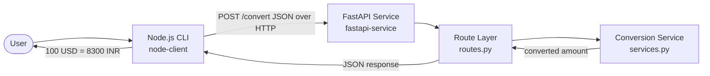

# I4 — Polyglot Currency Conversion System (FastAPI + Node.js CLI)

A two-component polyglot system that demonstrates cross-language communication over HTTP:

- **`fastapi-service/`** — a Python FastAPI service exposing `POST /convert` (hardcoded rates).
- **`node-client/`** — a Node.js CLI that calls the service and prints the result.

Everything is runnable from a fresh clone and verified by automated tests + an integration run.

---

## Architecture Diagram



---

## Folder Structure

```text
I4/
├── fastapi-service/
│   ├── app/
│   │   ├── main.py        # app entry point
│   │   ├── routes.py      # route layer (HTTP only)
│   │   ├── schemas.py     # validation layer (Pydantic)
│   │   └── services.py    # service layer (conversion logic + rates)
│   ├── tests/test_convert.py
│   ├── requirements.txt
│   └── README.md
├── node-client/
│   ├── src/convert.js     # CLI client (parse → call → format)
│   ├── tests/convert.test.js
│   ├── package.json
│   └── README.md
├── docs/agent-analysis/I4_polyglot_service.md
└── README.md              # this file
```

---

## Setup Instructions

**Terminal 1 — start the FastAPI service:**
```bash
cd fastapi-service
python3 -m venv .venv && source .venv/bin/activate
pip install -r requirements.txt
uvicorn app.main:app --port 8000
```

**Terminal 2 — run the Node CLI:**
```bash
cd node-client
npm install
node src/convert.js 100 USD INR
# -> 100 USD = 8300 INR
```

The CLI targets `http://localhost:8000` by default; override with `API_URL`:
```bash
API_URL=http://localhost:9000 node src/convert.js 100 USD INR
```

---

## Verification Steps

```bash
# 1. Service tests
cd fastapi-service && source .venv/bin/activate && pytest -v

# 2. Client tests
cd node-client && npm test

# 3. API check (service must be running)
curl -X POST localhost:8000/convert -H 'Content-Type: application/json' \
  -d '{"amount":100,"from":"USD","to":"INR"}'
# -> {"converted_amount":8300,"from":"USD","to":"INR"}

# 4. CLI check (service must be running)
node node-client/src/convert.js 100 USD INR
# -> 100 USD = 8300 INR
```

See `docs/agent-analysis/I4_polyglot_service.md` for full captured evidence.

---

## Supported Currencies & Rates

`USD`, `INR`, `EUR` — hardcoded:

| From → To | Rate |
|---|---|
| USD → INR | 83 |
| USD → EUR | 0.92 |
| INR → USD | 0.012 |
| EUR → USD | 1.08 |
| INR → EUR | 0.011 |
| EUR → INR | 90 |
