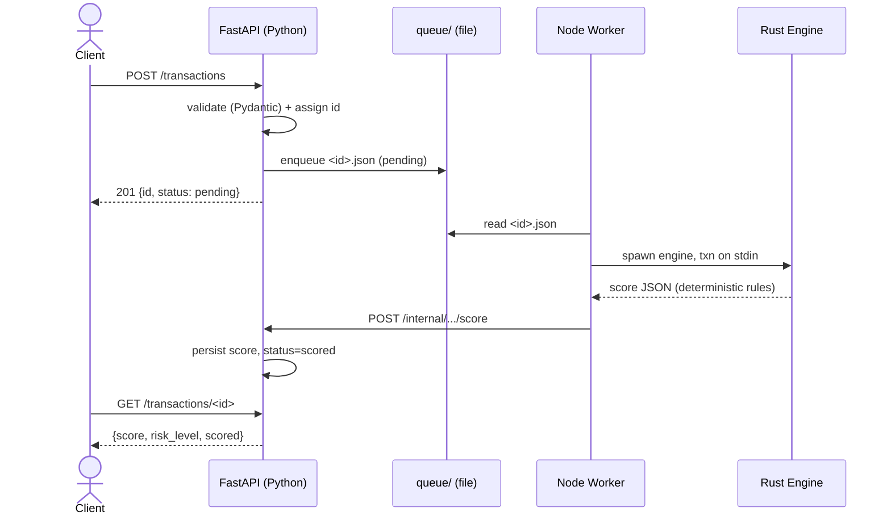
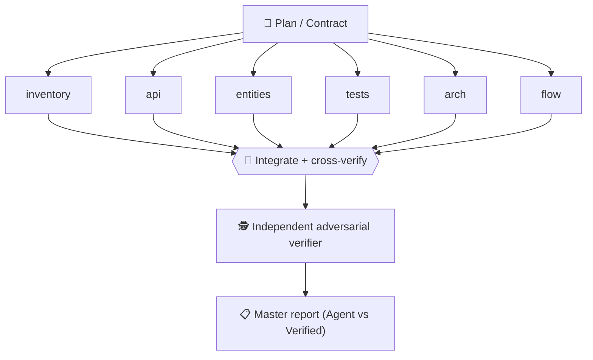
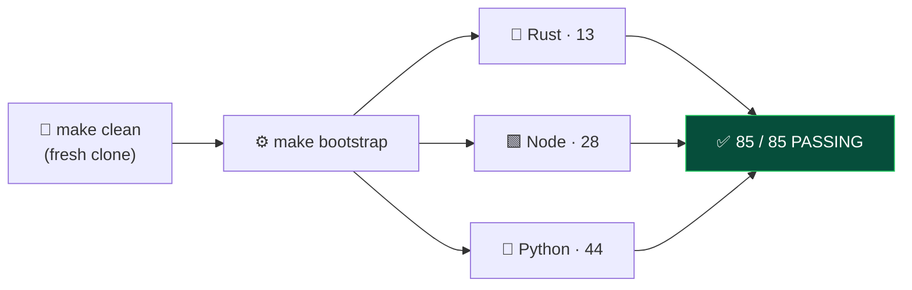

<div align="center">

# 🤖 Task_Evaluation — Coding-Agent Capability Portfolio

### What a coding agent can really do across the full software lifecycle — *understand · build · verify · harden · optimize · operate* — in **Python, Node.js, Rust, Terraform, Docker & Kubernetes**.

[](https://agent-platform-teal-three.vercel.app)
[](#-verification--evidence)
[](#-the-portfolio-at-a-glance)


<br/>

**[🌐 Explore the live platform →](https://agent-platform-teal-three.vercel.app)**

[](https://agent-platform-teal-three.vercel.app)

<sub>The companion **AgentOS** platform (Next.js) — browse every agent, read its real definition & output, copy/download the markdown.</sub>

</div>

---

## 📖 What is this?

A graded portfolio of **24 real coding tasks**, grouped into four tiers of increasing difficulty. Each
task was **executed for real and verified with captured evidence** — tests run, builds passed,
containers healthy, plans clean — never "looks done". Every task ships a `docs/agent-analysis/*.md`
record with an explicit **Agent-Generated vs Verified** split, so you can trust each claim.

> **🧭 Two ways to explore:** browse the folders here, or open the **[live AgentOS platform](https://agent-platform-teal-three.vercel.app)** which serves each agent's *actual* definition and output report.

#### Contents
[The portfolio at a glance](#-the-portfolio-at-a-glance) · [The capability lifecycle](#-the-capability-lifecycle) · [Tier deep-dives](#-tier-deep-dives) · [Flagship builds](#-flagship-builds-how-they-work) · [Getting started](#-getting-started) · [Verification](#-verification--evidence) · [Tech stack](#-tech-stack)

---

## 🗺 The portfolio at a glance


---

## 🔄 The capability lifecycle

Each tier maps to a stage of how real software actually gets built and run:

```mermaid
flowchart LR
    U["🔍 UNDERSTAND<br/>inventory · API map · ER · flow trace"]
    Bd["🛠 BUILD<br/>FastAPI · Node · Rust · polyglot"]
    V["✅ VERIFY<br/>tests · adversarial review"]
    H["🛡 HARDEN<br/>fix findings · safe change"]
    O["⚡ OPTIMIZE<br/>profile · −92.7% latency"]
    Op["🚀 OPERATE<br/>IaC · CI · K8s · observability"]
    U --> Bd --> V --> H --> O --> Op
    style U fill:#064e3b,stroke:#10b981,color:#fff
    style Bd fill:#1e3a8a,stroke:#3b82f6,color:#fff
    style V fill:#4c1d95,stroke:#8b5cf6,color:#fff
    style H fill:#7c2d12,stroke:#f97316,color:#fff
    style O fill:#831843,stroke:#ec4899,color:#fff
    style Op fill:#134e4a,stroke:#14b8a6,color:#fff
```



---

## 📚 Tier deep-dives

### 🟢 Basics — *read an unfamiliar repo, then build a small service*
| Folder | What it proves | Evidence |
|---|---|---|
| `repo-structure-mapper` | Inventory + architecture + dependency graph of any repo | android-monorepo: 27 tables, 0 FKs, 0 mismatches |
| `route-api-mapper` | Endpoint / outbound-API map with auth, validation, errors | paytmmoney: 11 Retrofit services, dynamic `@Url` |
| `test-discovery` | Frameworks, layout, coverage gate, canonical CI command | found `:advisory` missing from `settings.gradle` |
| `fastapi-transaction-service` | Layered Python service + tests | `pytest` **6 passed** + live curl |
| `node-transaction-service` | Layered Express service + tests | `npm test` **7 passed** |
| `rust-logcount-cli` | Deterministic CLI (lib + bin) + tests | `cargo test` **7 passed** |

### 🔵 Intermediate — *model, trace, change, integrate, containerize, debug*
| Folder | What it proves | Evidence |
|---|---|---|
| `er-diagram` | Data model + Mermaid ER from source, reconciled | 27 tables; no-FK cache pattern |
| `flow-tracer` | UI→VM→UseCase→Repo→API→native-sync trace with full DI resolution | add-to-watchlist flow (33 hops, 0 inferred), pinned commit, `file:line` cited, `verify_trace.sh` 36/36; recent-search as corroborating Flow B |
| `minimal-safe-change` | Smallest safe change + before/after tests + rollback | in-repo Python sandbox: `pytest` **2 failed → fix → 5 passed** + ruff (`make i3-verify`); pml-flutter `flutter test` 40/40 as extended example |
| `polyglot-currency-pair` | FastAPI service + Node client on one contract | pytest **7** + jest **9** + live integration |
| `dockerize-service` | Slim, non-root, health-checked image | container **Up (healthy)**, 55 MB |
| `bug-diagnosis` | Reproduce → root-cause → fix → verify | **3 failed → fix → 5 passed** |

### 🟣 Advanced — *multi-agent orchestration, adversarial review, performance*
| Folder | What it proves | Evidence |
|---|---|---|
| `parallel-repo-analysis` | 6 specialist agents → cross-verify → master report | independent verifier; 2 contradictions resolved |
| `parallel-expense-tracker` | 6 agents build a full-stack app, integrated | **16 tests**, Docker healthy |
| `polyglot-fraud-system` | FastAPI + Node worker + Rust engine, one contract | rust 6 / py 10 / node 12; **E2E 4/4 PASS** |
| `repo-modernization` | Value/risk matrix + execute the #1 safe step | gradle `distributionSha256Sum` pin, verified |
| `adversarial-pr-review` | Assume-wrong review, reproduce findings | reproduced **Critical** path-traversal + auth bypass |
| `performance-optimization` | Measure → profile → minimal change → prove | `/summary` 278ms → 20ms (**−92.7%**), 16/16 tests |

> 🔁 **The tiers feed each other:** `adversarial-pr-review` found 3 blocking issues in `polyglot-fraud-system`, which was then **hardened + regression-tested** (fastapi 7 → 10).

### 🟠 DevOps & Infra — *ship and operate it for real*
| Folder | What it proves | Evidence |
|---|---|---|
| `terraform-aws-stack` | Pinned, validated IaC (S3 + Lambda + API GW) | `validate` 0 errors; clean plan (15 to add) |
| `docker-compose-stack` | API + PostgreSQL + worker, health-gated startup | build→up→seed→E2E→down, all exit 0 |
| `ci-pipeline` | 5-stage GitHub Actions + cache + fail→fix demo | fail at stage 2 → fix → all green |
| `kubernetes-manifests` | Deployment/Service/probes, validated on a local cluster | manifests applied + verified |
| `reproducible-dev-env` | One-command `make bootstrap` (mise-pinned runtimes) | clean-slate **85/85 tests green** |
| `observability-bolt-on` | Structured logs + Prometheus metrics + health/readiness | scrape + probes verified (Prometheus/Grafana) |

---

## 🏗 Flagship builds: how they work

### `polyglot-fraud-system` — three languages, one contract
A distributed fraud-scoring pipeline: **FastAPI** ingests → a file queue → a **Node** worker → a **Rust** scoring engine → HTTP callback persists the score. Verified end-to-end **4/4**.



### `parallel-repo-analysis` / `parallel-expense-tracker` — multi-agent orchestration
Work is decomposed into independent specialist agents that run against a locked contract, then a coordinator integrates and an **independent verifier** adversarially re-checks the findings.



<div align="center">

| Browse the agent library | Read the real definition & output |
|---|---|
| [](https://agent-platform-teal-three.vercel.app/agents) | [](https://agent-platform-teal-three.vercel.app/agents) |

</div>

---

## 🚀 Getting started

**Prerequisites:** [`mise`](https://mise.jdx.dev) + `make`. *(Docker only for the container/compose tasks.)*

```bash
git clone git@github.com:t-abhijeetpal-source/Task_Eval.git
cd Task_Eval
make bootstrap     # pin runtimes → install all deps → generate .env → build + test (85 tests)
make test          # re-run the full suite anytime  ·  make help for all targets
```
Per-language: `make python` · `make node` · `make rust`. End-to-end demo: `make a3-integration`.

```bash
# Run the website locally
cd agent-platform && npm install && npm run dev   # http://localhost:3000
```

### 🗂 Repository structure
```
Task_Eval/
├── Basics/            repo-structure-mapper · route-api-mapper · test-discovery ·
│                      fastapi-transaction-service · node-transaction-service · rust-logcount-cli
├── Intermediate/      er-diagram · flow-tracer · minimal-safe-change ·
│                      polyglot-currency-pair · dockerize-service · bug-diagnosis
├── Advanced/          parallel-repo-analysis · parallel-expense-tracker · polyglot-fraud-system ·
│                      repo-modernization · adversarial-pr-review · performance-optimization
├── DevOps-Infra/      terraform-aws-stack · docker-compose-stack · ci-pipeline ·
│                      kubernetes-manifests · reproducible-dev-env · observability-bolt-on
├── agent-platform/    Next.js website (deployed to Vercel)
├── skills/            reusable task-agent skill definitions
├── Makefile           single-command entrypoint (make bootstrap)
└── mise.toml          pinned runtimes (Python 3.12.7 · Node 22.11.0 · Rust 1.83.0)
```
Each task folder contains its implementation, tests, and a `docs/agent-analysis/*.md` record.

---

## ✅ Verification & evidence



- **85 tests** pass on a clean-slate `make bootstrap` (Rust 13 · Node 28 · Python 44).
- `polyglot-fraud-system` end-to-end **4/4 PASS**; `parallel-expense-tracker` **16/16**; compose stack health-gated; Terraform plan clean; CI fail→fix proven.
- Every claim is backed by **captured terminal output** in the per-task records, with an explicit Agent-Generated vs Verified split. Environment blockers (disk, corporate TLS proxy) are documented honestly where they occurred.

---

## 🧱 Tech stack

**Languages/runtimes:** Python 3.12 · Node 22 · Rust 1.83
**Backend:** FastAPI · Express · SQLAlchemy/SQLite · PostgreSQL
**Infra:** Docker & Compose · Terraform · Kubernetes · GitHub Actions · mise
**Testing:** pytest · jest · cargo test
**Platform (website):** Next.js 16 · React 19 · TypeScript · Tailwind v4 · Framer Motion · Recharts

---

<div align="center">

**Built and verified with Claude Code** · Author: **Abhijeet Pal**

[🌐 Live platform](https://agent-platform-teal-three.vercel.app) · [📦 Repository](https://github.com/t-abhijeetpal-source/Task_Eval)

</div>
