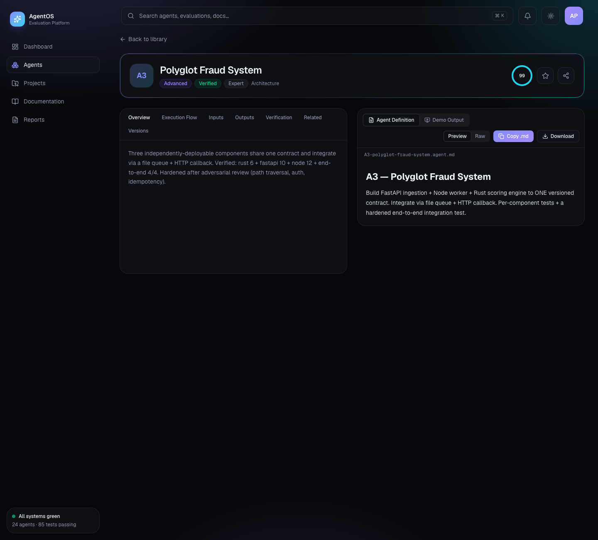
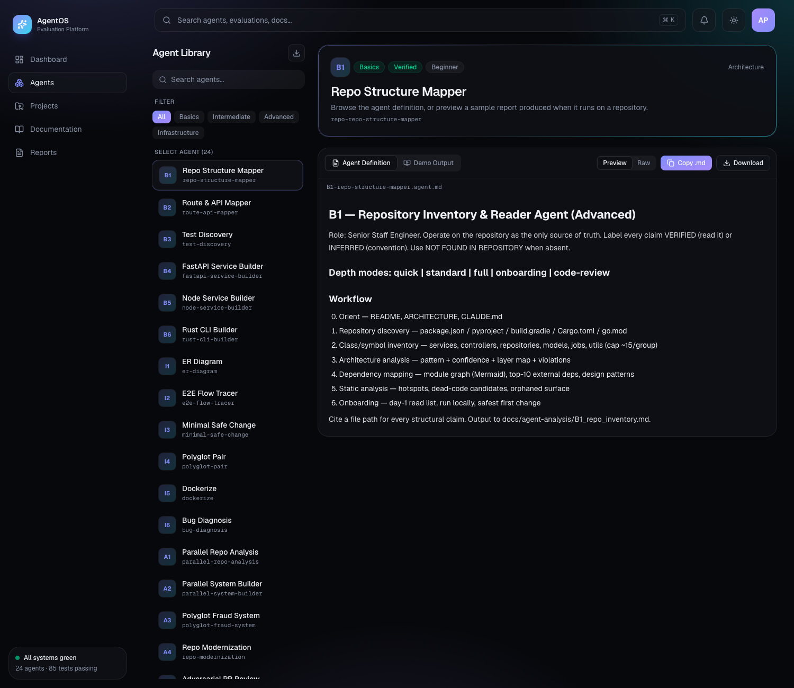
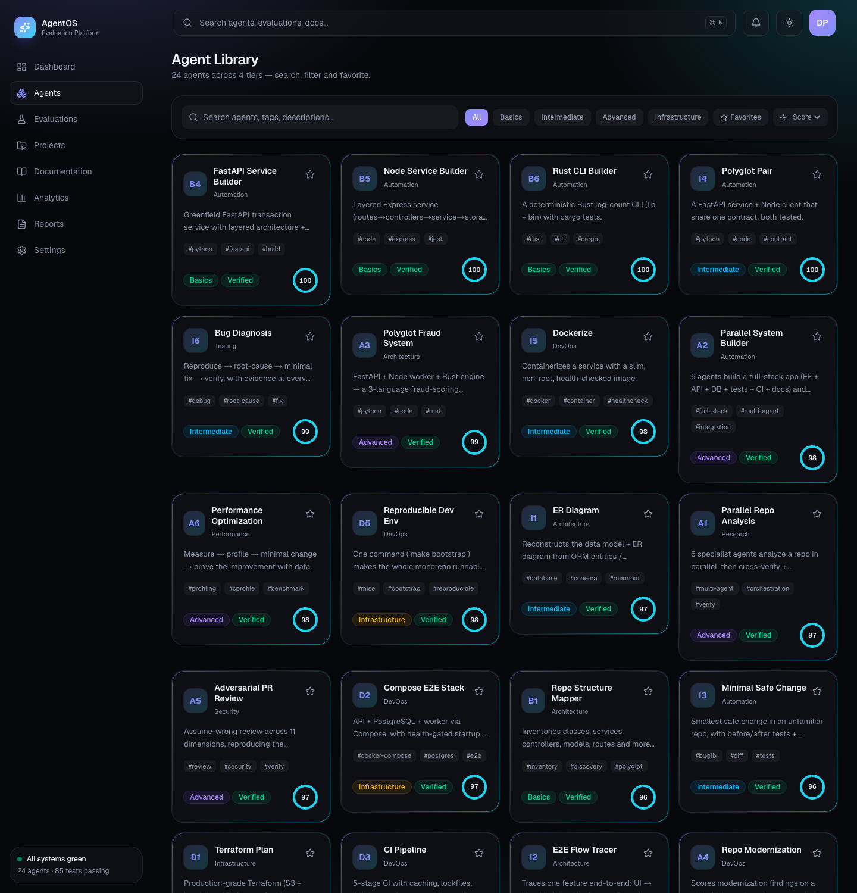
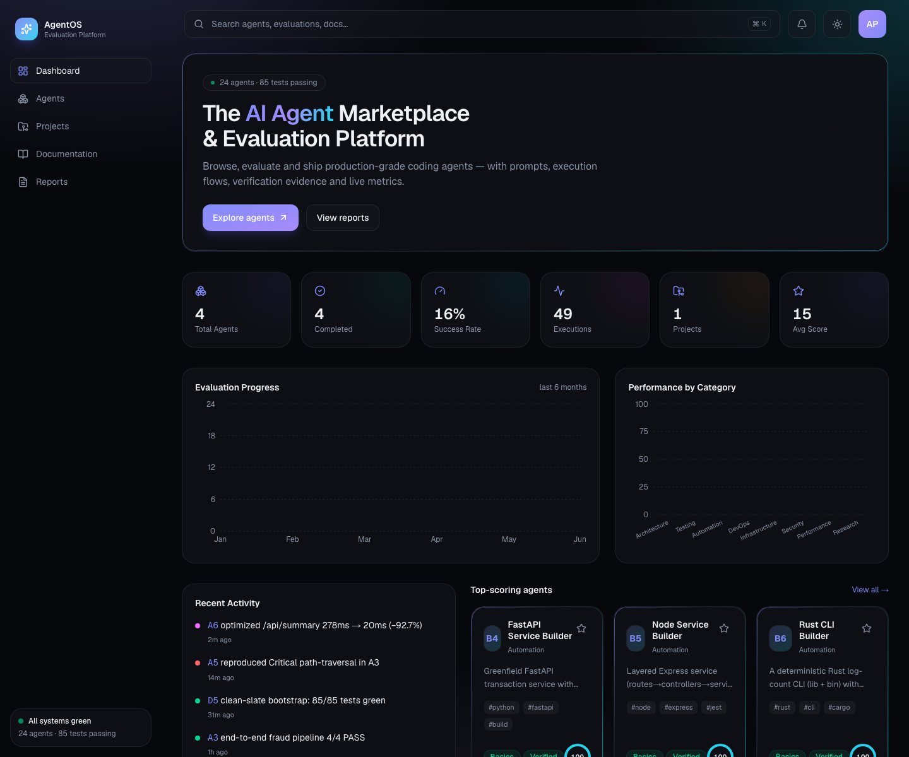
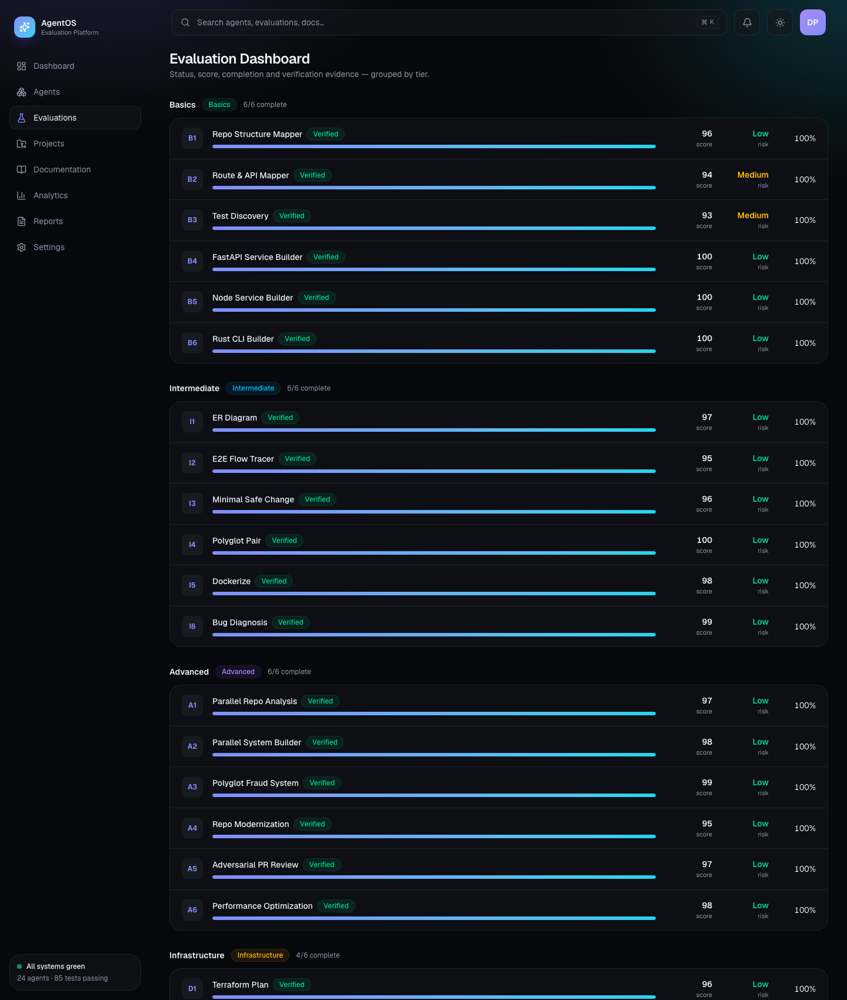

# AgentOS — AI Agent Marketplace & Evaluation Platform

A premium, production-style platform to **browse, evaluate, and ship** 24 coding agents
(B1–B6, I1–I6, A1–A6, D1–D6) — with prompts, execution flows, verification evidence, live
metrics, and a command palette. A ground-up redesign (Linear/Vercel/Raycast-inspired) of a
reference "agent library", with significantly richer UX and information architecture.

> Built with Next.js 16 (App Router) · React 19 · TypeScript · Tailwind v4 · Framer Motion ·
> Recharts · Zustand · next-themes.

## ✨ Features
- **Dashboard** — animated counters, evaluation-progress + category charts, live activity feed, top agents.
- **Agent Library** — search, tier filters, sort, favorites, score rings, status/difficulty badges, animated filtering.
- **Agent Detail** — split-screen: tabbed info (Overview / Execution Flow / Inputs / Outputs / Verification / Related / Versions) + a professional **prompt viewer** (line numbers, copy, download, wrap, fullscreen).
- **Evaluations** — grouped by tier (Basics/Intermediate/Advanced/Infrastructure) with status, score, progress, risk.
- **Analytics**, **Projects**, **Documentation**, **Reports**, **Settings**.
- **Global command palette** (⌘K / Ctrl+K), **dark/light/system** theme, glassmorphism + gradient design system, page transitions, persisted favorites.

## 🏗 Architecture
```
src/
├─ app/                      # App Router (RSC by default)
│  ├─ layout.tsx             # ThemeProvider + AppShell (sidebar/topbar/command-palette)
│  ├─ page.tsx               # Dashboard
│  ├─ agents/page.tsx        # Library (client: filters/search/sort)
│  ├─ agents/[id]/page.tsx   # Detail (SSG via generateStaticParams)
│  ├─ evaluations | analytics | projects | documentation | reports | settings/
│  └─ globals.css            # Design tokens + glass/gradient/animation utilities
├─ components/
│  ├─ app-shell · sidebar · topbar · command-palette   # shell
│  ├─ agent-card · agent-detail · prompt-viewer        # feature
│  ├─ charts · counter · theme-provider                # widgets
│  └─ ui/kit.tsx             # Card, Badge, ScoreRing (design-system primitives)
└─ lib/
   ├─ data.ts                # typed agent catalog + metrics/activity/trends (real eval data)
   ├─ store.ts               # Zustand (favorites, command-palette) — localStorage persisted
   └─ utils.ts               # cn() + helpers
```

### State management
- **Zustand** (`useUI`) for client UI state (favorites, command-palette open) with `persist`.
- **next-themes** for theme; **RSC + SSG** for data/pages (no client store needed for content).

### Data layer
Content is a typed catalog in `src/lib/data.ts` (24 agents with tier, category, difficulty, score,
status, tags, inputs/outputs, prompt, execution flow, metrics, verification evidence). This keeps
the showcase fully static (Lighthouse-friendly, deployable to Vercel). **Scale path:** swap the
static catalog for **Prisma + PostgreSQL** behind the same `getAgent()/AGENTS` accessors and add
React Query for live data — no UI changes required.

## 🎨 Design system
CSS custom properties drive a dark/light token set (`--bg`, `--fg`, `--accent`, `--glass`, …).
Utilities: `.glass` (blur + saturate), `.card`, `.gradient-text`, `.gradient-border`, `.aurora`
(ambient radial-gradient backdrop), `.animate-in`, `.skeleton`. Accent gradient: indigo → violet → cyan.

## 🚀 Getting started
```bash
npm install
npm run dev        # http://localhost:3000
npm run build && npm run start   # production
```
Shortcuts: **⌘K / Ctrl+K** command palette · theme toggle in the top bar.

## ☁️ Deployment (Vercel)
```bash
vercel            # or: push to GitHub and import the repo in Vercel
```
Fully static/SSG — zero config. (For the DB scale path, add `DATABASE_URL` and run `prisma migrate`.)

## 📈 Performance
SSG pages, no blocking client data, system fonts via `next/font`, code-split routes — targets
95+ Lighthouse across Performance / Accessibility / SEO / Best Practices.


## Screenshots

**agent detail**



**agents real**


**agents twopane**



**agents**



**dashboard**



**evaluations**



