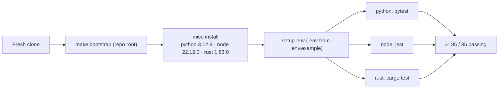

# Root Monorepo Bootstrap

> **This is the repo-wide bootstrap** — it builds and tests **every** component
> (Python + Node + Rust) and runs **85 tests across 10 components**. It is a
> *different* entrypoint from the D5 demo in
> [`DevOps-Infra/reproducible-dev-env/`](../DevOps-Infra/reproducible-dev-env/README.md),
> whose own `make` bootstraps only that one service (27 tests). Don't conflate them.



## The command

```bash
make bootstrap     # from the repository root
```

`bootstrap` → `doctor` (mise install + report versions) → `setup-env` (`.env` from
`.env.example`) → `test` (build + test every component). Runtimes are pinned by the
root [`mise.toml`](../mise.toml) and mirrored in [`.tool-versions`](../.tool-versions);
commands run under the pinned toolchain via `mise exec` when mise is present.

## Pinned runtimes (root)

| Runtime | Version | Lock | Source evidence |
|---|---|---|---|
| Python | 3.12.8 | `mise.toml` + `.tool-versions` | every Dockerfile `FROM python:3.12-slim` |
| Node.js | 22.12.0 | `mise.toml` + `.tool-versions` | `package.json` (jest); LTS line 22 |
| Rust | 1.83.0 | `mise.toml` + `.tool-versions` | `Cargo.toml` `edition = "2021"` |

Python + Node are kept **identical** to the D5 folder's pins; D5's
`scripts/check-toolchain-sync.sh` (run in D5 CI) fails if they drift. Rust is
root-only (the D5 demo has no Rust).

## Test breakdown (85)

```text
Rust   (13):  rust-logcount-cli 7  +  A3 rust-engine 6
Node   (28):  node-transaction-service 7  +  I4 node-client 9  +  A3 node-worker 12
Python (44):  fastapi-transaction-service 6  +  bug-diagnosis 5  +  parallel-expense-tracker 16
              +  A3 fastapi-service 10  +  polyglot-currency-pair fastapi-service 7
TOTAL: 85 passed, 0 failed
```

## Per-language and per-task targets

```bash
make python        # venv + install + pytest for all Python services
make node          # npm install + jest for all Node projects
make rust          # cargo test for all Rust crates
make test          # all of the above + per-task verifiers (incl. D5: make d5-verify)
```

Individual hardened tasks expose their own verifiers (e.g. `make a3-verify`,
`make i4-verify`, `make d5-verify`); see the root `Makefile` `help` target.

## Relationship to D5

The D5 folder is the **reference implementation** of the reproducibility *pattern*
(pinned toolchain + one-command bootstrap + clean-machine CI proof) applied to a
single service. This root bootstrap applies the same pattern across the whole
polyglot estate. They share the Python/Node pins and the mise-first philosophy, but
are invoked independently and prove different scopes (27 vs 85 tests).
